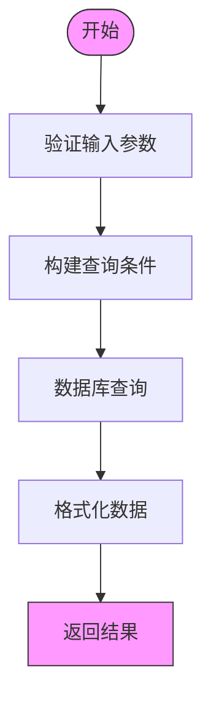
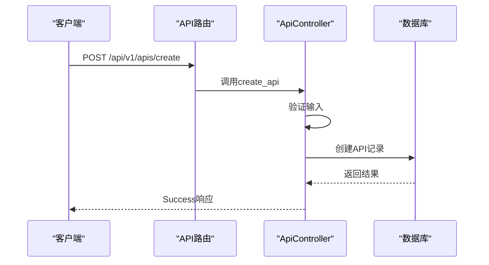
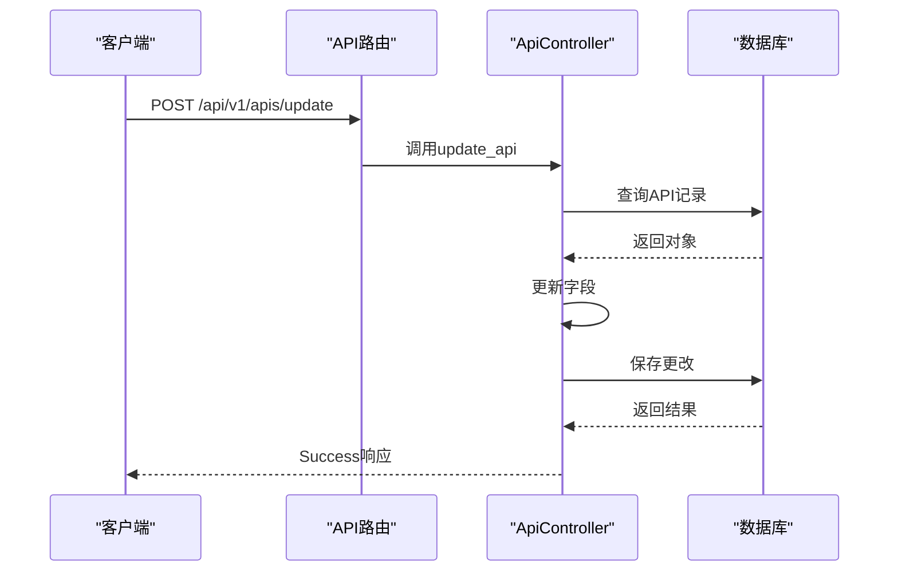
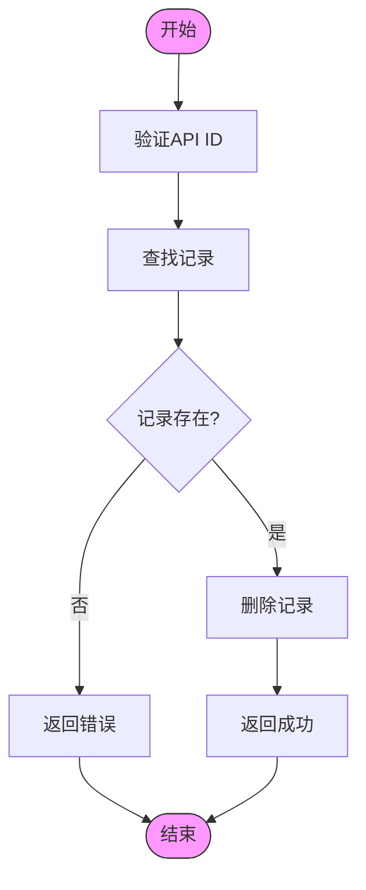
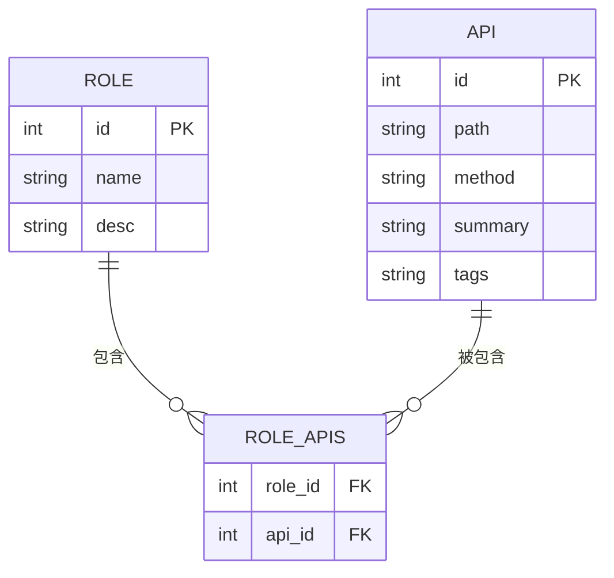
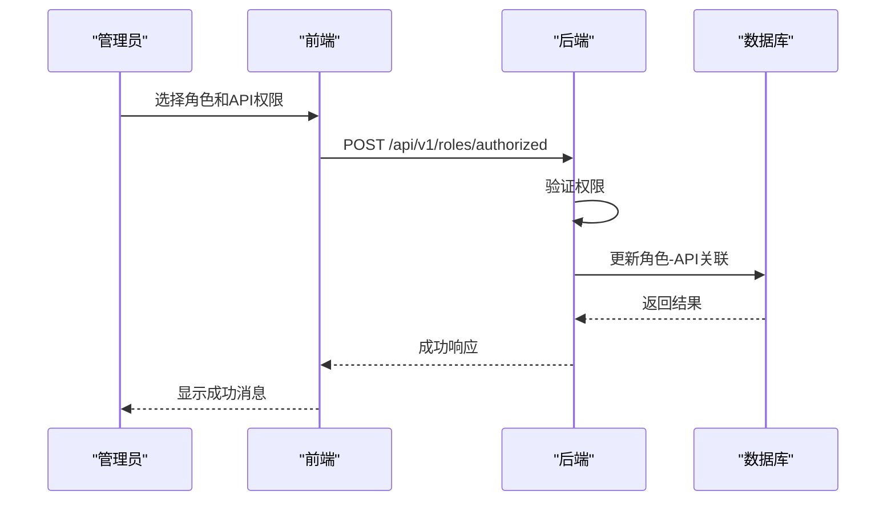
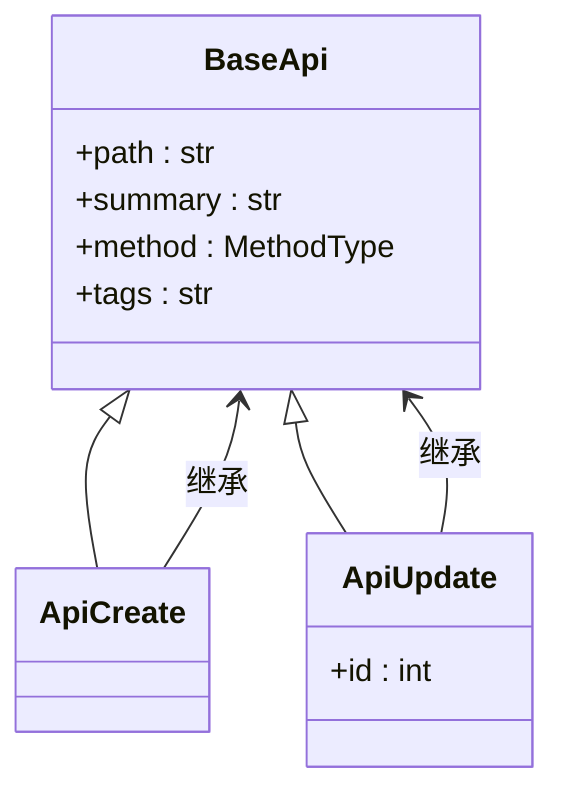
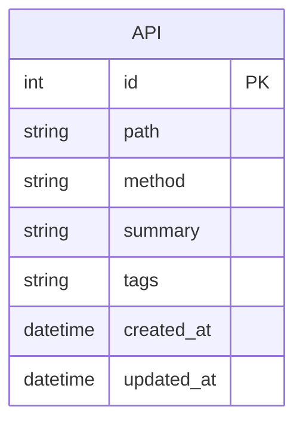
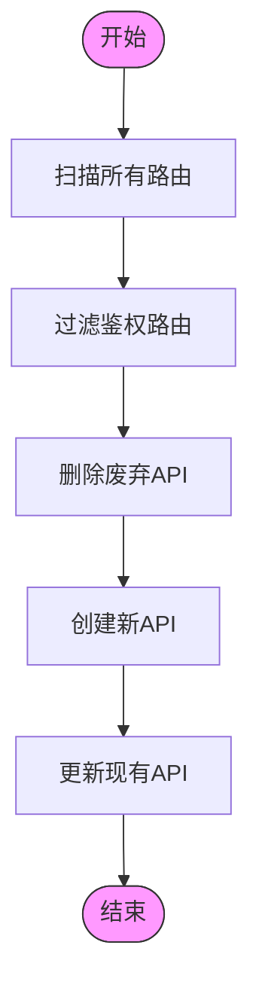

# API管理API

<cite>
**本文档引用的文件**  
- [apis.py](file://app/api/v1/apis/apis.py)
- [api.py](file://app/controllers/api.py)
- [apis.py](file://app/schemas/apis.py)
- [admin.py](file://app/models/admin.py)
- [roles.py](file://app/api/v1/roles/roles.py)
</cite>

## 目录
1. [简介](#简介)
2. [核心API端点](#核心api端点)
3. [权限系统集成](#权限系统集成)
4. [数据模型详解](#数据模型详解)
5. [API刷新机制](#api刷新机制)
6. [使用示例](#使用示例)
7. [总结](#总结)

## 简介
API管理API是系统权限体系的核心组成部分，负责管理所有后端API端点的元数据。它提供了一套完整的CRUD接口，用于获取、创建、更新和删除API定义，并为角色权限分配提供数据支持。该模块通过自动扫描和手动注册两种方式维护API列表，确保权限控制的准确性和实时性。

**Section sources**  
- [apis.py](file://app/api/v1/apis/apis.py#L1-L67)

## 核心API端点

### 获取API接口列表 (GET /api/v1/apis/list)
获取系统中所有API接口的分页列表，支持多种查询条件。

**字段说明**：
- `method`: GET
- `path`: `/api/v1/apis/list`
- `summary`: 查看API列表
- `tags`: apis

**查询参数**：
- `page`: 页码，默认为1
- `page_size`: 每页数量，默认为10
- `path`: 按API路径模糊查询
- `summary`: 按API简介模糊查询
- `tags`: 按API标签（模块）过滤



**Diagram sources**  
- [apis.py](file://app/api/v1/apis/apis.py#L10-L28)

**Section sources**  
- [apis.py](file://app/api/v1/apis/apis.py#L10-L28)

### 创建API接口 (POST /api/v1/apis/create)
注册一个新的API端点到系统中。

**字段说明**：
- `method`: POST
- `path`: `/api/v1/apis/create`
- `summary`: 创建Api
- `tags`: apis

**请求体**：使用`schemas.ApiCreate`模型，包含path、summary、method和tags字段。



**Diagram sources**  
- [apis.py](file://app/api/v1/apis/apis.py#L40-L45)
- [apis.py](file://app/schemas/apis.py#L15)

**Section sources**  
- [apis.py](file://app/api/v1/apis/apis.py#L40-L45)

### 更新API接口 (POST /api/v1/apis/update)
修改现有API接口的定义。

**字段说明**：
- `method`: POST
- `path`: `/api/v1/apis/update`
- `summary`: 更新Api
- `tags`: apis

**请求体**：使用`schemas.ApiUpdate`模型，在`ApiCreate`基础上增加id字段。



**Diagram sources**  
- [apis.py](file://app/api/v1/apis/apis.py#L48-L53)
- [apis.py](file://app/schemas/apis.py#L17-L18)

**Section sources**  
- [apis.py](file://app/api/v1/apis/apis.py#L48-L53)

### 删除API接口 (DELETE /api/v1/apis/delete)
从系统中移除指定的API接口。

**字段说明**：
- `method`: DELETE
- `path`: `/api/v1/apis/delete`
- `summary`: 删除Api
- `tags`: apis

**查询参数**：
- `api_id`: 要删除的API记录ID



**Diagram sources**  
- [apis.py](file://app/api/v1/apis/apis.py#L56-L61)

**Section sources**  
- [apis.py](file://app/api/v1/apis/apis.py#L56-L61)

## 权限系统集成

### permissions字段关联机制
API管理API通过`permissions`字段与权限系统紧密集成。在角色管理模块中，API权限通过多对多关系与角色关联。



**Diagram sources**  
- [admin.py](file://app/models/admin.py#L30-L38)

**Section sources**  
- [admin.py](file://app/models/admin.py#L30-L38)

### 角色权限分配
当管理员为角色分配API权限时，系统使用`/api/v1/roles/authorized`端点更新角色的API权限集合。



**Diagram sources**  
- [roles.py](file://app/api/v1/roles/roles.py#L64-L73)

**Section sources**  
- [roles.py](file://app/api/v1/roles/roles.py#L64-L73)

## 数据模型详解

### BaseApi 模型
基础API模型，定义了所有API的公共字段。



**Diagram sources**  
- [apis.py](file://app/schemas/apis.py#L4-L13)

**Section sources**  
- [apis.py](file://app/schemas/apis.py#L4-L13)

### 数据库模型
API在数据库中的存储结构。



**Diagram sources**  
- [admin.py](file://app/models/admin.py#L30-L38)

**Section sources**  
- [admin.py](file://app/models/admin.py#L30-L38)

## API刷新机制
系统提供自动刷新功能，可扫描所有注册的API路由并同步到数据库。



**Diagram sources**  
- [api.py](file://app/controllers/api.py#L10-L45)

**Section sources**  
- [api.py](file://app/controllers/api.py#L10-L45)

## 使用示例

### 注册新的后端API端点
使用curl命令注册一个新的API端点：

```bash
curl -X POST "http://localhost:8000/api/v1/apis/create" \
  -H "Authorization: Bearer <your_token>" \
  -H "Content-Type: application/json" \
  -d '{
    "path": "/api/v1/users/export",
    "summary": "导出用户数据",
    "method": "GET",
    "tags": "User"
  }'
```

此操作将新API注册到系统中，使其可以被角色权限系统引用。

**Section sources**  
- [apis.py](file://app/api/v1/apis/apis.py#L40-L45)

## 总结
API管理API为系统的权限控制提供了基础数据支持。通过统一管理所有API端点的元数据，实现了精细化的权限分配。系统支持手动创建和自动刷新两种模式，确保API列表的准确性和实时性。与角色管理模块的深度集成，使得权限分配更加灵活和可靠。

**Section sources**  
- [apis.py](file://app/api/v1/apis/apis.py#L1-L67)
- [api.py](file://app/controllers/api.py#L1-L45)
- [admin.py](file://app/models/admin.py#L30-L38)