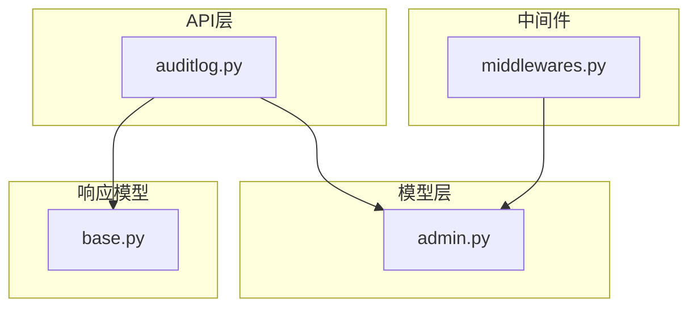
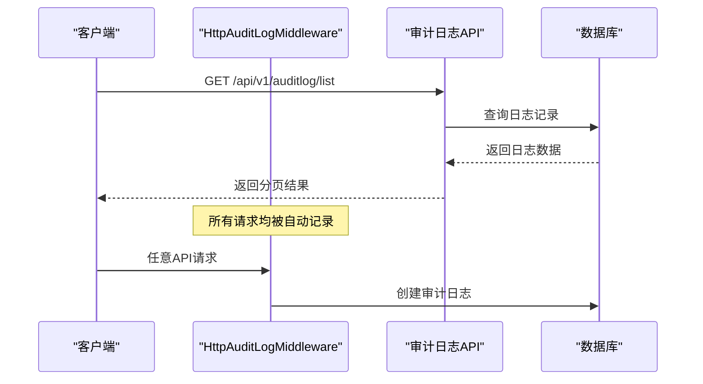
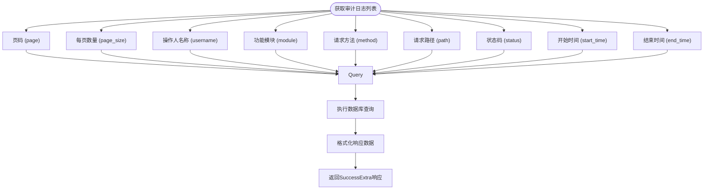
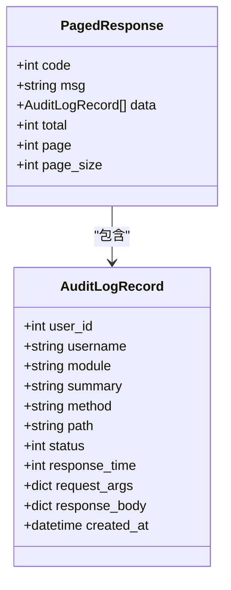
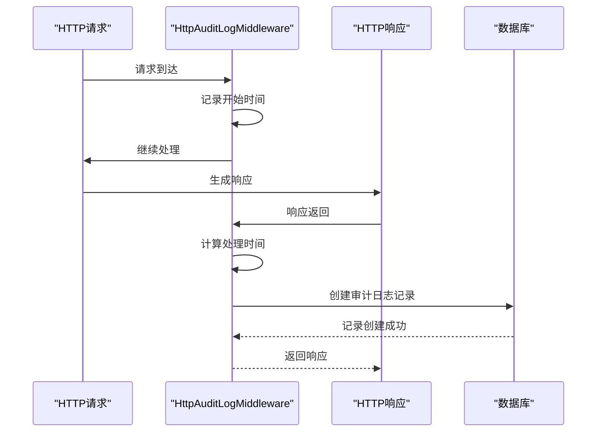
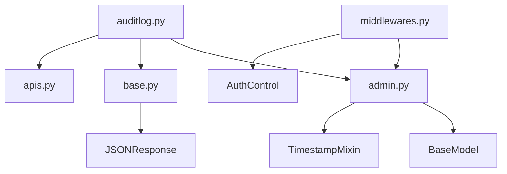

# 审计日志API

<cite>
**本文档引用的文件**
- [auditlog.py](file://app/api/v1/auditlog/auditlog.py)
- [admin.py](file://app/models/admin.py)
- [base.py](file://app/schemas/base.py)
- [middlewares.py](file://app/core/middlewares.py)
- [enums.py](file://app/models/enums.py)
- [apis.py](file://app/schemas/apis.py)
</cite>

## 目录
1. [简介](#简介)
2. [项目结构](#项目结构)
3. [核心组件](#核心组件)
4. [架构概述](#架构概述)
5. [详细组件分析](#详细组件分析)
6. [依赖分析](#依赖分析)
7. [性能考虑](#性能考虑)
8. [故障排除指南](#故障排除指南)
9. [结论](#结论)

## 简介
本API用于提供系统操作审计日志的只读访问功能，支持分页、排序和多维度过滤。所有日志由中间件自动记录，为系统安全审计提供数据支持。该API不提供创建或删除日志的功能，仅允许查询。

## 项目结构
审计日志功能位于`app/api/v1/auditlog/`目录下，包含路由定义和日志模型。日志数据通过中间件自动采集，存储于数据库中，通过标准API接口对外提供查询服务。

**Diagram sources**
- [auditlog.py](file://app/api/v1/auditlog/auditlog.py)
- [admin.py](file://app/models/admin.py)
- [middlewares.py](file://app/core/middlewares.py)
- [base.py](file://app/schemas/base.py)

**Section sources**
- [auditlog.py](file://app/api/v1/auditlog/auditlog.py)
- [admin.py](file://app/models/admin.py)

## 核心组件
审计日志API的核心组件包括日志记录中间件、日志数据模型和查询接口。中间件自动捕获HTTP请求信息并持久化，API接口提供结构化查询能力，支持按用户、操作类型、时间范围等条件过滤。

**Section sources**
- [auditlog.py](file://app/api/v1/auditlog/auditlog.py#L1-L48)
- [admin.py](file://app/models/admin.py#L70-L89)
- [middlewares.py](file://app/core/middlewares.py#L100-L182)

## 架构概述
系统通过中间件在请求处理过程中自动记录审计日志，日志数据存储在数据库中。API层提供标准化的RESTful接口，客户端可通过GET请求查询日志列表，支持分页和多条件过滤。

**Diagram sources**
- [auditlog.py](file://app/api/v1/auditlog/auditlog.py#L10-L48)
- [middlewares.py](file://app/core/middlewares.py#L100-L182)
- [admin.py](file://app/models/admin.py#L70-L89)

## 详细组件分析

### 审计日志查询接口分析
该接口提供审计日志的分页查询功能，支持多种过滤条件。

#### 接口参数说明

**Diagram sources**
- [auditlog.py](file://app/api/v1/auditlog/auditlog.py#L10-L48)

#### 响应数据结构

**Diagram sources**
- [admin.py](file://app/models/admin.py#L70-L89)
- [base.py](file://app/schemas/base.py#L30-L52)

**Section sources**
- [auditlog.py](file://app/api/v1/auditlog/auditlog.py#L10-L48)
- [admin.py](file://app/models/admin.py#L70-L89)
- [base.py](file://app/schemas/base.py#L30-L52)

### 审计日志自动记录机制分析
系统通过中间件实现审计日志的自动记录，无需业务代码显式调用。

**Diagram sources**
- [middlewares.py](file://app/core/middlewares.py#L100-L182)

**Section sources**
- [middlewares.py](file://app/core/middlewares.py#L100-L182)

## 依赖分析
审计日志功能依赖于多个核心组件，包括数据库模型、响应模式和中间件系统。

**Diagram sources**
- [auditlog.py](file://app/api/v1/auditlog/auditlog.py)
- [admin.py](file://app/models/admin.py)
- [base.py](file://app/schemas/base.py)
- [middlewares.py](file://app/core/middlewares.py)
- [apis.py](file://app/schemas/apis.py)

**Section sources**
- [auditlog.py](file://app/api/v1/auditlog/auditlog.py)
- [admin.py](file://app/models/admin.py)
- [base.py](file://app/schemas/base.py)
- [middlewares.py](file://app/core/middlewares.py)

## 性能考虑
- 查询使用数据库索引优化，关键字段如`username`、`path`、`created_at`均已建立索引
- 响应体大小限制为1MB，防止大响应体影响性能
- 分页查询避免一次性加载大量数据
- 中间件异步记录日志，不影响主请求性能

## 故障排除指南
- 若日志未记录：检查中间件是否正确注册，确认请求方法在监控列表中
- 若查询无结果：验证过滤条件是否过于严格，检查时间格式是否正确
- 若响应缓慢：检查数据库索引状态，确认查询条件使用了索引字段
- 若出现500错误：检查请求参数类型是否匹配，特别是时间格式

**Section sources**
- [auditlog.py](file://app/api/v1/auditlog/auditlog.py#L10-L48)
- [middlewares.py](file://app/core/middlewares.py#L100-L182)

## 结论
审计日志API为系统提供了完整的操作审计能力，通过自动化记录和结构化查询，有效支持安全审计需求。API设计遵循RESTful规范，功能完整且性能优良，是系统安全体系的重要组成部分。