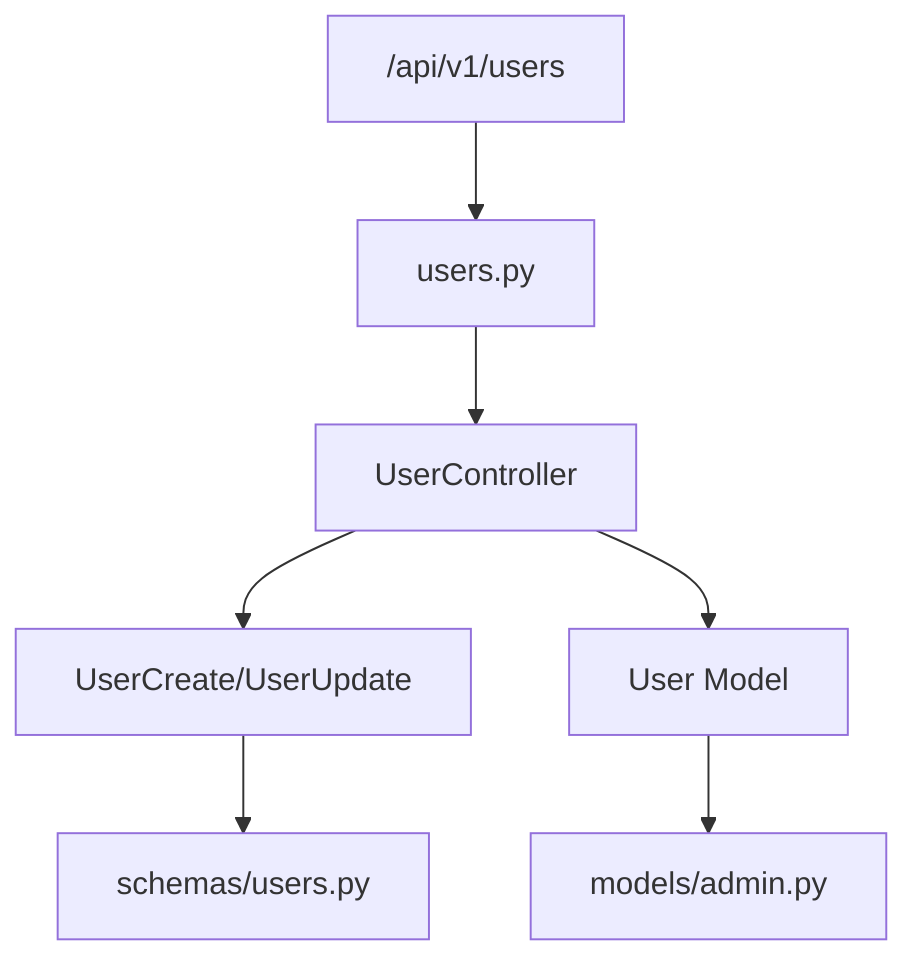
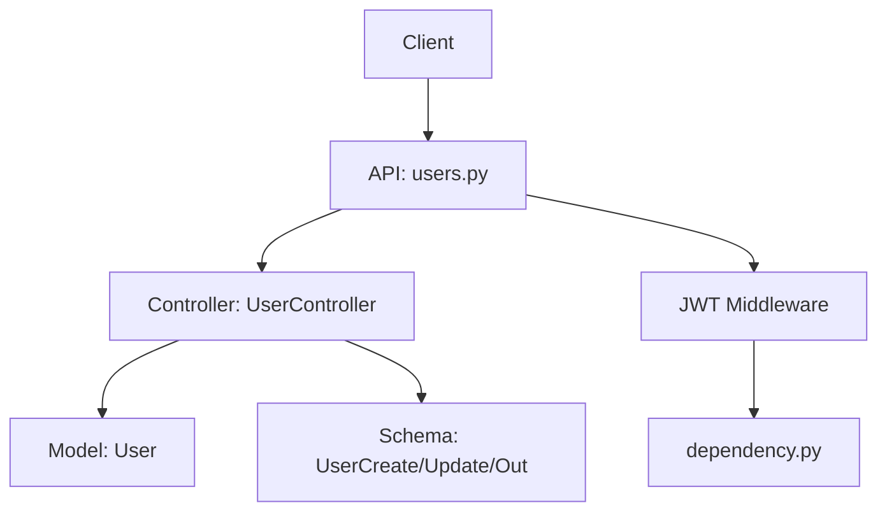
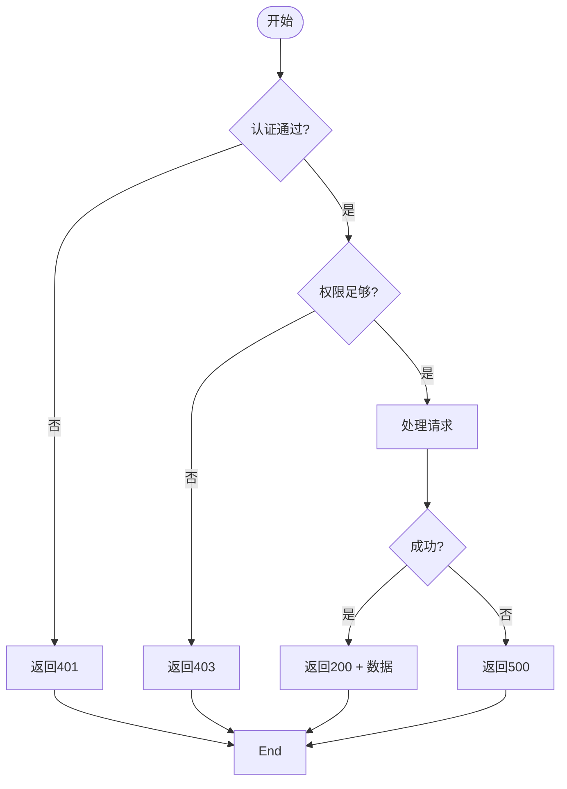
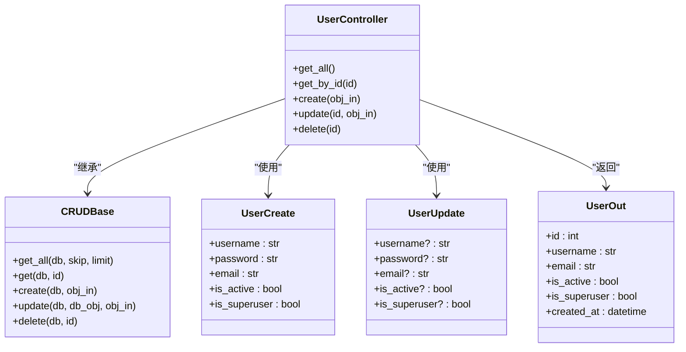

# 用户管理API

<cite>
**本文档引用的文件**  
- [users.py](file://app/api/v1/users/users.py)
- [user.py](file://app/controllers/user.py)
- [users.py](file://app/schemas/users.py)
- [admin.py](file://app/models/admin.py)
- [dependency.py](file://app/core/dependency.py)
</cite>

## 目录
1. [简介](#简介)
2. [项目结构](#项目结构)
3. [核心组件](#核心组件)
4. [架构概览](#架构概览)
5. [详细组件分析](#详细组件分析)
6. [依赖分析](#依赖分析)
7. [性能考虑](#性能考虑)
8. [故障排除指南](#故障排除指南)
9. [结论](#结论)

## 简介
本文档详细描述了基于 FastAPI 的后端系统中用户管理相关的 RESTful API 接口。涵盖用户信息的增删改查操作，包括获取用户列表、获取单个用户、创建用户、更新用户和删除用户。所有接口均需 JWT 认证，并对超级用户权限进行了特殊处理。文档明确了每个端点的请求方式、路径、参数、认证要求、请求体与响应体结构，以及典型调用示例。

## 项目结构
用户管理功能主要分布在 `app/api/v1/users/`、`app/controllers/` 和 `app/schemas/` 三个目录中。API 路由定义在 `users.py` 中，业务逻辑由 `UserController` 处理，数据模型和序列化结构分别定义在 `models/admin.py` 和 `schemas/users.py` 中。



**图示来源**  
- [users.py](file://app/api/v1/users/users.py)
- [user.py](file://app/controllers/user.py)
- [users.py](file://app/schemas/users.py)
- [admin.py](file://app/models/admin.py)

**本节来源**  
- [users.py](file://app/api/v1/users/users.py)
- [user.py](file://app/controllers/user.py)

## 核心组件
用户管理的核心组件包括 API 路由模块、控制器 `UserController`、数据模型 `User` 以及输入输出模式 `UserCreate`、`UserUpdate` 和 `UserOut`。这些组件共同实现了完整的用户生命周期管理功能。

**本节来源**  
- [users.py](file://app/api/v1/users/users.py#L1-L50)
- [user.py](file://app/controllers/user.py#L14-L20)
- [users.py](file://app/schemas/users.py#L18-L50)
- [admin.py](file://app/models/admin.py#L8-L30)

## 架构概览
系统采用典型的分层架构：API 层负责路由分发，Controller 层处理业务逻辑，Model 层定义数据结构，Schema 层负责数据验证与序列化。用户请求通过中间件进行 JWT 鉴权后进入 API 层，由控制器调用底层 CRUD 操作完成数据持久化。



**图示来源**  
- [users.py](file://app/api/v1/users/users.py)
- [user.py](file://app/controllers/user.py)
- [admin.py](file://app/models/admin.py)
- [dependency.py](file://app/core/dependency.py)

## 详细组件分析

### 用户API分析
用户API提供五个主要端点，支持完整的CRUD操作，并集成分页和权限控制。

#### API端点列表
| 端点 | 方法 | 描述 | 权限要求 |
|------|------|------|--------|
| `/api/v1/users/` | GET | 获取用户列表（支持分页） | 超级用户或管理员 |
| `/api/v1/users/{user_id}` | GET | 获取指定用户信息 | 超级用户或本人 |
| `/api/v1/users/` | POST | 创建新用户 | 超级用户 |
| `/api/v1/users/{user_id}` | PUT | 更新用户信息 | 超级用户或本人 |
| `/api/v1/users/{user_id}` | DELETE | 删除用户 | 超级用户 |

**本节来源**  
- [users.py](file://app/api/v1/users/users.py#L10-L100)

#### 请求头要求
所有请求必须包含有效的 JWT Bearer Token：
```
Authorization: Bearer <your-jwt-token>
```

#### 请求体结构
创建用户时使用 `schemas.UserCreate` 模型：
- `username`: 字符串，必填
- `password`: 字符串，必填
- `email`: 邮箱格式，可选
- `is_active`: 布尔值，默认 `True`
- `is_superuser`: 布尔值，默认 `False`

更新用户时使用 `schemas.UserUpdate` 模型，字段均为可选。

#### 响应结构
- 成功响应（200）返回 `schemas.UserOut` 模型，包含用户基本信息。
- 错误响应返回 `schemas.GenericResponse`，包含 `code`、`message` 和可选 `data`。
- 状态码说明：
  - `200`: 成功
  - `400`: 请求参数错误
  - `401`: 未认证
  - `403`: 权限不足
  - `404`: 用户不存在
  - `500`: 服务器内部错误



**图示来源**  
- [users.py](file://app/api/v1/users/users.py#L20-L80)
- [dependency.py](file://app/core/dependency.py#L5-L30)

### 调用示例

#### 创建用户
```bash
curl -X POST "http://localhost:8000/api/v1/users/" \
  -H "Authorization: Bearer your_jwt_token" \
  -H "Content-Type: application/json" \
  -d '{
    "username": "newuser",
    "password": "securepassword",
    "email": "newuser@example.com",
    "is_active": true,
    "is_superuser": false
  }'
```

#### 获取用户列表（带分页）
```bash
curl -X GET "http://localhost:8000/api/v1/users/?page=1&page_size=10" \
  -H "Authorization: Bearer your_jwt_token"
```

分页参数说明：
- `page`: 当前页码，从1开始
- `page_size`: 每页数量，最大100

**本节来源**  
- [users.py](file://app/api/v1/users/users.py#L45-L75)
- [user.py](file://app/controllers/user.py#L30-L60)

## 依赖分析
用户管理模块依赖于核心的 `CRUDBase` 基类实现基本数据库操作，通过 `get_current_user` 依赖注入实现权限控制，并使用 `schemas` 和 `models` 进行数据验证与持久化。



**图示来源**  
- [user.py](file://app/controllers/user.py#L14-L20)
- [users.py](file://app/schemas/users.py#L18-L50)

**本节来源**  
- [user.py](file://app/controllers/user.py)
- [crud.py](file://app/core/crud.py)

## 性能考虑
- 列表查询支持分页以避免大数据量加载
- 数据库查询使用索引优化（如 `username` 和 `email` 字段）
- JWT 验证通过中间件缓存提升性能
- 密码使用哈希存储，确保安全性

## 故障排除指南
- **401 错误**：检查 JWT Token 是否过期或格式错误
- **403 错误**：确认当前用户是否具备相应权限（如创建用户需超级用户）
- **404 错误**：检查用户 ID 是否存在
- **400 错误**：验证请求体字段是否符合 `UserCreate` 或 `UserUpdate` 定义
- **500 错误**：查看服务端日志排查数据库连接或内部逻辑异常

**本节来源**  
- [users.py](file://app/api/v1/users/users.py)
- [exceptions.py](file://app/core/exceptions.py)

## 结论
用户管理API设计遵循 RESTful 规范，具备完整的权限控制、数据验证和错误处理机制。通过清晰的分层结构和类型定义，保证了接口的稳定性与可维护性。建议在生产环境中结合日志审计和速率限制进一步增强安全性。