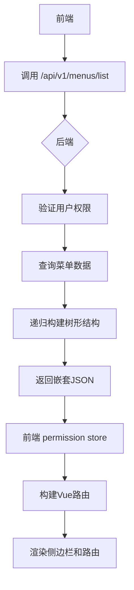
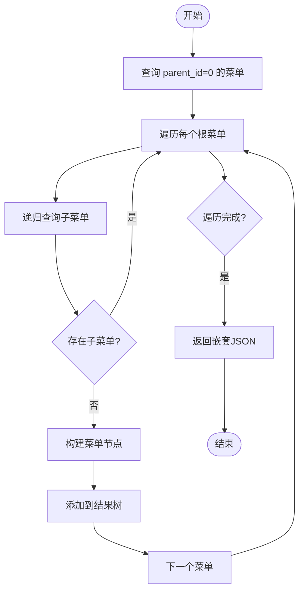
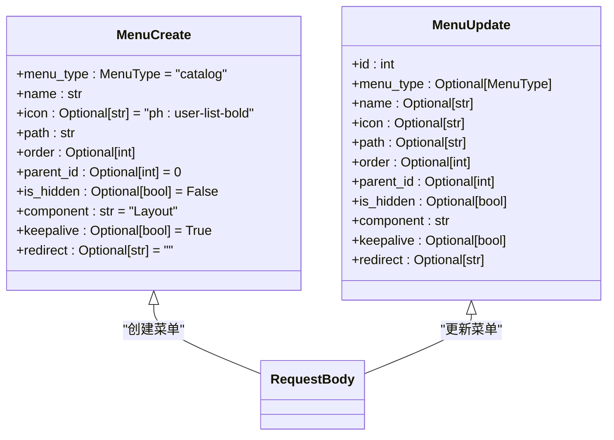
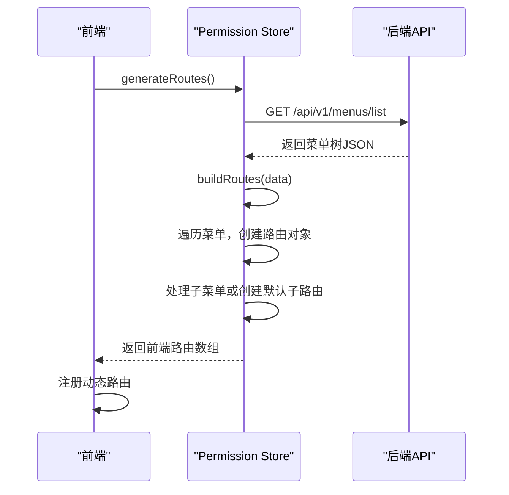
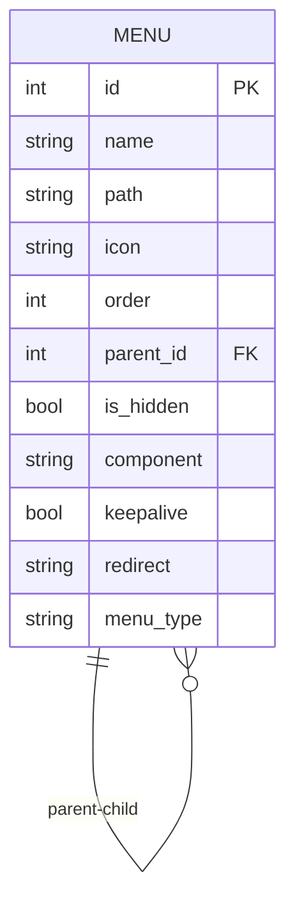

# 菜单管理API

<cite>
**本文档引用的文件**  
- [menus.py](file://app/api/v1/menus/menus.py)
- [menus.py](file://app/schemas/menus.py)
- [index.js](file://web/src/store/modules/permission/index.js)
</cite>

## 目录
1. [简介](#简介)
2. [项目结构](#项目结构)
3. [核心组件](#核心组件)
4. [架构概览](#架构概览)
5. [详细组件分析](#详细组件分析)
6. [依赖分析](#依赖分析)
7. [性能考虑](#性能考虑)
8. [故障排除指南](#故障排除指南)
9. [结论](#结论)

## 简介
本API用于管理系统中的菜单结构，支持动态生成前端路由。主要功能包括获取菜单树、获取菜单列表、创建、更新和删除菜单项。菜单数据根据当前用户权限进行过滤，确保用户只能访问其被授权的菜单项。前端通过`permission` store模块消费此API，动态构建可访问的路由表。

## 项目结构
菜单管理功能分布在后端API路由、数据模型与前端权限模块中。后端位于`app/api/v1/menus/`，定义了RESTful端点；数据结构定义于`schemas/menus.py`；前端权限逻辑位于`web/src/store/modules/permission/index.js`，负责将API返回的菜单数据转换为Vue路由对象。

**Section sources**
- [menus.py](file://app/api/v1/menus/menus.py#L1-L63)
- [menus.py](file://app/schemas/menus.py#L1-L52)
- [index.js](file://web/src/store/modules/permission/index.js#L1-L93)

## 核心组件
核心组件包括：
- `GET /api/v1/menus/list`：获取完整的菜单树结构，用于前端动态路由构建。
- `POST /api/v1/menus/create`：创建新菜单项，接收`MenuCreate`模型。
- `POST /api/v1/menus/update`：更新现有菜单，接收`MenuUpdate`模型。
- `DELETE /api/v1/menus/delete`：删除指定菜单，若存在子菜单则禁止删除。

**Section sources**
- [menus.py](file://app/api/v1/menus/menus.py#L15-L63)

## 架构概览
后端提供基于角色权限的菜单访问控制，前端在登录后调用`/api/v1/menus/list`获取可访问的菜单树，并由`permission` store将其转换为Vue Router可识别的路由配置。菜单支持多级嵌套，通过`parent_id`字段构建树形结构。

**Diagram sources**
- [menus.py](file://app/api/v1/menus/menus.py#L15-L30)
- [index.js](file://web/src/store/modules/permission/index.js#L1-L93)

## 详细组件分析

### 获取菜单树分析
`GET /api/v1/menus/list` 端点递归查询所有父级菜单（`parent_id=0`），并为每个菜单项递归加载其子菜单，最终返回完整的树形结构。响应数据为嵌套的JSON数组，每个节点包含`name`、`path`、`icon`、`children`等字段。

**Diagram sources**
- [menus.py](file://app/api/v1/menus/menus.py#L15-L30)

### 创建与更新菜单分析
创建和更新操作分别使用`MenuCreate`和`MenuUpdate` Pydantic模型验证请求体。

#### 请求字段说明
- `title` (`name`): 菜单显示名称，如"用户管理"
- `icon`: 图标名称，支持Iconify格式，如"ph:user-list-bold"
- `path`: 路由路径，如"/system/user"
- `component`: 组件路径，前端视图文件路径
- `sort` (`order`): 排序权重，数值越小越靠前
- `hidden` (`is_hidden`): 是否在侧边栏隐藏
- `parent_id`: 父菜单ID，用于构建树形结构，0表示根节点

**Diagram sources**
- [menus.py](file://app/schemas/menus.py#L27-L51)

### 前端权限集成分析
前端`permission` store模块通过`generateRoutes()`方法调用`getUserMenu()` API，获取菜单数据后调用`buildRoutes()`函数将其转换为Vue Router格式。每个菜单项被映射为一个路由对象，包含`name`、`path`、`component`和`meta`等属性。子菜单直接作为`children`添加，无子菜单的则创建默认子路由。

**Diagram sources**
- [index.js](file://web/src/store/modules/permission/index.js#L1-L93)

**Section sources**
- [menus.py](file://app/schemas/menus.py#L27-L51)
- [index.js](file://web/src/store/modules/permission/index.js#L1-L93)

## 依赖分析
菜单管理API依赖于数据库模型和控制器（`menu_controller`），并通过FastAPI路由暴露接口。前端依赖此API返回的数据结构来构建路由，因此前后端需保持字段命名一致。删除操作依赖于子菜单数量检查，防止误删非叶子节点。

**Diagram sources**
- [menus.py](file://app/schemas/menus.py#L10-L24)

**Section sources**
- [menus.py](file://app/api/v1/menus/menus.py#L1-L63)

## 性能考虑
递归查询可能导致N+1问题，当前实现中每层菜单都会发起一次数据库查询。建议在控制器层优化为一次性查询所有菜单并内存中构建树形结构，以提升性能，特别是在菜单层级较深或数量较多时。

## 故障排除指南
- **菜单未显示**：检查`is_hidden`字段是否为`true`，或用户角色是否拥有该菜单权限。
- **路由无法访问**：确认`component`路径是否正确，且前端存在对应视图文件。
- **删除失败**：提示“Cannot delete a menu with child menus”时，需先删除所有子菜单。
- **图标不显示**：确认图标名称格式是否符合Iconify规范，如`ph:user-list-bold`。

**Section sources**
- [menus.py](file://app/api/v1/menus/menus.py#L55-L63)

## 结论
菜单管理API为系统提供了灵活的动态路由能力，通过树形结构和权限控制实现了高度可配置的导航系统。前后端通过清晰的数据契约协同工作，使得菜单的增删改查能够实时反映在用户界面中。未来可优化数据库查询方式以提升大规模菜单场景下的性能表现。