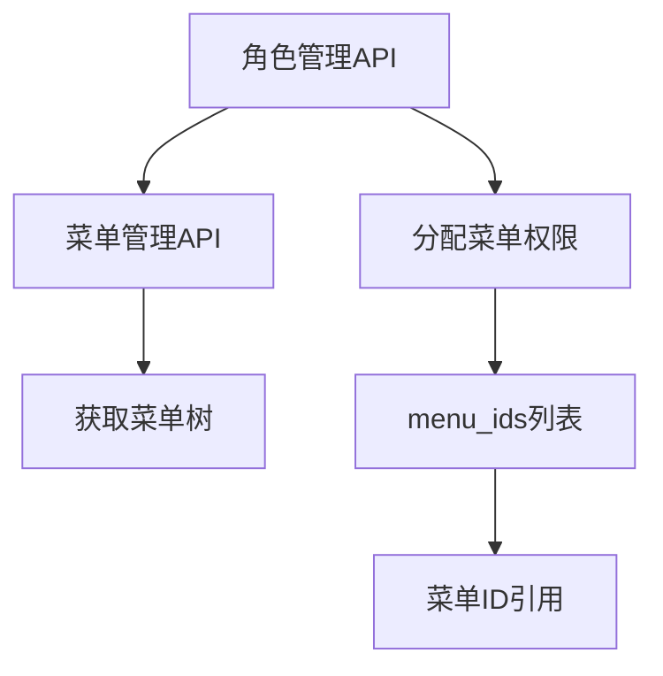
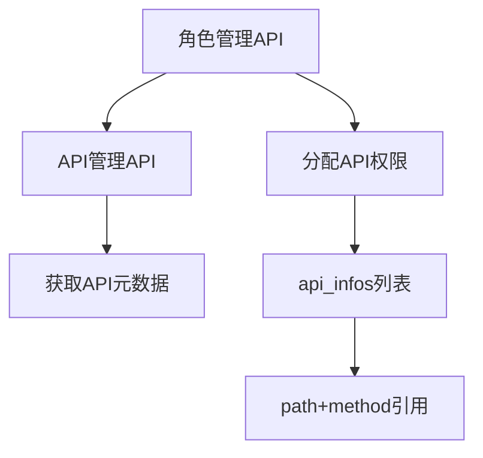
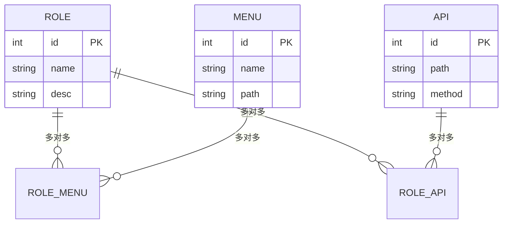

# 角色管理API

<cite>
**本文档引用的文件**  
- [roles.py](file://app/api/v1/roles/roles.py)
- [roles.py](file://app/schemas/roles.py)
- [role.py](file://app/controllers/role.py)
- [admin.py](file://app/models/admin.py)
- [crud.py](file://app/core/crud.py)
</cite>

## 目录
1. [简介](#简介)
2. [核心端点概览](#核心端点概览)
3. [获取角色列表](#获取角色列表)
4. [创建角色](#创建角色)
5. [更新角色](#更新角色)
6. [删除角色](#删除角色)
7. [获取角色权限树](#获取角色权限树)
8. [更新角色权限](#更新角色权限)
9. [请求体结构详解](#请求体结构详解)
10. [响应权限树结构说明](#响应权限树结构说明)
11. [curl示例：更新角色权限](#curl示例更新角色权限)
12. [认证与权限要求](#认证与权限要求)
13. [在RBAC系统中的核心作用](#在rbac系统中的核心作用)
14. [与菜单和API管理API的关联](#与菜单和api管理api的关联)

## 简介
角色管理API是基于FastAPI构建的后端接口模块，用于实现基于角色的访问控制（RBAC）系统中的角色全生命周期管理。该API支持角色的增删改查以及权限分配功能，通过与菜单和API元数据的关联，实现细粒度的权限控制。本API是系统权限体系的核心组成部分，为前端提供完整的角色配置能力。

**Section sources**
- [roles.py](file://app/api/v1/roles/roles.py#L1-L73)

## 核心端点概览
角色管理API提供以下核心功能端点：

| 端点 | HTTP方法 | 功能 |
|------|--------|------|
| `/api/v1/role/list` | GET | 获取角色列表（支持分页和查询） |
| `/api/v1/role/get` | GET | 获取单个角色详情 |
| `/api/v1/role/create` | POST | 创建新角色 |
| `/api/v1/role/update` | POST | 更新角色基本信息 |
| `/api/v1/role/delete` | DELETE | 删除角色 |
| `/api/v1/role/authorized` | GET | 获取角色权限树 |
| `/api/v1/role/authorized` | POST | 更新角色权限（菜单和API） |

**Section sources**
- [roles.py](file://app/api/v1/roles/roles.py#L1-L73)

## 获取角色列表
### 功能说明
获取系统中所有角色的分页列表，支持按角色名称进行模糊查询。

### 请求信息
- **HTTP方法**: `GET`
- **完整URL路径**: `/api/v1/role/list`
- **认证要求**: 需要有效的JWT令牌
- **权限要求**: 需要`get/api/v1/role/list`权限

### 请求参数
| 参数名 | 类型 | 必需 | 描述 |
|-------|------|------|------|
| `page` | int | 否 | 页码，默认为1 |
| `page_size` | int | 否 | 每页数量，默认为10 |
| `role_name` | string | 否 | 角色名称，用于模糊查询 |

### 响应结构
返回包含角色列表、总数、当前页码和每页数量的分页响应。

**Section sources**
- [roles.py](file://app/api/v1/roles/roles.py#L10-L19)

## 创建角色
### 功能说明
在系统中创建一个新的角色。

### 请求信息
- **HTTP方法**: `POST`
- **完整URL路径**: `/api/v1/role/create`
- **认证要求**: 需要有效的JWT令牌
- **权限要求**: 需要`post/api/v1/role/create`权限

### 请求体结构
使用`schemas.RoleCreate`模型：
```json
{
  "name": "管理员",
  "desc": "管理员角色"
}
```

### 验证规则
- 角色名称必须唯一，若已存在同名角色则返回400错误
- 名称字段为必填项

### 成功响应
返回成功消息："Created Successfully"

**Section sources**
- [roles.py](file://app/api/v1/roles/roles.py#L34-L40)
- [roles.py](file://app/schemas/roles.py#L17-L19)

## 更新角色
### 功能说明
更新角色的基本信息（名称和描述）。

### 请求信息
- **HTTP方法**: `POST`
- **完整URL路径**: `/api/v1/role/update`
- **认证要求**: 需要有效的JWT令牌
- **权限要求**: 需要`post/api/v1/role/update`权限

### 请求体结构
使用`schemas.RoleUpdate`模型：
```json
{
  "id": 1,
  "name": "管理员",
  "desc": "管理员角色"
}
```

### 成功响应
返回成功消息："Updated Successfully"

**Section sources**
- [roles.py](file://app/api/v1/roles/roles.py#L42-L46)
- [roles.py](file://app/schemas/roles.py#L22-L25)

## 删除角色
### 功能说明
从系统中删除指定ID的角色。

### 请求信息
- **HTTP方法**: `DELETE`
- **完整URL路径**: `/api/v1/role/delete`
- **认证要求**: 需要有效的JWT令牌
- **权限要求**: 需要`delete/api/v1/role/delete`权限

### 请求参数
| 参数名 | 类型 | 必需 | 描述 |
|-------|------|------|------|
| `role_id` | int | 是 | 要删除的角色ID |

### 成功响应
返回成功消息："Deleted Success"

**Section sources**
- [roles.py](file://app/api/v1/roles/roles.py#L48-L54)

## 获取角色权限树
### 功能说明
获取指定角色的完整权限树，包括关联的菜单和API权限。

### 请求信息
- **HTTP方法**: `GET`
- **完整URL路径**: `/api/v1/role/authorized`
- **认证要求**: 需要有效的JWT令牌
- **权限要求**: 需要`get/api/v1/role/authorized`权限

### 请求参数
| 参数名 | 类型 | 必需 | 描述 |
|-------|------|------|------|
| `id` | int | 是 | 角色ID |

### 响应结构
返回角色对象的完整字典表示，包含：
- 基本信息（id, name, desc）
- 关联的用户列表
- 完整的菜单权限树
- 完整的API权限列表

此端点调用`to_dict(m2m=True)`方法获取多对多关系数据。

**Section sources**
- [roles.py](file://app/api/v1/roles/roles.py#L56-L60)

## 更新角色权限
### 功能说明
为指定角色分配菜单和API权限。

### 请求信息
- **HTTP方法**: `POST`
- **完整URL路径**: `/api/v1/role/authorized`
- **认证要求**: 需要有效的JWT令牌
- **权限要求**: 需要`post/api/v1/role/authorized`权限

### 请求体结构
使用`schemas.RoleUpdateMenusApis`模型：
```json
{
  "id": 1,
  "menu_ids": [1, 2, 3],
  "api_infos": [
    {"path": "/api/v1/user", "method": "GET"},
    {"path": "/api/v1/user", "method": "POST"}
  ]
}
```

### 处理逻辑
1. 清除角色现有的所有菜单权限
2. 根据提供的`menu_ids`重新关联菜单
3. 清除角色现有的所有API权限
4. 根据提供的`api_infos`（路径+方法）重新关联API

### 成功响应
返回成功消息："Updated Successfully"

**Section sources**
- [roles.py](file://app/api/v1/roles/roles.py#L62-L72)
- [roles.py](file://app/schemas/roles.py#L28-L31)

## 请求体结构详解
### RoleCreate 模型
定义创建角色时的请求体结构：
- `name`: 角色名称（必填）
- `desc`: 角色描述（可选）

### RoleUpdate 模型
定义更新角色基本信息时的请求体结构：
- `id`: 角色ID（必填）
- `name`: 角色名称（必填）
- `desc`: 角色描述（可选）

### RoleUpdateMenusApis 模型
定义更新角色权限时的请求体结构：
- `id`: 角色ID
- `menu_ids`: 菜单ID列表（整数数组）
- `api_infos`: API权限信息列表（对象数组），每个对象包含：
  - `path`: API路径
  - `method`: HTTP方法

**Section sources**
- [roles.py](file://app/schemas/roles.py#L17-L31)

## 响应权限树结构说明
当调用`/authorized`端点获取角色权限时，返回的权限树结构包含完整的菜单和API权限信息。

### 菜单权限结构
菜单权限以树形结构返回，每个菜单节点包含：
- `id`: 菜单ID
- `name`: 菜单名称
- `path`: 菜单路径
- `menu_type`: 菜单类型
- `parent_id`: 父菜单ID
- `children`: 子菜单列表（递归结构）

### API权限结构
API权限以扁平列表形式返回，每个API项包含：
- `id`: API ID
- `path`: API路径
- `method`: HTTP方法
- `summary`: API简介
- `tags`: API标签

这种结构设计使得前端可以方便地渲染权限分配界面。

**Section sources**
- [roles.py](file://app/api/v1/roles/roles.py#L56-L60)
- [admin.py](file://app/models/admin.py#L25-L89)

## curl示例：更新角色权限
以下是一个使用curl命令更新角色权限的完整示例：

```bash
curl -X POST "http://localhost:8000/api/v1/role/authorized" \
  -H "Authorization: Bearer YOUR_JWT_TOKEN" \
  -H "Content-Type: application/json" \
  -d '{
    "id": 1,
    "menu_ids": [1, 2, 5, 8],
    "api_infos": [
      {
        "path": "/api/v1/user",
        "method": "GET"
      },
      {
        "path": "/api/v1/user",
        "method": "POST"
      },
      {
        "path": "/api/v1/role",
        "method": "GET"
      }
    ]
  }'
```

此命令将为ID为1的角色分配指定的菜单和API权限。

**Section sources**
- [roles.py](file://app/api/v1/roles/roles.py#L62-L72)

## 认证与权限要求
所有角色管理API端点都需要进行认证和权限检查：

### 认证机制
- 使用JWT（JSON Web Token）进行认证
- 请求头中必须包含`Authorization: Bearer <token>`字段
- 令牌由登录接口生成，包含用户身份和权限信息

### 权限要求
每个端点都需要特定的权限标识：
- `get/api/v1/role/list`: 查看角色列表
- `post/api/v1/role/create`: 创建角色
- `post/api/v1/role/update`: 更新角色
- `delete/api/v1/role/delete`: 删除角色
- `get/api/v1/role/authorized`: 查看角色权限
- `post/api/v1/role/authorized`: 更新角色权限

权限检查由前端指令`vPermission`和后端中间件共同实现。

**Section sources**
- [roles.py](file://app/api/v1/roles/roles.py#L1-L73)
- [web/src/views/system/role/index.vue](file://web/src/views/system/role/index.vue#L189-L236)

## 在RBAC系统中的核心作用
角色管理API是整个RBAC（基于角色的访问控制）系统的核心组件，承担着关键职责：

### 权限管理中枢
- 作为权限分配的中心节点，连接用户、菜单和API
- 实现"用户→角色→权限"的间接授权模式
- 支持灵活的权限组合和复用

### 安全控制基础
- 通过角色隔离不同用户的操作范围
- 防止越权访问系统资源
- 提供审计日志的基础数据

### 系统可维护性
- 集中管理权限配置，降低维护成本
- 支持动态调整权限，无需修改代码
- 便于实施最小权限原则

该API的设计遵循了关注点分离原则，将权限管理逻辑与业务逻辑解耦，提高了系统的可扩展性和安全性。

**Section sources**
- [roles.py](file://app/api/v1/roles/roles.py#L1-L73)
- [role.py](file://app/controllers/role.py#L1-L27)

## 与菜单和API管理API的关联
角色管理API与菜单管理API和API管理API紧密协作，共同构建完整的权限体系。

### 与菜单管理API的关联


角色管理API通过`menu_ids`字段引用菜单管理API提供的菜单ID，实现菜单权限的分配。

### 与API管理API的关联


角色管理API通过`api_infos`中的`path`和`method`字段引用API管理API注册的接口，实现API权限的精确控制。

### 数据模型关联


**Diagram sources**
- [admin.py](file://app/models/admin.py#L25-L57)
- [role.py](file://app/controllers/role.py#L1-L27)

**Section sources**
- [admin.py](file://app/models/admin.py#L25-L89)
- [role.py](file://app/controllers/role.py#L1-L27)