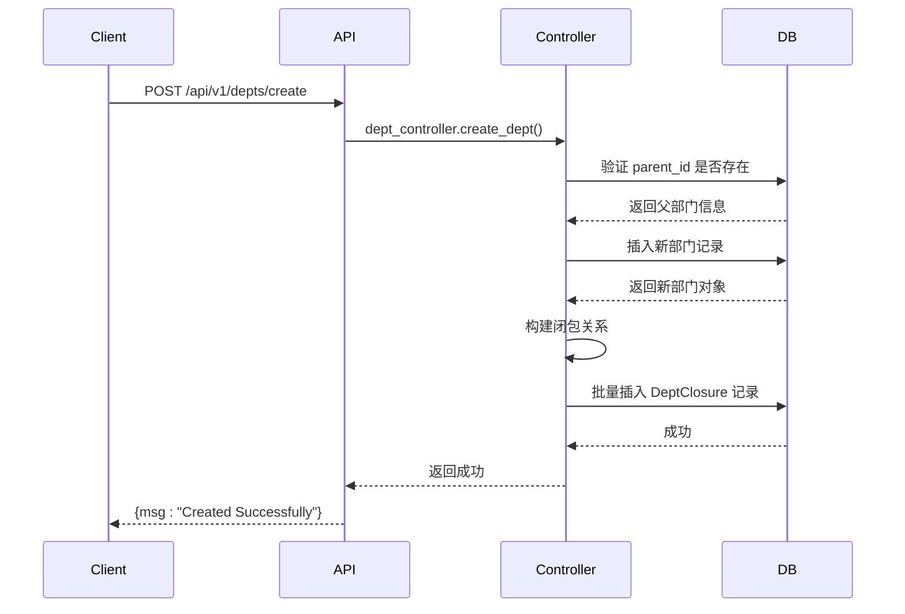
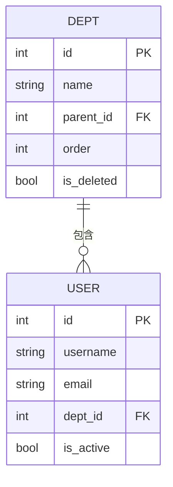

# 部门管理API

<cite>
**本文档引用的文件**  
- [depts.py](file://app/api/v1/depts/depts.py)
- [dept.py](file://app/controllers/dept.py)
- [depts.py](file://app/schemas/depts.py)
- [users.py](file://app/schemas/users.py)
</cite>

## 目录
1. [简介](#简介)
2. [核心功能概述](#核心功能概述)
3. [获取部门树](#获取部门树)
4. [创建部门](#创建部门)
5. [更新部门](#更新部门)
6. [删除部门](#删除部门)
7. [响应数据结构与层级关系](#响应数据结构与层级关系)
8. [创建子部门示例](#创建子部门示例)
9. [部门与用户关联机制](#部门与用户关联机制)

## 简介
本API用于管理系统中的部门信息，支持部门的增删改查操作，并以树形结构展示组织架构。通过该接口可实现企业或组织内部的层级化部门管理，适用于权限控制、人员归属等场景。

## 核心功能概述
部门管理API提供以下核心功能：
- 获取部门列表（树形结构）
- 创建新部门
- 更新现有部门信息
- 删除指定部门（软删除）
- 支持按名称模糊查询

这些功能由FastAPI驱动，基于Tortoise ORM实现数据库操作，并利用闭包表（Closure Table）模式高效维护部门间的层级关系。

**Section sources**
- [depts.py](file://app/api/v1/depts/depts.py#L1-L48)
- [dept.py](file://app/controllers/dept.py#L1-L86)

## 获取部门树
`GET /api/v1/depts/list` 端点用于获取所有部门的树形结构列表，便于前端展示组织架构图。

该接口支持可选参数 `name` 进行模糊匹配，返回结果为嵌套的JSON结构，根节点为 `parent_id=0` 的顶级部门，每个节点包含其子部门的递归结构。

树形结构通过内存中递归构建生成，先查询所有未被删除的部门并按排序字段 `order` 排序，再通过 `build_tree(parent_id)` 函数递归组装子节点。

```mermaid
flowchart TD
A["调用 GET /api/v1/depts/list"] --> B{是否提供 name 参数?}
B --> |是| C[添加 name 模糊查询条件]
B --> |否| D[仅过滤未删除部门]
C --> E[查询所有符合条件的部门]
D --> E
E --> F[按 order 字段排序]
F --> G[调用 build_tree(0) 构建树]
G --> H[返回树形结构 JSON]
```

**Diagram sources**
- [depts.py](file://app/api/v1/depts/depts.py#L8-L15)
- [dept.py](file://app/controllers/dept.py#L15-L45)

**Section sources**
- [depts.py](file://app/api/v1/depts/depts.py#L8-L15)
- [dept.py](file://app/controllers/dept.py#L15-L45)

## 创建部门
`POST /api/v1/depts/create` 用于创建新的部门。

请求体需符合 `schemas.DeptCreate` 模型定义，包含以下字段：

| 字段名 | 类型 | 是否必填 | 描述 |
|--------|------|----------|------|
| `name` | string | 是 | 部门名称，例如“人力资源部” |
| `desc` | string | 否 | 备注信息 |
| `order` | integer | 否 | 排序权重，数值越小越靠前 |
| `parent_id` | integer | 否 | 父部门ID，0表示顶级部门 |

在创建时会校验父部门是否存在（若 `parent_id ≠ 0`），并通过事务方式同时更新部门主表和闭包关系表（DeptClosure），确保层级关系一致性。



**Diagram sources**
- [depts.py](file://app/api/v1/depts/depts.py#L30-L36)
- [dept.py](file://app/controllers/dept.py#L68-L75)
- [depts.py](file://app/schemas/depts.py#L1-L18)

**Section sources**
- [depts.py](file://app/api/v1/depts/depts.py#L30-L36)
- [dept.py](file://app/controllers/dept.py#L68-L75)
- [depts.py](file://app/schemas/depts.py#L1-L18)

## 更新部门
`POST /api/v1/depts/update` 用于更新已有部门信息。

请求体需符合 `schemas.DeptUpdate` 模型，包含：
- `id`: 要更新的部门ID（必填）
- 其他字段同 `DeptCreate`

当 `parent_id` 发生变更时，系统会自动删除旧的闭包关系，并重建新的层级路径，确保树结构正确性。此过程在数据库事务中执行，防止数据不一致。

**Section sources**
- [depts.py](file://app/api/v1/depts/depts.py#L38-L43)
- [dept.py](file://app/controllers/dept.py#L77-L84)

## 删除部门
`DELETE /api/v1/depts/delete` 用于删除指定部门。

该操作为软删除，即将 `is_deleted` 字段设为 `True`，而非物理删除记录。同时会清除该部门在 `DeptClosure` 表中的所有关联关系，避免残留数据影响查询。

删除操作也包裹在事务中，确保主表与关系表同步更新。

**Section sources**
- [depts.py](file://app/api/v1/depts/depts.py#L45-L48)
- [dept.py](file://app/controllers/dept.py#L86-L87)

## 响应数据结构与层级关系
获取部门列表时返回的数据为树形嵌套结构，每个节点包含如下字段：

| 字段 | 类型 | 说明 |
|------|------|------|
| `id` | integer | 部门唯一标识 |
| `name` | string | 部门名称 |
| `desc` | string | 备注 |
| `order` | integer | 排序值 |
| `parent_id` | integer | 父部门ID |
| `children` | array | 子部门数组，递归嵌套 |

例如：
```json
[
  {
    "id": 1,
    "name": "总公司",
    "parent_id": 0,
    "children": [
      {
        "id": 2,
        "name": "研发部",
        "parent_id": 1,
        "children": []
      }
    ]
  }
]
```

此结构由 `build_tree()` 函数在内存中递归构建，确保前端可直接渲染为树形控件。

**Section sources**
- [dept.py](file://app/controllers/dept.py#L25-L45)

## 创建子部门示例
以下是一个使用curl创建子部门的示例：

```bash
curl -X POST "http://localhost:8000/api/v1/depts/create" \
  -H "Authorization: Bearer <your_token>" \
  -H "Content-Type: application/json" \
  -d '{
    "name": "前端开发组",
    "desc": "负责前端页面开发",
    "order": 1,
    "parent_id": 2
  }'
```

此请求将创建一个隶属于ID为2的部门（如“研发部”）的子部门“前端开发组”。

**Section sources**
- [depts.py](file://app/api/v1/depts/depts.py#L30-L36)

## 部门与用户关联机制
部门信息通过用户表中的 `dept_id` 字段与用户管理API关联。在 `schemas.UserCreate` 和 `UserUpdate` 模型中均包含 `dept_id` 字段，允许在创建或更新用户时指定其所属部门。

例如，创建用户时可指定：
```json
{
  "email": "zhangsan@company.com",
  "username": "zhangsan",
  "password": "123456",
  "dept_id": 2
}
```

这表示该用户属于ID为2的部门。后续可通过部门ID查询所属用户列表，实现组织架构下的人员管理。



**Diagram sources**
- [users.py](file://app/schemas/users.py#L20-L35)
- [depts.py](file://app/schemas/depts.py#L1-L18)

**Section sources**
- [users.py](file://app/schemas/users.py#L20-L35)