# 前端架构

<cite>
**本文档中引用的文件**  
- [main.js](file://web/src/main.js)
- [store/index.js](file://web/src/store/index.js)
- [store/modules/user/index.js](file://web/src/store/modules/user/index.js)
- [store/modules/permission/index.js](file://web/src/store/modules/permission/index.js)
- [router/index.js](file://web/src/router/index.js)
- [router/guard/auth-guard.js](file://web/src/router/guard/auth-guard.js)
- [directives/permission.js](file://web/src/directives/permission.js)
- [utils/http/index.js](file://web/src/utils/http/index.js)
- [api/index.js](file://web/src/api/index.js)
- [components/table/CrudTable.vue](file://web/src/components/table/CrudTable.vue)
</cite>

## 目录
1. [简介](#简介)
2. [项目结构](#项目结构)
3. [核心组件](#核心组件)
4. [架构概览](#架构概览)
5. [详细组件分析](#详细组件分析)
6. [依赖分析](#依赖分析)
7. [性能考虑](#性能考虑)
8. [故障排除指南](#故障排除指南)
9. [结论](#结论)

## 简介
本文档全面介绍基于 Vue3 Composition API 和 Vite 构建的现代化前端工程架构。重点阐述应用入口、状态管理、路由控制、权限系统、组件复用机制及网络请求封装等核心模块的设计与实现。

## 项目结构
项目采用模块化分层设计，主要目录包括：
- `src/api`：API 接口定义
- `src/components`：通用组件库
- `src/directives`：自定义指令
- `src/router`：路由配置与守卫
- `src/store`：Pinia 状态管理
- `src/utils`：工具函数与 HTTP 封装
- `src/views`：页面视图组件
- `src/layout`：布局组件

**Section sources**
- [main.js](file://web/src/main.js#L1-L26)

## 核心组件
系统核心由应用入口、状态管理、路由系统、权限控制和网络请求模块构成，各模块通过清晰的依赖关系协同工作。

**Section sources**
- [main.js](file://web/src/main.js#L1-L26)
- [store/index.js](file://web/src/store/index.js#L1-L7)

## 架构概览
系统采用现代化前端架构，基于 Vue3 Composition API 实现响应式数据流，通过 Vite 提供高效开发体验。

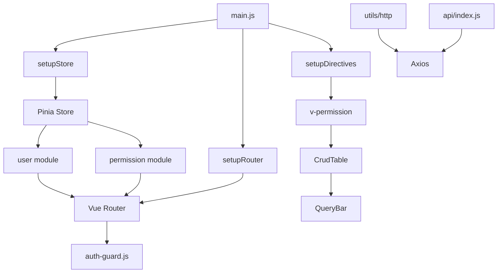

**Diagram sources**
- [main.js](file://web/src/main.js#L1-L26)
- [store/index.js](file://web/src/store/index.js#L1-L7)
- [router/index.js](file://web/src/router/index.js#L1-L67)
- [directives/permission.js](file://web/src/directives/permission.js#L1-L34)

## 详细组件分析

### 应用入口分析
`main.js` 作为应用唯一入口，负责初始化应用实例并注册全局依赖。

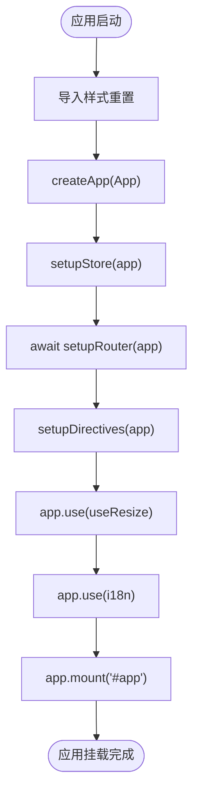

**Diagram sources**
- [main.js](file://web/src/main.js#L1-L26)

**Section sources**
- [main.js](file://web/src/main.js#L1-L26)

### 状态管理分析
Pinia 状态管理模块分为用户状态和权限状态两个核心模块，分别管理用户信息和动态路由。

#### 用户状态模块
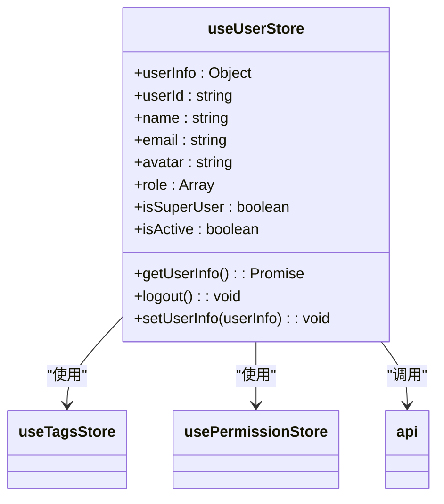

**Diagram sources**
- [store/modules/user/index.js](file://web/src/store/modules/user/index.js#L1-L65)

#### 权限状态模块
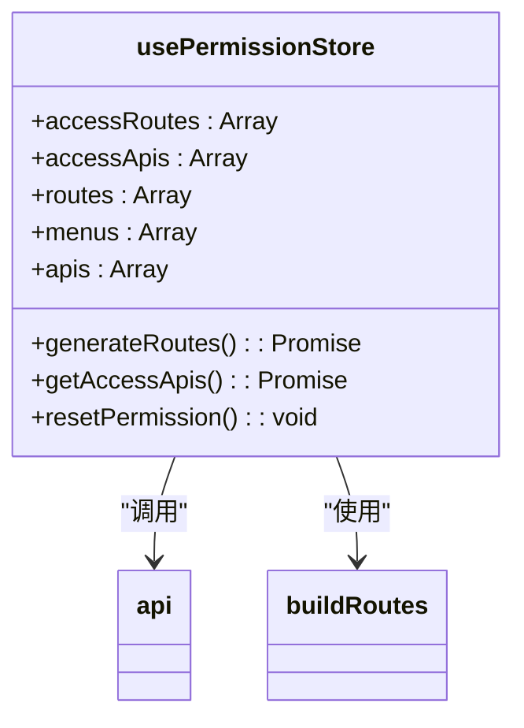

**Diagram sources**
- [store/modules/permission/index.js](file://web/src/store/modules/permission/index.js#L1-L93)

**Section sources**
- [store/modules/user/index.js](file://web/src/store/modules/user/index.js#L1-L65)
- [store/modules/permission/index.js](file://web/src/store/modules/permission/index.js#L1-L93)

### 路由系统分析
Vue Router 配置包含静态路由和动态路由两部分，通过路由守卫实现权限控制。

#### 路由初始化流程
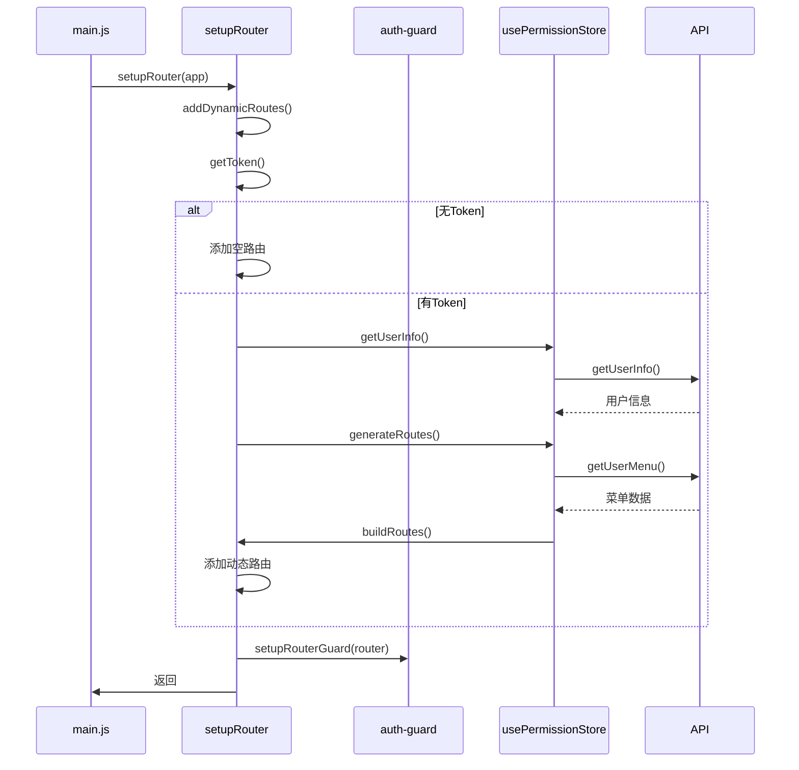

**Diagram sources**
- [router/index.js](file://web/src/router/index.js#L1-L67)
- [router/guard/auth-guard.js](file://web/src/router/guard/auth-guard.js#L1-L18)

#### 认证守卫机制
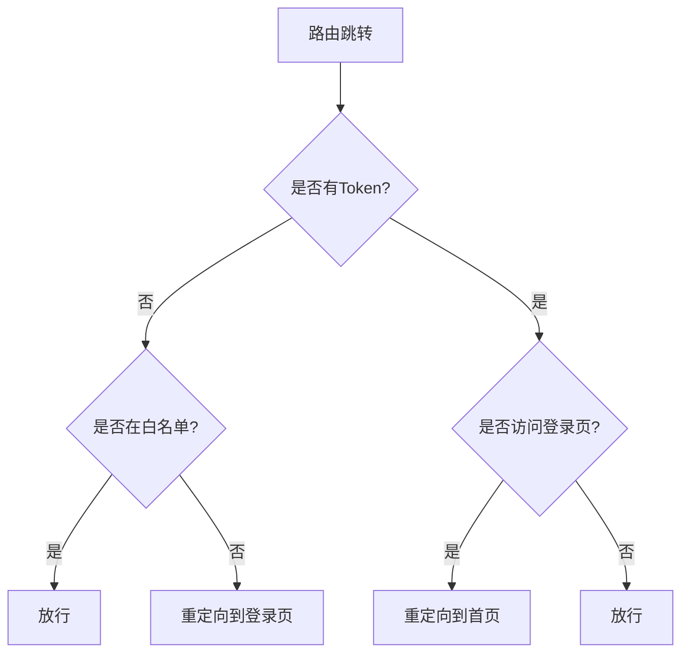

**Diagram sources**
- [router/guard/auth-guard.js](file://web/src/router/guard/auth-guard.js#L1-L18)

**Section sources**
- [router/index.js](file://web/src/router/index.js#L1-L67)
- [router/guard/auth-guard.js](file://web/src/router/guard/auth-guard.js#L1-L18)

### 组件体系分析
组件体系采用分层设计，提供通用组件、查询栏和表格等复用组件。

#### CRUD 表格组件
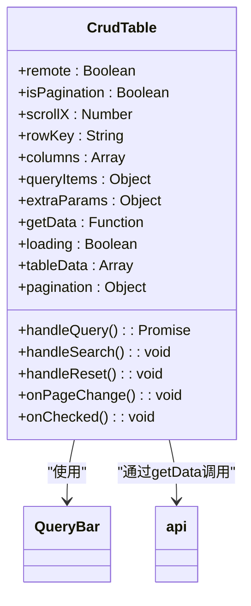

**Diagram sources**
- [components/table/CrudTable.vue](file://web/src/components/table/CrudTable.vue#L1-L151)

**Section sources**
- [components/table/CrudTable.vue](file://web/src/components/table/CrudTable.vue#L1-L151)

### 权限指令分析
`v-permission` 指令实现按钮级权限控制，根据用户权限动态显示或隐藏元素。

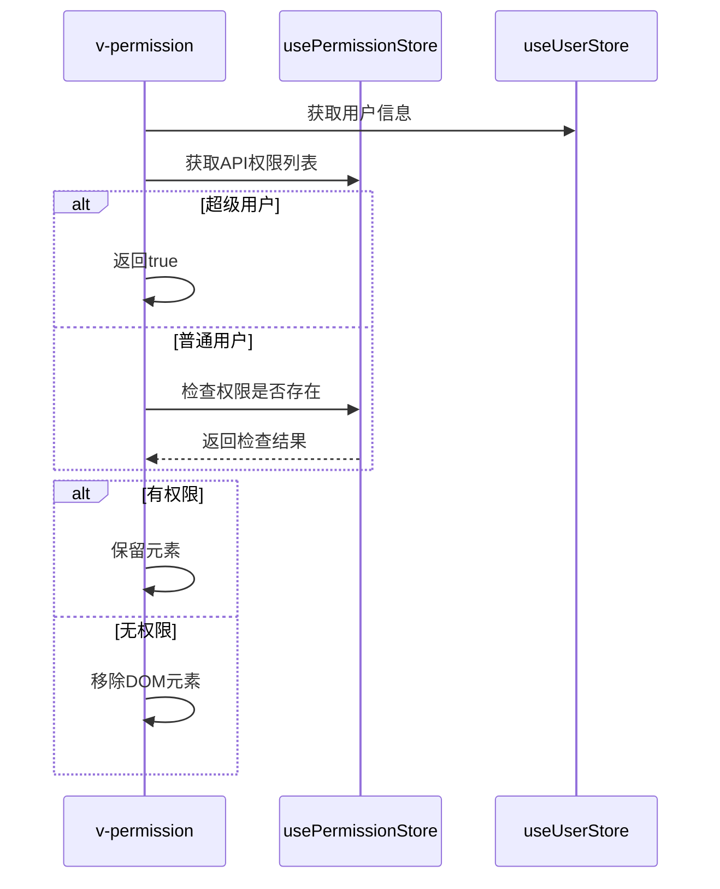

**Diagram sources**
- [directives/permission.js](file://web/src/directives/permission.js#L1-L34)

**Section sources**
- [directives/permission.js](file://web/src/directives/permission.js#L1-L34)

### 网络请求分析
HTTP 模块基于 Axios 封装，提供统一的请求拦截和响应处理。

#### 请求封装结构
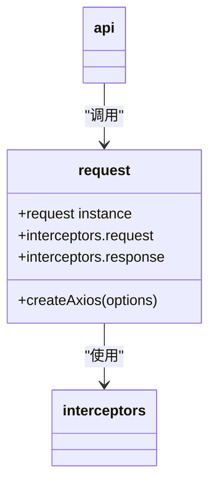

**Diagram sources**
- [utils/http/index.js](file://web/src/utils/http/index.js#L1-L19)

#### API 接口组织
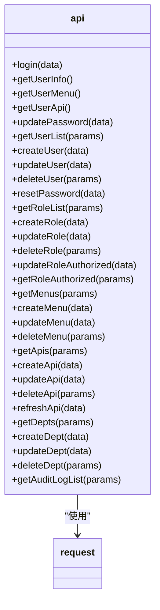

**Diagram sources**
- [api/index.js](file://web/src/api/index.js#L1-L42)

**Section sources**
- [utils/http/index.js](file://web/src/utils/http/index.js#L1-L19)
- [api/index.js](file://web/src/api/index.js#L1-L42)

## 依赖分析
系统各模块间存在明确的依赖关系，形成清晰的调用链路。

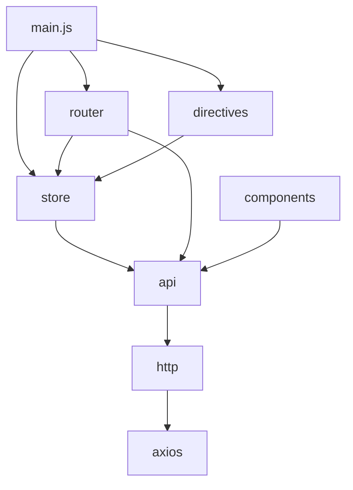

**Diagram sources**
- [main.js](file://web/src/main.js#L1-L26)
- [store/index.js](file://web/src/store/index.js#L1-L7)
- [router/index.js](file://web/src/router/index.js#L1-L67)
- [directives/permission.js](file://web/src/directives/permission.js#L1-L34)
- [api/index.js](file://web/src/api/index.js#L1-L42)

**Section sources**
- [main.js](file://web/src/main.js#L1-L26)
- [store/index.js](file://web/src/store/index.js#L1-L7)
- [router/index.js](file://web/src/router/index.js#L1-L67)

## 性能考虑
系统在性能方面进行了多项优化：
- 采用 Vite 构建工具，提供快速热更新
- 实现动态路由加载，减少初始加载体积
- 支持前后端分页，优化大数据量渲染
- 使用 Pinia 状态管理，避免重复请求
- 通过指令移除无权限元素，减少 DOM 节点

## 故障排除指南
常见问题及解决方案：

1. **页面空白**
   - 检查 `main.js` 是否正确挂载应用
   - 确认路由配置是否正确

2. **权限不生效**
   - 检查 `v-permission` 指令参数是否正确
   - 确认用户权限数据是否已正确加载

3. **API 请求失败**
   - 检查 `utils/http` 拦截器配置
   - 确认 `api/index.js` 中的接口路径

4. **动态路由未加载**
   - 检查 `permission` 模块的 `generateRoutes` 方法
   - 确认后端返回的菜单数据格式

**Section sources**
- [main.js](file://web/src/main.js#L1-L26)
- [store/modules/permission/index.js](file://web/src/store/modules/permission/index.js#L1-L93)
- [router/index.js](file://web/src/router/index.js#L1-L67)
- [directives/permission.js](file://web/src/directives/permission.js#L1-L34)

## 结论
本系统采用现代化前端技术栈，构建了结构清晰、可维护性强的企业级应用架构。通过 Vue3 Composition API 实现逻辑复用，利用 Pinia 进行状态管理，结合 Vue Router 实现灵活的路由控制，并通过自定义指令实现细粒度的权限管理。整体架构具有良好的扩展性和可维护性，为后续功能开发提供了坚实基础。