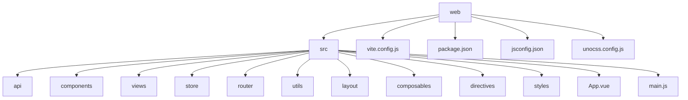

# 前端项目结构

<cite>
**本文档中引用的文件**  
- [main.js](file://web/src/main.js)
- [App.vue](file://web/src/App.vue)
- [vite.config.js](file://web/vite.config.js)
- [package.json](file://web/package.json)
- [jsconfig.json](file://web/jsconfig.json)
- [unocss.config.js](file://web/unocss.config.js)
- [router/index.js](file://web/src/router/index.js)
- [store/index.js](file://web/src/store/index.js)
- [build/plugin/unplugin.js](file://web/build/plugin/unplugin.js)
</cite>

## 目录

1. [项目结构](#项目结构)
2. [核心组件](#核心组件)
3. [构建与配置](#构建与配置)
4. [开发与生产流程](#开发与生产流程)
5. [依赖与插件分析](#依赖与插件分析)
6. [结论](#结论)

## 项目结构

本项目采用基于 Vue3 和 Vite 的现代化前端工程架构，整体结构清晰，职责分明。前端代码位于 `web` 目录下，核心源码集中于 `src` 文件夹。

**Diagram sources**  
- [web/src/main.js](file://web/src/main.js#L1-L26)
- [web/src/App.vue](file://web/src/App.vue#L1-L11)

**本节来源**  
- [web/src](file://web/src)

## 核心组件

### 应用入口：main.js

`main.js` 是整个 Vue 应用的入口文件，负责初始化 Vue 实例并挂载到 DOM。其核心流程包括：

- 导入全局样式与 UnoCSS 基础类
- 使用 `createApp` 创建应用实例
- 依次注册路由、状态管理、指令、i18n 和响应式工具
- 最终通过 `app.mount('#app')` 挂载到页面根节点

该文件采用异步函数 `setupApp` 封装初始化逻辑，确保异步依赖（如路由动态加载）正确执行。

**本节来源**  
- [main.js](file://web/src/main.js#L1-L26)

### 根组件：App.vue

`App.vue` 作为 Vue 应用的根组件，结构简洁但功能关键：

- 使用 `<AppProvider>` 作为全局上下文提供者
- 通过 `<router-view>` 结合 `v-slot` 动态渲染当前路由组件
- 采用 `defineAsyncComponent` 惰性加载机制提升性能

该组件不包含具体 UI，而是作为路由出口和全局状态注入的容器。

**本节来源**  
- [App.vue](file://web/src/App.vue#L1-L11)

### 路由系统：router/index.js

路由模块采用 Vue Router 4 的组合式 API，支持 history 和 hash 两种模式（由环境变量控制）。

关键功能包括：
- 动态路由加载：`addDynamicRoutes` 根据用户权限异步生成并注册路由
- 路由守卫集成：通过 `setupRouterGuard` 注册全局前置守卫
- Token 验证：在路由初始化时检查用户登录状态
- 404 路由兜底：确保未匹配路由跳转至错误页

**本节来源**  
- [router/index.js](file://web/src/router/index.js#L1-L67)

### 状态管理：store/index.js

使用 Pinia 实现状态管理，`setupStore` 函数将 Pinia 实例挂载到 Vue 应用。

特点：
- 轻量级、TypeScript 友好
- 模块化设计：通过 `export * from './modules'` 导出所有子模块
- 支持组合式 API 风格的 store 定义

**本节来源**  
- [store/index.js](file://web/src/store/index.js#L1-L7)

## 构建与配置

### Vite 配置：vite.config.js

`vite.config.js` 是 Vite 构建工具的核心配置文件，定义了开发与生产环境的行为。

主要配置项：

- **别名设置**：`@` 指向 `src` 目录，`~` 指向项目根目录，提升导入可读性
- **插件系统**：通过 `createVitePlugins` 引入一系列 unplugin 插件
- **代理配置**：开发环境下通过 `proxy` 实现跨域请求转发
- **构建输出**：指定输出目录、压缩警告阈值等

**本节来源**  
- [vite.config.js](file://web/vite.config.js#L1-L44)

### 原子化 CSS：unocss.config.js

UnoCSS 是一个按需生成原子化 CSS 的引擎，配置文件定义了其行为：

- **预设**：启用 `presetUno`（基础原子类）和 `presetAttributify`（属性化语法）
- **快捷方式**：自定义常用类组合，如 `f-c-c` 表示居中布局
- **自定义规则**：支持正则匹配生成动态样式，如 `bc-red` 生成边框颜色
- **主题颜色**：映射 CSS 变量，实现主题切换能力

该配置实现了极致的样式复用与体积优化。

**本节来源**  
- [unocss.config.js](file://web/unocss.config.js#L1-L60)

### 路径支持：jsconfig.json

`jsconfig.json` 为 IDE 提供路径别名智能提示支持：

- `@/*` 映射到 `src/*`
- `~/*` 映射到项目根目录
- 启用 `allowJs` 支持 JavaScript 项目

此配置确保开发时导入路径的自动补全与跳转功能正常。

**本节来源**  
- [jsconfig.json](file://web/jsconfig.json#L1-L14)

## 开发与生产流程

### 脚本命令：package.json

`package.json` 定义了项目生命周期脚本：

- `dev`：启动 Vite 开发服务器
- `build`：执行生产环境打包
- `preview`：本地预览打包结果
- `lint` / `lint:fix`：代码风格检查与自动修复
- `prettier`：格式化代码

这些脚本封装了复杂构建逻辑，提供简洁的开发接口。

**本节来源**  
- [package.json](file://web/package.json#L1-L60)

### 构建流程解析

开发服务器启动流程：
1. 执行 `vite` 命令
2. 加载 `vite.config.js`
3. 解析别名与插件
4. 启动开发服务器并打开浏览器

生产打包流程：
1. 执行 `vite build`
2. 应用生产环境配置
3. 编译 TypeScript、处理资源
4. 应用 UnoCSS 按需生成样式
5. 输出到 `dist` 目录

## 依赖与插件分析

### 核心插件：unplugin.js

`build/plugin/unplugin.js` 集成了多个 unplugin 插件：

- **unplugin-auto-import**：自动导入 Vue 和 Vue Router API，无需手动 import
- **unplugin-components**：自动注册组件，结合 `NaiveUiResolver` 支持按需加载
- **unplugin-icons**：集成 Iconify 图标库，支持 `icon-[collection]-[icon]` 语法
- **vite-plugin-svg-icons**：将 SVG 文件转换为可复用的 Symbol 图标

这些插件极大提升了开发效率与构建性能。

**本节来源**  
- [build/plugin/unplugin.js](file://web/build/plugin/unplugin.js#L1-L46)

## 结论

该项目构建了一个现代化、工程化的 Vue3 前端架构，具备以下优势：

- **高效开发**：Vite 提供极速 HMR，unplugin 系列插件减少样板代码
- **极致性能**：UnoCSS 按需生成样式，动态路由懒加载
- **良好维护性**：目录结构清晰，职责分离明确
- **可扩展性强**：插件化架构便于功能扩展

整体设计体现了当前前端工程化的最佳实践，适合中大型管理系统开发。