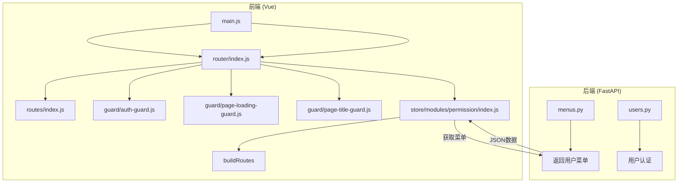
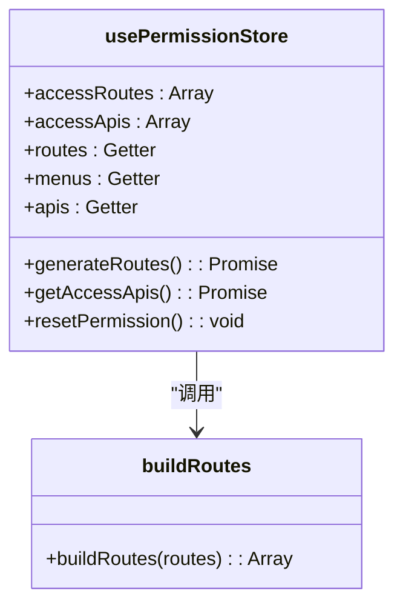
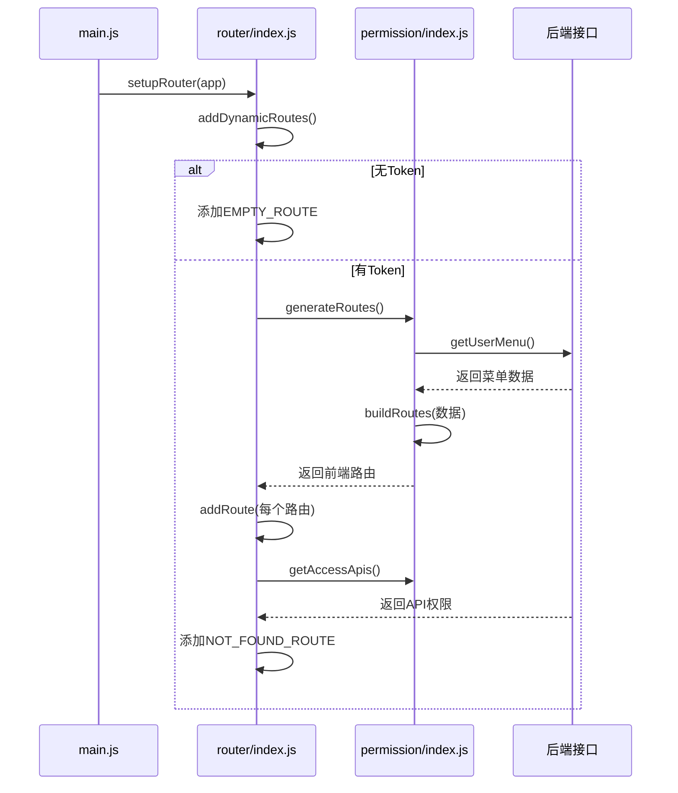
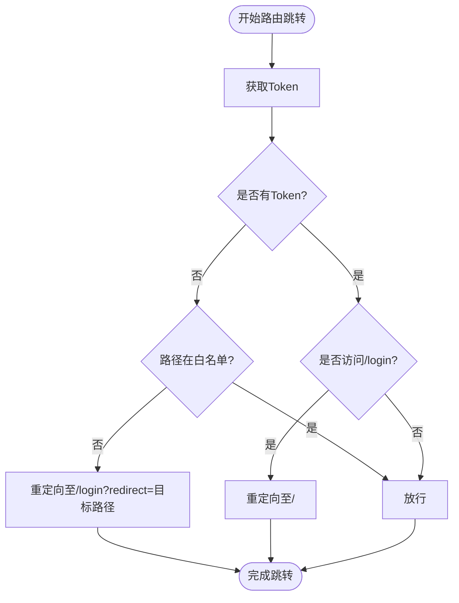
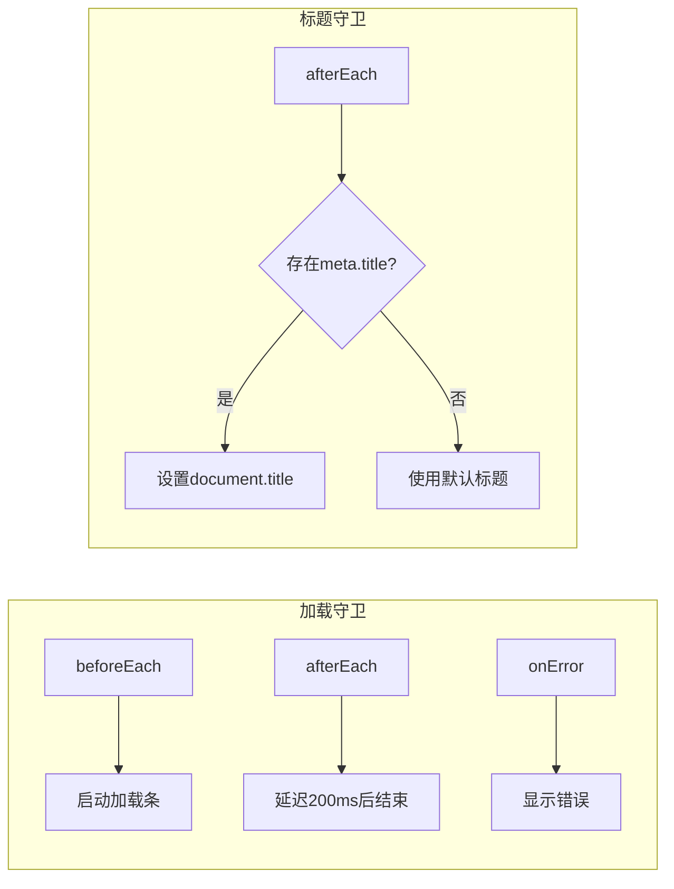
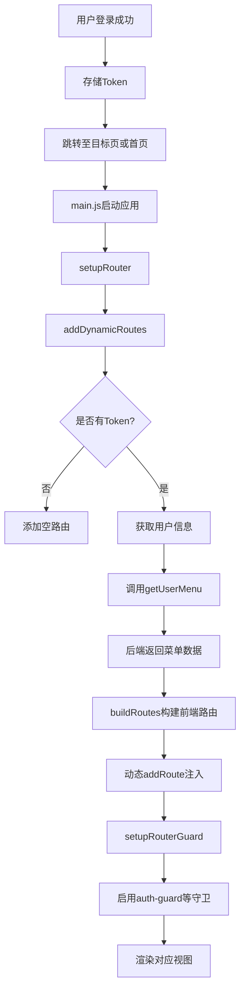

# 动态路由构建逻辑

<cite>
**本文档引用文件**  
- [routes/index.js](file://web/src/router/routes/index.js)
- [permission/index.js](file://web/src/store/modules/permission/index.js)
- [auth-guard.js](file://web/src/router/guard/auth-guard.js)
- [page-loading-guard.js](file://web/src/router/guard/page-loading-guard.js)
- [page-title-guard.js](file://web/src/router/guard/page-title-guard.js)
- [router/index.js](file://web/src/router/index.js)
- [main.js](file://web/src/main.js)
</cite>

## 目录
1. [项目结构](#项目结构)
2. [核心组件](#核心组件)
3. [权限状态管理机制](#权限状态管理机制)
4. [动态路由生成流程](#动态路由生成流程)
5. [路由守卫实现逻辑](#路由守卫实现逻辑)
6. [页面状态处理守卫](#页面状态处理守卫)
7. [整体数据流与执行流程](#整体数据流与执行流程)
8. [结论](#结论)

## 项目结构

本项目采用前后端分离架构，前端基于 Vue 3 + Vite 构建，使用 Pinia 进行状态管理，Vue Router 实现路由控制。核心权限与路由相关代码集中在 `web/src/router` 和 `web/src/store/modules/permission` 目录下。

前端路由系统由静态基础路由与动态权限路由共同构成。静态路由定义于 `routes/index.js`，包含登录页、错误页及默认工作台等无需权限控制的页面。动态路由则根据用户权限从后端获取菜单数据，在运行时动态注入路由表。

**Diagram sources**
- [main.js](file://web/src/main.js#L1-L27)
- [routes/index.js](file://web/src/router/routes/index.js#L1-L144)
- [permission/index.js](file://web/src/store/modules/permission/index.js#L1-L94)

**Section sources**
- [main.js](file://web/src/main.js#L1-L27)
- [routes/index.js](file://web/src/router/routes/index.js#L1-L144)

## 核心组件

系统核心组件包括：静态路由定义、权限状态存储、路由守卫机制、动态路由注入逻辑。其中，`basicRoutes` 定义了所有用户均可访问的基础路由，如登录页、404 页面等；`usePermissionStore` 负责管理用户权限路由与接口权限；各类路由守卫在导航过程中执行验证与副作用操作。

**Section sources**
- [routes/index.js](file://web/src/router/routes/index.js#L1-L144)
- [permission/index.js](file://web/src/store/modules/permission/index.js#L1-L94)
- [auth-guard.js](file://web/src/router/guard/auth-guard.js#L1-L19)

## 权限状态管理机制

`store/modules/permission/index.js` 使用 Pinia 定义了 `usePermissionStore`，用于集中管理用户可访问的路由与 API 权限。

该模块包含以下关键逻辑：
- `state` 中维护 `accessRoutes`（动态路由）和 `accessApis`（接口权限）
- `getters` 提供合并后的完整路由表 `routes` 和过滤后的菜单项 `menus`
- `actions` 中 `generateRoutes()` 调用 `api.getUserMenu()` 获取后端菜单数据，并通过 `buildRoutes` 函数转换为前端路由格式

`buildRoutes` 函数根据后端返回的菜单结构递归构建前端路由对象，自动处理父子菜单关系，并为无子项的菜单创建默认子路由以确保正确渲染。

**Diagram sources**
- [permission/index.js](file://web/src/store/modules/permission/index.js#L1-L94)

**Section sources**
- [permission/index.js](file://web/src/store/modules/permission/index.js#L1-L94)

## 动态路由生成流程

动态路由的注入发生在应用初始化阶段，由 `router/index.js` 中的 `setupRouter` 函数触发。

流程如下：
1. 应用启动时调用 `setupRouter(app)`
2. 执行 `addDynamicRoutes()` 判断是否存在用户 token
3. 若无 token，仅添加空路由；若有 token，则：
   - 调用 `useUserStore().getUserInfo()` 获取用户信息
   - 调用 `permissionStore.generateRoutes()` 获取并构建动态路由
   - 调用 `getAccessApis()` 获取接口权限
   - 遍历 `accessRoutes` 并通过 `router.addRoute()` 动态注册
   - 移除临时的空路由，添加 404 未找到路由

此机制确保只有经过身份验证的用户才能获得与其权限匹配的可访问路由。

**Diagram sources**
- [router/index.js](file://web/src/router/index.js#L1-L68)
- [permission/index.js](file://web/src/store/modules/permission/index.js#L1-L94)

**Section sources**
- [router/index.js](file://web/src/router/index.js#L1-L68)

## 路由守卫实现逻辑

`auth-guard.js` 实现了核心的身份验证与权限拦截逻辑，通过 `router.beforeEach` 全局前置守卫进行拦截。

其主要逻辑包括：
- 获取本地存储的 token
- 若无 token 且目标路径不在白名单（登录页、404），则重定向至登录页并携带跳转参数
- 若已有 token 且访问登录页，则自动跳转至首页
- 其他情况放行

该守卫有效防止未登录用户访问受保护页面，并避免已登录用户重复访问登录页。

**Diagram sources**
- [auth-guard.js](file://web/src/router/guard/auth-guard.js#L1-L19)

**Section sources**
- [auth-guard.js](file://web/src/router/guard/auth-guard.js#L1-L19)

## 页面状态处理守卫

系统提供了两个辅助性路由守卫：页面加载状态与标题更新。

`page-loading-guard.js` 在路由跳转前后控制全局加载条：
- `beforeEach` 触发时启动加载条
- `afterEach` 触发后延迟 200ms 结束加载（模拟页面渲染时间）
- `onError` 发生时显示错误状态

`page-title-guard.js` 在每次路由切换后更新浏览器标题：
- 读取目标路由 `meta.title`
- 拼接基础标题 `VITE_TITLE`
- 更新 `document.title`

这两个守卫提升了用户体验，分别提供了视觉反馈与页面标识。

**Diagram sources**
- [page-loading-guard.js](file://web/src/router/guard/page-loading-guard.js#L1-L16)
- [page-title-guard.js](file://web/src/router/guard/page-title-guard.js#L1-L13)

**Section sources**
- [page-loading-guard.js](file://web/src/router/guard/page-loading-guard.js#L1-L16)
- [page-title-guard.js](file://web/src/router/guard/page-title-guard.js#L1-L13)

## 整体数据流与执行流程

从用户登录成功到动态路由渲染的完整流程如下：

该流程确保了权限数据的安全获取、路由的按需加载以及页面的正确渲染。

**Diagram sources**
- [main.js](file://web/src/main.js#L1-L27)
- [router/index.js](file://web/src/router/index.js#L1-L68)
- [permission/index.js](file://web/src/store/modules/permission/index.js#L1-L94)

**Section sources**
- [main.js](file://web/src/main.js#L1-L27)
- [router/index.js](file://web/src/router/index.js#L1-L68)

## 结论

本系统通过 `routes/index.js` 定义静态路由结构，利用 `permission` 模块根据后端权限数据动态生成可访问路由表，并通过 `auth-guard.js` 在跳转前验证登录状态与权限，有效拦截未授权访问。`page-loading-guard` 与 `page-title-guard` 分别处理加载状态与页面标题，提升用户体验。`store/modules/permission/index.js` 统一管理权限状态，实现菜单树的构建与缓存。整个流程从登录到路由渲染形成闭环，具备良好的安全性与可维护性。