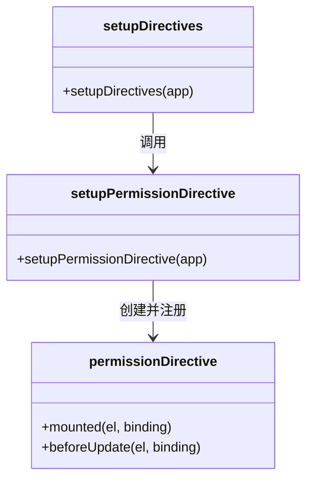
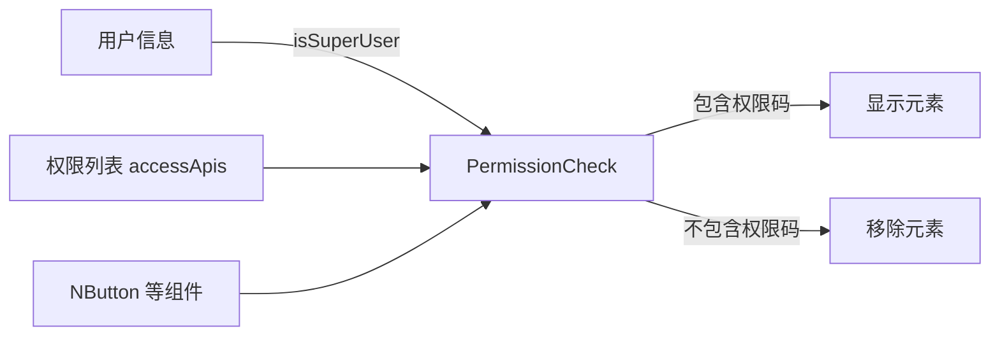

# 权限指令（v-permission）

<cite>
**本文档引用的文件**  
- [directives/permission.js](file://web/src/directives/permission.js)
- [directives/index.js](file://web/src/directives/index.js)
- [store/modules/permission/index.js](file://web/src/store/modules/permission/index.js)
- [views/system/user/index.vue](file://web/src/views/system/user/index.vue)
- [views/system/api/index.vue](file://web/src/views/system/api/index.vue)
</cite>

## 目录
1. [简介](#简介)
2. [核心实现原理](#核心实现原理)
3. [权限指令注册机制](#权限指令注册机制)
4. [实际应用示例](#实际应用示例)
5. [性能优化策略](#性能优化策略)
6. [总结](#总结)

## 简介

`v-permission` 是一个自定义 Vue 指令，用于实现按钮级别的细粒度权限控制。通过该指令，前端可以根据当前用户的角色和权限动态决定是否显示特定的 DOM 元素（如按钮、操作项等），从而实现基于权限码的界面级访问控制。

该机制结合了 Pinia 状态管理、Vue 自定义指令钩子函数以及后端权限数据同步，构建了一套完整的前端权限控制系统。

## 核心实现原理

`v-permission` 指令的核心逻辑位于 `directives/permission.js` 文件中，其主要通过以下步骤实现权限判断与 DOM 控制：

1. **权限判断函数 `hasPermission(permission)`**：
   - 从 `useUserStore` 获取当前用户信息。
   - 从 `usePermissionStore` 获取用户可访问的 API 权限列表 `accessApis`。
   - 若用户为超级管理员（`isSuperUser`），则直接返回 `true`，拥有所有权限。
   - 否则，检查传入的权限标识是否包含在 `accessApis` 列表中。

2. **DOM 控制逻辑 `updateElVisible(el, permission)`**：
   - 接收指令绑定的元素 `el` 和权限码 `permission`。
   - 若未提供权限码，则抛出错误提示。
   - 若当前用户不具备该权限，则通过 `el.parentElement.removeChild(el)` 将该元素从 DOM 中移除，实现“隐藏”效果。

3. **指令钩子函数**：
   - `mounted`：在元素挂载后立即执行权限判断，控制初始可见性。
   - `beforeUpdate`：在组件更新前重新校验权限，确保权限状态变化时能及时响应。

```mermaid
flowchart TD
A[指令绑定 v-permission="xxx"] --> B{mounted 钩子触发}
B --> C[调用 updateElVisible]
C --> D[执行 hasPermission 判断]
D --> E{是否具有权限?}
E --> |否| F[从父节点移除元素]
E --> |是| G[保留元素显示]
H{组件更新} --> I[beforeUpdate 钩子触发]
I --> C
```

**Diagram sources**  
- [directives/permission.js](file://web/src/directives/permission.js#L6-L34)

**Section sources**  
- [directives/permission.js](file://web/src/directives/permission.js#L1-L34)

## 权限指令注册机制

所有自定义指令通过 `directives/index.js` 进行集中注册和初始化。该文件导出 `setupDirectives(app)` 函数，在应用启动时统一安装所有指令。

```javascript
import setupPermissionDirective from './permission'

export function setupDirectives(app) {
  setupPermissionDirective(app)
}
```

此设计实现了：
- **模块化封装**：每个指令独立实现，职责清晰。
- **统一管理**：便于扩展其他指令（如 `v-debounce`、`v-loading` 等）。
- **解耦注册逻辑**：将指令安装与主应用逻辑分离，提升可维护性。



**Diagram sources**  
- [directives/index.js](file://web/src/directives/index.js#L1-L7)
- [directives/permission.js](file://web/src/directives/permission.js#L36-L48)

**Section sources**  
- [directives/index.js](file://web/src/directives/index.js#L1-L7)

## 实际应用示例

在系统管理页面中，`v-permission` 被广泛用于控制操作按钮的可见性。以用户管理页面为例：

### 用户管理页面中的权限控制

在 `views/system/user/index.vue` 中，新增用户按钮通过以下方式受权限控制：

```vue
<NButton v-permission="'post/api/v1/user/create'" type="primary" @click="handleAdd">
  新建用户
</NButton>
```

当用户不具备 `post/api/v1/user/create` 权限时，该按钮将被直接从 DOM 中移除，无法通过审查元素等方式手动触发。

此外，在表格操作列中，编辑、删除、重置密码等操作也均通过 `withDirectives` 动态绑定权限指令：

```js
withDirectives(
  h(NButton, { onClick: handleEdit }, { default: () => '编辑' }),
  [[vPermission, 'post/api/v1/user/update']]
)
```

这表明该指令不仅适用于模板语法，也可在渲染函数（render function）中灵活使用。

### 其他页面的应用

搜索结果显示，该指令同样应用于 API 管理、部门、菜单、角色等模块：

- `v-permission="'post/api/v1/api/create'"` —— API 新建
- `v-permission="'post/api/v1/dept/create'"` —— 部门新增
- `v-permission="'post/api/v1/role/create'"` —— 角色创建

这些权限码与后端 API 路径严格对应，确保前后端权限体系一致。



**Diagram sources**  
- [views/system/user/index.vue](file://web/src/views/system/user/index.vue#L377)
- [views/system/api/index.vue](file://web/src/views/system/api/index.vue#L182)

**Section sources**  
- [views/system/user/index.vue](file://web/src/views/system/user/index.vue#L1-L496)
- [views/system/api/index.vue](file://web/src/views/system/api/index.vue#L1-L269)

## 性能优化策略

尽管 `v-permission` 实现简单高效，但仍需关注以下性能与响应式优化点：

### 1. 避免重复计算

`hasPermission` 函数本身无复杂计算，但由于依赖 Pinia store 中的 `accessApis` 和 `isSuperUser`，其结果会随 store 变化自动响应。Vue 的响应式系统确保只有当相关状态变更时才会重新执行判断。

### 2. 响应式依赖追踪

由于 `useUserStore()` 和 `usePermissionStore()` 返回的是响应式 store 实例，`hasPermission` 在执行时会自动建立对 `isSuperUser` 和 `accessApis` 的依赖。一旦这些状态更新（如用户登录、权限刷新），所有使用 `v-permission` 的组件将自动重新渲染并重新判断权限。

### 3. DOM 操作优化

直接调用 `removeChild` 移除节点是一种高效的方式，避免了使用 `v-if` 或 `v-show` 可能带来的额外条件判断开销。但需注意：
- 移除后无法通过 Vue 机制恢复，除非重新渲染父组件。
- 不适用于需要频繁切换权限的场景（可通过 `v-show` + 权限判断替代）。

### 4. 批量注册避免重复安装

通过 `setupDirectives` 统一注册，确保每个指令仅注册一次，防止多次调用导致性能损耗或冲突。

## 总结

`v-permission` 指令通过简洁而有效的设计，实现了前端按钮级权限控制的核心需求。其优势在于：

- **高内聚低耦合**：权限逻辑集中于指令内部，业务组件无需关心实现细节。
- **响应式集成**：与 Pinia 深度结合，自动响应权限状态变化。
- **易于使用**：模板中仅需一行指令即可完成权限控制。
- **安全性强**：通过移除 DOM 节点防止非法操作，优于仅隐藏样式。

未来可扩展方向包括支持权限组合（如 `['user:add', 'user:edit']` 取交集或并集）、增加权限失效提示、支持指令参数配置行为（如隐藏而非移除）等。

**Section sources**  
- [directives/permission.js](file://web/src/directives/permission.js#L1-L34)
- [store/modules/permission/index.js](file://web/src/store/modules/permission/index.js#L1-L94)
- [views/system/user/index.vue](file://web/src/views/system/user/index.vue#L377)