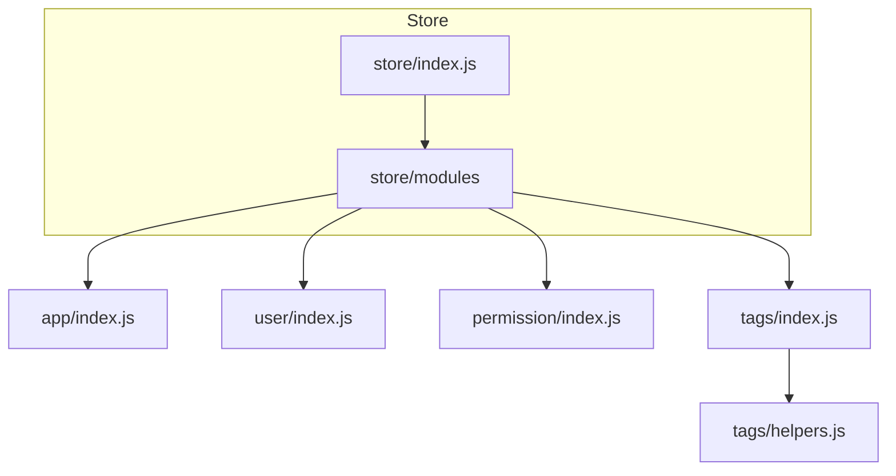
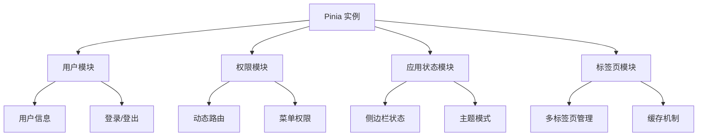
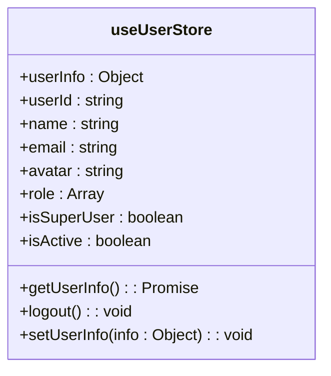
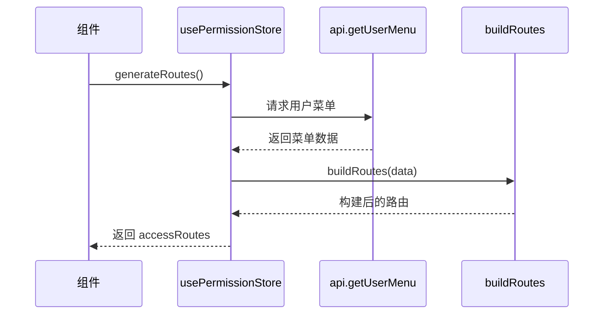
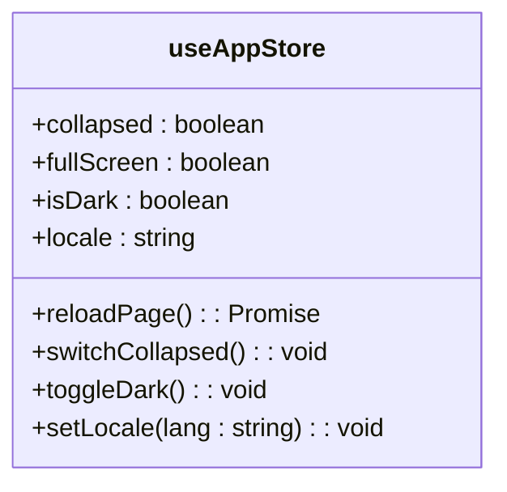
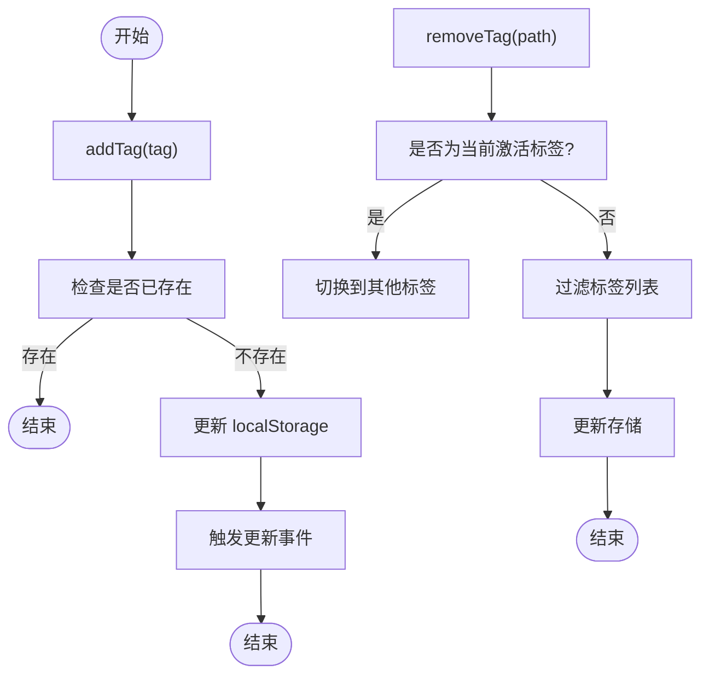
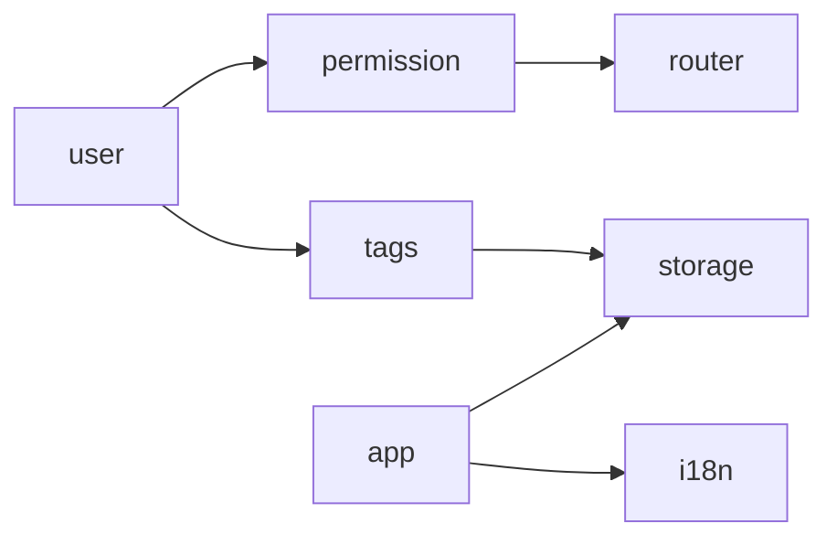

# 状态管理（Pinia）

<cite>
**本文档中引用的文件**  
- [store/index.js](file://web/src/store/index.js)
- [store/modules/user/index.js](file://web/src/store/modules/user/index.js)
- [store/modules/permission/index.js](file://web/src/store/modules/permission/index.js)
- [store/modules/app/index.js](file://web/src/store/modules/app/index.js)
- [store/modules/tags/index.js](file://web/src/store/modules/tags/index.js)
- [store/modules/tags/helpers.js](file://web/src/store/modules/tags/helpers.js)
- [utils/auth/token.js](file://web/src/utils/auth/token.js)
- [router/routes/index.js](file://web/src/router/routes/index.js)
- [api/index.js](file://web/src/api/index.js)
</cite>

## 目录
1. [简介](#简介)
2. [项目结构](#项目结构)
3. [核心组件](#核心组件)
4. [架构概览](#架构概览)
5. [详细组件分析](#详细组件分析)
6. [依赖分析](#依赖分析)
7. [性能考虑](#性能考虑)
8. [故障排除指南](#故障排除指南)
9. [结论](#结论)

## 简介
Pinia 是 Vue.js 应用中的状态管理库，用于集中管理全局状态。本项目通过 `store` 模块实现了用户信息、权限控制、应用状态和标签页管理的统一管理。各模块通过定义清晰的 state、getters 和 actions，确保状态变更的可预测性和可维护性。

## 项目结构
项目中的状态管理模块位于 `web/src/store` 目录下，采用模块化设计，分为 `app`、`user`、`permission` 和 `tags` 四个核心模块，并通过 `index.js` 统一导出和初始化。

**Diagram sources**  
- [store/index.js](file://web/src/store/index.js#L1-L7)
- [store/modules/user/index.js](file://web/src/store/modules/user/index.js#L1-L65)

## 核心组件
Pinia 的核心在于模块化的状态定义与共享。`setupStore` 函数负责在应用启动时注册 Pinia 实例，而各个模块则通过 `defineStore` 定义独立的状态逻辑。

**Section sources**  
- [store/index.js](file://web/src/store/index.js#L1-L7)
- [store/modules/user/index.js](file://web/src/store/modules/user/index.js#L1-L65)

## 架构概览
整个状态管理架构围绕 Pinia 构建，各模块职责分明，通过统一的 API 调用和本地存储机制实现状态持久化与同步。

**Diagram sources**  
- [store/index.js](file://web/src/store/index.js#L1-L7)
- [store/modules/user/index.js](file://web/src/store/modules/user/index.js#L1-L65)
- [store/modules/permission/index.js](file://web/src/store/modules/permission/index.js#L1-L93)

## 详细组件分析

### 用户模块分析
`user` 模块负责管理用户基本信息、令牌状态及登录登出逻辑。通过 `getUserInfo` 获取用户数据，`logout` 方法清除所有相关状态并重置路由。

**Diagram sources**  
- [store/modules/user/index.js](file://web/src/store/modules/user/index.js#L1-L65)

**Section sources**  
- [store/modules/user/index.js](file://web/src/store/modules/user/index.js#L1-L65)
- [utils/auth/token.js](file://web/src/utils/auth/token.js#L1-L31)

### 权限模块分析
`permission` 模块处理动态路由与菜单权限。通过 `generateRoutes` 方法从后端获取菜单数据并构建前端路由结构，`buildRoutes` 函数负责转换逻辑。

**Diagram sources**  
- [store/modules/permission/index.js](file://web/src/store/modules/permission/index.js#L1-L93)
- [router/routes/index.js](file://web/src/router/routes/index.js#L1-L143)

**Section sources**  
- [store/modules/permission/index.js](file://web/src/store/modules/permission/index.js#L1-L93)

### 应用状态模块分析
`app` 模块管理全局应用状态，如侧边栏展开状态、暗黑模式切换、语言设置等。使用 `useDark` 实现主题切换，并通过本地存储持久化设置。

**Diagram sources**  
- [store/modules/app/index.js](file://web/src/store/modules/app/index.js#L1-L60)

**Section sources**  
- [store/modules/app/index.js](file://web/src/store/modules/app/index.js#L1-L60)

### 标签页模块分析
`tags` 模块实现多标签页的增删改查与缓存机制。通过 `addTag`、`removeTag` 等方法管理标签状态，并利用 `lStorage` 持久化当前激活标签和标签列表。

**Diagram sources**  
- [store/modules/tags/index.js](file://web/src/store/modules/tags/index.js#L1-L70)
- [store/modules/tags/helpers.js](file://web/src/store/modules/tags/helpers.js#L1-L6)

**Section sources**  
- [store/modules/tags/index.js](file://web/src/store/modules/tags/index.js#L1-L70)
- [store/modules/tags/helpers.js](file://web/src/store/modules/tags/helpers.js#L1-L6)

## 依赖分析
各模块之间通过 `useXXXStore` 相互引用，形成清晰的依赖关系。例如，`user` 模块在登出时调用 `tags` 和 `permission` 模块的重置方法。

**Diagram sources**  
- [store/modules/user/index.js](file://web/src/store/modules/user/index.js#L1-L65)
- [store/modules/permission/index.js](file://web/src/store/modules/permission/index.js#L1-L93)
- [store/modules/tags/index.js](file://web/src/store/modules/tags/index.js#L1-L70)

**Section sources**  
- [store/modules/user/index.js](file://web/src/store/modules/user/index.js#L1-L65)
- [store/modules/permission/index.js](file://web/src/store/modules/permission/index.js#L1-L93)
- [store/modules/tags/index.js](file://web/src/store/modules/tags/index.js#L1-L70)

## 性能考虑
- 所有状态变更均通过 actions 进行，确保可追踪性。
- 路由和标签页状态使用本地存储，减少重复请求。
- 动态路由按需加载，提升首屏性能。

## 故障排除指南
- 若登录后菜单未更新，请检查 `generateRoutes` 是否正确调用。
- 标签页无法关闭时，确认 `removeTag` 是否正确处理了激活状态切换。
- 主题切换失效时，检查 `useDark` 是否正确初始化。

**Section sources**  
- [store/modules/user/index.js](file://web/src/store/modules/user/index.js#L1-L65)
- [store/modules/permission/index.js](file://web/src/store/modules/permission/index.js#L1-L93)
- [store/modules/app/index.js](file://web/src/store/modules/app/index.js#L1-L60)

## 结论
Pinia 在本项目中提供了高效、可维护的状态管理方案。通过模块化设计，各功能解耦清晰，便于扩展与调试。结合本地存储与 API 调用，实现了用户状态的持久化与动态更新，为前端架构的稳定性奠定了基础。