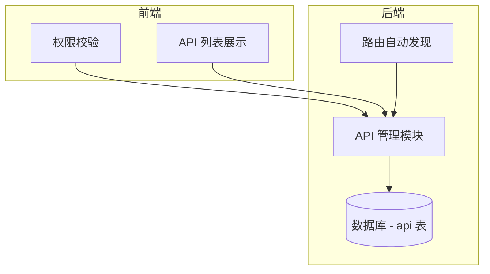
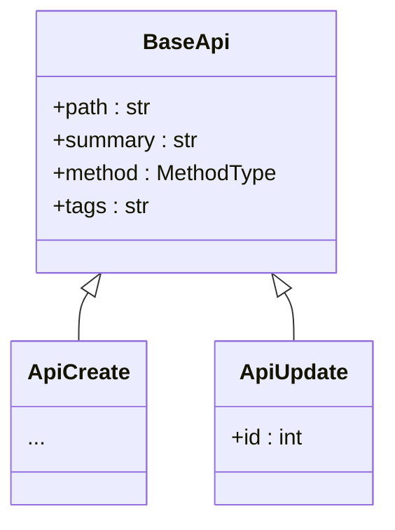
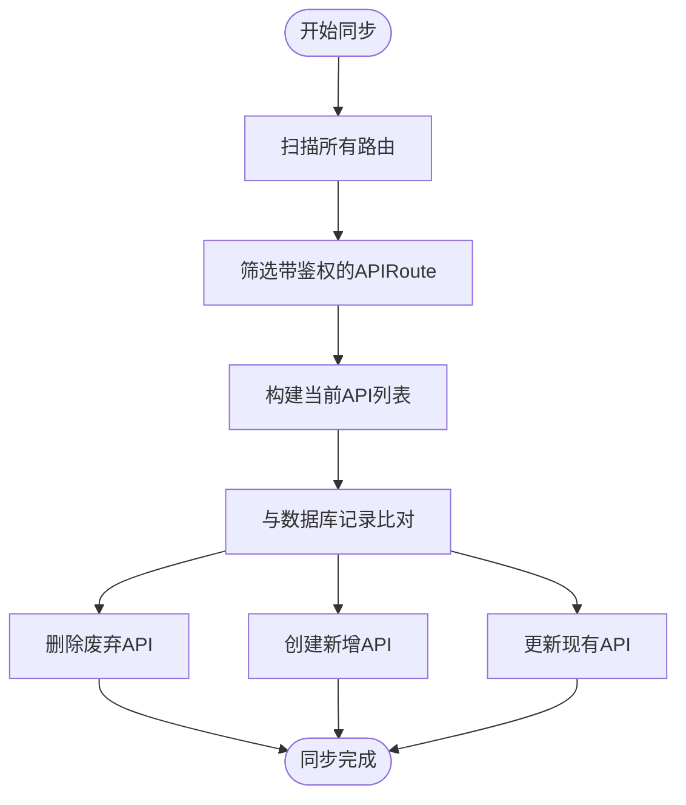

# API 接口管理规范

<cite>
**本文档引用文件**  
- [apis.py](file://app/api/v1/apis/apis.py)
- [apis.py](file://app/schemas/apis.py)
- [api.py](file://app/controllers/api.py)
- [admin.py](file://app/models/admin.py)
- [enums.py](file://app/models/enums.py)
</cite>

## 目录
1. [简介](#简介)
2. [API 接口管理模块概述](#api-接口管理模块概述)
3. [核心 API 端点说明](#核心-api-端点说明)
4. [API 记录关键字段解析](#api-记录关键字段解析)
5. [角色权限关联机制](#角色权限关联机制)
6. [API 自动发现与手动注册双模式](#api-自动发现与手动注册双模式)
7. [批量同步接口实现原理](#批量同步接口实现原理)
8. [批量同步请求体结构示例](#批量同步请求体结构示例)
9. [RBAC 权限体系基础作用](#rbac-权限体系基础作用)
10. [附录](#附录)

## 简介
本文档详细描述系统中 API 接口管理模块的设计与实现，涵盖 API 的注册、查询、更新、删除及批量同步功能。重点阐述 API 与角色权限的绑定机制，以及如何通过自动发现和手动注册两种模式维护系统接口元数据。该模块是实现细粒度访问控制的核心组件。

## API 接口管理模块概述
API 接口管理模块负责集中维护系统内所有后端接口的元数据信息，包括路径、方法、标签、描述等，并作为 RBAC（基于角色的访问控制）权限体系的数据基础。前端权限系统依赖此模块提供的 API 列表进行动态菜单渲染和按钮级权限校验。



**图示来源**  
- [apis.py](file://app/api/v1/apis/apis.py#L1-L67)
- [admin.py](file://app/models/admin.py#L34-L41)

**本节来源**  
- [apis.py](file://app/api/v1/apis/apis.py#L1-L67)
- [admin.py](file://app/models/admin.py#L34-L41)

## 核心 API 端点说明
API 接口管理模块提供以下核心端点用于操作 API 记录：

| 端点 | HTTP 方法 | 功能说明 |
|------|----------|--------|
| `/api/v1/apis/list` | GET | 分页查询 API 列表，支持按路径、简介、标签过滤 |
| `/api/v1/apis/get` | GET | 根据 ID 获取单个 API 详情 |
| `/api/v1/apis/create` | POST | 创建新的 API 记录 |
| `/api/v1/apis/update` | POST | 更新现有 API 记录 |
| `/api/v1/apis/delete` | DELETE | 根据 ID 删除 API 记录 |
| `/api/v1/apis/refresh` | POST | 批量同步 API，自动发现并更新路由 |

**本节来源**  
- [apis.py](file://app/api/v1/apis/apis.py#L10-L67)

## API 记录关键字段解析
每个 API 记录包含以下关键字段，用于唯一标识和分类接口：

- **请求方法（method）**: 枚举类型，表示 HTTP 方法（GET、POST、PUT、DELETE 等），定义于 `MethodType` 枚举类。
- **路径（path）**: 字符串类型，表示接口的完整 URL 路径，如 `/api/v1/user/list`。
- **标签（tag）**: 字符串类型，用于对 API 进行分类，通常对应功能模块名称（如“用户管理”）。
- **描述（summary）**: 字符串类型，简要说明接口功能，用于界面展示。

这些字段在数据库模型 `Api` 和 Pydantic 模型 `BaseApi` 中保持一致，确保前后端数据结构统一。



**图示来源**  
- [apis.py](file://app/schemas/apis.py#L4-L17)
- [admin.py](file://app/models/admin.py#L34-L41)

**本节来源**  
- [apis.py](file://app/schemas/apis.py#L4-L17)
- [admin.py](file://app/models/admin.py#L34-L41)

## 角色权限关联机制
API 接口通过多对多关系与角色（Role）进行绑定。在 `Role` 模型中定义了 `apis` 字段，关联到 `Api` 模型。当用户被赋予某个角色时，其可访问的 API 列表即为该角色所绑定的所有接口。

权限校验流程如下：
1. 用户发起请求
2. 系统根据用户角色获取其授权的 API 列表
3. 校验当前请求路径和方法是否在授权列表中
4. 若匹配则放行，否则返回 403 禁止访问

**本节来源**  
- [admin.py](file://app/models/admin.py#L25-L26)

## API 自动发现与手动注册双模式
系统支持两种 API 注册方式：自动发现和手动注册。

- **自动发现模式**：通过扫描 FastAPI 应用实例中的所有路由，识别带有依赖注入（如鉴权）的接口，并自动同步至数据库。此过程由 `refresh_api()` 方法触发。
- **手动注册模式**：管理员可通过调用 `/create` 接口手动添加 API 记录，适用于未被自动发现的特殊接口或测试接口。

双模式结合确保了 API 注册的灵活性与完整性。

**本节来源**  
- [api.py](file://app/controllers/api.py#L10-L45)
- [apis.py](file://app/api/v1/apis/apis.py#L60-L67)

## 批量同步接口实现原理
批量同步接口 `/api/v1/apis/refresh` 的核心逻辑如下：

1. 遍历 FastAPI 应用的所有路由
2. 筛选出带有依赖注入（即需要鉴权）的 `APIRoute` 类型路由
3. 提取其方法、路径、摘要、标签等元数据
4. 与数据库中现有 API 记录比对：
   - 若数据库存在但路由已移除，则删除废弃记录
   - 若路由存在但数据库无记录，则创建新记录
   - 若两者均存在，则更新数据库记录
5. 完成同步后返回成功响应

该机制确保 API 元数据与实际代码路由始终保持一致。



**图示来源**  
- [api.py](file://app/controllers/api.py#L10-L45)

**本节来源**  
- [api.py](file://app/controllers/api.py#L10-L45)

## 批量同步请求体结构示例
批量同步接口为无参 POST 请求，无需请求体。调用示例如下：

```http
POST /api/v1/apis/refresh HTTP/1.1
Content-Type: application/json
Authorization: Bearer <token>

{}
```

响应示例：
```json
{
  "msg": "OK",
  "data": null,
  "success": true
}
```

系统将自动从应用路由中提取元数据，无需客户端提供任何输入。

**本节来源**  
- [apis.py](file://app/api/v1/apis/apis.py#L60-L67)

## RBAC 权限体系基础作用
API 接口管理模块是 RBAC 权限体系的基石。所有新增的后端接口必须在此模块中注册，才能被前端权限系统识别并纳入访问控制范围。未注册的接口即使存在也无法通过权限校验，从而防止未授权访问。

该设计实现了：
- 接口级别的细粒度权限控制
- 动态权限分配与回收
- 权限变更的即时生效
- 安全审计的数据基础

**本节来源**  
- [admin.py](file://app/models/admin.py#L25-L26)
- [api.py](file://app/controllers/api.py#L10-L45)

## 附录
### MethodType 枚举值
| 值 | 说明 |
|----|------|
| GET | 查询操作 |
| POST | 创建操作 |
| PUT | 更新操作 |
| DELETE | 删除操作 |
| PATCH | 局部更新 |

**本节来源**  
- [enums.py](file://app/models/enums.py)