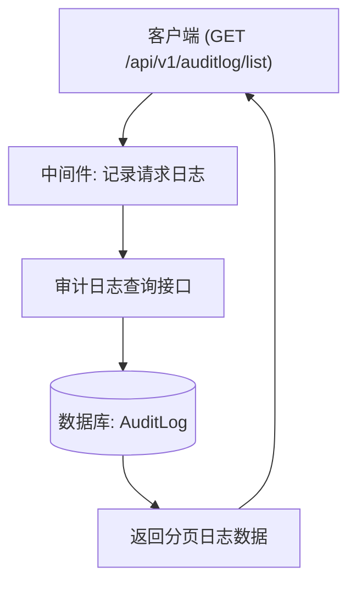
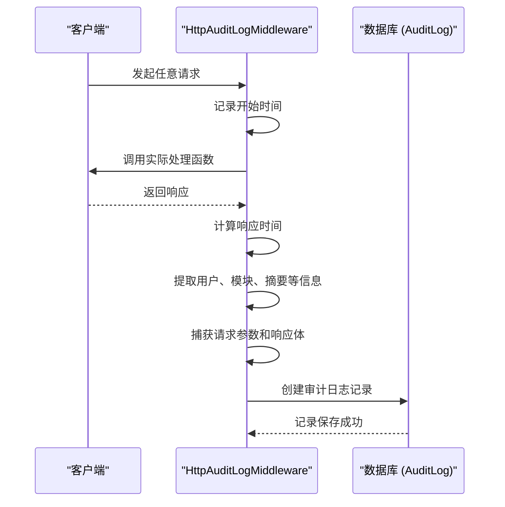
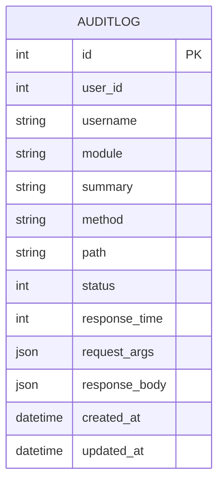

# 审计日志接口规范

<cite>
**本文档引用的文件**  
- [auditlog.py](file://app/api/v1/auditlog/auditlog.py)
- [admin.py](file://app/models/admin.py)
- [middlewares.py](file://app/core/middlewares.py)
- [apis.py](file://app/schemas/apis.py)
- [base.py](file://app/schemas/base.py)
</cite>

## 目录
1. [简介](#简介)
2. [接口定义](#接口定义)
3. [查询参数说明](#查询参数说明)
4. [响应结构](#响应结构)
5. [审计日志记录机制](#审计日志记录机制)
6. [使用示例](#使用示例)
7. [安全与不可篡改性](#安全与不可篡改性)
8. [附录](#附录)

## 简介
本接口用于查询系统操作审计日志，提供只读访问能力，支持按用户、操作类型、时间范围、IP 地址等多维度条件过滤。所有日志由后端中间件自动记录，确保操作可追溯、数据不可篡改，适用于系统管理员进行问题排查和安全审计。

**Section sources**
- [auditlog.py](file://app/api/v1/auditlog/auditlog.py#L1-L48)

## 接口定义
获取操作日志列表的接口如下：

- **HTTP 方法**: `GET`
- **请求路径**: `/api/v1/auditlog/list`
- **功能描述**: 查看系统操作日志，支持分页和多条件过滤
- **权限要求**: 需要管理员身份认证（通过 `token` 头部传递）
- **是否可写**: 否，仅为只读查询接口



**Diagram sources**
- [auditlog.py](file://app/api/v1/auditlog/auditlog.py#L10-L48)
- [middlewares.py](file://app/core/middlewares.py#L100-L182)

## 查询参数说明
该接口支持以下查询参数，所有参数均为可选：

| 参数名 | 类型 | 描述 | 示例 |
|--------|------|------|------|
| `page` | 整数 | 当前页码，默认为 1 | `1` |
| `page_size` | 整数 | 每页数量，默认为 10 | `20` |
| `username` | 字符串 | 操作人用户名（模糊匹配） | `"admin"` |
| `module` | 字符串 | 功能模块名称（模糊匹配） | `"用户管理"` |
| `method` | 字符串 | 请求方法（如 GET、POST） | `"POST"` |
| `summary` | 字符串 | 接口描述（模糊匹配） | `"创建用户"` |
| `path` | 字符串 | 请求路径（模糊匹配） | `"/api/v1/user/create"` |
| `status` | 整数 | HTTP 响应状态码 | `200` |
| `start_time` | 时间戳 | 日志起始时间（ISO8601 格式） | `"2024-01-01T00:00:00"` |
| `end_time` | 时间戳 | 日志结束时间（ISO8601 格式） | `"2024-01-31T23:59:59"` |

> **注意**：时间范围支持三种组合：
> - 同时提供 `start_time` 和 `end_time`：查询区间内日志
> - 仅提供 `start_time`：查询该时间之后的日志
> - 仅提供 `end_time`：查询该时间之前的日志

**Section sources**
- [auditlog.py](file://app/api/v1/auditlog/auditlog.py#L15-L35)

## 响应结构
成功响应返回 `SuccessExtra` 结构，包含分页信息和日志列表。

### 响应体格式
```json
{
  "code": 200,
  "msg": "OK",
  "data": [
    {
      "id": 123,
      "user_id": 1,
      "username": "admin",
      "module": "用户管理",
      "summary": "创建新用户",
      "method": "POST",
      "path": "/api/v1/user/create",
      "status": 200,
      "response_time": 45,
      "request_args": { "username": "testuser", "email": "test@example.com" },
      "response_body": { "code": 200, "msg": "Success", "data": { "id": 456 } },
      "created_at": "2024-01-15T10:30:00"
    }
  ],
  "total": 1,
  "page": 1,
  "page_size": 10
}
```

### 字段说明
- `data`: 日志条目数组，每条包含：
  - `target`: 实际记录在 `path` 和 `summary` 中，表示操作目标
  - `method`: 请求方法（GET/POST/PUT/DELETE）
  - `path`: 请求路径
  - `request_args`: 请求参数（查询参数或请求体）
  - `response_body`: 响应内容（受大小限制）
  - `status`: HTTP 状态码
  - `success/fail`: 根据 `status` 判断，2xx 为成功，其余为失败
  - `操作者信息`: `user_id` 和 `username`
  - `created_at`: 操作时间戳
- `total`: 总记录数
- `page`, `page_size`: 分页信息

**Section sources**
- [base.py](file://app/schemas/base.py#L30-L52)
- [admin.py](file://app/models/admin.py#L78-L88)

## 审计日志记录机制
审计日志由 `HttpAuditLogMiddleware` 中间件自动记录，无需业务代码手动调用。

### 工作流程


### 关键实现点
- **自动捕获**：中间件在 `dispatch` 阶段拦截所有请求，自动提取元数据
- **用户识别**：通过 `token` 解析当前登录用户（`AuthControl.is_authed`）
- **模块与描述**：从 FastAPI 路由的 `tags` 和 `summary` 字段自动填充
- **请求/响应捕获**：
  - `request_args` 包含查询参数和 JSON/表单数据
  - `response_body` 默认记录，但对 `/api/v1/auditlog/list` 自身的响应体进行脱敏处理，避免无限递归
- **性能控制**：响应体超过 1MB 将不记录具体内容

**Diagram sources**
- [middlewares.py](file://app/core/middlewares.py#L100-L182)

**Section sources**
- [middlewares.py](file://app/core/middlewares.py#L100-L182)

## 使用示例
### 示例 1：排查用户登录失败问题
```http
GET /api/v1/auditlog/list?
  username=john&
  status=401&
  start_time=2024-01-15T08:00:00&
  end_time=2024-01-15T09:00:00
```
此查询可找出用户 `john` 在指定时间段内所有认证失败的请求，帮助分析登录异常原因。

### 示例 2：审计管理员删除操作
```http
GET /api/v1/auditlog/list?
  method=DELETE&
  module=用户管理&
  status=200
```
用于审查所有成功的用户删除操作，确保操作合规。

### 示例 3：监控高延迟接口
```http
GET /api/v1/auditlog/list?
  response_time__gte=1000&
  page_size=5
```
查找响应时间超过 1 秒的请求，用于性能优化分析。

**Section sources**
- [auditlog.py](file://app/api/v1/auditlog/auditlog.py#L15-L48)

## 安全与不可篡改性
- **只读设计**：该接口仅提供查询功能，无任何创建、更新或删除操作
- **写入隔离**：日志写入由中间件在请求处理完成后自动完成，业务逻辑无法干预
- **防篡改机制**：
  - 日志记录在事务提交后执行，确保一致性
  - `AuditLog` 表无公开的修改或删除接口
  - 所有日志包含精确时间戳和操作者信息，追溯性强
- **敏感数据处理**：
  - 密码等敏感字段在 `request_args` 中不会被记录（由前端或中间件过滤）
  - 大型响应体自动截断，防止日志膨胀

**Section sources**
- [middlewares.py](file://app/core/middlewares.py#L150-L160)
- [admin.py](file://app/models/admin.py#L78-L88)

## 附录
### 数据模型定义


**Diagram sources**
- [admin.py](file://app/models/admin.py#L78-L88)

### 相关枚举类型
- `MethodType`: 枚举类型，包含 `GET`, `POST`, `PUT`, `DELETE`, `PATCH`

**Section sources**
- [apis.py](file://app/schemas/apis.py#L1-L17)