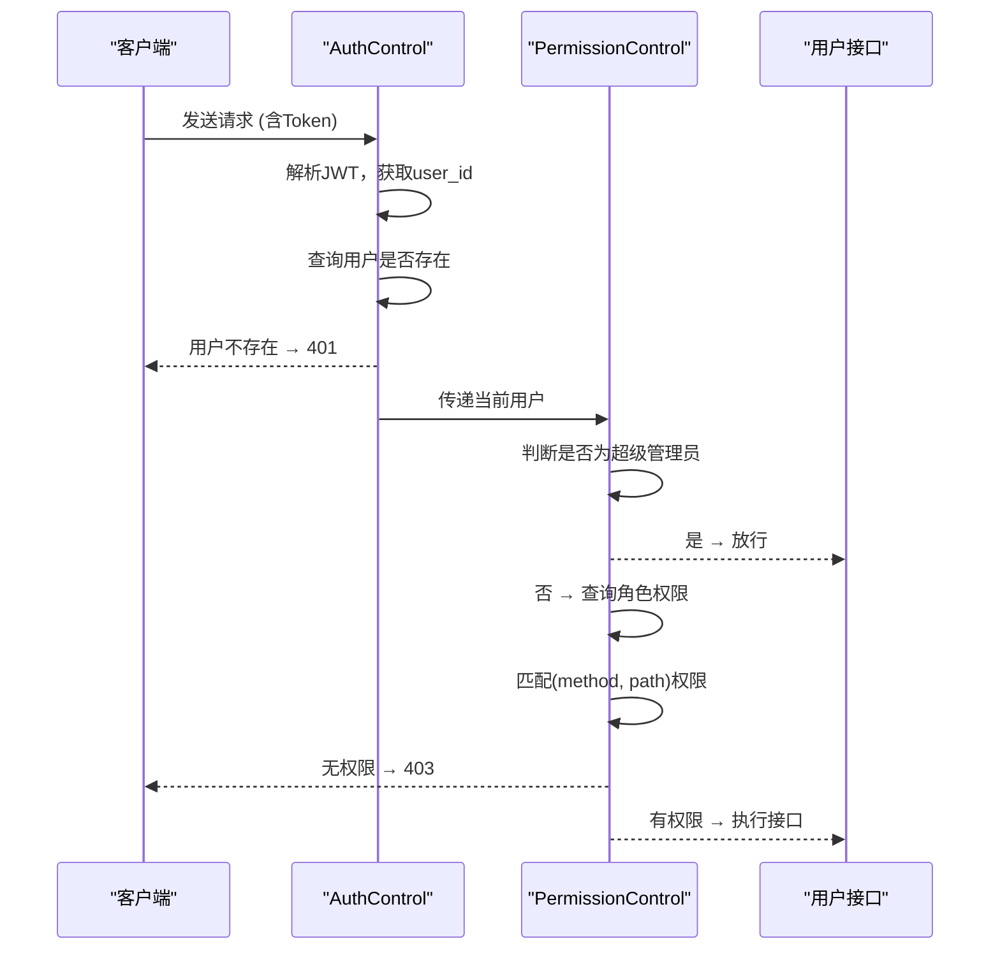
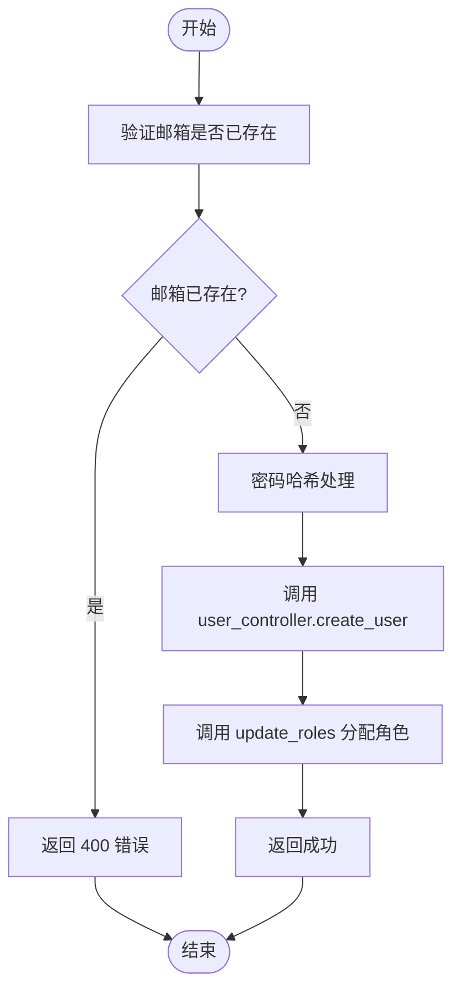
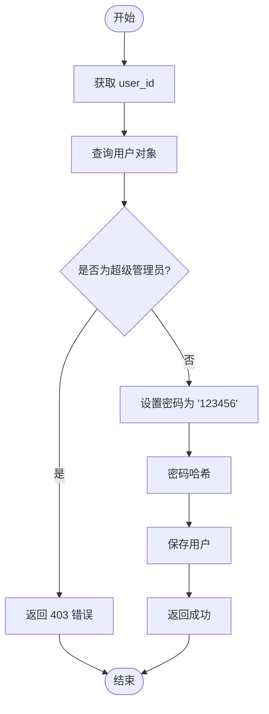

# 用户管理接口规范

<cite>
**本文档引用的文件**  
- [users.py](file://app/api/v1/users/users.py)
- [user.py](file://app/controllers/user.py)
- [users.py](file://app/schemas/users.py)
- [dependency.py](file://app/core/dependency.py)
- [base.py](file://app/schemas/base.py)
</cite>

## 目录
1. [简介](#简介)
2. [接口概览](#接口概览)
3. [认证与权限控制](#认证与权限控制)
4. [用户列表查询](#用户列表查询)
5. [创建用户](#创建用户)
6. [更新用户信息](#更新用户信息)
7. [删除用户](#删除用户)
8. [重置密码](#重置密码)
9. [错误码说明](#错误码说明)
10. [前端调用示例](#前端调用示例)

## 简介
本接口规范文档详细描述了系统中用户管理模块的所有 RESTful API 接口。涵盖用户增删改查及密码重置功能，结合 FastAPI 路由定义、Pydantic 数据模型与权限控制机制，确保接口的安全性与一致性。所有接口均基于 JWT 认证，并通过角色权限系统进行访问控制。

## 接口概览
用户管理模块提供以下核心接口：

| 接口名称 | HTTP 方法 | 路径 | 权限要求 | 功能说明 |
|--------|---------|------|--------|--------|
| 获取用户列表 | GET | `/api/v1/users/list` | `user:list` | 分页查询用户，支持按用户名、邮箱、部门过滤 |
| 查看用户详情 | GET | `/api/v1/users/get` | `user:read` | 根据用户 ID 获取单个用户信息 |
| 创建用户 | POST | `/api/v1/users/create` | `user:create` | 创建新用户，需指定邮箱、用户名、密码等信息 |
| 更新用户 | POST | `/api/v1/users/update` | `user:edit` | 更新用户基本信息及关联角色 |
| 删除用户 | DELETE | `/api/v1/users/delete` | `user:delete` | 根据用户 ID 删除用户 |
| 重置密码 | POST | `/api/v1/users/reset_password` | `user:reset_password` | 将指定用户密码重置为默认值 `123456` |

**Section sources**  
- [users.py](file://app/api/v1/users/users.py#L0-L80)

## 认证与权限控制
所有用户管理接口均需通过 JWT 认证和权限校验。

### 认证方式
- 使用 `Authorization` 请求头传递 JWT Token
- Token 格式为 `Bearer <token>` 或直接传递 token 字符串（开发环境支持 `dev`）
- 认证逻辑由 `AuthControl.is_authed` 实现，解析 token 并验证用户有效性

### 权限控制
- 权限校验通过 `DependPermission` 依赖注入实现
- 普通用户需具备对应角色权限（如 `user:create`），超级管理员自动拥有所有权限
- 权限绑定在角色上，通过角色关联的 API 列表进行比对



**Diagram sources**  
- [dependency.py](file://app/core/dependency.py#L34-L52)

**Section sources**  
- [dependency.py](file://app/core/dependency.py#L0-L53)

## 用户列表查询
获取分页的用户列表，支持多条件筛选。

### 请求信息
- **方法**: `GET`
- **路径**: `/api/v1/users/list`
- **认证**: 是
- **权限**: `user:list`

### 请求参数
| 参数名 | 类型 | 必填 | 描述 |
|-------|------|------|------|
| page | int | 否 | 页码，默认为 1 |
| page_size | int | 否 | 每页数量，默认为 10 |
| username | string | 否 | 用户名模糊搜索 |
| email | string | 否 | 邮箱地址模糊搜索 |
| dept_id | int | 否 | 部门 ID 精确匹配 |

### 响应格式
成功响应结构如下：
```json
{
  "code": 200,
  "msg": null,
  "data": [
    {
      "id": 1,
      "email": "admin@qq.com",
      "username": "admin",
      "is_active": true,
      "is_superuser": true,
      "created_at": "2023-01-01T00:00:00",
      "updated_at": "2023-01-01T00:00:00",
      "last_login": "2023-01-01T00:00:00",
      "roles": [...],
      "dept": { "id": 1, "name": "技术部", ... }
    }
  ],
  "total": 1,
  "page": 1,
  "page_size": 10
}
```

**Section sources**  
- [users.py](file://app/api/v1/users/users.py#L8-L34)

## 创建用户
新增系统用户并分配角色。

### 请求信息
- **方法**: `POST`
- **路径**: `/api/v1/users/create`
- **认证**: 是
- **权限**: `user:create`

### 请求体（UserCreate）
基于 `UserCreate` Pydantic 模型：
| 字段 | 类型 | 必填 | 描述 |
|------|------|------|------|
| email | string | 是 | 邮箱地址 |
| username | string | 是 | 用户名 |
| password | string | 是 | 明文密码（后端自动哈希） |
| is_active | bool | 否 | 是否启用，默认 true |
| is_superuser | bool | 否 | 是否为超级管理员，默认 false |
| role_ids | list[int] | 否 | 角色 ID 列表 |
| dept_id | int | 否 | 所属部门 ID，默认 0 |

### 响应格式
```json
{ "code": 200, "msg": "Created Successfully", "data": null }
```

### 业务逻辑流程


**Diagram sources**  
- [users.py](file://app/api/v1/users/users.py#L35-L47)
- [user.py](file://app/controllers/user.py#L25-L34)

**Section sources**  
- [users.py](file://app/api/v1/users/users.py#L35-L47)
- [user.py](file://app/controllers/user.py#L25-L34)
- [users.py](file://app/schemas/users.py#L15-L27)

## 更新用户信息
修改用户基本信息及角色分配。

### 请求信息
- **方法**: `POST`
- **路径**: `/api/v1/users/update`
- **认证**: 是
- **权限**: `user:edit`

### 请求体（UserUpdate）
基于 `UserUpdate` 模型：
| 字段 | 类型 | 必填 | 描述 |
|------|------|------|------|
| id | int | 是 | 用户 ID |
| email | string | 是 | 邮箱 |
| username | string | 是 | 用户名 |
| is_active | bool | 否 | 启用状态 |
| is_superuser | bool | 否 | 超级管理员标志 |
| role_ids | list[int] | 否 | 新角色 ID 列表 |
| dept_id | int | 否 | 部门 ID |

### 响应格式
```json
{ "code": 200, "msg": "Updated Successfully", "data": null }
```

### 处理流程
- 调用 `user_controller.update()` 更新用户字段
- 调用 `update_roles()` 清除旧角色并添加新角色
- 不更新密码字段

**Section sources**  
- [users.py](file://app/api/v1/users/users.py#L49-L56)
- [user.py](file://app/controllers/user.py#L50-L52)
- [users.py](file://app/schemas/users.py#L29-L37)

## 删除用户
根据用户 ID 删除用户。

### 请求信息
- **方法**: `DELETE`
- **路径**: `/api/v1/users/delete`
- **认证**: 是
- **权限**: `user:delete`

### 请求参数
| 参数名 | 类型 | 必填 | 描述 |
|-------|------|------|------|
| user_id | int | 是 | 要删除的用户 ID |

### 响应格式
```json
{ "code": 200, "msg": "Deleted Successfully", "data": null }
```

### 说明
- 使用 `user_controller.remove(id)` 实现软删除或硬删除
- 删除前无额外确认机制，需前端提示

**Section sources**  
- [users.py](file://app/api/v1/users/users.py#L58-L64)

## 重置密码
将指定用户密码重置为默认值 `123456`。

### 请求信息
- **方法**: `POST`
- **路径**: `/api/v1/users/reset_password`
- **认证**: 是
- **权限**: `user:reset_password`

### 请求体
```json
{ "user_id": 1 }
```

### 响应格式
```json
{ "code": 200, "msg": "密码已重置为123456", "data": null }
```

### 安全限制
- 超级管理员账户禁止重置密码
- 由 `user_controller.reset_password()` 实现，自动哈希新密码



**Diagram sources**  
- [users.py](file://app/api/v1/users/users.py#L78-L80)
- [user.py](file://app/controllers/user.py#L54-L59)

**Section sources**  
- [users.py](file://app/api/v1/users/users.py#L78-L80)
- [user.py](file://app/controllers/user.py#L54-L59)

## 错误码说明
| 状态码 | 错误码 | 说明 | 建议处理方式 |
|-------|--------|------|-------------|
| 400 | 400 | 用户邮箱已存在 | 提示用户更换邮箱 |
| 400 | 400 | 旧密码验证错误 | 提示用户输入正确旧密码 |
| 401 | 401 | 认证失败（Token无效/过期） | 跳转至登录页重新登录 |
| 403 | 403 | 无权限访问 | 检查当前用户角色权限配置 |
| 403 | 403 | 不允许重置超级管理员密码 | 提示操作受限 |
| 404 | N/A | 路径未找到 | 检查请求 URL 是否正确 |
| 500 | 500 | 服务器内部错误 | 记录日志并联系管理员 |

**Section sources**  
- [users.py](file://app/api/v1/users/users.py#L42-L45)
- [user.py](file://app/controllers/user.py#L15-L22)
- [user.py](file://app/controllers/user.py#L56-L57)

## 前端调用示例
在 Vue 前端中，通过 `useCRUD` 组合式函数调用用户管理接口：

```javascript
const $table = ref()
const { handleCreate, handleUpdate, handleDelete } = useCRUD({
  doCreate: api.createUser,
  doUpdate: api.updateUser,
  doDelete: api.deleteUser,
  refresh: () => $table.value?.handleSearch(),
})
```

- `api.createUser` 对应 `/api/v1/users/create`
- 自动携带 JWT Token
- 权限控制通过 `v-permission` 指令实现，如 `v-permission="post/api/v1/users/create"`

**Section sources**  
- [index.vue](file://web/src/views/system/user/index.vue#L52-L111)