# 菜单管理接口规范

<cite>
**本文档引用文件**  
- [menus.py](file://app/api/v1/menus/menus.py)
- [menus.py](file://app/schemas/menus.py)
- [menu.py](file://app/controllers/menu.py)
- [admin.py](file://app/models/admin.py)
- [index.vue](file://web/src/views/system/menu/index.vue)
- [index.js](file://web/src/api/index.js)
</cite>

## 目录
1. [简介](#简介)
2. [项目结构](#项目结构)
3. [核心组件](#核心组件)
4. [架构概览](#架构概览)
5. [详细组件分析](#详细组件分析)
6. [依赖分析](#依赖分析)
7. [性能考量](#性能考量)
8. [故障排除指南](#故障排除指南)
9. [结论](#结论)

## 简介
本规范文档旨在为菜单管理模块提供完整的 API 接口说明，重点描述基于树形结构的菜单增删改查及排序功能。文档涵盖接口定义、请求/响应结构、字段说明、业务约束、前后端联动机制等内容，为后端开发者提供实现参考，为前端开发者提供集成指导。

## 项目结构
菜单管理功能分布在多个模块中，采用分层架构设计，包括 API 路由、控制器、数据模型和前端视图。

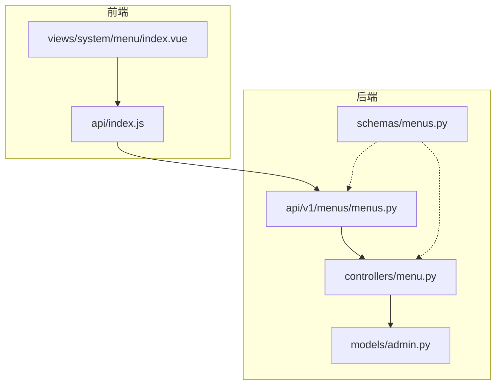

**图示来源**  
- [menus.py](file://app/api/v1/menus/menus.py)
- [menu.py](file://app/controllers/menu.py)
- [index.vue](file://web/src/views/system/menu/index.vue)

**本节来源**  
- [menus.py](file://app/api/v1/menus/menus.py)
- [menu.py](file://app/controllers/menu.py)
- [index.vue](file://web/src/views/system/menu/index.vue)

## 核心组件
菜单管理模块的核心组件包括：菜单数据模型、菜单控制器、菜单 API 路由、菜单请求模式和前端视图组件。这些组件共同实现了树形菜单的完整生命周期管理。

**本节来源**  
- [menus.py](file://app/api/v1/menus/menus.py#L1-L63)
- [menu.py](file://app/controllers/menu.py#L1-L16)
- [admin.py](file://app/models/admin.py#L44-L58)

## 架构概览
系统采用典型的分层架构，从前端到后端依次为：视图层（Vue）、API 层（FastAPI）、业务逻辑层（Controller）、数据访问层（CRUD）和数据模型层（Tortoise ORM）。

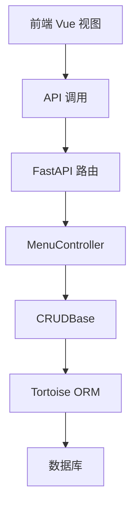

**图示来源**  
- [menus.py](file://app/api/v1/menus/menus.py#L1-L63)
- [menu.py](file://app/controllers/menu.py#L1-L16)

## 详细组件分析

### 菜单数据模型分析
菜单数据模型定义了菜单项的持久化结构，包含层级关系、路由信息、显示属性等关键字段。

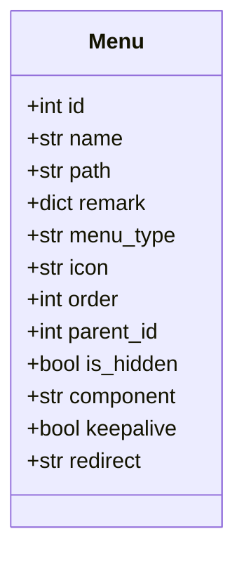

**图示来源**  
- [admin.py](file://app/models/admin.py#L44-L58)

**本节来源**  
- [admin.py](file://app/models/admin.py#L44-L58)

### 菜单请求模式分析
菜单请求模式定义了创建和更新操作的数据结构，区分了必填和可选字段，并提供了默认值。

#### 创建菜单请求模式
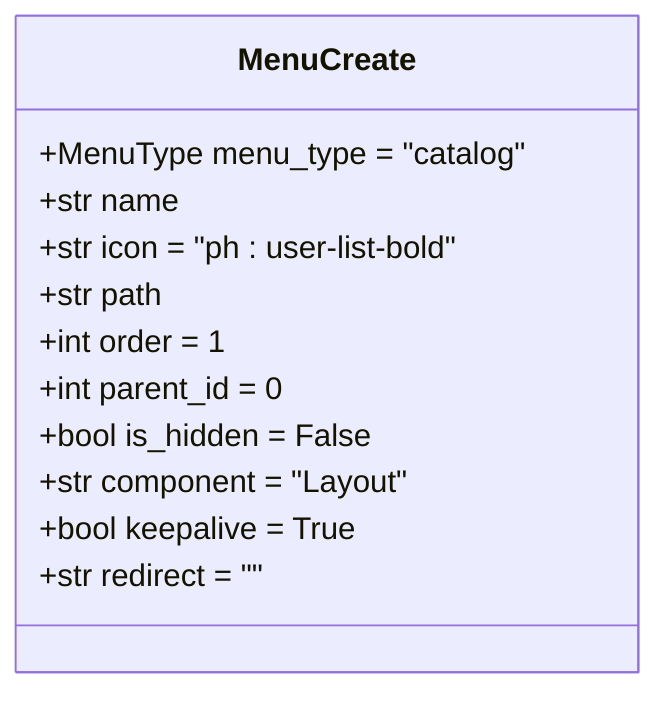

#### 更新菜单请求模式
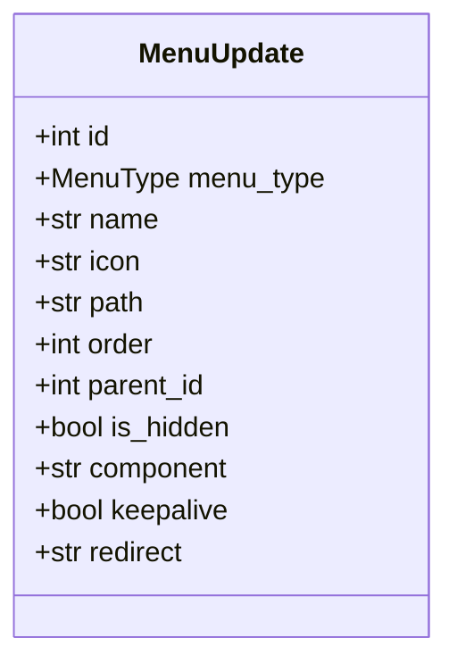

**图示来源**  
- [menus.py](file://app/schemas/menus.py#L20-L52)

**本节来源**  
- [menus.py](file://app/schemas/menus.py#L20-L52)

### 菜单控制器分析
菜单控制器继承自通用 CRUD 基类，提供了菜单项的创建、读取、更新和删除操作，并包含根据路径查询菜单的特殊方法。

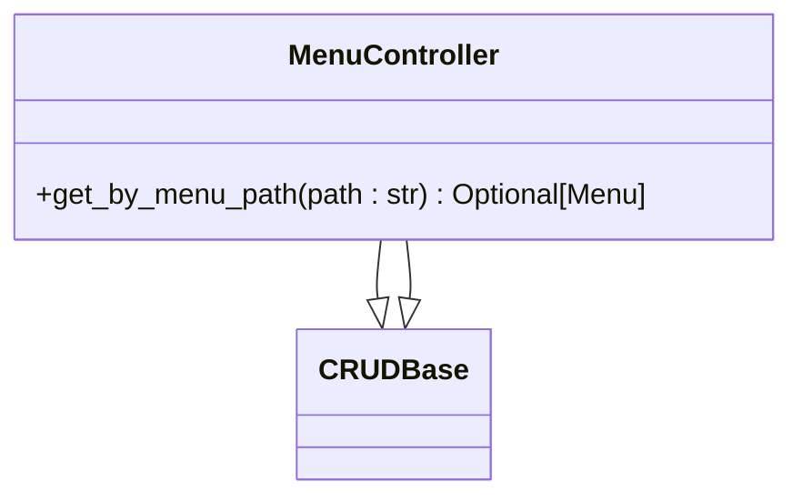

**图示来源**  
- [menu.py](file://app/controllers/menu.py#L1-L16)

**本节来源**  
- [menu.py](file://app/controllers/menu.py#L1-L16)

### 菜单 API 接口分析
菜单 API 接口提供了完整的 RESTful 操作，支持树形结构的序列化和级联删除约束。

#### 获取菜单树接口流程
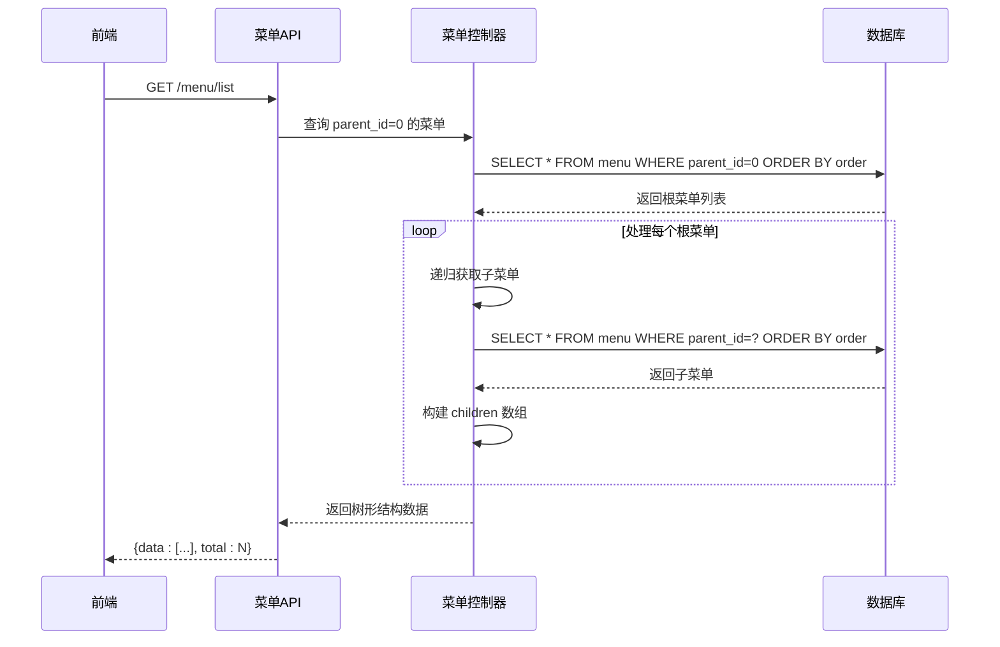

**图示来源**  
- [menus.py](file://app/api/v1/menus/menus.py#L10-L30)

#### 创建菜单接口流程
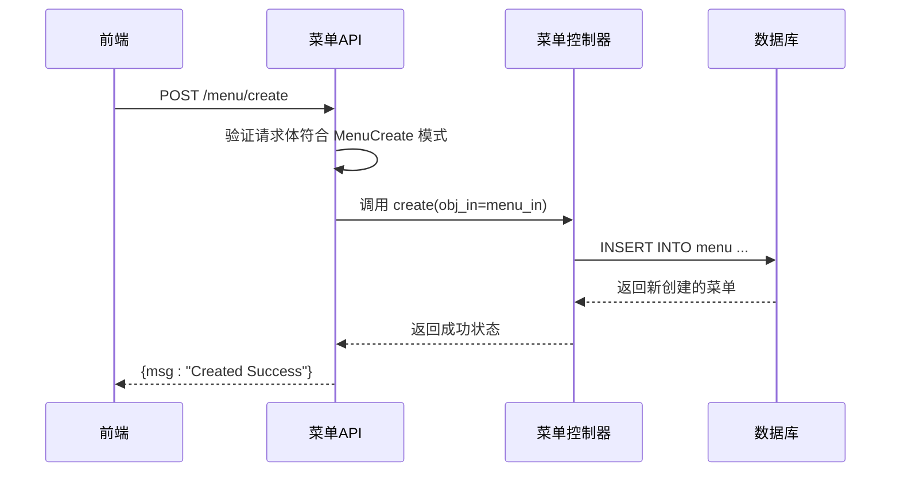

**图示来源**  
- [menus.py](file://app/api/v1/menus/menus.py#L35-L40)

#### 删除菜单接口流程
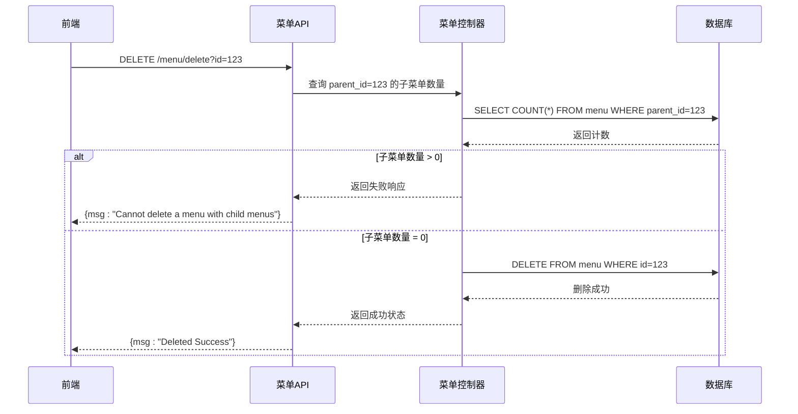

**图示来源**  
- [menus.py](file://app/api/v1/menus/menus.py#L55-L63)

**本节来源**  
- [menus.py](file://app/api/v1/menus/menus.py#L1-L63)

### 前端集成分析
前端通过 API 调用与后端交互，实现了菜单树的展示和管理功能。

#### 前端菜单管理流程
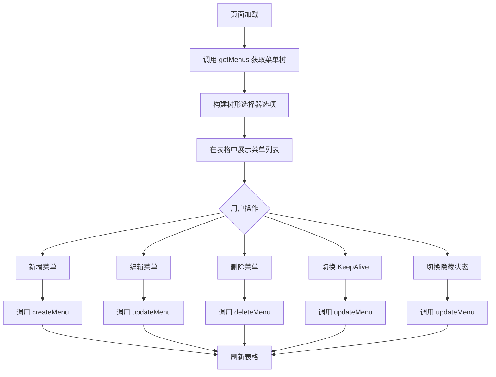

**图示来源**  
- [index.vue](file://web/src/views/system/menu/index.vue)
- [index.js](file://web/src/api/index.js)

**本节来源**  
- [index.vue](file://web/src/views/system/menu/index.vue)
- [index.js](file://web/src/api/index.js)

## 依赖分析
菜单管理模块依赖于多个核心组件，形成了清晰的依赖关系链。

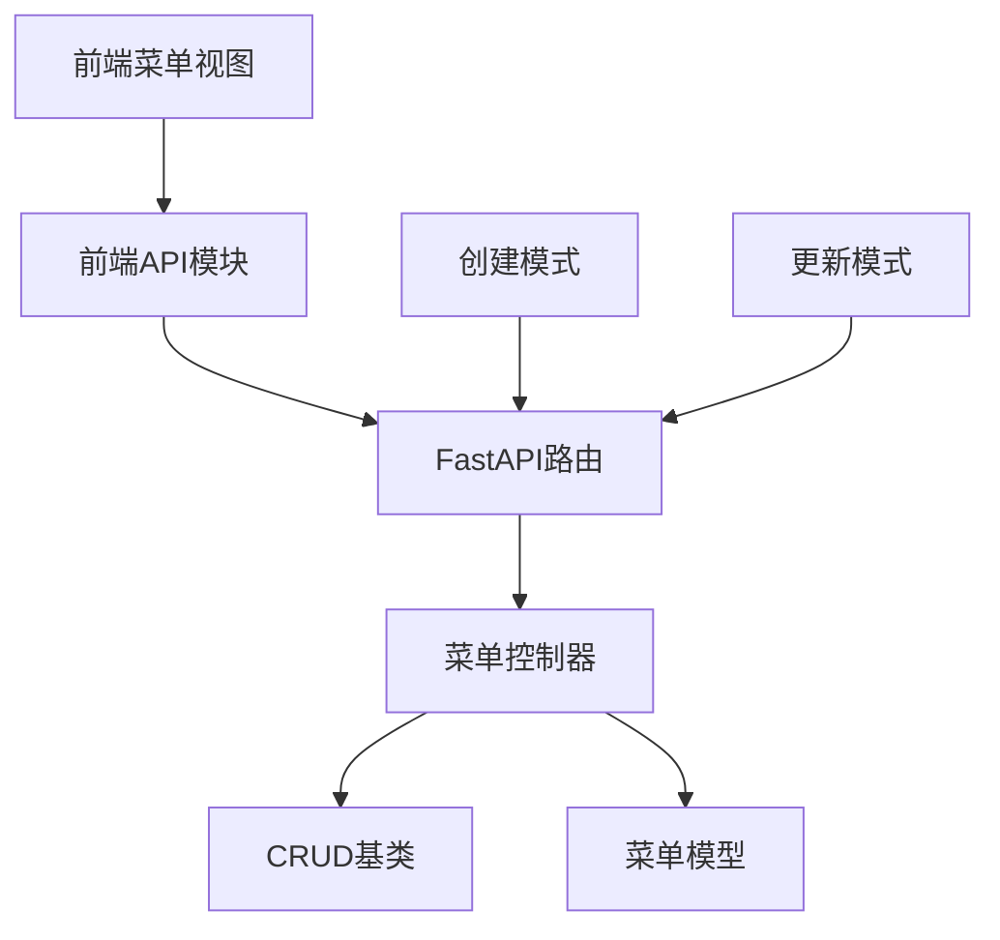

**图示来源**  
- [menus.py](file://app/api/v1/menus/menus.py)
- [menu.py](file://app/controllers/menu.py)
- [schemas/menus.py](file://app/schemas/menus.py)

**本节来源**  
- [menus.py](file://app/api/v1/menus/menus.py)
- [menu.py](file://app/controllers/menu.py)
- [schemas/menus.py](file://app/schemas/menus.py)

## 性能考量
菜单管理接口在性能方面有以下特点和优化建议：

- **树形结构递归查询**：当前实现使用递归查询构建菜单树，对于深层级菜单可能导致 N+1 查询问题。建议在菜单层级较深时考虑使用闭包表（Closure Table）模式优化。
- **索引优化**：数据库表中对 `parent_id`、`order`、`path` 字段建立了索引，确保查询性能。
- **缓存策略**：菜单数据相对稳定，建议在应用层添加缓存机制，减少数据库查询压力。
- **分页支持**：虽然当前接口未实现分页，但 `list_menu` 函数预留了分页参数，便于后续扩展。

## 故障排除指南
### 常见问题及解决方案

| 问题现象 | 可能原因 | 解决方案 |
|---------|--------|---------|
| 无法删除菜单 | 该菜单存在子菜单 | 先删除所有子菜单，或实现级联删除功能 |
| 菜单路径重复 | 创建时未检查路径唯一性 | 在创建前调用 `get_by_menu_path` 检查路径是否存在 |
| 树形结构显示异常 | 后端返回数据格式错误 | 检查 `get_menu_with_children` 递归逻辑 |
| 排序不生效 | 未按 `order` 字段排序 | 确保查询时包含 `.order_by("order")` |

**本节来源**  
- [menus.py](file://app/api/v1/menus/menus.py#L55-L63)
- [menu.py](file://app/controllers/menu.py#L13-L15)

## 结论
菜单管理模块提供了一套完整的树形菜单管理 API，支持增删改查和排序操作。接口设计合理，前后端分离清晰，通过递归查询实现了树形结构的序列化。建议后续可增加路径唯一性校验、批量排序接口和缓存机制，进一步提升功能完整性和系统性能。