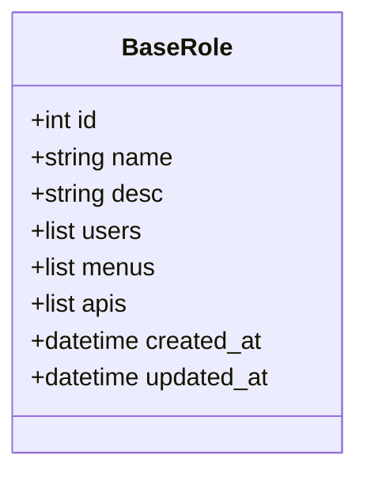
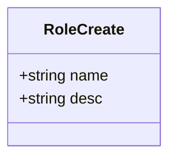
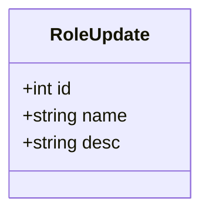
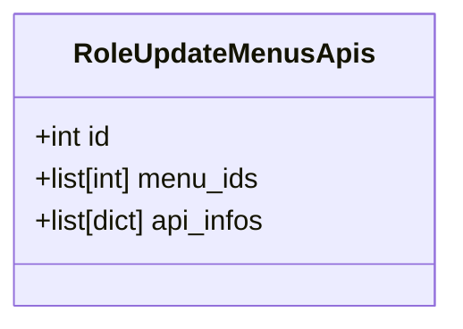
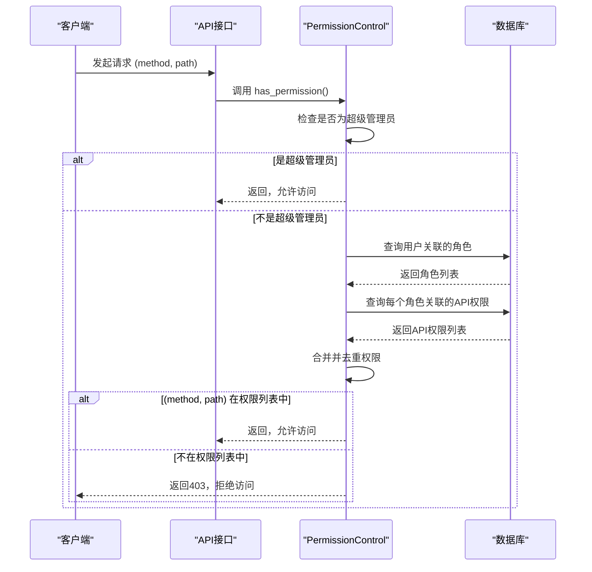
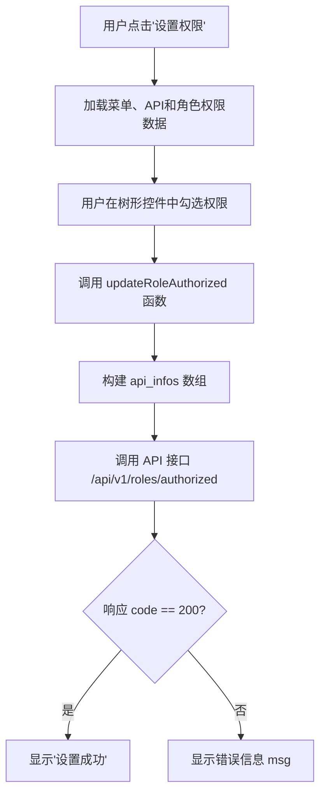

# 角色管理接口规范

<cite>
**本文档引用的文件**  
- [roles.py](file://app/api/v1/roles/roles.py)
- [roles.py](file://app/schemas/roles.py)
- [role.py](file://app/controllers/role.py)
- [dependency.py](file://app/core/dependency.py)
- [admin.py](file://app/models/admin.py)
- [index.vue](file://web/src/views/system/role/index.vue)
</cite>

## 目录
1. [简介](#简介)
2. [核心数据结构](#核心数据结构)
3. [接口定义](#接口定义)
4. [权限控制机制](#权限控制机制)
5. [前端调用示例](#前端调用示例)
6. [异常情况说明](#异常情况说明)

## 简介
本接口规范文档详细描述了角色管理模块的全生命周期操作，涵盖角色的创建、查询、更新、删除以及权限分配等核心功能。系统通过基于角色的访问控制（RBAC）模型，实现对菜单和API资源的精细化权限管理。所有接口均基于 FastAPI 框架构建，并通过依赖注入机制实现权限校验。

## 核心数据结构

### 角色基础模型 (BaseRole)
该模型定义了角色的核心属性，作为其他角色相关模型的基类。



**Diagram sources**  
- [roles.py](file://app/schemas/roles.py#L4-L15)

### 角色创建模型 (RoleCreate)
用于创建新角色的请求体数据结构。



**Diagram sources**  
- [roles.py](file://app/schemas/roles.py#L17-L20)

### 角色更新模型 (RoleUpdate)
用于更新现有角色信息的请求体数据结构，包含角色ID。



**Diagram sources**  
- [roles.py](file://app/schemas/roles.py#L22-L27)

### 权限分配模型 (RoleUpdateMenusApis)
用于为角色分配菜单和API权限的请求体数据结构，包含角色ID、菜单ID列表和API信息列表。



**Diagram sources**  
- [roles.py](file://app/schemas/roles.py#L29-L32)

## 接口定义

### 获取角色列表 (GET /api/v1/roles/list)
获取分页的角色列表，支持按角色名称进行模糊查询。

**请求参数**
- `page` (int): 页码，默认为1
- `page_size` (int): 每页数量，默认为10
- `role_name` (string): 角色名称，用于模糊查询

**响应结构**
- `data`: 角色对象列表
- `total`: 总记录数
- `page`: 当前页码
- `page_size`: 每页数量

**Section sources**
- [roles.py](file://app/api/v1/roles/roles.py#L12-L23)

### 创建角色 (POST /api/v1/roles/create)
创建一个新的角色。

**请求体 (RoleCreate)**
```json
{
  "name": "管理员",
  "desc": "管理员角色"
}
```

**响应**
- 成功：`{ "msg": "Created Successfully" }`
- 失败：HTTP 400，角色名已存在

**Section sources**
- [roles.py](file://app/api/v1/roles/roles.py#L25-L38)

### 更新角色 (POST /api/v1/roles/update)
更新现有角色的基本信息。

**请求体 (RoleUpdate)**
```json
{
  "id": 1,
  "name": "管理员",
  "desc": "管理员角色"
}
```

**响应**
- 成功：`{ "msg": "Updated Successfully" }`

**Section sources**
- [roles.py](file://app/api/v1/roles/roles.py#L40-L45)

### 删除角色 (DELETE /api/v1/roles/delete)
删除指定ID的角色。

**请求参数**
- `role_id` (int): 角色ID

**响应**
- 成功：`{ "msg": "Deleted Success" }`

**Section sources**
- [roles.py](file://app/api/v1/roles/roles.py#L47-L53)

### 获取角色权限 (GET /api/v1/roles/authorized)
获取指定角色的详细权限信息，包括其关联的菜单和API。

**请求参数**
- `id` (int): 角色ID

**响应结构 (RoleOut)**
```json
{
  "id": 1,
  "name": "管理员",
  "desc": "管理员角色",
  "menus": [
    { "id": 1, "name": "系统管理", "path": "/system" }
  ],
  "apis": [
    { "path": "/api/v1/roles", "method": "GET" }
  ]
}
```

**Section sources**
- [roles.py](file://app/api/v1/roles/roles.py#L55-L61)

### 分配权限 (POST /api/v1/roles/authorized)
为指定角色分配菜单和API权限。

**请求体 (RoleUpdateMenusApis)**
```json
{
  "id": 1,
  "menu_ids": [1, 2, 3],
  "api_infos": [
    { "path": "/api/v1/roles", "method": "GET" },
    { "path": "/api/v1/users", "method": "POST" }
  ]
}
```

**响应**
- 成功：`{ "msg": "Updated Successfully" }`

**Section sources**
- [roles.py](file://app/api/v1/roles/roles.py#L63-L72)

## 权限控制机制

### 权限校验流程
系统的权限控制由 `PermissionControl` 类实现，其核心方法 `has_permission` 在每次请求时被调用。



**Diagram sources**  
- [dependency.py](file://app/core/dependency.py#L34-L52)

### 敏感操作权限控制
在 `roles.py` 中，通过 `DependPermission` 依赖注入来保护敏感操作。例如，创建、更新、删除角色等操作均需要 `post/api/v1/role/create`、`post/api/v1/role/update`、`delete/api/v1/role/delete` 等权限。

**Section sources**
- [roles.py](file://app/api/v1/roles/roles.py)
- [dependency.py](file://app/core/dependency.py#L50)

## 前端调用示例

### 分配权限接口调用
前端在 `index.vue` 中调用 `updateRoleAuthorized` 函数来分配权限。



**Diagram sources**  
- [index.vue](file://web/src/views/system/role/index.vue#L230-L281)

**Section sources**
- [index.vue](file://web/src/views/system/role/index.vue)

## 异常情况说明

### 角色名已存在
当尝试创建一个已存在的角色名时，系统会抛出 HTTP 400 异常。

**触发条件**
- 调用 `create_role` 接口
- `role_controller.is_exist(name=role_in.name)` 返回 `True`

**错误响应**
```json
{
  "detail": "The role with this rolename already exists in the system."
}
```

**Section sources**
- [roles.py](file://app/api/v1/roles/roles.py#L30-L35)

### 权限不存在
当请求的 (method, path) 组合不在用户任何角色的权限列表中时，系统会抛出 HTTP 403 异常。

**触发条件**
- 用户非超级管理员
- `(method, path)` 不在 `permission_apis` 列表中

**错误响应**
```json
{
  "detail": "Permission denied method:POST path:/api/v1/roles"
}
```

**Section sources**
- [dependency.py](file://app/core/dependency.py#L50)

### 角色被用户引用无法删除
当前系统未在 `remove` 方法中显式检查角色是否被用户引用。根据 `User` 模型中的 `roles = fields.ManyToManyField("models.Role", related_name="user_roles")`，直接删除被引用的角色可能会导致数据库外键约束错误或数据不一致。

**潜在风险**
- 删除一个被用户使用中的角色可能导致用户失去所有权限。
- 需要在 `role_controller.remove` 方法中添加前置检查逻辑。

**Section sources**
- [role.py](file://app/controllers/role.py#L18)
- [admin.py](file://app/models/admin.py#L3)