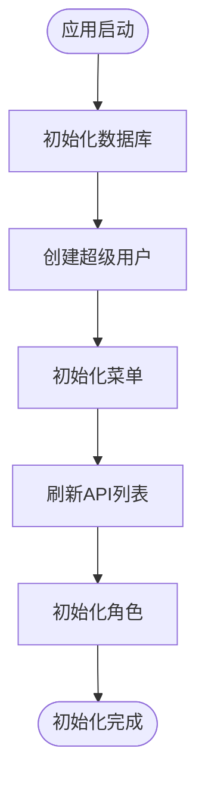
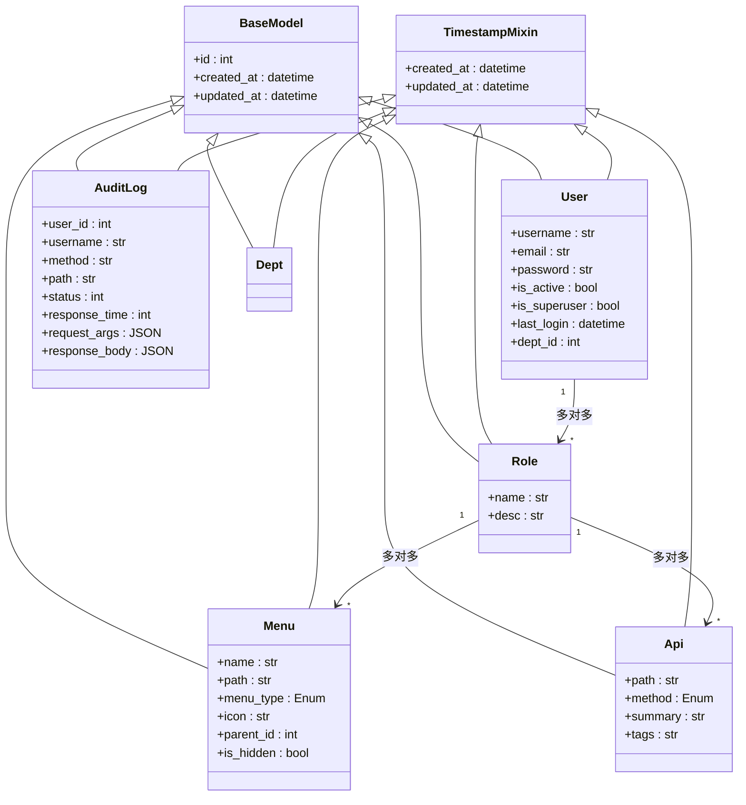
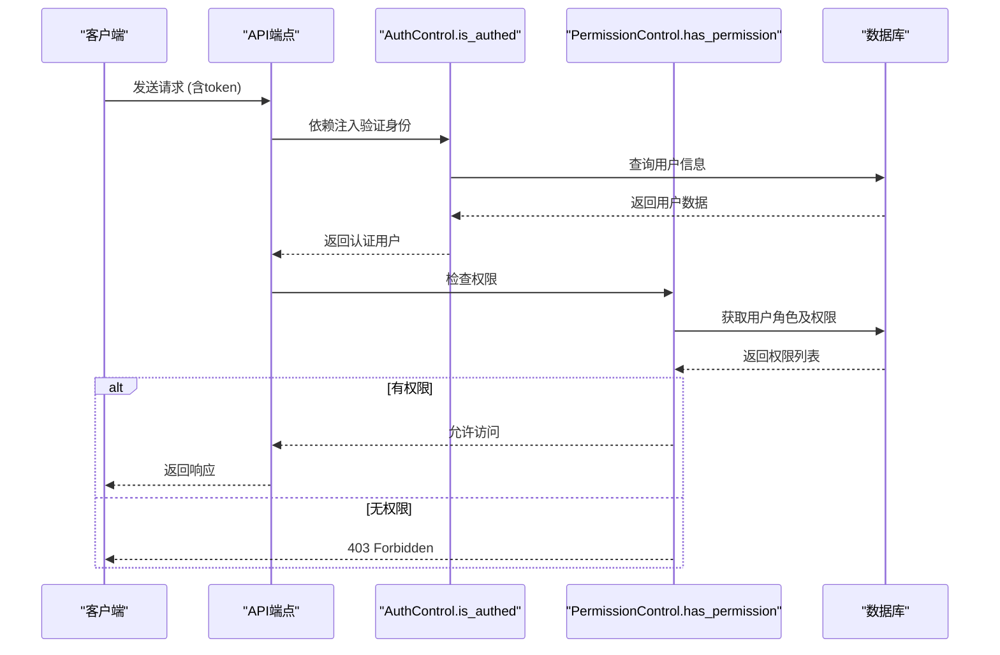

# 后端架构

<cite>
**本文档引用的文件**
- [init_app.py](file://app/core/init_app.py)
- [admin.py](file://app/models/admin.py)
- [jwt_utils.py](file://app/utils/jwt_utils.py)
- [dependency.py](file://app/core/dependency.py)
- [middlewares.py](file://app/core/middlewares.py)
</cite>

## 目录
1. [分层架构模式](#分层架构模式)
2. [应用初始化流程](#应用初始化流程)
3. [数据模型设计](#数据模型设计)
4. [Pydantic Schemas 的作用](#pydantic-schemas-的作用)
5. [权限控制机制](#权限控制机制)
6. [审计日志中间件](#审计日志中间件)

## 分层架构模式

本项目采用基于 FastAPI 的典型分层架构，分为 API 路由层、控制器层和模型/Schema 层。这种分层结构实现了关注点分离，提升了代码的可维护性和可测试性。

- **API 路由层**：位于 `app/api/v1` 目录下，负责定义 HTTP 路由和接口端点，将请求分发到对应的控制器。
- **控制器层**：位于 `app/controllers` 目录下，包含业务逻辑的协调代码，调用模型进行数据操作，并返回响应。
- **模型/Schema 层**：`app/models` 包含 Tortoise-ORM 模型，用于数据库操作；`app/schemas` 包含 Pydantic 模型，用于请求验证和响应序列化。

该架构的优势在于职责清晰、易于扩展和单元测试，同时通过依赖注入机制实现了组件间的松耦合。

## 应用初始化流程

应用的初始化流程在 `init_app.py` 文件中定义，主要包括数据库连接、中间件注册和初始数据填充。

**Diagram sources**
- [init_app.py](file://app/core/init_app.py#L100-L230)

**Section sources**
- [init_app.py](file://app/core/init_app.py#L1-L233)

### 数据库连接
通过 `init_db` 函数使用 Aerich 进行数据库迁移和初始化，确保数据库结构与模型定义一致。

### 中间件注册
`make_middlewares` 函数注册了以下中间件：
- **CORS 中间件**：配置跨域资源共享策略。
- **后台任务中间件**（BackGroundTaskMiddleware）：管理异步后台任务的生命周期。
- **审计日志中间件**（HttpAuditLogMiddleware）：记录所有关键操作日志。

### 初始数据填充
系统启动时自动执行以下初始化任务：
- 创建默认超级用户（用户名：admin，密码：123456）
- 初始化系统管理菜单及其子菜单
- 刷新 API 接口列表
- 创建管理员和普通用户角色，并分配相应的菜单和 API 权限

## 数据模型设计

数据模型基于 Tortoise-ORM 实现，定义在 `app/models/admin.py` 文件中，采用基类继承方式实现公共字段复用。

**Diagram sources**
- [admin.py](file://app/models/admin.py#L1-L90)

**Section sources**
- [admin.py](file://app/models/admin.py#L1-L90)

### 继承关系
所有模型均继承自 `BaseModel` 和 `TimestampMixin`，前者提供主键字段，后者提供创建和更新时间戳。

### 表间关联
- **用户与角色**：多对多关系，一个用户可拥有多个角色。
- **角色与菜单/API**：多对多关系，用于实现细粒度的权限控制。
- **菜单父子关系**：通过 `parent_id` 字段实现树形结构。

## Pydantic Schemas 的作用

Pydantic Schemas 定义在 `app/schemas` 目录中，主要用于：
1. **请求验证**：在 API 接口中作为参数类型，自动验证客户端提交的数据格式。
2. **响应序列化**：定义 API 返回数据的结构，确保输出的一致性和安全性。
3. **文档生成**：配合 FastAPI 自动生成 OpenAPI 文档，提升开发体验。

例如，用户创建请求通过 `UserCreate` Schema 进行验证，确保必填字段和数据类型正确。

## 权限控制机制

权限控制系统基于 JWT 令牌和依赖注入实现，核心组件位于 `dependency.py` 和 `jwt_utils.py`。

**Diagram sources**
- [jwt_utils.py](file://app/utils/jwt_utils.py#L1-L10)
- [dependency.py](file://app/core/dependency.py#L1-L53)

**Section sources**
- [jwt_utils.py](file://app/utils/jwt_utils.py#L1-L10)
- [dependency.py](file://app/core/dependency.py#L1-L53)

### JWT 令牌管理
`create_access_token` 函数使用 `jwt.encode` 生成签名令牌，包含用户 ID 等声明信息，算法和密钥从配置中读取。

### 基于依赖的权限校验
`require_permission` 功能由 `PermissionControl.has_permission` 方法实现：
- 首先通过 `DependAuth` 确保用户已认证。
- 检查用户是否为超级管理员（跳过权限检查）。
- 否则，根据用户角色关联的 API 列表，验证当前请求的方法和路径是否在允许范围内。

## 审计日志中间件

`HttpAuditLogMiddleware` 记录所有关键操作，用于安全审计和问题追踪。

**Section sources**
- [middlewares.py](file://app/core/middlewares.py#L48-L181)

### 记录内容
- **请求信息**：方法、路径、参数（查询参数和请求体）
- **响应信息**：状态码、响应时间、响应体（大小受限）
- **用户信息**：通过 JWT 解析获取用户 ID 和用户名
- **上下文信息**：API 模块、摘要等路由元数据

### 工作流程
1. `before_request` 阶段解析并存储请求参数。
2. `dispatch` 阶段记录处理开始时间。
3. `after_request` 阶段计算响应时间，收集完整日志数据并持久化到 `AuditLog` 表。

### 排除路径
以下路径不会被记录以保护敏感信息或避免循环记录：
- `/api/v1/base/access_token`（登录接口）
- `/docs` 和 `/openapi.json`（文档接口）
- 审计日志自身的查询接口

该中间件确保了系统的可追溯性，同时通过大小限制防止大响应体影响性能。