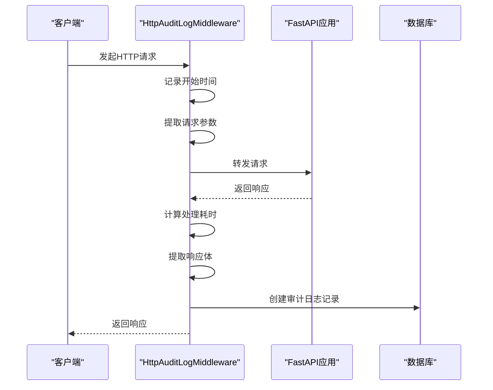
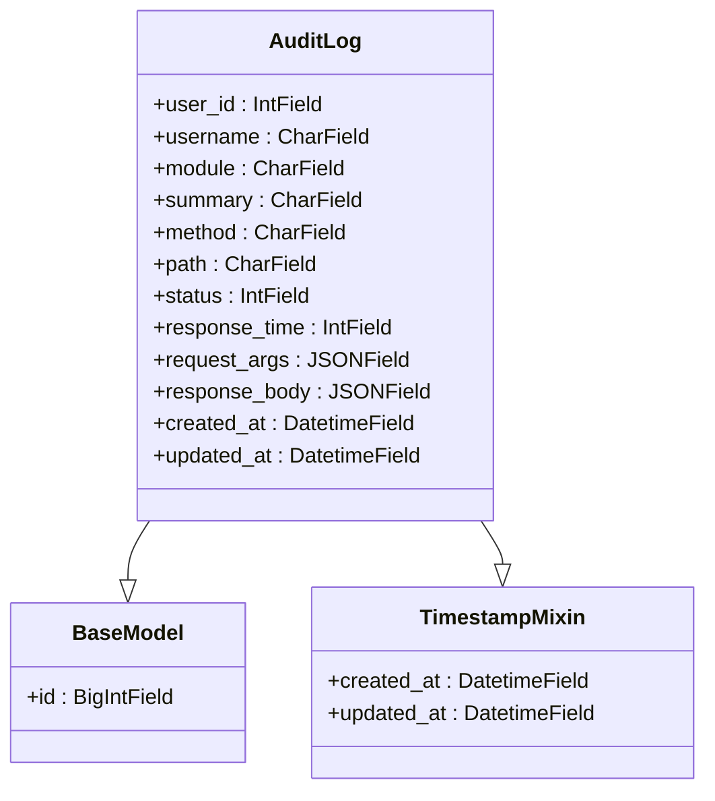
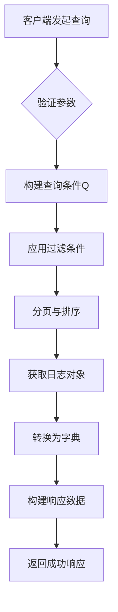

# 审计日志实现

<cite>
**Referenced Files in This Document**   
- [middlewares.py](file://app/core/middlewares.py)
- [admin.py](file://app/models/admin.py)
- [auditlog.py](file://app/api/v1/auditlog/auditlog.py)
- [base.py](file://app/models/base.py)
</cite>

## 目录
1. [简介](#简介)
2. [审计日志中间件](#审计日志中间件)
3. [审计日志数据模型](#审计日志数据模型)
4. [日志查询接口](#日志查询接口)
5. [触发机制与覆盖范围](#触发机制与覆盖范围)
6. [性能影响与优化考量](#性能影响与优化考量)
7. [结论](#结论)

## 简介
本文档详细阐述了 `vue-fastapi-admin` 项目中审计日志功能的实现机制。该功能旨在记录系统中所有关键操作的详细信息，为安全审计、故障排查和行为分析提供数据支持。核心实现由三部分构成：位于 `app/core/middlewares.py` 的 HTTP 审计日志中间件，负责拦截请求并生成日志；位于 `app/models/admin.py` 的 `AuditLog` 数据模型，定义了日志的存储结构；以及位于 `app/api/v1/auditlog/auditlog.py` 的查询接口，用于检索和展示日志数据。

## 审计日志中间件

`HttpAuditLogMiddleware` 是一个基于 FastAPI 的自定义中间件，它通过拦截所有传入的 HTTP 请求和响应来实现审计功能。该中间件在请求处理流程的开始和结束时执行，从而捕获完整的操作上下文。

**Diagram sources**
- [middlewares.py](file://app/core/middlewares.py#L100-L182)

**Section sources**
- [middlewares.py](file://app/core/middlewares.py#L100-L182)

### 请求拦截与信息提取
中间件通过重写 `dispatch` 方法介入请求处理流程。当请求到达时，`before_request` 方法会被调用，其主要任务是解析并存储请求参数。对于 `POST`、`PUT` 和 `PATCH` 请求，它会尝试解析 JSON 格式的请求体，并将其与查询参数合并。对于文件上传等表单数据，它会特别处理，仅记录文件名而非文件内容，以避免日志文件过大。

### 响应拦截与日志生成
在 FastAPI 应用处理完请求并生成响应后，`after_request` 方法会被调用。此时，中间件会执行以下关键步骤：
1.  **计算响应时间**：通过比较请求开始和结束的时间戳，计算出整个请求的处理耗时（以毫秒为单位）。
2.  **获取用户信息**：从请求头中提取 `token`，并利用 `AuthControl.is_authed` 方法验证其有效性，从而获取当前操作的用户ID和用户名。
3.  **获取路由信息**：遍历 FastAPI 的路由表，匹配当前请求的路径和方法，以获取该接口所属的 `module`（功能模块）和 `summary`（请求简介）。
4.  **提取响应体**：为了防止日志记录过大的响应数据，中间件会检查响应体的大小。如果超过1MB的限制，将记录一个提示信息。此外，为了防止审计日志列表接口自身产生无限递归的日志，该接口的响应体内容会被脱敏处理。
5.  **创建日志记录**：将所有收集到的信息（用户ID、用户名、模块、摘要、方法、路径、状态码、响应时间、请求参数、响应体）作为参数，调用 `AuditLog.create(**data)` 方法，将日志持久化到数据库。

## 审计日志数据模型

`AuditLog` 模型定义了审计日志在数据库中的结构和存储内容。它继承自 `BaseModel` 和 `TimestampMixin`，因此除了自身的字段外，还自动包含了 `id`、`created_at` 和 `updated_at` 字段。

**Diagram sources**
- [admin.py](file://app/models/admin.py#L78-L88)
- [base.py](file://app/models/base.py#L45-L62)

**Section sources**
- [admin.py](file://app/models/admin.py#L78-L88)

### 字段说明
下表详细描述了 `AuditLog` 模型的各个字段及其用途：

| 字段名 | 数据类型 | 描述 | 索引 |
| :--- | :--- | :--- | :--- |
| `user_id` | `IntField` | 执行操作的用户ID。若用户未登录，则为0。 | 是 |
| `username` | `CharField` | 执行操作的用户名。 | 是 |
| `module` | `CharField` | 该请求所属的功能模块（如"用户管理"、"角色管理"）。 | 是 |
| `summary` | `CharField` | 该请求的简要描述（如"创建用户"、"修改角色"）。 | 是 |
| `method` | `CharField` | HTTP请求方法（GET, POST, PUT, DELETE等）。 | 是 |
| `path` | `CharField` | 请求的完整URL路径。 | 是 |
| `status` | `IntField` | HTTP响应状态码（如200, 404, 500）。 | 是 |
| `response_time` | `IntField` | 请求的处理耗时，单位为毫秒。 | 是 |
| `request_args` | `JSONField` | 请求中包含的所有参数，包括查询参数和请求体。 | 否 |
| `response_body` | `JSONField` | 响应体的内容。 | 否 |
| `created_at` | `DatetimeField` | 日志记录的创建时间。 | 是 |
| `updated_at` | `DatetimeField` | 日志记录的最后更新时间。 | 是 |

## 日志查询接口

系统提供了一个专门的API接口来查询和检索审计日志，该接口定义在 `auditlog.py` 文件中。

**Diagram sources**
- [auditlog.py](file://app/api/v1/auditlog/auditlog.py#L10-L48)

**Section sources**
- [auditlog.py](file://app/api/v1/auditlog/auditlog.py#L10-L48)

### 接口功能
`get_audit_log_list` 函数通过 `@router.get("/list")` 装饰器暴露为一个 `GET` 请求接口。它支持多种查询参数，允许管理员根据不同的条件筛选日志：
*   **分页**：通过 `page` 和 `page_size` 参数实现分页。
*   **用户筛选**：通过 `username` 模糊匹配操作人。
*   **模块与方法筛选**：通过 `module` 和 `method` 筛选特定功能或请求类型。
*   **时间范围筛选**：通过 `start_time` 和 `end_time` 筛选指定时间段内的日志。
*   **状态码筛选**：通过 `status` 精确匹配特定的HTTP状态码。

### 查询逻辑
该接口使用 Tortoise ORM 的 `Q` 对象来构建复杂的查询条件。对于每一个非空的查询参数，都会向 `Q` 对象中添加一个相应的过滤条件。最终，查询会根据 `created_at` 字段降序排列，并应用分页限制，返回一个包含日志数据列表、总数、当前页码和每页数量的 `SuccessExtra` 响应对象。

## 触发机制与覆盖范围

审计日志的触发是自动且全面的，由 `HttpAuditLogMiddleware` 中间件统一管理。其触发机制和覆盖范围如下：

1.  **触发条件**：任何符合中间件配置的HTTP请求都会触发日志记录。具体来说，请求的 `method` 必须在中间件初始化时指定的 `methods` 列表中（通常包含 `POST`, `PUT`, `DELETE` 等写操作），并且请求路径不能匹配 `exclude_paths` 中定义的排除路径（例如健康检查接口 `/health`）。
2.  **覆盖范围**：由于中间件作用于整个应用，因此所有通过 FastAPI 路由的、符合条件的请求都会被记录。这包括但不限于：
    *   **用户管理**：创建、修改、删除用户。
    *   **角色管理**：创建、修改、删除角色，以及为角色分配菜单和API权限。
    *   **部门管理**：创建、修改、删除部门。
    *   **菜单与API管理**：对系统菜单和API定义的任何变更。
    *   **其他所有写操作**：任何对数据库进行修改的API调用。

值得注意的是，读取操作（如 `GET` 请求）默认不会被记录，这有助于减少日志量。但此行为取决于中间件的配置。

## 性能影响与优化考量

虽然审计日志功能至关重要，但它不可避免地会对系统性能产生一定影响，主要体现在以下几个方面：

1.  **I/O 开销**：每次写操作都需要向数据库插入一条新的日志记录，这会增加数据库的写入压力，尤其是在高并发场景下。
2.  **序列化开销**：中间件需要解析请求体和响应体，并将它们序列化为JSON存储在 `JSONField` 中，这个过程消耗CPU资源。
3.  **内存开销**：为了获取响应体，中间件需要在内存中暂存整个响应内容，对于大响应体，这可能导致内存使用量增加。

### 优化措施
项目中已实施了多项优化措施来缓解这些影响：
*   **响应体大小限制**：通过 `max_body_size` 限制（1MB）来防止记录过大的响应数据，避免日志膨胀和内存溢出。
*   **选择性记录**：通过 `exclude_paths` 配置排除了 `/health` 等高频但无需审计的接口，减少了不必要的日志记录。
*   **异步处理**：尽管当前实现是同步的，但最佳实践是将日志记录操作放入后台任务队列（如Celery）中异步执行。这可以将日志写入的延迟从主请求流程中剥离，显著提升API的响应速度。当前代码中的 `BgTasks` 模块暗示了项目可能已具备异步任务处理能力，未来可将审计日志的创建操作迁移至此。
*   **数据库索引**：对 `user_id`, `module`, `path`, `status`, `created_at` 等常用查询字段建立了数据库索引，确保日志查询操作的高效性。

## 结论
`vue-fastapi-admin` 的审计日志功能通过一个精心设计的中间件、一个结构清晰的数据模型和一个功能完备的查询接口，实现了对系统关键操作的全面监控。它能够自动捕获用户、操作、时间、结果等关键信息，并提供灵活的查询能力。尽管存在一定的性能开销，但通过大小限制和排除路径等优化手段，其影响已被控制在合理范围内。未来通过引入异步日志记录，可以进一步提升系统的整体性能和可扩展性。