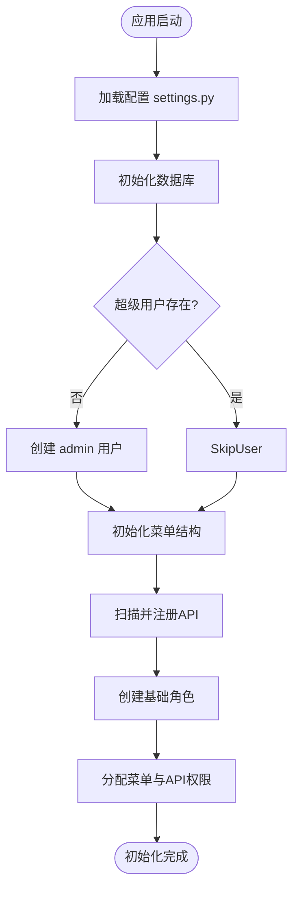
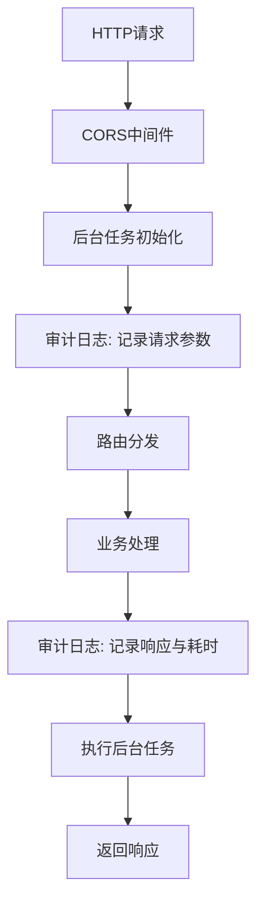
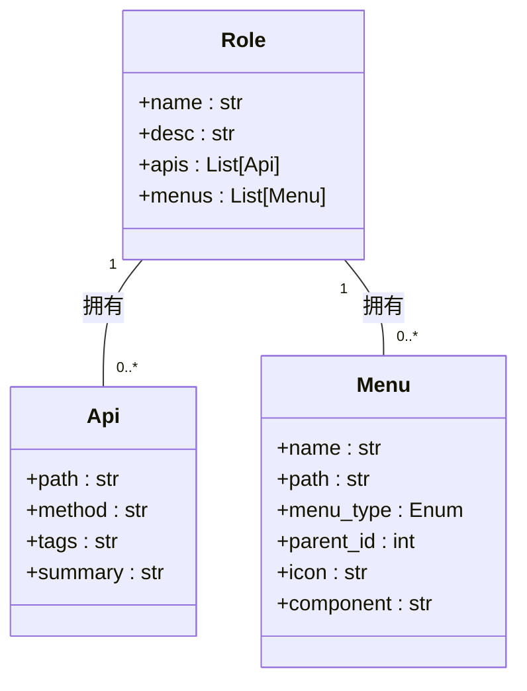

# 应用初始化流程

<cite>
**本文档引用的文件**  
- [run.py](file://run.py)
- [init_app.py](file://app/core/init_app.py)
- [config.py](file://app/settings/config.py)
- [middlewares.py](file://app/core/middlewares.py)
</cite>

## 目录
1. [简介](#简介)
2. [项目结构](#项目结构)
3. [核心初始化流程](#核心初始化流程)
4. [配置加载](#配置加载)
5. [数据库连接初始化](#数据库连接初始化)
6. [API路由注册](#api路由注册)
7. [中间件注册](#中间件注册)
8. [自动初始化机制](#自动初始化机制)
9. [总结](#总结)

## 简介
本文档详细记录了 `vue-fastapi-admin` 后端应用的完整初始化流程。从 `run.py` 入口文件开始，逐步分析 `init_app.py` 中定义的初始化步骤，包括配置加载、数据库连接、路由注册、中间件注入以及系统数据的自动创建。重点阐述系统如何通过 `init_data` 函数实现首次部署时的自动化初始化，极大简化部署流程。

## 项目结构
本项目采用模块化分层架构，主要目录包括：
- `app/api/v1/`: API 路由定义
- `app/controllers/`: 业务逻辑控制器
- `app/models/`: 数据模型定义
- `app/settings/`: 配置管理
- `app/core/`: 核心功能（初始化、中间件、异常处理）
- `app/utils/`: 工具函数

初始化流程主要集中在 `app/core/init_app.py` 文件中，由 `run.py` 触发。

**Section sources**
- [run.py](file://run.py#L1-L13)
- [app/core/init_app.py](file://app/core/init_app.py#L1-L233)

## 核心初始化流程
应用的初始化流程始于 `run.py` 文件，通过 Uvicorn 启动 FastAPI 应用实例。核心初始化逻辑封装在 `app/core/init_app.py` 中的 `init_data` 函数内，该函数按顺序执行以下关键步骤：
1. 初始化数据库（含迁移）
2. 创建超级管理员账户（若不存在）
3. 初始化系统菜单
4. 初始化 API 列表
5. 初始化基础角色并分配权限

**Diagram sources**
- [init_app.py](file://app/core/init_app.py#L227-L232)

## 配置加载
系统配置由 `app/settings/config.py` 中的 `Settings` 类统一管理，基于 Pydantic Settings 实现。在初始化过程中，通过 `settings = Settings()` 实例化配置对象，自动加载以下关键配置：
- **CORS 设置**：允许所有来源、方法和头部，支持凭证
- **数据库配置**：默认使用 SQLite，支持 MySQL、PostgreSQL 等多种后端
- **JWT 配置**：密钥、算法及过期时间（7天）
- **日志路径**：日志文件存储位置

这些配置在中间件、数据库连接和认证模块中被广泛引用。

**Section sources**
- [config.py](file://app/settings/config.py#L1-L94)

## 数据库连接初始化
数据库初始化由 `init_db` 函数完成，使用 Tortoise-ORM 和 Aerich（迁移工具）实现。流程如下：
1. 创建 `Command` 实例，传入 `TORTOISE_ORM` 配置
2. 调用 `init_db(safe=True)` 初始化数据库结构
3. 执行 `migrate()` 检查并应用迁移
4. 若迁移失败（如模型历史丢失），则重建迁移目录并重新初始化

此机制确保数据库结构始终与代码模型保持同步。

**Section sources**
- [init_app.py](file://app/core/init_app.py#L184-L199)

## API路由注册
API 路由通过 `register_routers` 函数注册。系统将 `app/api/v1/` 目录下的所有路由统一挂载到 `/api` 前缀下。路由定义分散在各个子模块中（如用户、角色、菜单等），通过 `api_router` 集中导入，实现模块化管理。

**Section sources**
- [init_app.py](file://app/core/init_app.py#L62-L64)

## 中间件注册
系统通过 `make_middlewares` 函数注册以下核心中间件：
- **CORS 中间件**：处理跨域请求，配置允许的源、方法、头部
- **后台任务中间件** (`BackGroundTaskMiddleware`)：在请求前后初始化和执行后台任务
- **审计日志中间件** (`HttpAuditLogMiddleware`)：记录所有关键操作（GET/POST/PUT/DELETE），排除登录、文档等路径

这些中间件增强了应用的安全性、可观测性和功能性。

**Diagram sources**
- [init_app.py](file://app/core/init_app.py#L30-L58)
- [middlewares.py](file://app/core/middlewares.py#L1-L182)

## 自动初始化机制
系统通过 `init_data` 及其子函数实现首次部署的自动化初始化，无需手动干预。

### 创建超级管理员账户
`init_superuser` 函数检查用户表是否为空，若为空则创建默认超级管理员：
- **用户名**: `admin`
- **邮箱**: `admin@admin.com`
- **密码**: `123456`
- **权限**: `is_superuser=True`

此机制确保系统始终存在一个可登录的管理员账户。

**Section sources**
- [init_app.py](file://app/core/init_app.py#L66-L77)

### 初始化系统菜单
`init_menus` 函数创建完整的系统菜单结构：
- **一级菜单**：“系统管理”（路径 `/system`）
- **二级菜单**：用户、角色、菜单、API、部门、审计日志管理
- **独立菜单**：“一级菜单”（路径 `/top-menu`）

所有菜单项包含图标、排序、组件路径等元信息，直接映射到前端路由。

**Section sources**
- [init_app.py](file://app/core/init_app.py#L80-L175)

### 初始化API权限列表
`init_apis` 函数调用 `api_controller.refresh_api()` 扫描所有注册的 API 路由，并将其持久化到数据库的 `apis` 表中。这为后续的权限控制提供了数据基础。

**Section sources**
- [init_app.py](file://app/core/init_app.py#L178-L181)

### 初始化基础角色与权限
`init_roles` 函数创建两个基础角色：
1. **管理员**：拥有所有菜单和 API 的访问权限
2. **普通用户**：拥有所有菜单和基础模块（GET 请求）的访问权限

权限通过多对多关系（`Role.apis` 和 `Role.menus`）自动分配，确保新部署的系统具备合理的默认权限体系。

**Diagram sources**
- [init_app.py](file://app/core/init_app.py#L202-L224)
- [models/admin.py](file://app/models/admin.py)

## 总结
该应用的初始化流程设计精巧，通过 `init_data` 函数串联起配置、数据库、路由、中间件和系统数据的初始化。其核心价值在于**自动化**：
- 自动创建管理员账户，避免部署失败
- 自动同步 API 列表，减少配置遗漏
- 自动分配基础权限，确保系统可用性
- 结合 Aerich 实现数据库迁移自动化

这一机制显著降低了首次部署的复杂度，使开发者和运维人员能够快速启动和运行系统。