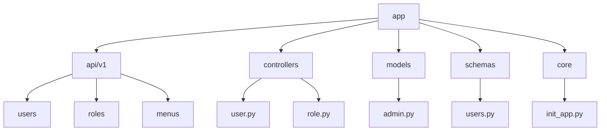
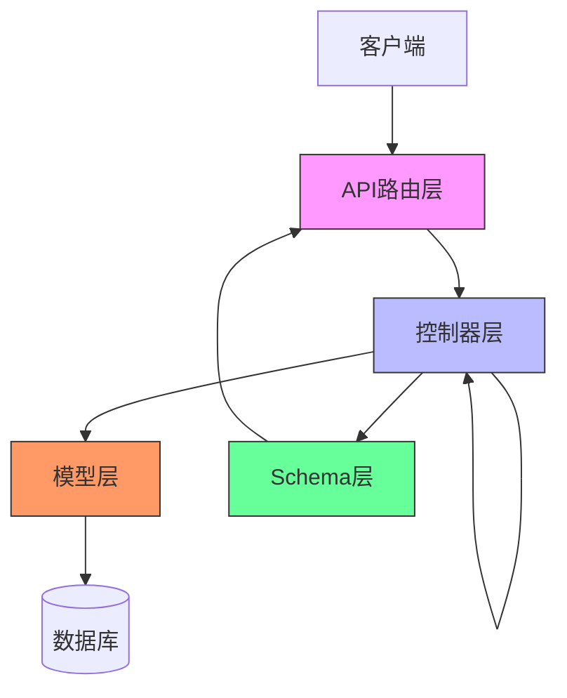
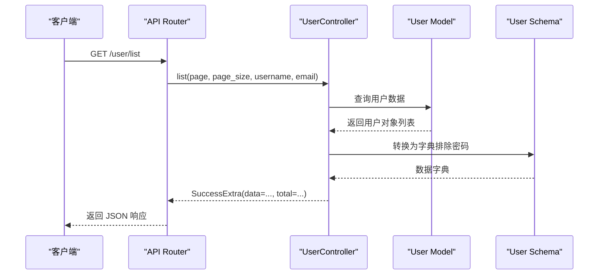
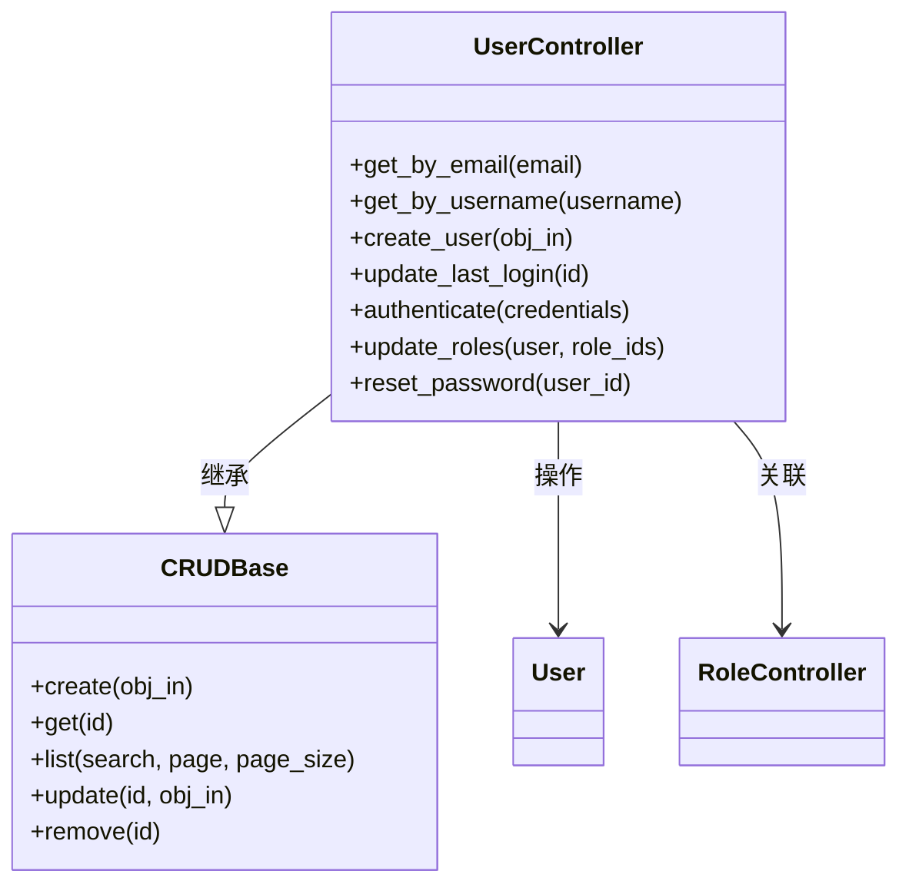
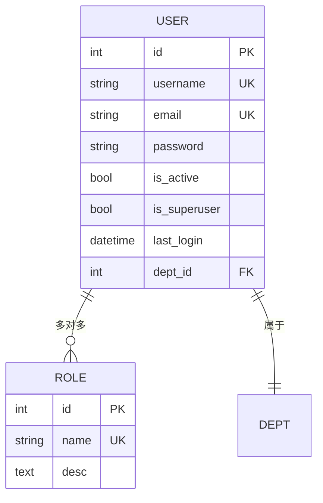
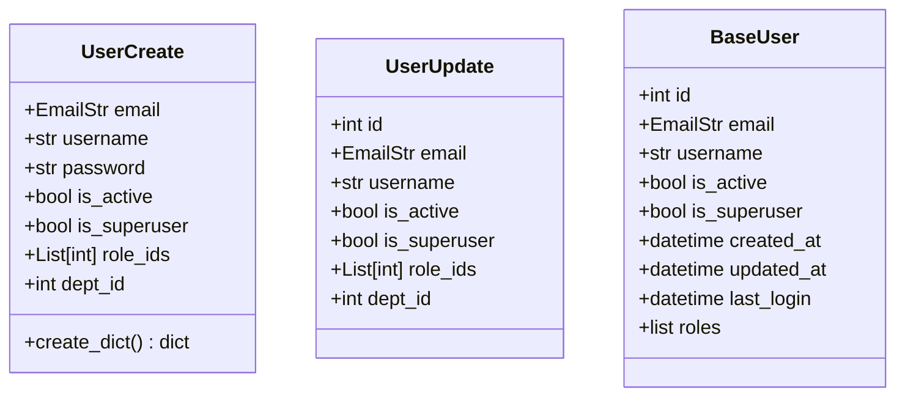
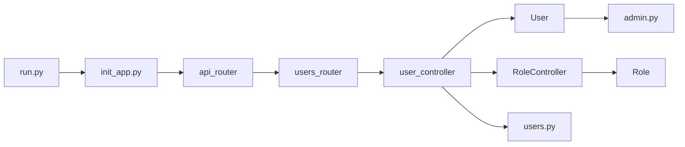

# 应用结构与分层架构

<cite>
**本文档引用的文件**  
- [run.py](file://run.py)
- [init_app.py](file://app/core/init_app.py)
- [users.py](file://app/api/v1/users/users.py)
- [user.py](file://app/controllers/user.py)
- [users.py](file://app/schemas/users.py)
- [admin.py](file://app/models/admin.py)
- [__init__.py](file://app/api/v1/__init__.py)
- [__init__.py](file://app/controllers/__init__.py)
</cite>

## 目录
1. [简介](#简介)
2. [项目结构](#项目结构)
3. [核心组件](#核心组件)
4. [架构概览](#架构概览)
5. [详细组件分析](#详细组件分析)
6. [依赖分析](#依赖分析)
7. [性能考虑](#性能考虑)
8. [故障排除指南](#故障排除指南)
9. [结论](#结论)

## 简介
本项目是一个基于 FastAPI 的后端管理系统，采用清晰的分层架构设计，包含 API 路由层、控制器层、模型层和 Schema 层。该结构实现了职责分离，提升了代码的可测试性与可维护性。本文档将深入解析各层之间的调用关系，并以用户管理模块为例说明其工作流程。

## 项目结构

**图示来源**  
- [app/api/v1](file://app/api/v1)
- [app/controllers](file://app/controllers)
- [app/models](file://app/models)
- [app/schemas](file://app/schemas)
- [app/core](file://app/core)

**本节来源**  
- [app/api/v1](file://app/api/v1)
- [app/controllers](file://app/controllers)
- [app/models](file://app/models)
- [app/schemas](file://app/schemas)

## 核心组件

系统的核心组件包括 FastAPI 实例初始化、API 路由分发、控制器逻辑处理、数据模型定义以及请求/响应 Schema。这些组件协同工作，确保请求能够被正确解析、验证、处理并返回结果。

**本节来源**  
- [run.py](file://run.py)
- [init_app.py](file://app/core/init_app.py)
- [users.py](file://app/api/v1/users/users.py)
- [user.py](file://app/controllers/user.py)
- [users.py](file://app/schemas/users.py)
- [admin.py](file://app/models/admin.py)

## 架构概览

**图示来源**  
- [init_app.py](file://app/core/init_app.py#L1-L233)
- [users.py](file://app/api/v1/users/users.py#L1-L82)
- [user.py](file://app/controllers/user.py#L1-L61)
- [users.py](file://app/schemas/users.py#L1-L45)
- [admin.py](file://app/models/admin.py#L1-L90)

## 详细组件分析

### 用户管理模块分析

用户管理模块展示了从 API 请求到数据持久化的完整流程。

#### API 路由层
API 路由层负责接收 HTTP 请求并将其分发给对应的控制器方法。例如，`/user/list` 请求由 `list_user` 函数处理。

**图示来源**  
- [users.py](file://app/api/v1/users/users.py#L1-L82)
- [user.py](file://app/controllers/user.py#L1-L61)
- [users.py](file://app/schemas/users.py#L1-L45)

#### 控制器层
控制器层是业务逻辑的核心，协调模型和 Schema 完成操作。`UserController` 继承自 `CRUDBase`，提供标准的增删改查功能。

**图示来源**  
- [user.py](file://app/controllers/user.py#L1-L61)
- [admin.py](file://app/models/admin.py#L1-L90)
- [role.py](file://app/controllers/role.py)

#### 模型层
模型层定义了数据库表结构，使用 Tortoise ORM 映射 Python 类到数据库表。

**图示来源**  
- [admin.py](file://app/models/admin.py#L1-L90)

#### Schema 层
Schema 层使用 Pydantic 定义请求和响应的数据结构，实现输入验证和序列化。

**图示来源**  
- [users.py](file://app/schemas/users.py#L1-L45)

**本节来源**  
- [users.py](file://app/api/v1/users/users.py#L1-L82)
- [user.py](file://app/controllers/user.py#L1-L61)
- [users.py](file://app/schemas/users.py#L1-L45)
- [admin.py](file://app/models/admin.py#L1-L90)

## 依赖分析

**图示来源**  
- [run.py](file://run.py#L1-L14)
- [init_app.py](file://app/core/init_app.py#L1-L233)
- [__init__.py](file://app/api/v1/__init__.py#L1-L22)
- [users.py](file://app/api/v1/users/users.py#L1-L82)
- [user.py](file://app/controllers/user.py#L1-L61)
- [admin.py](file://app/models/admin.py#L1-L90)
- [users.py](file://app/schemas/users.py#L1-L45)

**本节来源**  
- [run.py](file://run.py#L1-L14)
- [init_app.py](file://app/core/init_app.py#L1-L233)
- [__init__.py](file://app/api/v1/__init__.py#L1-L22)
- [user.py](file://app/controllers/user.py#L1-L61)

## 性能考虑
分层架构虽然提高了可维护性，但也引入了额外的调用开销。建议对高频接口进行缓存优化，并合理使用数据库索引。Tortoise ORM 的异步特性有助于提升 I/O 密集型操作的性能。

## 故障排除指南
常见问题包括路由未注册、权限不足、数据验证失败等。可通过查看日志输出、检查依赖注入配置、确认模型字段类型等方式进行排查。`init_app.py` 中的异常处理器可捕获常见错误并返回友好提示。

**本节来源**  
- [init_app.py](file://app/core/init_app.py#L1-L233)
- [exceptions.py](file://app/core/exceptions.py)

## 结论
该 FastAPI 项目通过清晰的分层架构实现了高内聚、低耦合的设计目标。API 路由层、控制器层、模型层和 Schema 层各司其职，便于团队协作开发与单元测试。以用户管理为例，展示了请求从入口到数据库的完整流转过程，体现了良好的可扩展性与可维护性。