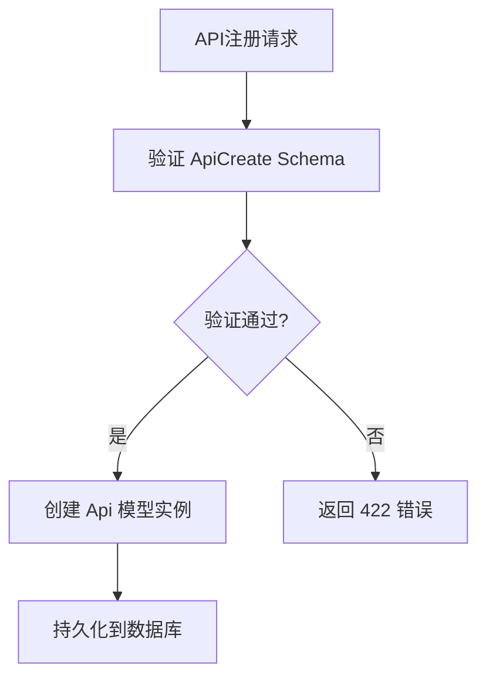
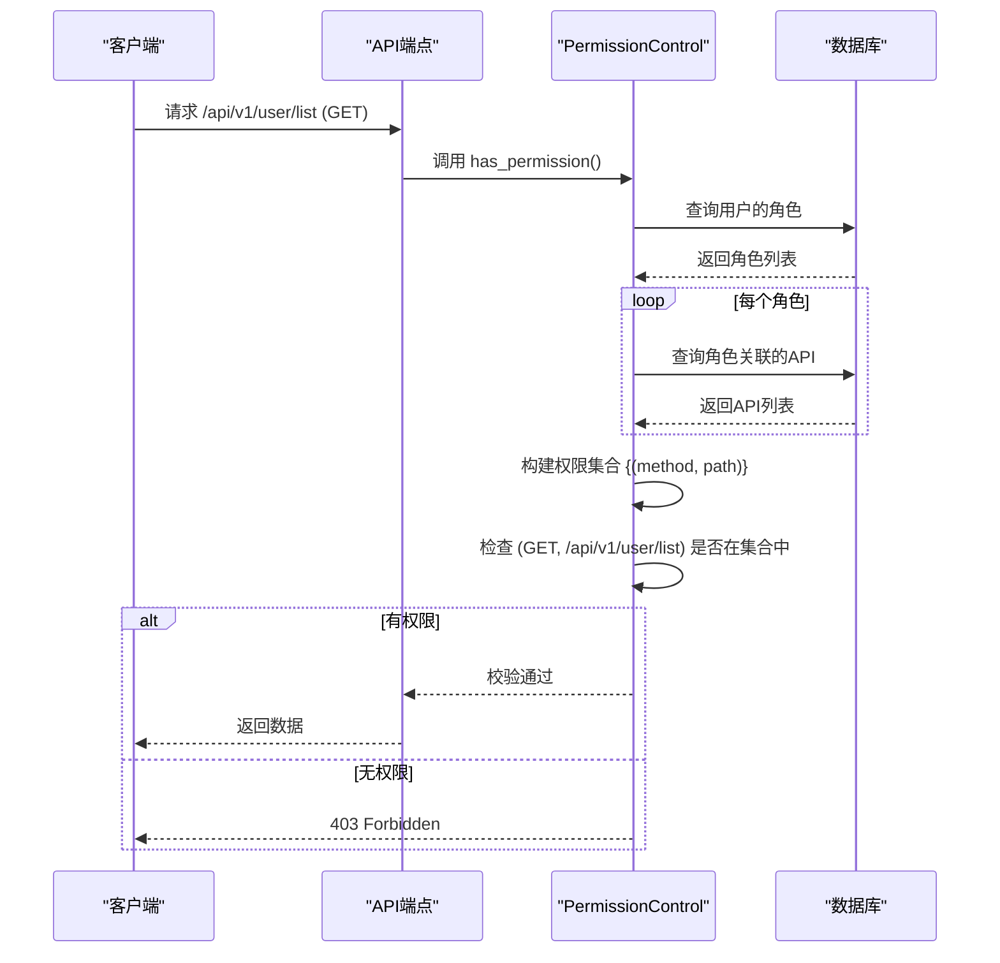

# API接口模型

<cite>
**本文档引用的文件**  
- [enums.py](file://app/models/enums.py)
- [admin.py](file://app/models/admin.py#L34-L41)
- [apis.py](file://app/schemas/apis.py)
- [dependency.py](file://app/core/dependency.py#L39-L53)
- [apis.py](file://app/api/v1/apis/apis.py)
- [roles.py](file://app/schemas/roles.py#L12)
</cite>

## 目录
1. [引言](#引言)
2. [API模型字段详解](#api模型字段详解)
3. [权限控制的最小粒度单元](#权限控制的最小粒度单元)
4. [Swagger UI中的接口分组机制](#swagger-ui中的接口分组机制)
5. [API注册的数据验证](#api注册的数据验证)
6. [后端权限校验机制](#后端权限校验机制)
7. [前端权限指令依据](#前端权限指令依据)
8. [总结](#总结)

## 引言
`Api` 模型是系统权限管理体系的核心组成部分，用于定义和管理所有可访问的API端点。该模型不仅承载了接口的基本元信息，还作为权限分配与校验的最小粒度单元，贯穿于前后端的权限控制流程中。本文档将深入解析 `Api` 模型的结构、用途及其在整个权限体系中的关键作用。

## API模型字段详解
`Api` 模型定义于 `app/models/admin.py` 中，包含以下核心字段：

- **path**: 字符串类型，表示API的完整路径（如 `/api/v1/user/list`），用于唯一标识一个接口。
- **method**: 枚举类型，关联 `app/models/enums.py` 中的 `MethodType`，限定为 `GET`、`POST`、`PUT`、`DELETE`、`PATCH` 五种HTTP方法之一。
- **summary**: 字符串类型，提供对该API功能的简要描述（如“查看用户列表”），便于开发者理解接口用途。
- **tags**: 字符串类型，用于对API进行逻辑分组（如“User”、“Role”），直接影响Swagger UI中的展示结构。

这些字段共同构成了系统中每一个可被授权访问的API资源的基本信息。

**Section sources**
- [admin.py](file://app/models/admin.py#L34-L41)
- [enums.py](file://app/models/enums.py)

## 权限控制的最小粒度单元
`Api` 模型是权限控制系统中的最小粒度单元。每个 `Api` 实例代表一个具体的、可被授权或拒绝的接口操作（由 `path` 和 `method` 共同唯一确定）。

该模型通过多对多关系与 `Role` 模型（位于 `app/models/admin.py`）进行绑定：
```python
apis = fields.ManyToManyField("models.Api", related_name="role_apis")
```
这意味着一个角色可以拥有多个API权限，而一个API也可以被分配给多个角色。这种设计实现了灵活的权限分配策略，允许管理员根据业务需求精细化地控制不同角色对具体接口的访问能力。

**Section sources**
- [admin.py](file://app/models/admin.py#L24-L31)
- [admin.py](file://app/models/admin.py#L34-L41)

## Swagger UI中的接口分组机制
`tags` 字段在自动生成的API文档（Swagger UI）中扮演着至关重要的角色。它决定了API接口在文档界面上的分组展示方式。

例如，所有 `tags` 值为 "User" 的API（如 `/api/v1/user/list`、`/api/v1/user/create`）都会被归类到“User”分组下，形成一个逻辑清晰的模块化视图。这极大地提升了API文档的可读性和易用性，使前端开发者和第三方集成者能够快速定位和理解相关接口。

**Section sources**
- [admin.py](file://app/models/admin.py#L34-L41)
- [apis.py](file://app/api/v1/apis/apis.py)

## API注册的数据验证
当需要创建新的API记录时，系统使用 `app/schemas/apis.py` 中定义的Pydantic模型进行数据验证。

- **ApiCreate**: 继承自 `BaseApi`，用于验证新API的创建请求。它确保传入的 `path`、`method`、`summary` 和 `tags` 字段符合预定义的格式和约束（如 `method` 必须是 `MethodType` 枚举中的有效值）。
- **ApiUpdate**: 在 `ApiCreate` 的基础上增加了 `id` 字段，用于验证更新操作。

这些Schema确保了API元数据的完整性和一致性，防止无效或恶意数据进入权限系统。



**Diagram sources**
- [apis.py](file://app/schemas/apis.py)
- [admin.py](file://app/models/admin.py#L34-L41)

**Section sources**
- [apis.py](file://app/schemas/apis.py)

## 后端权限校验机制
系统的后端权限校验由 `app/core/dependency.py` 中的 `PermissionControl.has_permission` 依赖项实现。

其核心逻辑如下：
1. 从请求中提取当前用户（通过 `AuthControl.is_authed`）。
2. 获取该用户所绑定的所有角色。
3. 遍历所有角色，收集其关联的 `apis` 权限。
4. 将权限列表转换为 `(method, path)` 元组的集合。
5. 检查当前请求的 `method` 和 `path` 是否存在于该集合中。
6. 如果不存在，则抛出 `403 Forbidden` 异常。

此过程确保了只有被明确授权的用户才能访问特定的API端点，实现了基于角色的访问控制（RBAC）。



**Diagram sources**
- [dependency.py](file://app/core/dependency.py#L39-L53)
- [admin.py](file://app/models/admin.py#L24-L31)

**Section sources**
- [dependency.py](file://app/core/dependency.py#L39-L53)

## 前端权限指令依据
前端的权限控制指令 `v-permission` 的数据来源与后端保持一致。通常，系统在用户登录成功后，会通过一个API（如 `/api/v1/roles/menus` 或类似接口）获取该用户所有角色所拥有的菜单和API权限列表。

前端应用将这些权限信息存储在状态管理（如Vuex或Pinia）中。`v-permission` 指令在执行时，会检查当前用户是否拥有执行某个操作（对应特定 `path` 和 `method`）所需的权限，从而决定是否渲染或启用相关UI元素（如按钮、菜单项）。

虽然具体的前端实现位于 `web/src/directives/permission.js`，但其权限判断的原始数据直接来源于后端 `Api` 模型所定义的权限集合。

**Section sources**
- [dependency.py](file://app/core/dependency.py#L39-L53)
- [roles.py](file://app/schemas/roles.py#L12)

## 总结
`Api` 模型是整个系统权限架构的基石。它通过精确的字段定义（`path`、`method`、`summary`、`tags`）描述了每一个可被访问的接口，并作为最小权限单元与 `Role` 模型建立多对多关系。这一设计不仅支撑了后端 `require_permission` 依赖项的精确校验，也为前端 `v-permission` 指令提供了权威的数据来源。同时，`tags` 字段的存在使得API文档能够清晰地组织和展示，提升了系统的可维护性和开发效率。