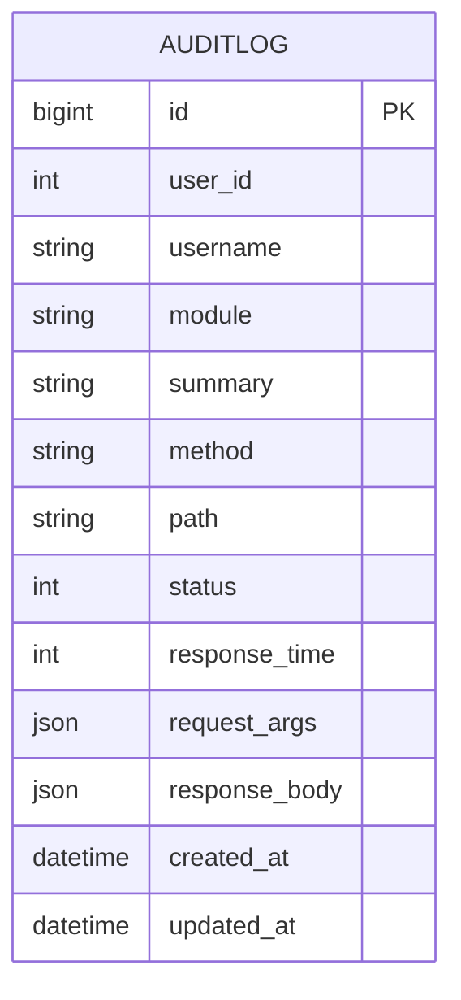
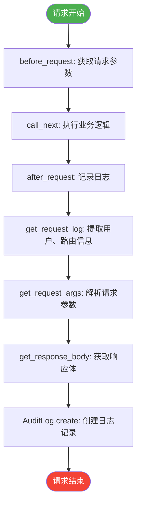
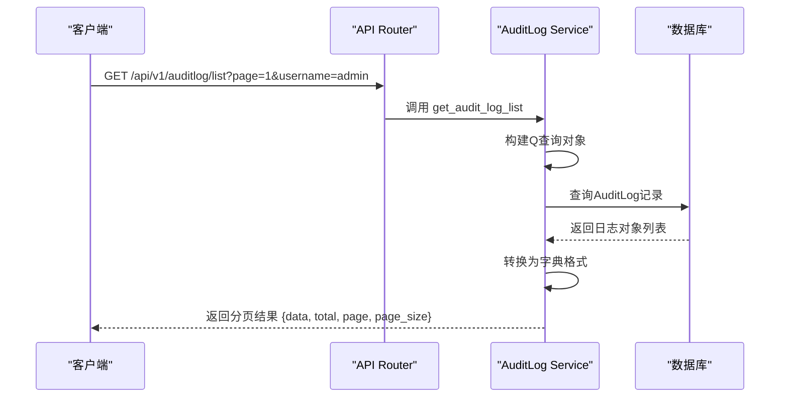

# 审计日志模型

<cite>
**本文档引用的文件**  
- [admin.py](file://app/models/admin.py#L78-L88)
- [middlewares.py](file://app/core/middlewares.py)
- [auditlog.py](file://app/api/v1/auditlog/auditlog.py)
</cite>

## 目录
1. [简介](#简介)
2. [模型结构](#模型结构)
3. [关键字段说明](#关键字段说明)
4. [日志记录机制](#日志记录机制)
5. [中间件实现流程](#中间件实现流程)
6. [应用场景](#应用场景)
7. [敏感信息风险与脱敏策略](#敏感信息风险与脱敏策略)
8. [查询接口](#查询接口)
9. [总结](#总结)

## 简介
审计日志模型（`AuditLog`）是系统安全与运维的核心组件，用于记录所有用户在系统中的关键操作行为。该模型通过中间件自动捕获每次API调用的完整上下文，包括操作者、操作行为、执行结果及请求响应数据，为安全审计、故障排查和用户行为分析提供数据支持。

**Section sources**  
- [admin.py](file://app/models/admin.py#L78-L88)

## 模型结构
`AuditLog` 模型继承自 `BaseModel` 和 `TimestampMixin`，具备主键ID、创建时间（`created_at`）和更新时间（`updated_at`）等基础字段。其核心字段设计覆盖了操作的主体、行为、结果和数据内容。

**Diagram sources**  
- [admin.py](file://app/models/admin.py#L78-L88)

## 关键字段说明
`AuditLog` 模型的关键字段按功能可分为四类：

### 操作主体
- **`user_id`**: 记录执行操作的用户ID，用于唯一标识操作者。
- **`username`**: 记录操作者的用户名，便于直观识别。

### 操作行为
- **`module`**: 记录功能模块名称，来源于API路由的标签（tags）。
- **`summary`**: 记录接口的简要描述，直接取自API的`summary`字段。
- **`method`**: 记录HTTP请求方法（如GET、POST）。
- **`path`**: 记录完整的请求路径。

### 执行结果
- **`status`**: 记录HTTP响应状态码（如200、404）。
- **`response_time`**: 记录接口响应时间（毫秒），用于性能监控。

### 数据内容
- **`request_args`**: 使用 `JSONField` 存储请求参数，包括查询参数和请求体内容。
- **`response_body`**: 使用 `JSONField` 存储响应体内容，便于事后分析。

**Section sources**  
- [admin.py](file://app/models/admin.py#L78-L88)

## 日志记录机制
审计日志的记录完全自动化，由 `HttpAuditLogMiddleware` 中间件在每次API请求完成后触发。该机制无需在业务代码中手动调用，确保了日志的完整性和一致性。

**Section sources**  
- [middlewares.py](file://app/core/middlewares.py)

## 中间件实现流程
`HttpAuditLogMiddleware` 的工作流程如下：

**Diagram sources**  
- [middlewares.py](file://app/core/middlewares.py)

### 核心方法
- **`get_request_log`**: 从 `request` 和 `response` 对象中提取路径、状态码、用户信息等。
- **`get_request_args`**: 支持JSON和表单数据的解析，对文件上传仅记录文件名。
- **`get_response_body`**: 限制响应体大小（1MB），并对审计日志自身的查询进行脱敏处理，避免无限递归。

**Section sources**  
- [middlewares.py](file://app/core/middlewares.py)

## 应用场景
审计日志在以下场景中发挥关键作用：
- **安全审计**: 追踪敏感操作（如用户权限变更），识别异常行为。
- **故障排查**: 结合 `request_args` 和 `response_body` 快速复现和定位问题。
- **行为分析**: 统计各功能模块的使用频率，优化产品设计。

## 敏感信息风险与脱敏策略
尽管 `response_body` 提供了强大的调试能力，但其存储完整的响应数据也带来了敏感信息泄露的风险（如用户密码、身份证号）。

### 潜在风险
- 日志文件可能被未授权访问。
- 数据库备份可能包含敏感日志数据。

### 脱敏策略
1. **字段级脱敏**: 在 `get_response_body` 中增加敏感字段过滤逻辑，例如移除 `password`、`id_card` 等字段。
2. **配置化排除**: 允许通过配置指定哪些API路径或字段不记录响应体。
3. **加密存储**: 对 `response_body` 字段进行加密存储，仅在需要时解密查看。

**Section sources**  
- [middlewares.py](file://app/core/middlewares.py)

## 查询接口
系统提供了 `/api/v1/auditlog/list` 接口用于查询审计日志，支持多维度筛选：
- 用户名（`username`）
- 功能模块（`module`）
- 请求方法（`method`）
- 状态码（`status`）
- 时间范围（`start_time`, `end_time`）

该接口使用 `Q` 对象构建复杂查询条件，并支持分页。

**Diagram sources**  
- [auditlog.py](file://app/api/v1/auditlog/auditlog.py)

**Section sources**  
- [auditlog.py](file://app/api/v1/auditlog/auditlog.py)

## 总结
`AuditLog` 模型通过与 `HttpAuditLogMiddleware` 的紧密结合，实现了对系统操作的全面、自动化记录。其结构化的设计使得日志数据易于查询和分析。然而，在享受其便利性的同时，必须重视 `response_body` 字段带来的安全风险，并通过实施脱敏策略来保护用户隐私和系统安全。