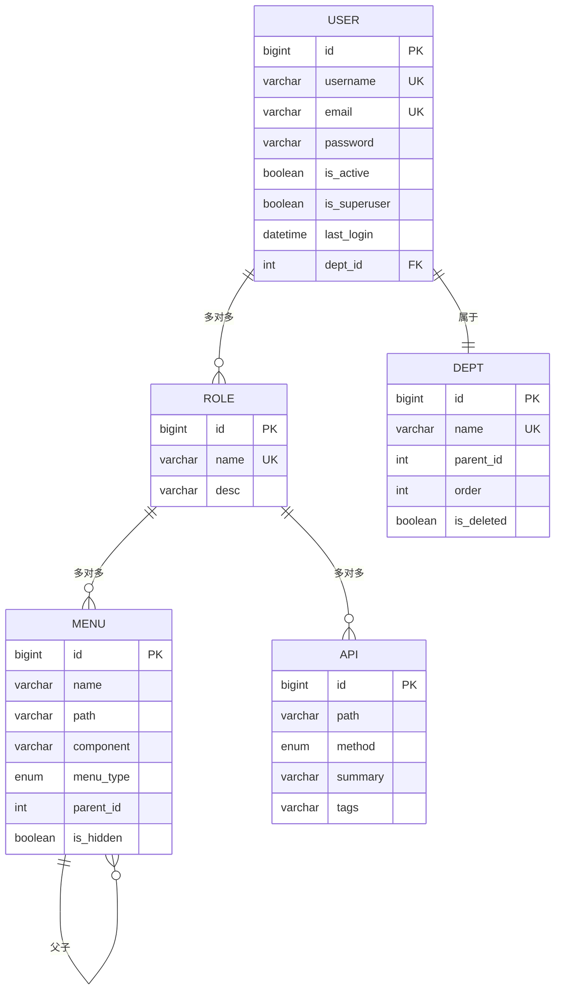

# 数据模型设计

<cite>
**本文档引用的文件**
- [base.py](file://app/models/base.py)
- [admin.py](file://app/models/admin.py)
- [enums.py](file://app/models/enums.py)
- [users.py](file://app/schemas/users.py)
- [roles.py](file://app/schemas/roles.py)
- [depts.py](file://app/schemas/depts.py)
- [menus.py](file://app/schemas/menus.py)
- [apis.py](file://app/schemas/apis.py)
</cite>

## 目录
1. [简介](#简介)
2. [基础模型设计](#基础模型设计)
3. [核心实体模型](#核心实体模型)
4. [枚举类型定义](#枚举类型定义)
5. [Pydantic Schemas 设计](#pydantic-schemas-设计)
6. [模型关系图](#模型关系图)
7. [总结](#总结)

## 简介
本文档详细说明了基于 Tortoise-ORM 的数据模型设计，涵盖 `User`、`Role`、`Dept`、`Menu` 和 `Api` 五个核心实体。文档分析了基类 `BaseModel` 提供的通用字段（如 `id`、`created_at`、`updated_at`），阐述了各模型的字段定义、数据类型、约束条件及表间关系（包括外键和多对多关系）。同时，解释了 `enums.py` 中定义的枚举类型及其在模型中的应用，并说明了 Pydantic Schemas 如何用于请求验证和响应序列化，确保数据完整性。

## 基础模型设计

`models.base.BaseModel` 是所有实体模型的基类，提供了通用的字段和方法，确保代码的复用性和一致性。

- **BaseModel**: 定义了 `id` 字段作为主键，类型为 `BigIntField`，并自动创建索引。
- **TimestampMixin**: 混入类，提供 `created_at` 和 `updated_at` 时间戳字段，分别记录创建时间和最后更新时间。
- **to_dict() 方法**: 提供了将模型实例转换为字典的方法，支持排除字段和包含多对多关系数据。

**Section sources**
- [base.py](file://app/models/base.py#L1-L62)

## 核心实体模型

### User 模型
`User` 模型表示系统用户，包含用户的基本信息、认证信息和权限关联。

- **字段**:
  - `username`: 用户名，唯一且带索引。
  - `email`: 邮箱，唯一且带索引。
  - `password`: 密码，加密存储。
  - `is_active`: 是否激活，用于控制账户状态。
  - `is_superuser`: 是否为超级管理员。
  - `last_login`: 最后登录时间。
  - `dept_id`: 外键，关联 `Dept` 模型，表示所属部门。
  - `roles`: 多对多关系，关联 `Role` 模型，表示用户拥有的角色。

**Section sources**
- [admin.py](file://app/models/admin.py#L4-L22)

### Role 模型
`Role` 模型表示系统角色，用于权限管理。

- **字段**:
  - `name`: 角色名称，唯一且带索引。
  - `desc`: 角色描述。
  - `menus`: 多对多关系，关联 `Menu` 模型，表示该角色可访问的菜单。
  - `apis`: 多对多关系，关联 `Api` 模型，表示该角色可调用的 API。

**Section sources**
- [admin.py](file://app/models/admin.py#L24-L32)

### Dept 模型
`Dept` 模型表示组织部门，支持树形结构。

- **字段**:
  - `name`: 部门名称，唯一且带索引。
  - `desc`: 备注信息。
  - `parent_id`: 父部门 ID，用于构建部门层级。
  - `order`: 排序字段。
  - `is_deleted`: 软删除标记。

**Section sources**
- [admin.py](file://app/models/admin.py#L50-L59)

### Menu 模型
`Menu` 模型表示系统菜单，用于前端导航。

- **字段**:
  - `name`: 菜单名称。
  - `path`: 菜单路径，对应前端路由。
  - `component`: 前端组件路径。
  - `menu_type`: 菜单类型，使用 `MenuType` 枚举。
  - `parent_id`: 父菜单 ID，用于构建菜单树。
  - `is_hidden`: 是否在菜单中隐藏。

**Section sources**
- [admin.py](file://app/models/admin.py#L34-L48)

### Api 模型
`Api` 模型表示系统 API 接口，用于权限控制。

- **字段**:
  - `path`: API 路径。
  - `method`: 请求方法，使用 `MethodType` 枚举。
  - `summary`: API 简介。
  - `tags`: API 标签，用于分类。

**Section sources**
- [admin.py](file://app/models/admin.py#L34-L48)

## 枚举类型定义

`models.enums` 模块定义了系统中使用的枚举类型，确保数据的一致性和可维护性。

- **MethodType**: 表示 HTTP 请求方法，包括 `GET`、`POST`、`PUT`、`DELETE`、`PATCH`。
- **MenuType**: 表示菜单类型，包括 `catalog`（目录）和 `menu`（菜单）。
- **EnumBase**: 所有枚举的基类，提供获取枚举值和名称的类方法。

**Section sources**
- [enums.py](file://app/models/enums.py#L1-L20)

## Pydantic Schemas 设计

Pydantic Schemas 用于 API 请求和响应的数据验证与序列化。

### 用户相关 Schemas
- **UserCreate**: 用于创建用户的请求体，包含 `email`、`username`、`password` 和 `role_ids`。
- **UserUpdate**: 用于更新用户信息，包含 `id` 和可选字段。
- **BaseUser**: 用于响应返回的用户信息，包含所有字段。

**Section sources**
- [users.py](file://app/schemas/users.py#L1-L44)

### 角色相关 Schemas
- **RoleCreate**: 用于创建角色，包含 `name` 和 `desc`。
- **RoleUpdate**: 用于更新角色信息。
- **RoleUpdateMenusApis**: 用于更新角色的菜单和 API 权限。

**Section sources**
- [roles.py](file://app/schemas/roles.py#L1-L32)

### 其他 Schemas
- **DeptCreate/DeptUpdate**: 部门的创建和更新 Schema。
- **MenuCreate/MenuUpdate**: 菜单的创建和更新 Schema。
- **ApiCreate/ApiUpdate**: API 的创建和更新 Schema。

**Section sources**
- [depts.py](file://app/schemas/depts.py#L1-L18)
- [menus.py](file://app/schemas/menus.py#L1-L52)
- [apis.py](file://app/schemas/apis.py#L1-L17)

## 模型关系图

**Diagram sources**
- [admin.py](file://app/models/admin.py#L4-L89)

## 总结
本系统通过 Tortoise-ORM 实现了清晰的数据模型设计，利用基类和混入类实现了字段复用，通过多对多关系实现了灵活的权限控制。枚举类型确保了关键字段的数据一致性，Pydantic Schemas 保证了 API 层的数据验证和序列化。整体设计具有良好的可扩展性和可维护性。