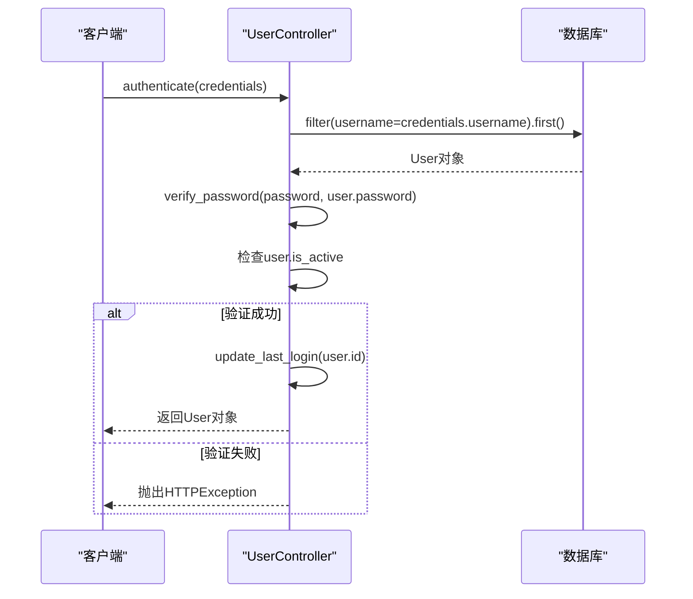

# 用户模型

<cite>
**本文档引用的文件**  
- [admin.py](file://app/models/admin.py)
- [users.py](file://app/schemas/users.py)
- [user.py](file://app/controllers/user.py)
- [enums.py](file://app/models/enums.py)
</cite>

## 目录
1. [简介](#简介)
2. [核心字段详解](#核心字段详解)
3. [关系字段分析](#关系字段分析)
4. [last_login 更新逻辑](#last_login-更新逻辑)
5. [枚举类型使用](#枚举类型使用)
6. [数据访问模式](#数据访问模式)
7. [Pydantic 模型协同](#pydantic-模型协同)

## 简介
`User` 模型是系统权限管理的核心实体，定义了用户的基本信息、状态、权限角色及所属部门。该模型基于 Tortoise ORM 实现，继承自 `BaseModel` 和 `TimestampMixin`，具备创建和更新时间戳自动管理能力。模型位于 `app/models/admin.py`，与控制器、Schema 共同构成完整的用户管理模块。

## 核心字段详解

`User` 模型包含以下核心字段，定义了用户的身份、状态和联系方式：

- **username**: `CharField` 类型，最大长度 20，唯一性约束（`unique=True`），建立数据库索引（`index=True`），用于用户登录和系统内唯一标识。
- **email**: `CharField` 类型，最大长度 255，唯一性约束，建立索引，用于用户通信和身份验证。
- **is_active**: `BooleanField` 类型，默认值 `True`，建立索引，表示用户账户是否被激活。`False` 值表示账户被禁用，无法登录。
- **is_superuser**: `BooleanField` 类型，默认值 `False`，建立索引，表示用户是否为超级管理员。超级管理员拥有系统所有权限，不受角色权限限制。
- **password**: `CharField` 类型，最大长度 128，存储密码哈希值，不为空，由 `get_password_hash` 函数加密后存储。

这些字段共同构成了用户的身份和权限基础，其唯一性和索引设置保证了数据的完整性和查询效率。

**Section sources**
- [admin.py](file://app/models/admin.py#L8-L21)

## 关系字段分析

### 多对多关系：`roles`
`roles` 字段通过 `fields.ManyToManyField("models.Role", related_name="user_roles")` 实现与 `Role` 模型的多对多关联。一个用户可以拥有多个角色，一个角色也可以被多个用户拥有。`related_name="user_roles"` 允许通过 `Role` 实例反向访问其关联的用户列表。

权限校验时，系统通过用户关联的角色，获取其拥有的菜单（`menus`）和 API 接口（`apis`）权限。`user_controller.update_roles()` 方法负责更新用户的角色集合，先清除现有角色，再逐一添加新角色。

### 外键关系：`dept_id`
`dept_id` 字段为 `fields.IntField(null=True)`，表示用户与 `Dept`（部门）模型的外键关联。它存储部门的主键 ID，`null=True` 表示用户可以不属于任何部门。该字段建立索引以优化按部门查询用户的性能。

**Section sources**
- [admin.py](file://app/models/admin.py#L19-L20)
- [user.py](file://app/controllers/user.py#L35-L43)

## last_login 更新逻辑

`last_login` 字段记录用户最后一次成功登录的时间，类型为 `DatetimeField`，可为空，建立索引。

该字段的更新由 `UserController` 中的 `update_last_login(id: int)` 方法负责。此方法在用户成功通过身份验证后被调用：
1.  根据用户 ID 查询用户对象。
2.  将 `user.last_login` 设置为当前时间 `datetime.now()`。
3.  调用 `await user.save()` 持久化更新到数据库。

此逻辑确保了 `last_login` 的准确性和实时性，为用户活跃度分析提供数据支持。

**Section sources**
- [admin.py](file://app/models/admin.py#L18)
- [user.py](file://app/controllers/user.py#L28-L32)

## 枚举类型使用

系统通过 `app/models/enums.py` 定义枚举类型，实现数据的标准化和类型安全。虽然 `User` 模型本身未直接使用枚举，但其关联的 `Menu` 模型使用了 `MenuType` 枚举，而 `Api` 模型使用了 `MethodType` 枚举。

`MethodType` 继承自 `StrEnum`，定义了标准的 HTTP 请求方法：
```python
class MethodType(StrEnum):
    GET = "GET"
    POST = "POST"
    PUT = "PUT"
    DELETE = "DELETE"
    PATCH = "PATCH"
```

这种设计确保了 API 路径和方法的组合是预定义且一致的，避免了字符串拼写错误，并便于前端进行权限匹配。

**Section sources**
- [enums.py](file://app/models/enums.py#L12-L18)

## 数据访问模式

用户模型的典型数据访问模式由 `UserController` 类封装，遵循 CRUD（创建、读取、更新、删除）原则：

- **创建用户**: `create_user(obj_in: UserCreate)` 方法接收 `UserCreate` Schema，先对密码进行哈希处理，然后调用基类的 `create` 方法将用户数据存入数据库。
- **查询用户**: 提供 `get_by_email(email)` 和 `get_by_username(username)` 方法，通过唯一字段快速检索用户对象。
- **权限校验**: `authenticate(credentials)` 方法是登录的核心。它根据用户名查找用户，验证密码（`verify_password`），并检查 `is_active` 状态，任何一步失败都会抛出相应的 `HTTPException`。



**Diagram sources**
- [user.py](file://app/controllers/user.py#L34-L53)

**Section sources**
- [user.py](file://app/controllers/user.py#L20-L53)

## Pydantic 模型协同

`app/schemas/users.py` 定义了与 `User` 数据库模型协同工作的 Pydantic 模型，实现数据的输入验证和安全输出。

- **UserCreate**: 用于用户创建请求。它定义了必填字段（`email`, `username`, `password`）和可选字段（`is_active`, `is_superuser`, `role_ids`, `dept_id`）。`create_dict()` 方法将对象转换为字典，排除未设置的字段和 `role_ids`，以便安全地传递给 ORM 创建方法。
- **UserUpdate**: 用于用户更新请求，包含 `id` 字段以标识目标用户。
- **BaseUser**: 作为响应模型的基础，定义了返回给前端的用户信息，包括 `id`, `email`, `username`, `is_active`, `is_superuser`, 时间戳和 `roles` 列表。`roles` 字段被序列化为列表，便于前端展示。

这种分离确保了：
1.  **输入安全**：`UserCreate` 对输入数据进行严格验证（如邮箱格式）。
2.  **输出安全**：`BaseUser` 不包含敏感的 `password` 字段，防止信息泄露。
3.  **职责分离**：数据库模型关注数据存储，Pydantic 模型关注 API 接口的数据格式。

**Section sources**
- [users.py](file://app/schemas/users.py#L1-L44)
- [user.py](file://app/controllers/user.py#L10-L11)