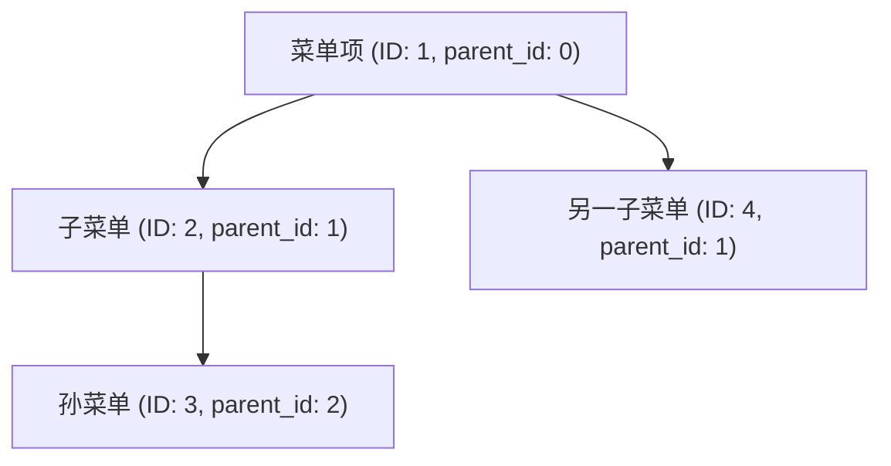
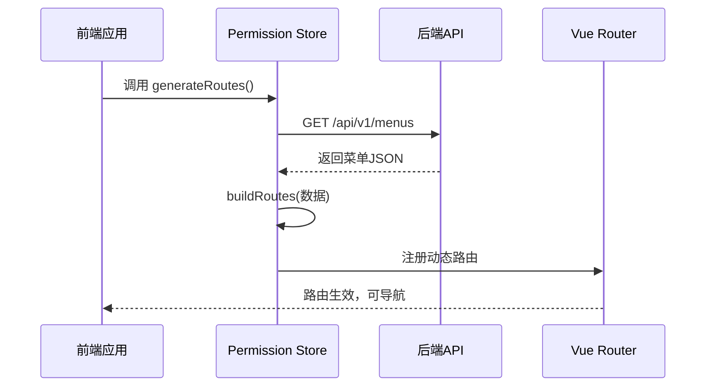

# 菜单模型

<cite>
**本文档引用的文件**  
- [app/models/admin.py](file://app/models/admin.py)
- [app/schemas/menus.py](file://app/schemas/menus.py)
- [app/models/enums.py](file://app/models/enums.py)
- [web/src/store/modules/permission/index.js](file://web/src/store/modules/permission/index.js)
</cite>

## 目录
1. [介绍](#介绍)
2. [核心字段详解](#核心字段详解)
3. [菜单类型枚举分析](#菜单类型枚举分析)
4. [树形结构与层级嵌套机制](#树形结构与层级嵌套机制)
5. [前端路由动态生成流程](#前端路由动态生成流程)
6. [完整菜单树JSON示例](#完整菜单树json示例)

## 介绍
菜单模型（Menu）是系统权限与导航体系的核心组成部分，负责定义前端路由结构、UI渲染逻辑以及用户可见性控制。该模型通过后端API提供数据支持，前端根据返回的菜单数据动态构建路由和侧边栏。本文档将深入解析其字段设计、数据流转机制及前后端协作方式。

## 核心字段详解

### 前端路由配置字段
- `name`：菜单名称，用于显示在侧边栏和面包屑中。
- `path`：路由路径，对应前端Vue Router中的路径配置。
- `component`：组件路径，指示Vue加载哪个视图组件。

### UI渲染相关字段
- `menu_type`：菜单类型，决定该节点是目录、菜单项还是外链，影响UI展示形式。
- `icon`：图标标识，用于在侧边栏中显示对应图标。

### 结构与排序字段
- `parent_id`：父级菜单ID，用于构建无限层级的树形结构。
- `order`：排序权重，数值越小优先级越高，在同级菜单中按此值升序排列。

### 控制与状态字段
- `is_hidden`：是否隐藏，控制菜单项是否在侧边栏中可见。
- `keepalive`：是否启用Vue组件缓存，影响页面切换时的组件状态保持。

**Section sources**
- [app/models/admin.py](file://app/models/admin.py#L60-L80)
- [app/schemas/menus.py](file://app/schemas/menus.py#L10-L50)

## 菜单类型枚举分析

`menu_type` 字段依赖于 `enums.py` 中定义的 `MenuType` 枚举类，确保菜单类型的合法性与一致性。当前支持两种类型：

```python
class MenuType(StrEnum):
    CATALOG = "catalog"  # 目录
    MENU = "menu"      # 菜单
```

- **目录（catalog）**：作为容器存在，不直接绑定页面组件，仅用于组织子菜单。
- **菜单（menu）**：代表一个可点击的导航项，通常关联具体页面组件。

该枚举继承自 `StrEnum`，允许直接使用字符串值进行比较和序列化，便于前后端交互。

**Section sources**
- [app/schemas/menus.py](file://app/schemas/menus.py#L4-L9)
- [app/models/enums.py](file://app/models/enums.py#L1-L20)

## 树形结构与层级嵌套机制

菜单的无限层级嵌套通过 `parent_id` 字段实现。每个菜单项记录其父节点ID，根节点的 `parent_id` 为0。系统通过递归查询或一次性拉平数据后在内存中构建树形结构。

数据库层面采用简单父子关系模型，无需闭包表或路径枚举等复杂设计，适用于中小型系统。查询时通过 `parent_id` 进行过滤，前端递归组装成嵌套JSON结构。



**Diagram sources**
- [app/models/admin.py](file://app/models/admin.py#L75)
- [app/schemas/menus.py](file://app/schemas/menus.py#L18)

## 前端路由动态生成流程

前端通过调用 `/api/v1/menus` 接口获取当前用户有权访问的菜单列表，数据结构遵循 `BaseMenu` 模型定义。获取后，在 `store/modules/permission/index.js` 中执行 `buildRoutes` 函数，将其转换为Vue Router可识别的路由格式。

关键步骤如下：
1. 发起 `getUserMenu()` 请求获取菜单数据。
2. 遍历菜单列表，构建路由对象。
3. 若存在子菜单，则递归处理 `children`。
4. 若无子菜单，则创建默认子路由指向具体组件。
5. 将生成的路由注入到全局路由系统中。



**Diagram sources**
- [web/src/store/modules/permission/index.js](file://web/src/store/modules/permission/index.js#L15-L60)
- [app/schemas/menus.py](file://app/schemas/menus.py#L10-L30)

## 完整菜单树JSON示例

以下是一个典型的菜单树结构示例，展示了多层级嵌套、不同类型菜单及关键属性的应用：

```json
[
  {
    "id": 1,
    "name": "系统管理",
    "path": "/system",
    "component": "Layout",
    "menu_type": "catalog",
    "icon": "ph:gear-bold",
    "order": 1,
    "parent_id": 0,
    "is_hidden": false,
    "keepalive": true,
    "children": [
      {
        "id": 2,
        "name": "用户管理",
        "path": "/system/user",
        "component": "/system/user",
        "menu_type": "menu",
        "icon": "ph:user-list-bold",
        "order": 1,
        "parent_id": 1,
        "is_hidden": false,
        "keepalive": true
      },
      {
        "id": 3,
        "name": "角色管理",
        "path": "/system/role",
        "component": "/system/role",
        "menu_type": "menu",
        "icon": "ph:users-bold",
        "order": 2,
        "parent_id": 1,
        "is_hidden": false,
        "keepalive": true
      }
    ]
  }
]
```

此结构可被前端直接用于渲染侧边栏和生成路由。

**Section sources**
- [app/schemas/menus.py](file://app/schemas/menus.py#L10-L30)
- [web/src/store/modules/permission/index.js](file://web/src/store/modules/permission/index.js#L15-L60)