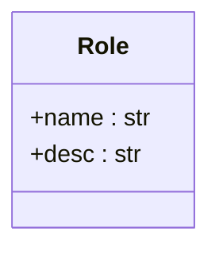
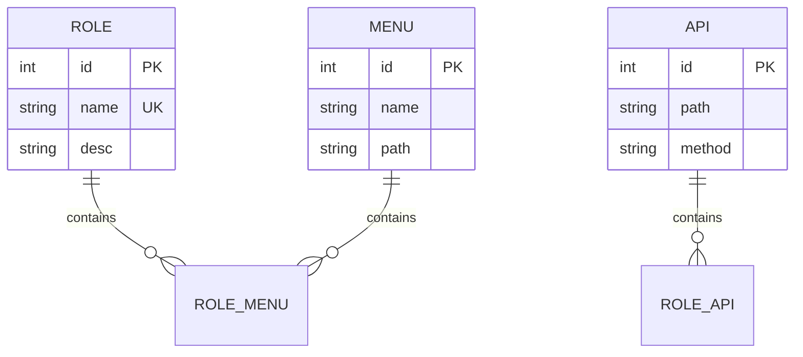
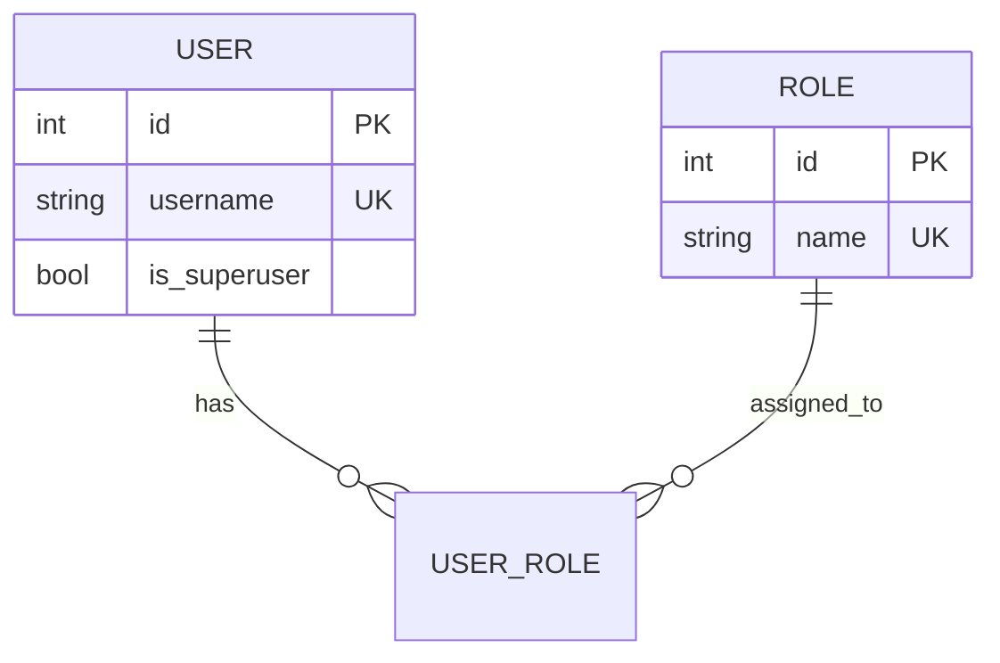
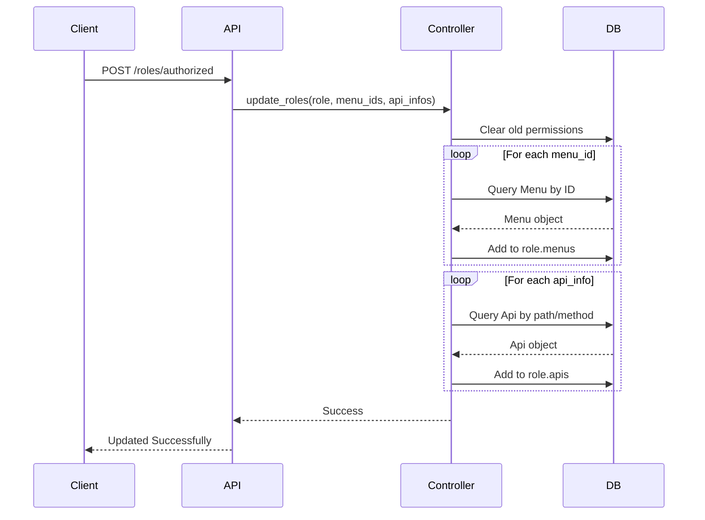
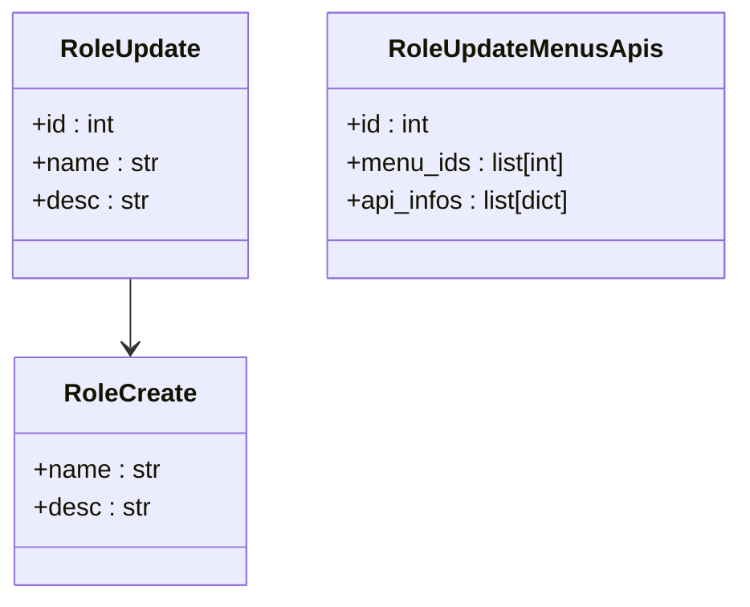

# 角色模型

<cite>
**本文档引用的文件**  
- [roles.py](file://app/schemas/roles.py)
- [admin.py](file://app/models/admin.py)
- [role.py](file://app/controllers/role.py)
- [roles.py](file://app/api/v1/roles/roles.py)
</cite>

## 目录
1. [简介](#简介)
2. [核心字段设计](#核心字段设计)
3. [多对多关系解析](#多对多关系解析)
4. [角色与用户关联](#角色与用户关联)
5. [权限分配与校验流程](#权限分配与校验流程)
6. [Schema 接口契约](#schema-接口契约)
7. [代码示例](#代码示例)
8. [总结](#总结)

## 简介
本系统基于 FastAPI 与 Tortoise ORM 实现了基于角色的访问控制（RBAC）机制。`Role` 模型是权限体系的核心，通过与 `Menu` 和 `Api` 模型建立多对多关系，实现细粒度的权限管理。本文档深入解析 `Role` 模型的设计原理、字段约束、关联逻辑及其实现方式。

**Section sources**
- [admin.py](file://app/models/admin.py#L15-L25)

## 核心字段设计
`Role` 模型定义了两个核心字段：`name` 和 `desc`，分别表示角色名称和描述。

- **name**: 字符串类型，最大长度为 20，唯一且带索引，用于标识角色的唯一性。
- **desc**: 字符串类型，最大长度为 500，可为空，用于描述角色的职责或用途。

这些字段在数据库层面通过 `CharField` 进行约束，并在应用层通过 Pydantic Schema 进行输入验证，确保数据完整性。

**Diagram sources**
- [admin.py](file://app/models/admin.py#L16-L17)

**Section sources**
- [admin.py](file://app/models/admin.py#L16-L17)
- [roles.py](file://app/schemas/roles.py#L10-L14)

## 多对多关系解析
`Role` 模型通过两个 `ManyToManyField` 字段与菜单和 API 接口建立多对多关联：

- **menus**: 关联 `Menu` 模型，`related_name="role_menus"`，表示一个角色可以拥有多个菜单权限。
- **apis**: 关联 `Api` 模型，`related_name="role_apis"`，表示一个角色可以访问多个 API 接口。

这种设计支持灵活的权限分配，允许动态地为角色添加或移除菜单和接口权限，满足 RBAC 的核心需求。

**Diagram sources**
- [admin.py](file://app/models/admin.py#L18-L19)

**Section sources**
- [admin.py](file://app/models/admin.py#L18-L19)

## 角色与用户关联
`User` 模型通过 `roles = fields.ManyToManyField("models.Role", related_name="user_roles")` 与 `Role` 建立多对多关系。这意味着一个用户可以拥有多个角色，一个角色也可以被多个用户拥有。

此反向关联使得权限继承成为可能：用户通过其所属角色自动获得相应的菜单和 API 权限，简化了权限管理逻辑。

**Diagram sources**
- [admin.py](file://app/models/admin.py#L5-L6)

**Section sources**
- [admin.py](file://app/models/admin.py#L5-L6)

## 权限分配与校验流程
权限的分配和校验通过控制器和 API 路由协同完成。

### 权限分配流程
1. 调用 `/roles/authorized` POST 接口，传入 `RoleUpdateMenusApis` 数据。
2. 控制器 `role_controller.update_roles()` 方法先清空角色现有权限。
3. 根据 `menu_ids` 和 `api_infos` 重新关联对应的 `Menu` 和 `Api` 对象。

### 权限校验流程
1. 调用 `/roles/authorized` GET 接口，传入角色 ID。
2. 使用 `to_dict(m2m=True)` 方法序列化角色对象，包含其关联的菜单和 API 数据。
3. 前端或中间件可据此判断用户是否具备访问特定资源的权限。

**Diagram sources**
- [role.py](file://app/controllers/role.py#L15-L25)
- [roles.py](file://app/api/v1/roles/roles.py#L65-L73)

**Section sources**
- [role.py](file://app/controllers/role.py#L15-L25)
- [roles.py](file://app/api/v1/roles/roles.py#L65-L73)

## Schema 接口契约
`schemas/roles.py` 定义了角色操作的接口契约，确保前后端数据交互的一致性和有效性。

- **RoleCreate**: 创建角色时的输入模型，包含 `name` 和 `desc`。
- **RoleUpdate**: 更新角色基本信息的模型，包含 `id`、`name` 和 `desc`。
- **RoleUpdateMenusApis**: 专门用于更新角色权限的模型，包含 `id`、`menu_ids`（菜单 ID 列表）和 `api_infos`（API 信息字典列表）。

这些 Schema 通过 Pydantic 的 `Field` 提供示例值和验证逻辑，增强了 API 的可读性和健壮性。

**Diagram sources**
- [roles.py](file://app/schemas/roles.py#L16-L32)

**Section sources**
- [roles.py](file://app/schemas/roles.py#L16-L32)

## 代码示例
以下为关键操作的代码路径示例：

- **创建角色**: `[create_role](file://app/api/v1/roles/roles.py#L45-L50)`
- **更新角色权限**: `[update_role_authorized](file://app/api/v1/roles/roles.py#L65-L73)`
- **权限更新逻辑**: `[update_roles](file://app/controllers/role.py#L15-L25)`

这些函数共同构成了角色权限管理的核心流程，确保了数据一致性与操作原子性。

**Section sources**
- [roles.py](file://app/api/v1/roles/roles.py#L45-L50)
- [roles.py](file://app/api/v1/roles/roles.py#L65-L73)
- [role.py](file://app/controllers/role.py#L15-L25)

## 总结
`Role` 模型作为 RBAC 权限体系的核心，通过精心设计的字段和多对多关系，实现了灵活、可扩展的权限控制。结合 Pydantic Schema 和 Tortoise ORM，系统在数据验证、持久化和查询方面表现出色。通过清晰的 API 接口和控制器逻辑，角色的创建、权限分配与校验得以高效执行，为系统的安全性和可维护性提供了坚实基础。