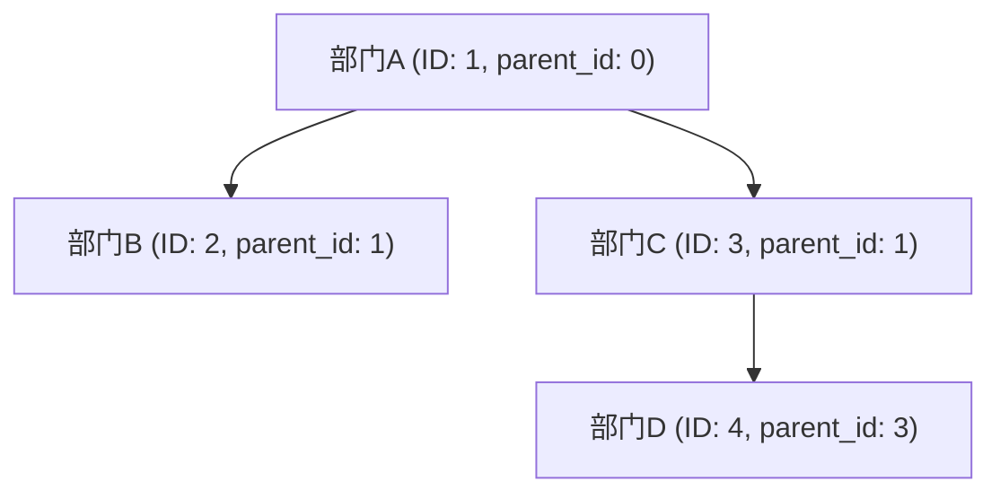
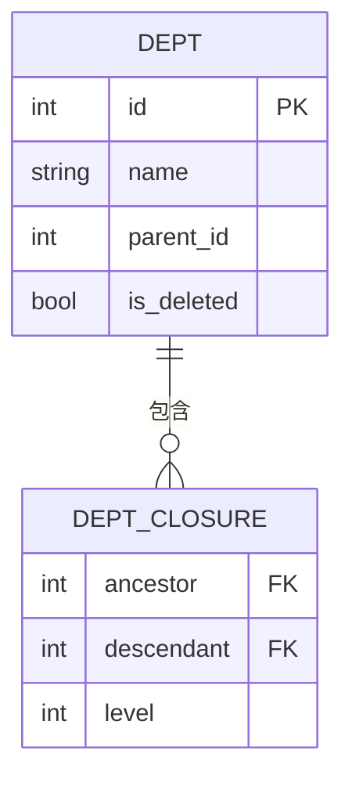
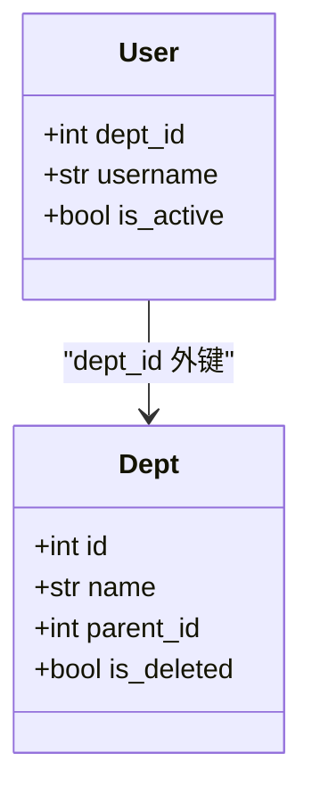

# 部门模型

<cite>
**本文档引用的文件**  
- [admin.py](file://app/models/admin.py)
- [dept.py](file://app/controllers/dept.py)
- [depts.py](file://app/schemas/depts.py)
</cite>

## 目录
1. [简介](#简介)
2. [核心字段说明](#核心字段说明)
3. [树形结构实现](#树形结构实现)
4. [软删除机制](#软删除机制)
5. [闭包表设计（DeptClosure）](#闭包表设计deptclosure)
6. [与用户模型的关联](#与用户模型的关联)
7. [查询示例：获取所有子部门](#查询示例获取所有子部门)
8. [总结](#总结)

## 简介
`Dept` 模型用于管理系统中的部门组织结构。该模型支持树形层级关系，通过闭包表（`DeptClosure`）实现高效的祖先-后代关系查询，并结合软删除机制保障数据安全。同时，部门与用户通过 `dept_id` 字段建立归属关系，支撑权限与组织架构管理。

**Section sources**
- [admin.py](file://app/models/admin.py#L61-L69)

## 核心字段说明
`Dept` 模型包含以下关键字段：

- **name**: 部门名称，唯一且带索引，最大长度为20字符。
- **desc**: 备注信息，可为空，最大长度500字符。
- **parent_id**: 父部门ID，用于构建树形结构，默认值为0表示根节点。
- **order**: 排序字段，整型，默认为0，用于控制显示顺序。
- **is_deleted**: 软删除标记，布尔类型，默认为False。

这些字段共同定义了部门的基本属性和层级关系。

**Section sources**
- [admin.py](file://app/models/admin.py#L61-L69)

## 树形结构实现
`Dept` 模型通过 `parent_id` 字段实现类似菜单模型的树形结构。每个部门记录其父级ID，形成父子关系链。顶级部门的 `parent_id` 为0。

系统通过递归方式构建完整的部门树结构。控制器中的 `get_dept_tree` 方法会：
1. 查询所有未被删除的部门并按 `order` 排序；
2. 使用递归函数 `build_tree(parent_id)` 构建嵌套的树形结构；
3. 从 `parent_id=0` 开始逐层展开子节点。

这种结构支持无限层级的组织架构。



**Diagram sources**
- [dept.py](file://app/controllers/dept.py#L10-L35)

## 软删除机制
`is_deleted` 字段作为软删除标记，用于标识部门是否已被逻辑删除。当删除一个部门时，系统不会从数据库中物理移除该记录，而是将其 `is_deleted` 字段设置为 `True`。

这种方式的优点包括：
- 可恢复误删数据；
- 保留历史关联记录（如审计日志、用户归属等）；
- 避免外键约束冲突。

在查询有效部门时，系统始终添加 `is_deleted=False` 的过滤条件。

**Section sources**
- [admin.py](file://app/models/admin.py#L64)
- [dept.py](file://app/controllers/dept.py#L12)

## 闭包表设计（DeptClosure）
为解决传统递归查询性能低下的问题，系统采用**闭包表（Closure Table）** 设计，由 `DeptClosure` 模型实现。

### 模型结构
`DeptClosure` 包含三个字段：
- **ancestor**: 祖先部门ID
- **descendant**: 后代部门ID
- **level**: 两者之间的层级距离（0表示自身）

每条记录表示一个“祖先→后代”的路径关系。例如，若部门A是部门D的祖父，则存在：
- (A, D, 2)
- (A, B, 1)
- (B, D, 1)
- (A, A, 0), (B, B, 0) 等自引用

### 优势
- 查询任意部门的所有子孙或祖先仅需一次简单SQL；
- 支持按层级过滤（如直接子级 level=1）；
- 性能稳定，不受树深度影响。

### 维护机制
每当创建或更新部门的父级关系时，系统自动调用 `update_dept_closure` 方法重建相关路径。



**Diagram sources**
- [admin.py](file://app/models/admin.py#L72-L75)
- [dept.py](file://app/controllers/dept.py#L37-L55)

## 与用户模型的关联
`User` 模型通过 `dept_id` 字段与 `Dept` 建立单向外键关联，表示用户的所属部门。

- `dept_id` 为可选字段（`null=True`），允许用户暂无部门归属；
- 查询用户列表时，可通过 `dept_id` 过滤特定部门下的用户；
- 展示用户信息时，可关联查询部门名称用于展示。

此设计实现了组织架构与人员管理的解耦与灵活关联。



**Diagram sources**
- [admin.py](file://app/models/admin.py#L8-L21)
- [admin.py](file://app/models/admin.py#L61-L69)

## 查询示例：获取所有子部门
使用闭包表查询指定部门（如ID=1）的所有子部门（含多级后代）的SQL示例如下：

```sql
SELECT d.*
FROM dept d
JOIN dept_closure dc ON d.id = dc.descendant
WHERE dc.ancestor = 1
  AND d.is_deleted = false
  AND dc.descendant != dc.ancestor  -- 排除自身
ORDER BY d.order;
```

此查询高效地返回ID为1的部门的所有下级部门，无论嵌套多少层级。

**Section sources**
- [dept.py](file://app/controllers/dept.py#L12)
- [admin.py](file://app/models/admin.py#L64)

## 总结
`Dept` 模型通过标准字段定义、树形结构设计、软删除机制和闭包表优化，构建了一个高性能、可扩展的部门管理体系。`DeptClosure` 表的引入显著提升了复杂层级查询的效率，而与 `User` 模型的关联则实现了组织架构与人员管理的有效集成。

**Section sources**
- [admin.py](file://app/models/admin.py#L61-L75)
- [dept.py](file://app/controllers/dept.py#L1-L86)