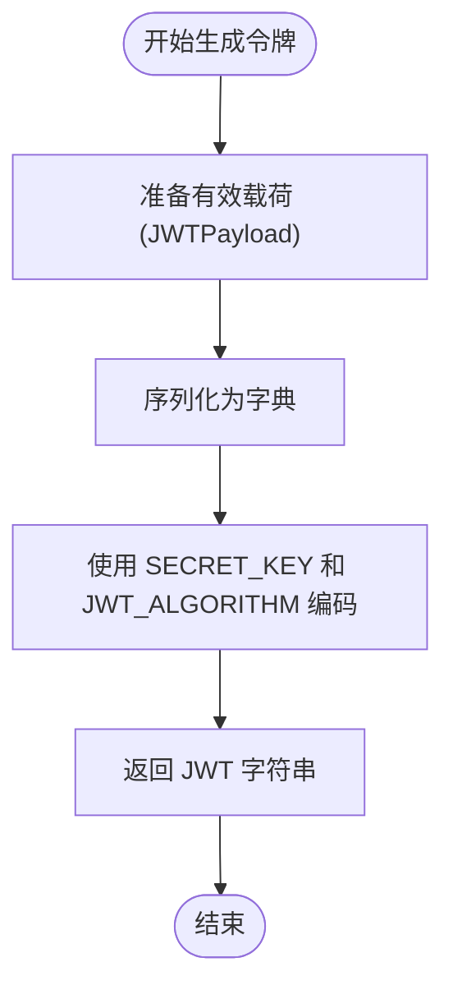
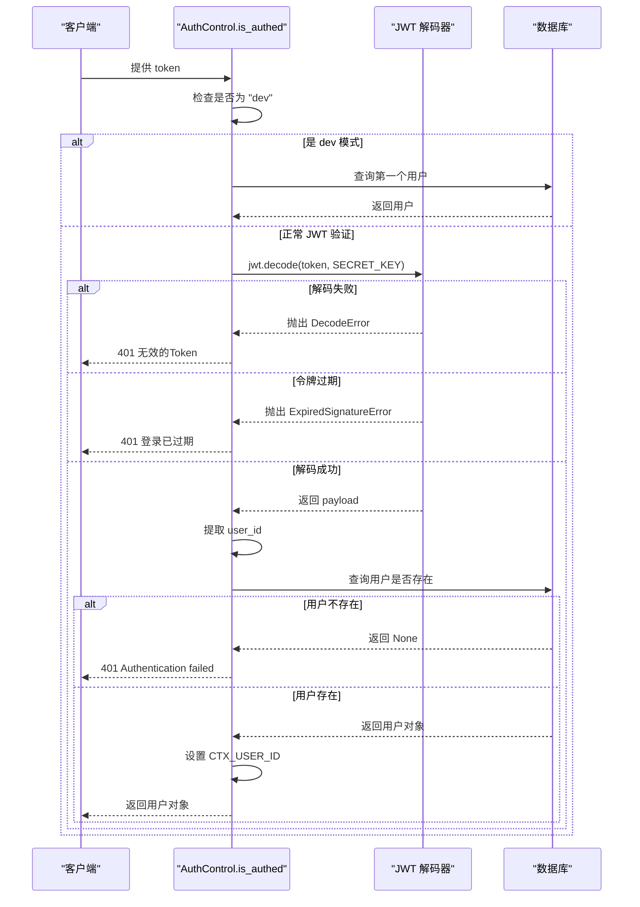
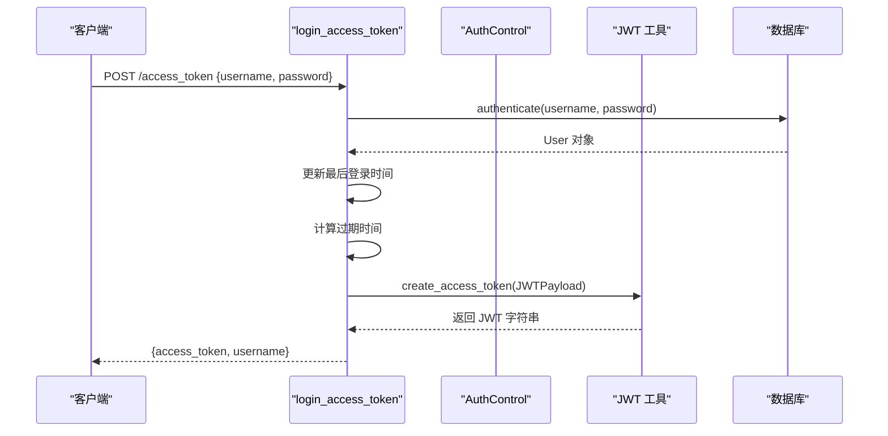

# 认证与权限控制机制

<cite>
**本文档引用的文件**  
- [jwt_utils.py](file://app/utils/jwt_utils.py)
- [dependency.py](file://app/core/dependency.py)
- [base.py](file://app/api/v1/base/base.py)
- [login.py](file://app/schemas/login.py)
</cite>

## 目录
1. [简介](#简介)
2. [JWT 令牌机制](#jwt-令牌机制)
3. [权限校验与依赖注入](#权限校验与依赖注入)
4. [登录与令牌获取流程](#登录与令牌获取流程)
5. [前端认证流程](#前端认证流程)
6. [执行流程图](#执行流程图)
7. [总结](#总结)

## 简介
本系统采用基于 JWT 的无状态认证机制，结合 FastAPI 的依赖注入系统实现细粒度的 RBAC（基于角色的访问控制）权限管理。用户登录后获取访问令牌（Access Token），后续请求通过 Header 携带该令牌进行身份验证和权限校验。

**Section sources**  
- [base.py](file://app/api/v1/base/base.py#L1-L10)

## JWT 令牌机制

### 令牌生成（`create_access_token`）
系统通过 `jwt_utils.py` 中的 `create_access_token` 函数生成 JWT 令牌。该函数接收一个包含用户信息的 `JWTPayload` 对象，将其序列化为字典后，使用预设的密钥（`SECRET_KEY`）和算法（`JWT_ALGORITHM`）进行编码，生成签名的 JWT 字符串。

`JWTPayload` 包含以下字段：
- `user_id`: 用户唯一标识
- `username`: 用户名
- `is_superuser`: 是否为超级管理员
- `exp`: 令牌过期时间戳



**Diagram sources**  
- [jwt_utils.py](file://app/utils/jwt_utils.py#L6-L9)
- [login.py](file://app/schemas/login.py#L15-L20)

**Section sources**  
- [jwt_utils.py](file://app/utils/jwt_utils.py#L1-L10)
- [login.py](file://app/schemas/login.py#L15-L20)

### 令牌验证（`verify_token`）
令牌验证由 `dependency.py` 中的 `AuthControl.is_authed` 方法实现。该方法从请求 Header 中提取 `token`，并执行以下验证流程：
1. 若 `token` 为特殊值 `"dev"`，则自动认证为第一个用户（开发模式）
2. 否则，使用 `jwt.decode` 解码 JWT，验证签名和过期时间
3. 从解码后的 `payload` 中提取 `user_id`
4. 查询数据库确认用户存在
5. 将 `user_id` 存入上下文（`CTX_USER_ID`），供后续逻辑使用

异常处理：
- `jwt.DecodeError`: 抛出 401，提示“无效的Token”
- `jwt.ExpiredSignatureError`: 抛出 401，提示“登录已过期”
- 其他异常：抛出 500，返回异常详情



**Diagram sources**  
- [dependency.py](file://app/core/dependency.py#L10-L30)

**Section sources**  
- [dependency.py](file://app/core/dependency.py#L10-L30)

## 权限校验与依赖注入

### 权限校验机制（`require_permission`）
权限校验由 `PermissionControl.has_permission` 方法实现。该方法依赖于已通过身份验证的用户（通过 `Depends(AuthControl.is_authed)` 注入），并执行以下逻辑：
1. 若用户为超级管理员（`is_superuser`），直接放行
2. 否则，获取当前请求的 `method`（如 GET、POST）和 `path`（如 /api/v1/user）
3. 查询该用户所有角色所关联的 API 权限
4. 构建允许访问的 `(method, path)` 元组集合
5. 检查当前请求是否在允许集合中，若不在则抛出 403 错误

```mermaid
flowchart TD
A([开始权限校验]) --> B{是否为超级管理员?}
B --> |是| C[放行]
B --> |否| D[获取请求 method 和 path]
D --> E[查询用户角色]
E --> F{角色为空?}
F --> |是| G[403 用户未绑定角色]
F --> |否| H[获取角色关联的 API 列表]
H --> I[构建 (method, path) 权限集合]
I --> J{当前请求在集合中?}
J --> |否| K[403 权限拒绝]
J --> |是| L[放行]
C --> M([结束])
G --> M
K --> M
L --> M
```

**Diagram sources**  
- [dependency.py](file://app/core/dependency.py#L33-L48)

**Section sources**  
- [dependency.py](file://app/core/dependency.py#L33-L48)

### 依赖注入使用示例
系统定义了两个常用的依赖项：
- `DependAuth`: 用于身份认证，确保用户已登录
- `DependPermission`: 用于权限校验，确保用户有访问权限

在路由中使用示例如下：
```python
@router.get("/userinfo", dependencies=[DependAuth])
@router.get("/usermenu", dependencies=[DependAuth])
@router.get("/userapi", dependencies=[DependAuth])
@router.post("/update_password", dependencies=[DependAuth])

# 在 v1 路由中，所有模块均需权限校验
v1_router.include_router(users_router, prefix="/user", dependencies=[DependPermission])
v1_router.include_router(roles_router, prefix="/role", dependencies=[DependPermission])
```

**Section sources**  
- [dependency.py](file://app/core/dependency.py#L51-L52)
- [base.py](file://app/api/v1/base/base.py#L39-L93)
- [__init__.py](file://app/api/v1/__init__.py#L2-L20)

## 登录与令牌获取流程

### 登录接口（`/login`）
位于 `base.py` 中的 `/access_token` 接口用于用户登录：
1. 接收 `CredentialsSchema`（包含 `username` 和 `password`）
2. 调用 `user_controller.authenticate` 进行用户认证
3. 更新用户最后登录时间
4. 计算令牌过期时间
5. 构造 `JWTPayload` 并调用 `create_access_token` 生成令牌
6. 返回包含 `access_token` 和 `username` 的 `JWTOut` 对象



**Diagram sources**  
- [base.py](file://app/api/v1/base/base.py#L15-L37)

**Section sources**  
- [base.py](file://app/api/v1/base/base.py#L15-L37)

## 前端认证流程
1. 用户在登录页输入用户名和密码
2. 前端调用 `/api/v1/access_token` 接口获取令牌
3. 前端将令牌存储在本地（如 localStorage 或 cookie）
4. 后续所有请求在 Header 中添加 `Authorization: Bearer <token>`
5. 后端通过 `DependAuth` 或 `DependPermission` 自动验证令牌和权限
6. 若令牌过期，前端需重新登录或调用刷新接口（如实现）

**Section sources**  
- [base.py](file://app/api/v1/base/base.py#L15-L37)
- [dependency.py](file://app/core/dependency.py#L10-L30)

## 执行流程图
```mermaid
flowchart TD
A([用户登录]) --> B[/POST /access_token\n{username, password}/]
B --> C{认证成功?}
C --> |否| D[返回 401]
C --> |是| E[生成 JWT 令牌]
E --> F[返回 access_token]
F --> G[前端存储令牌]
G --> H[后续请求携带 Token]
H --> I[/请求任意受保护接口/]
I --> J{DependAuth 验证}
J --> |无效| K[401 无效Token/已过期]
J --> |有效| L{DependPermission 校验}
L --> |无权限| M[403 权限拒绝]
L --> |有权限| N[执行业务逻辑]
N --> O[返回响应]
```

**Diagram sources**  
- [base.py](file://app/api/v1/base/base.py#L15-L37)
- [dependency.py](file://app/core/dependency.py#L10-L48)

## 总结
本系统通过 `jwt_utils.py` 实现安全的 JWT 令牌生成，通过 `dependency.py` 中的 `AuthControl` 和 `PermissionControl` 类实现身份认证与 RBAC 权限控制，并通过 FastAPI 的依赖注入机制（`DependAuth` 和 `DependPermission`）在路由层面统一管理认证与权限。整个流程清晰、安全且易于维护。