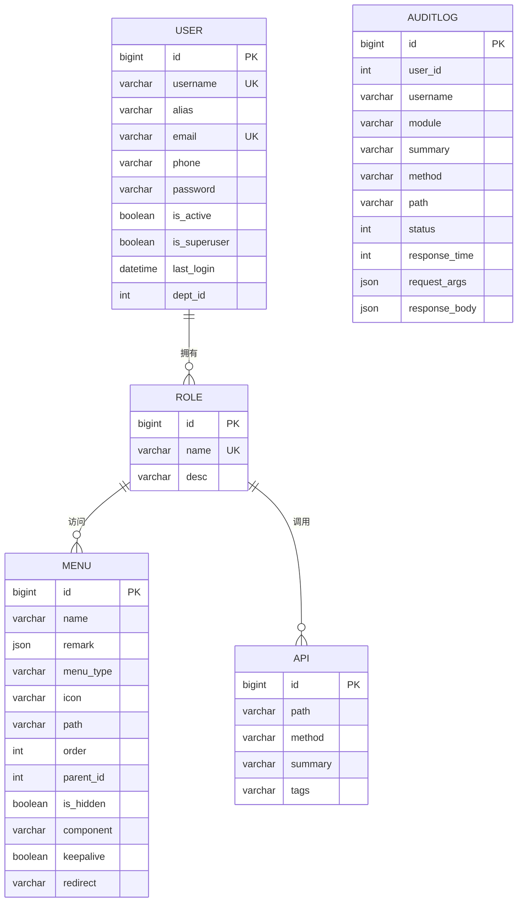

# 数据库设计

<cite>
**Referenced Files in This Document**   
- [admin.py](file://app/models/admin.py)
- [base.py](file://app/models/base.py)
- [enums.py](file://app/models/enums.py)
- [config.py](file://app/settings/config.py)
</cite>

## 目录
1. [简介](#简介)
2. [核心数据实体](#核心数据实体)
3. [实体关系图](#实体关系图)
4. [基类与通用字段](#基类与通用字段)
5. [数据库配置与迁移](#数据库配置与迁移)
6. [模型创建最佳实践](#模型创建最佳实践)
7. [结论](#结论)

## 简介
本文档详细描述了基于 Tortoise-ORM 的后端系统数据库设计。重点分析了 `app/models/admin.py` 中定义的核心数据实体，包括用户（User）、角色（Role）、菜单（Menu）、API 接口（Api）和审计日志（AuditLog）。文档详细列出了各模型的字段、数据类型、约束和默认值，绘制了实体关系图（ERD），并解释了基类提供的通用功能。同时，文档还涵盖了数据库连接配置和迁移策略。

## 核心数据实体

### 用户 (User)
`User` 模型代表系统中的用户账户，是权限管理的基础。

**字段详情**:
- **username**: `CharField`，最大长度 20，唯一，索引，用户名称
- **alias**: `CharField`，最大长度 30，可为空，索引，姓名
- **email**: `CharField`，最大长度 255，唯一，索引，邮箱
- **phone**: `CharField`，最大长度 20，可为空，索引，电话
- **password**: `CharField`，最大长度 128，可为空，密码
- **is_active**: `BooleanField`，默认 `True`，索引，是否激活
- **is_superuser**: `BooleanField`，默认 `False`，索引，是否为超级管理员
- **last_login**: `DatetimeField`，可为空，索引，最后登录时间
- **dept_id**: `IntField`，可为空，索引，部门ID
- **roles**: `ManyToManyField`，关联 `Role` 模型，`user_roles` 关系名

**Section sources**
- [admin.py](file://app/models/admin.py#L8-L21)

### 角色 (Role)
`Role` 模型代表系统中的角色，用于权限的批量分配。

**字段详情**:
- **name**: `CharField`，最大长度 20，唯一，索引，角色名称
- **desc**: `CharField`，最大长度 500，可为空，角色描述
- **menus**: `ManyToManyField`，关联 `Menu` 模型，`role_menus` 关系名
- **apis**: `ManyToManyField`，关联 `Api` 模型，`role_apis` 关系名

**Section sources**
- [admin.py](file://app/models/admin.py#L24-L31)

### 菜单 (Menu)
`Menu` 模型代表前端导航菜单项。

**字段详情**:
- **name**: `CharField`，最大长度 20，索引，菜单名称
- **remark**: `JSONField`，可为空，保留字段
- **menu_type**: `CharEnumField`，枚举类型 `MenuType`，可为空，索引，菜单类型
- **icon**: `CharField`，最大长度 100，可为空，菜单图标
- **path**: `CharField`，最大长度 100，索引，菜单路径
- **order**: `IntField`，默认 `0`，索引，排序
- **parent_id**: `IntField`，默认 `0`，索引，父菜单ID
- **is_hidden**: `BooleanField`，默认 `False`，是否隐藏
- **component**: `CharField`，最大长度 100，组件
- **keepalive**: `BooleanField`，默认 `True`，存活
- **redirect**: `CharField`，最大长度 100，可为空，重定向

**Section sources**
- [admin.py](file://app/models/admin.py#L44-L58)

### API 接口 (Api)
`Api` 模型代表后端 API 接口，用于细粒度权限控制。

**字段详情**:
- **path**: `CharField`，最大长度 100，索引，API路径
- **method**: `CharEnumField`，枚举类型 `MethodType`，索引，请求方法
- **summary**: `CharField`，最大长度 500，索引，请求简介
- **tags**: `CharField`，最大长度 100，索引，API标签

**Section sources**
- [admin.py](file://app/models/admin.py#L34-L41)

### 审计日志 (AuditLog)
`AuditLog` 模型记录用户操作，用于安全审计和问题追踪。

**字段详情**:
- **user_id**: `IntField`，索引，用户ID
- **username**: `CharField`，最大长度 64，默认 `""`，索引，用户名称
- **module**: `CharField`，最大长度 64，默认 `""`，索引，功能模块
- **summary**: `CharField`，最大长度 128，默认 `""`，索引，请求描述
- **method**: `CharField`，最大长度 10，默认 `""`，索引，请求方法
- **path**: `CharField`，最大长度 255，默认 `""`，索引，请求路径
- **status**: `IntField`，默认 `-1`，索引，状态码
- **response_time**: `IntField`，默认 `0`，索引，响应时间(单位ms)
- **request_args**: `JSONField`，可为空，请求参数
- **response_body**: `JSONField`，可为空，返回数据

**Section sources**
- [admin.py](file://app/models/admin.py#L78-L88)

## 实体关系图

**Diagram sources**
- [admin.py](file://app/models/admin.py#L8-L88)

## 基类与通用字段

### BaseModel
`BaseModel` 是所有数据模型的基类，提供了通用的数据库字段和方法。

**核心功能**:
- **id**: `BigIntField`，主键，索引，所有模型的唯一标识。
- **to_dict()**: 异步方法，将模型实例转换为字典。支持将 `DateTimeField` 类型的字段格式化为字符串，并可选择性地包含多对多（M2M）关系的数据。
- **__fetch_m2m_field()**: 私有辅助方法，用于获取 M2M 字段的值。

**Section sources**
- [base.py](file://app/models/base.py#L8-L52)

### TimestampMixin
`TimestampMixin` 是一个混入（Mixin）类，为模型添加了时间戳字段。

**核心字段**:
- **created_at**: `DatetimeField`，`auto_now_add=True`，在记录创建时自动填充当前时间，索引。
- **updated_at**: `DatetimeField`，`auto_now=True`，在记录每次更新时自动更新为当前时间，索引。

所有核心模型（User, Role, Menu, Api, AuditLog）都继承了此混入类，确保了数据的时间可追溯性。

**Section sources**
- [base.py](file://app/models/base.py#L59-L61)

## 数据库配置与迁移

### 数据库连接配置
数据库连接信息在 `app/settings/config.py` 文件中通过 `TORTOISE_ORM` 配置项定义。

**关键配置**:
- **默认连接**: 当前配置使用 SQLite 作为默认数据库，连接字符串指向项目根目录下的 `db.sqlite3` 文件。
- **多数据库支持**: 配置中注释了 MySQL、PostgreSQL、MSSQL/Oracle 和 SQLServer 的连接配置，可根据需要启用。
- **时区设置**: `use_tz=False`，`timezone="Asia/Shanghai"`，使用上海时区进行时间处理。
- **应用映射**: `"models"` 应用包含了 `app.models` 和 `aerich.models` 两个模块。

**Section sources**
- [config.py](file://app/settings/config.py#L27-L71)

### 迁移策略 (Aerich)
系统使用 `Aerich` 作为 Tortoise-ORM 的迁移工具。

**工作流程**:
1.  **初始化**: 首次使用时，运行 `aerich init-db` 命令，根据模型定义创建数据库和表。
2.  **生成迁移**: 当模型发生变更（如添加字段、修改约束）后，运行 `aerich migrate` 命令，Aerich 会检测变更并生成相应的迁移脚本。
3.  **应用迁移**: 运行 `aerich upgrade` 命令，将生成的迁移脚本应用到数据库，使数据库结构与代码模型保持同步。
4.  **回滚迁移**: 如果需要，可以使用 `aerich downgrade` 命令回滚到之前的版本。

这种策略确保了数据库结构的版本化管理，使得团队协作和生产环境部署更加安全和可控。

## 模型创建最佳实践

### 索引优化
- **高频查询字段**: 为 `username`, `email`, `path`, `user_id` 等经常用于查询条件的字段建立索引，可显著提升查询性能。
- **唯一性约束**: 对 `username` 和 `email` 等需要保证唯一性的字段，使用 `unique=True`，这不仅保证了数据完整性，也隐式地创建了唯一索引。
- **复合索引**: 对于经常组合查询的字段（如 `user_id` 和 `created_at`），可以考虑创建复合索引以优化查询。

### 数据完整性
- **枚举类型**: 使用 `CharEnumField`（如 `MethodType`）来限制字段的取值范围，防止无效数据的写入。
- **非空约束**: 对于关键字段，明确设置 `null=True` 或 `null=False`，避免数据歧义。
- **默认值**: 为 `is_active`, `order`, `status` 等字段设置合理的默认值，简化数据插入逻辑。
- **外键与关联**: 通过 `ManyToManyField` 正确定义模型间的多对多关系，由 ORM 自动管理关联表。

### 可维护性
- **继承基类**: 所有模型都应继承 `BaseModel` 和 `TimestampMixin`，以复用通用字段和方法，保持代码一致性。
- **清晰的描述**: 使用 `description` 参数为字段添加中文描述，提高代码的可读性和文档的自动生成能力。
- **模块化**: 将不同的业务模型放在不同的文件中（如 `admin.py`），便于管理和维护。

## 结论
该系统的数据库设计清晰、规范，利用 Tortoise-ORM 的强大功能实现了现代化的异步数据访问。通过 `BaseModel` 和 `TimestampMixin` 提供了良好的基础，核心实体之间的多对多关系设计灵活，满足了权限管理的需求。结合 Aerich 迁移工具，整个数据库的生命周期管理高效且安全。遵循文档中提到的最佳实践，可以确保未来模型的扩展既高效又可靠。