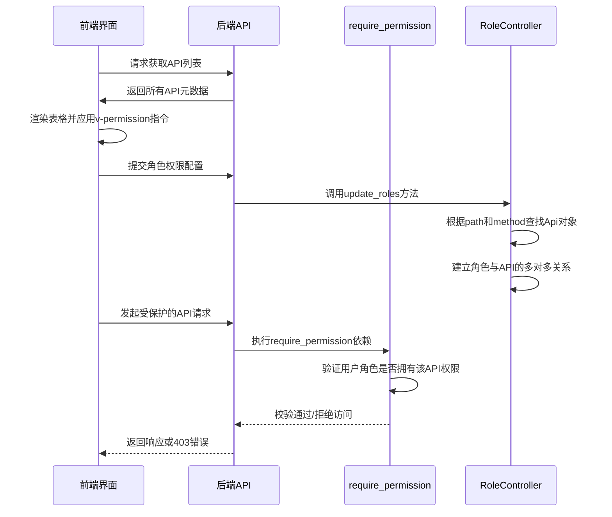

# API管理

<cite>
**本文档引用文件**  
- [index.vue](file://web/src/views/system/api/index.vue)
- [api.py](file://app/controllers/api.py)
- [apis.py](file://app/schemas/apis.py)
- [admin.py](file://app/models/admin.py)
- [role.py](file://app/controllers/role.py)
</cite>

## 目录
1. [简介](#简介)
2. [前端界面功能分析](#前端界面功能分析)
3. [后端API元数据管理](#后端api元数据管理)
4. [API权限控制机制](#api权限控制机制)
5. [完整流程示例：新增API并绑定权限](#完整流程示例新增api并绑定权限)
6. [安全问题与防范措施](#安全问题与防范措施)
7. [结论](#结论)

## 简介
本系统通过前后端协同实现对后端API接口的注册、分类、搜索和权限管理。前端提供可视化操作界面，后端持久化存储API元数据，并通过角色绑定实现细粒度访问控制。核心流程包括API的自动发现、手动维护、权限分配及运行时校验。

## 前端界面功能分析

`web/src/views/system/api/index.vue` 是API管理模块的主视图组件，基于Vue 3和Naive UI构建，提供完整的CRUD操作支持。

该界面主要包含以下功能：
- **API列表展示**：以表格形式展示所有已注册的API，字段包括路径、请求方式、简介和标签。
- **标签分类与搜索过滤**：支持按API路径、简介和Tags进行多条件查询，便于快速定位目标接口。
- **权限绑定操作**：在编辑API时，可将其分配给特定角色，实现权限关联。
- **操作权限控制**：通过 `v-permission` 指令控制“新增”、“刷新”、“编辑”、“删除”等按钮的可见性，确保用户只能执行被授权的操作。

界面通过 `useCRUD` 组合式函数封装了通用的增删改查逻辑，提升了代码复用性和可维护性。

**中文(中文)**
- [index.vue](file://web/src/views/system/api/index.vue#L0-L268)

## 后端API元数据管理

后端通过 `app/controllers/api.py` 中的 `ApiController` 类实现对API元数据的管理，其数据模型定义于 `app/models/admin.py` 的 `Api` 模型中。

### API模型字段说明
| 字段 | 类型 | 描述 | 在权限系统中的作用 |
|------|------|------|------------------|
| `path` | 字符串 | API路径（如 `/api/v1/user/list`） | 作为权限标识的一部分，用于精确匹配接口 |
| `method` | 枚举（GET/POST/PUT/DELETE等） | HTTP请求方法 | 区分不同操作类型的权限需求 |
| `summary` | 字符串 | 接口功能简介 | 提供可读性描述，辅助权限配置 |
| `tags` | 字符串 | 接口所属模块标签（如User、Role） | 支持按模块批量管理权限 |

这些字段通过 `app/schemas/apis.py` 中的Pydantic模型进行校验和序列化，确保数据一致性。

`ApiController` 提供了 `refresh_api` 方法，用于自动同步FastAPI应用路由系统中的API信息。该方法会遍历 `app.routes`，识别带有依赖注入（即需要鉴权）的 `APIRoute`，并更新数据库中的API记录，自动创建新接口或删除废弃接口。

**中文(中文)**
- [api.py](file://app/controllers/api.py#L0-L45)
- [apis.py](file://app/schemas/apis.py#L0-L17)
- [admin.py](file://app/models/admin.py#L60-L68)

## API权限控制机制

系统的权限控制采用“角色-权限”绑定模式，核心逻辑如下：

1. **权限标识生成**：每个API的权限标识由HTTP方法和路径组合而成，格式为 `{method}/{path}`（如 `post/api/v1/api/create`）。
2. **角色绑定API**：在角色管理模块中，通过 `RoleController.update_roles` 方法将API与角色关联。该方法接收API信息列表，根据 `path` 和 `method` 查找对应的 `Api` 对象，并建立多对多关系。
3. **运行时权限校验**：在需要权限保护的路由上使用 `require_permission` 依赖注入。该依赖会检查当前用户所属角色是否拥有请求对应的API权限，若无权限则抛出异常。

前端通过 `v-permission` 指令实现按钮级权限控制，其参数即为权限标识。该指令会查询用户权限列表，决定是否渲染对应的操作按钮。

**中文(中文)**
- [role.py](file://app/controllers/role.py#L0-L27)
- [api.py](file://app/controllers/api.py#L10-L45)

## 完整流程示例：新增API并绑定权限

以下是从新增一个API条目到其在菜单权限中生效的完整流程：

1. **API注册**：
   - 开发者在FastAPI应用中定义一个新的路由，并添加 `dependencies=[Depends(require_permission)]`。
   - 调用 `/api/v1/api/refresh` 接口，触发 `ApiController.refresh_api` 方法。
   - 系统扫描所有路由，发现新API并自动将其插入 `api` 表。

2. **前端展示**：
   - 管理员进入“API管理”页面，点击“刷新API”按钮。
   - 页面调用刷新接口后重新加载列表，新API出现在表格中。

3. **权限分配**：
   - 管理员进入“角色管理”页面，选择目标角色进行编辑。
   - 在权限配置区域，从API列表中勾选新API，保存更改。
   - `RoleController.update_roles` 方法执行，建立角色与API的关联。

4. **权限生效**：
   - 具有该角色的用户登录后，其权限列表中包含新API的权限标识。
   - 当用户访问前端对应功能时，`v-permission` 指令检测到权限存在，显示操作按钮。
   - 用户发起API请求时，后端 `require_permission` 依赖校验通过，返回数据。

**中文(中文)**
- [index.vue](file://web/src/views/system/api/index.vue#L100-L150)
- [api.py](file://app/controllers/api.py#L10-L45)
- [role.py](file://app/controllers/role.py#L20-L27)

## 安全问题与防范措施

### 常见安全风险
1. **API未被正确识别**：新API未添加鉴权依赖，导致 `refresh_api` 无法捕获，从而绕过权限管理。
2. **权限校验绕过**：前端隐藏按钮但未在后端校验，攻击者可通过直接调用API绕过控制。
3. **权限标识泄露**：权限标识生成规则过于简单，易被猜测。

### 防范措施与排查步骤
- **强制鉴权检查**：定期审计代码，确保所有敏感API都包含 `require_permission` 依赖。
- **后端强制校验**：所有关键接口必须在后端进行权限校验，前端控制仅为用户体验优化。
- **权限标识混淆**：可考虑使用哈希或映射表生成非直观的权限标识。
- **日志监控**：通过 `AuditLog` 模型记录所有API调用，便于追踪异常访问行为。

排查步骤：
1. 检查目标API是否在 `api` 表中存在。
2. 确认该API在 `role_apis` 关联表中是否与预期角色绑定。
3. 查看用户权限列表是否包含对应权限标识。
4. 检查后端路由定义是否包含正确的依赖注入。
5. 审查审计日志，确认请求是否被记录及状态码。

**中文(中文)**
- [admin.py](file://app/models/admin.py#L80-L89)
- [api.py](file://app/controllers/api.py#L15-L30)
- [index.vue](file://web/src/views/system/api/index.vue#L180-L200)

## 结论
本系统的API管理模块实现了从前端操作到后端权限控制的闭环管理。通过自动化的API发现机制和灵活的角色绑定策略，有效提升了权限管理的效率和安全性。建议在实际使用中结合定期审计和日志分析，进一步强化系统的安全防护能力。