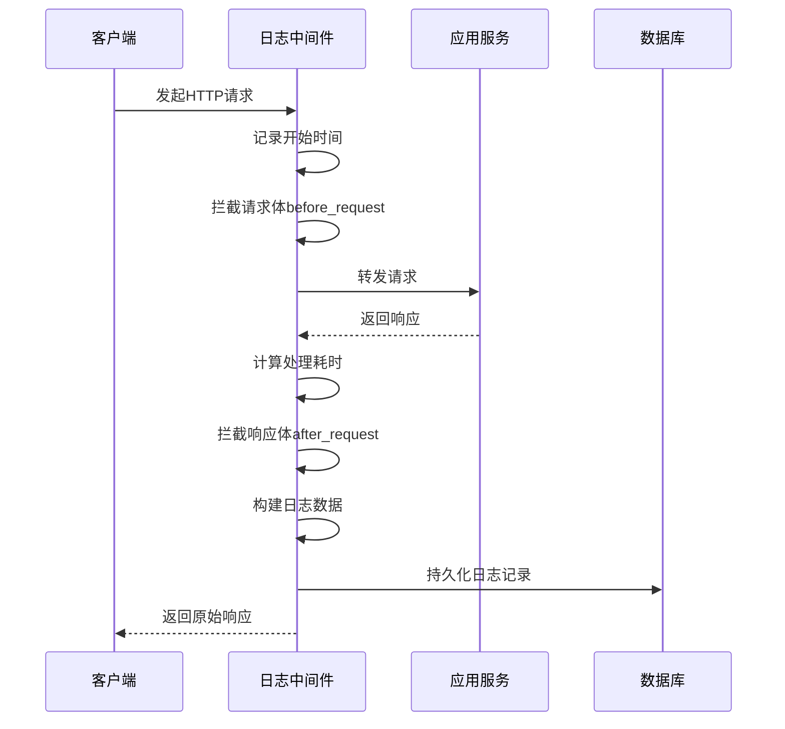

# 审计日志

<cite>
**本文档引用文件**  
- [index.vue](file://web/src/views/system/auditlog/index.vue)
- [auditlog.py](file://app/api/v1/auditlog/auditlog.py)
- [middlewares.py](file://app/core/middlewares.py)
- [admin.py](file://app/models/admin.py)
- [base.py](file://app/models/base.py)
- [base.py](file://app/schemas/base.py)
</cite>

## 目录
1. [简介](#简介)
2. [前端日志展示](#前端日志展示)
3. [后端查询接口](#后端查询接口)
4. [日志生成机制](#日志生成机制)
5. [数据模型与存储](#数据模型与存储)
6. [日志触发条件与脱敏策略](#日志触发条件与脱敏策略)
7. [性能优化与诊断](#性能优化与诊断)
8. [结论](#结论)

## 简介
本系统通过自动化的审计日志模块，记录所有关键操作行为，包括用户登录、权限变更、用户信息修改等敏感操作。日志数据由中间件在请求处理过程中自动捕获并持久化至数据库，提供完整的操作追溯能力。前端通过可查询界面展示日志列表，支持多维度筛选和分页浏览，便于运维和安全审计。

## 前端日志展示

审计日志前端界面基于 `web/src/views/system/auditlog/index.vue` 实现，采用 `CrudTable` 组件展示日志数据，并通过 `QueryBarItem` 提供灵活的查询条件输入。

### 展示字段
日志列表展示以下核心字段：
- **用户名称**：执行操作的用户名
- **接口概要**：接口的功能描述
- **功能模块**：所属业务模块标签
- **请求方法**：HTTP 方法（GET、POST、DELETE）
- **请求路径**：API 请求路径
- **状态码**：HTTP 响应状态码
- **请求体**：以弹窗形式展示请求参数（JSON 格式化）
- **响应体**：以弹窗形式展示响应内容（JSON 格式化）
- **响应时间(s)**：接口处理耗时（毫秒转换为秒）
- **操作时间**：日志记录时间戳

### 筛选条件
支持以下查询条件组合过滤：
- 用户名称（模糊匹配）
- 功能模块（模糊匹配）
- 接口概要（模糊匹配）
- 请求方法（下拉选择：GET、POST、DELETE）
- 请求路径（模糊匹配）
- 状态码（精确匹配）
- 操作时间范围（日期时间范围选择器）

默认时间范围为当天 00:00:00 至 23:59:59。

### 分页机制
表格组件通过 `api.getAuditLogList` 异步加载数据，支持标准分页：
- 每页默认显示 10 条记录
- 支持页码跳转与数量调整
- 查询结果包含总记录数、当前页码、每页数量等元信息

**Section sources**
- [index.vue](file://web/src/views/system/auditlog/index.vue#L1-L285)

## 后端查询接口

后端通过 `app/api/v1/auditlog/auditlog.py` 提供日志查询接口，基于 FastAPI 实现 RESTful 风格的 `/api/v1/auditlog/list` 端点。

### 接口参数
| 参数名 | 类型 | 描述 |
|--------|------|------|
| `page` | int | 页码（默认 1） |
| `page_size` | int | 每页数量（默认 10） |
| `username` | str | 用户名称（模糊搜索） |
| `module` | str | 功能模块（模糊搜索） |
| `method` | str | 请求方法（模糊搜索） |
| `summary` | str | 接口描述（模糊搜索） |
| `path` | str | 请求路径（模糊搜索） |
| `status` | int | 状态码（精确匹配） |
| `start_time` | datetime | 开始时间 |
| `end_time` | datetime | 结束时间 |

### 查询逻辑
使用 Tortoise ORM 的 `Q` 对象构建复合查询条件，支持时间范围的三种模式：
- 同时提供起止时间：`created_at__range`
- 仅开始时间：`created_at__gte`
- 仅结束时间：`created_at__lte`

查询结果按创建时间倒序排列，并返回分页数据及总数。

### 响应结构
使用 `SuccessExtra` 响应类封装结果，包含：
- `data`: 当前页日志数据数组
- `total`: 总记录数
- `page`: 当前页码
- `page_size`: 每页数量

**Section sources**
- [auditlog.py](file://app/api/v1/auditlog/auditlog.py#L1-L48)

## 日志生成机制

日志的自动生成由 `app/core/middlewares.py` 中的 `HttpAuditLogMiddleware` 中间件实现，该中间件继承自 `BaseHTTPMiddleware`，在请求处理流程中自动捕获上下文信息。

### 技术流程


**Diagram sources**
- [middlewares.py](file://app/core/middlewares.py#L1-L182)

### 请求上下文捕获
#### 请求参数获取
- **查询参数**：从 `request.query_params` 提取
- **请求体**：
  - JSON 数据：通过 `request.json()` 解析
  - 表单数据：通过 `request.form()` 提取，文件上传时仅记录文件名

#### 响应体捕获
通过重写响应体迭代器，捕获响应内容：
- 设置最大捕获大小为 1MB
- 对审计日志自身的响应进行脱敏：移除 `response_body` 字段，避免无限递归
- 使用 `lenient_json` 方法安全解析 JSON 内容

#### 路由与用户信息
- **路由信息**：遍历 `app.routes` 匹配当前路径，提取 `tags`（模块）和 `summary`（接口描述）
- **用户信息**：从请求头提取 `token`，调用 `AuthControl.is_authed()` 验证并获取用户对象

### 中间件配置
- **监控方法**：由初始化参数 `methods` 控制（未在代码中显式列出，但逻辑支持配置）
- **排除路径**：通过 `exclude_paths` 正则匹配排除特定路径（如健康检查）
- **审计路径保护**：对 `/api/v1/auditlog/list` 等日志接口响应体进行简化，防止日志膨胀

**Section sources**
- [middlewares.py](file://app/core/middlewares.py#L1-L182)

## 数据模型与存储

日志数据持久化基于 Tortoise ORM 模型 `AuditLog`，定义于 `app/models/admin.py`。

### 数据结构
| 字段名 | 类型 | 描述 | 索引 |
|--------|------|------|------|
| `user_id` | IntField | 用户ID | 是 |
| `username` | CharField | 用户名称 | 是 |
| `module` | CharField | 功能模块 | 是 |
| `summary` | CharField | 请求描述 | 是 |
| `method` | CharField | 请求方法 | 是 |
| `path` | CharField | 请求路径 | 是 |
| `status` | IntField | 状态码 | 是 |
| `response_time` | IntField | 响应时间(毫秒) | 是 |
| `request_args` | JSONField | 请求参数 | 否 |
| `response_body` | JSONField | 返回数据 | 否 |
| `created_at` | DatetimeField | 创建时间 | 是 |
| `updated_at` | DatetimeField | 更新时间 | 是 |

继承自 `BaseModel` 和 `TimestampMixin`，自动管理 ID、创建时间和更新时间。

### 存储周期管理
当前代码未实现自动清理逻辑，但可通过以下方式管理：
- **手动归档**：定期导出历史数据
- **数据库策略**：设置 TTL 或分区表
- **后台任务**：结合 `BgTasks` 模块实现定时清理

**Section sources**
- [admin.py](file://app/models/admin.py#L1-L89)
- [base.py](file://app/models/base.py#L1-L62)

## 日志触发条件与脱敏策略

### 触发条件
日志记录由中间件统一触发，满足以下条件即生成日志：
1. 请求方法在监控列表中（如 POST、PUT、DELETE、GET）
2. 请求路径未被排除（如非健康检查或静态资源）
3. 请求完成并生成响应

典型触发场景包括：
- 用户登录/登出
- 用户信息创建、修改、删除
- 角色与权限分配
- 菜单与API配置变更
- 敏感数据访问

### 敏感信息脱敏
- **请求体脱敏**：文件上传时仅记录文件名，不记录文件内容
- **响应体脱敏**：
  - 对审计日志接口自身响应，移除 `response_body` 字段
  - 大响应体（>1MB）标记为“响应过大无法记录”
- **用户信息保护**：仅记录用户名和用户ID，不记录密码、token等敏感字段

## 性能优化与诊断

### 常见问题诊断
| 问题现象 | 可能原因 | 诊断方法 |
|--------|--------|--------|
| 日志缺失 | 请求被排除路径匹配 | 检查 `exclude_paths` 正则表达式 |
| 查询缓慢 | 缺少复合索引 | 分析查询执行计划 |
| 响应体为空 | 响应过大或解析失败 | 检查日志大小是否超过1MB |
| 用户名为空 | Token验证失败 | 检查认证中间件是否正常执行 |

### 索引优化建议
为提升大规模数据下的查询性能，建议在数据库中添加以下复合索引：
```sql
-- 常用查询字段组合
CREATE INDEX idx_auditlog_query ON auditlog (username, module, method, status, created_at);

-- 时间范围查询优化
CREATE INDEX idx_auditlog_time ON auditlog (created_at DESC);

-- 路径与方法组合查询
CREATE INDEX idx_auditlog_path_method ON auditlog (path, method);
```

### 归档策略建议
1. **按月分区**：对 `auditlog` 表按 `created_at` 进行范围分区
2. **冷热分离**：将超过6个月的日志归档至低成本存储
3. **定期清理**：通过后台任务（`BgTasks`）每月执行一次过期数据清理
4. **异步写入**：考虑将日志写入改为异步，避免阻塞主请求流程

**Section sources**
- [middlewares.py](file://app/core/middlewares.py#L1-L182)
- [auditlog.py](file://app/api/v1/auditlog/auditlog.py#L1-L48)

## 结论
本系统的审计日志模块实现了全自动的关键操作记录，从前端展示、后端查询到中间件捕获形成了完整闭环。通过合理的数据模型设计和中间件机制，确保了日志的完整性与安全性。针对大规模数据场景，建议实施索引优化和归档策略，以保障系统性能与可维护性。该模块为系统安全审计、故障排查和合规性要求提供了坚实的技术支撑。