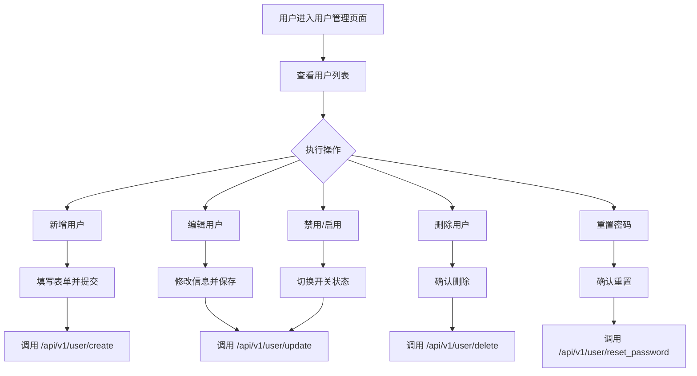
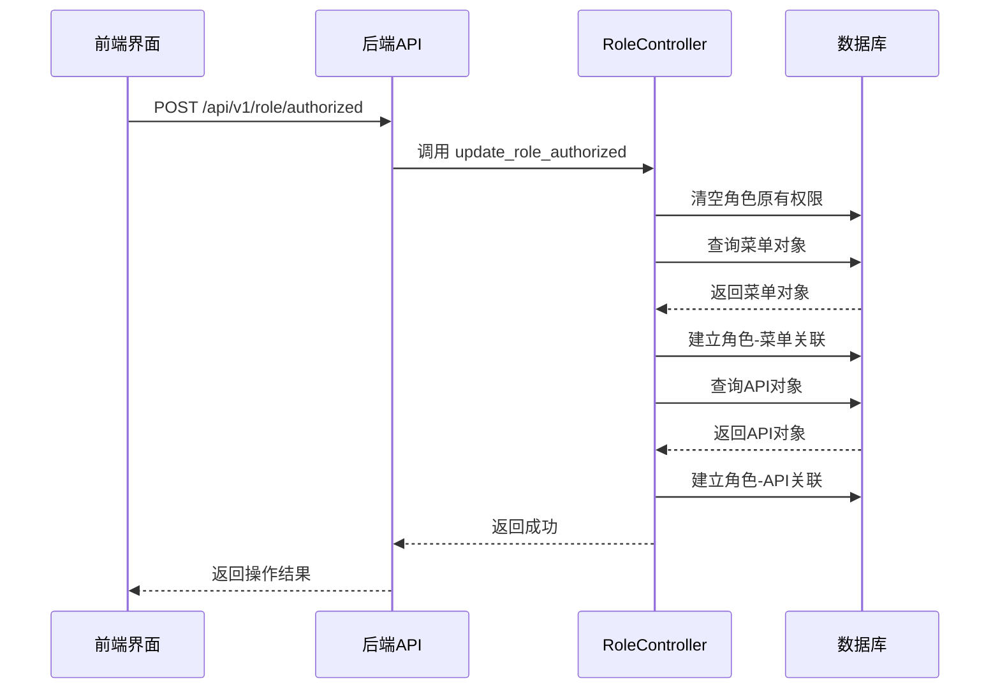
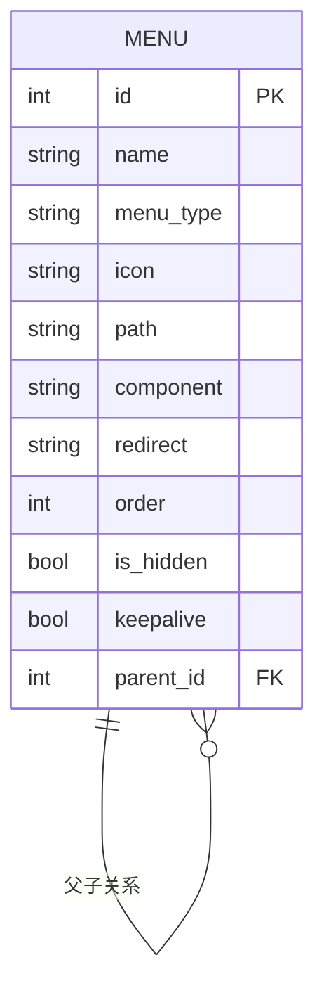
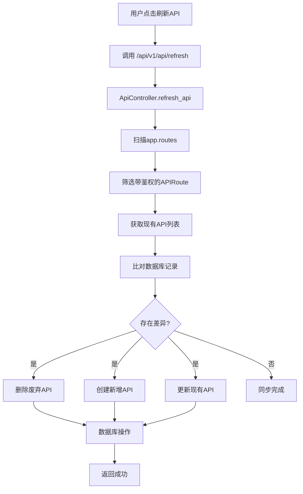
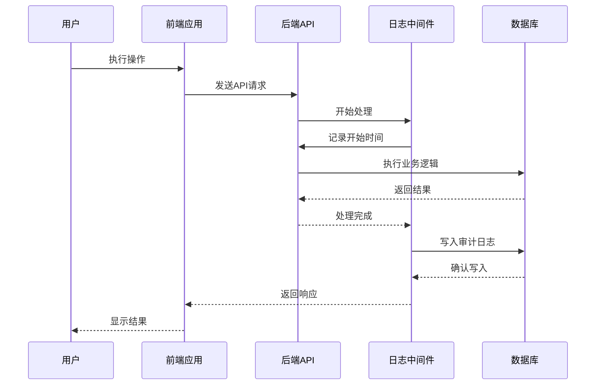

# 核心功能模块详解

<cite>
**本文档中引用的文件**  
- [users.py](file://app/api/v1/users/users.py)
- [user.py](file://app/controllers/user.py)
- [index.vue](file://web/src/views/system/user/index.vue)
- [roles.py](file://app/api/v1/roles/roles.py)
- [role.py](file://app/controllers/role.py)
- [index.vue](file://web/src/views/system/role/index.vue)
- [menus.py](file://app/api/v1/menus/menus.py)
- [menu.py](file://app/controllers/menu.py)
- [index.vue](file://web/src/views/system/menu/index.vue)
- [apis.py](file://app/api/v1/apis/apis.py)
- [api.py](file://app/controllers/api.py)
- [index.vue](file://web/src/views/system/api/index.vue)
- [auditlog.py](file://app/api/v1/auditlog/auditlog.py)
- [index.vue](file://web/src/views/system/auditlog/index.vue)
</cite>

## 目录
1. [用户管理](#用户管理)
2. [角色管理](#角色管理)
3. [菜单管理](#菜单管理)
4. [API管理](#api管理)
5. [审计日志](#审计日志)

## 用户管理

本模块提供用户全生命周期管理功能，包括增删改查、状态切换和密码重置。前端通过 `index.vue` 实现交互界面，后端由 `users.py` 提供 RESTful API 接口，控制器 `user.py` 处理核心逻辑。

前端界面采用表格形式展示用户列表，支持按用户名、邮箱和部门进行搜索。用户可通过“新建用户”按钮弹出表单进行创建，表单包含用户名、邮箱、密码、角色分配、部门归属等字段，并集成表单验证机制。编辑操作通过点击“编辑”按钮触发，删除操作需二次确认以防止误操作。

状态切换通过表格中的开关组件实现，禁用用户时系统会校验是否为当前登录用户，避免自我禁用。密码重置功能仅对非超级管理员用户开放，点击“重置密码”后，系统将密码重置为默认值“123456”，并提示操作成功。

后端 `user_controller` 提供 `create_user`、`update`、`remove` 和 `reset_password` 方法，分别处理用户创建、更新、删除和密码重置。创建和更新时会同步用户角色关系，密码通过 `get_password_hash` 函数进行哈希加密存储。`reset_password` 方法会拒绝超级管理员的密码重置请求，确保系统安全。

**操作流程示意图**

**本节来源**
- [users.py](file://app/api/v1/users/users.py#L0-L81)
- [user.py](file://app/controllers/user.py#L0-L60)
- [index.vue](file://web/src/views/system/user/index.vue#L0-L495)

## 角色管理

角色管理模块用于定义系统角色并分配权限。前端 `index.vue` 提供角色列表展示和权限设置功能，后端通过 `roles.py` 暴露 API，`role.py` 中的 `RoleController` 实现权限分配逻辑。

用户可在角色列表页面查看所有角色，支持按角色名搜索。创建角色时需填写角色名和描述，系统会校验角色名唯一性。编辑和删除操作与用户管理类似，均通过表格操作列完成。

核心功能是权限分配，点击“设置权限”按钮可打开抽屉式面板，包含“菜单权限”和“接口权限”两个标签页。菜单权限采用树形结构展示，支持全选、半选和级联选择。接口权限同样以树形结构组织，按 API 模块（tags）分组，每个接口可独立勾选。

后端 `update_role_authorized` 接口接收角色 ID、菜单 ID 列表和 API 信息列表。`role_controller` 的 `update_roles` 方法先清空角色原有权限，再根据传入的 ID 列表重新建立关联。菜单权限通过 `role.menus.add()` 建立多对多关系，API 权限通过 `role.apis.add()` 实现。权限数据在数据库中以中间表形式存储，确保灵活性和可扩展性。

**权限分配流程**

**本节来源**
- [roles.py](file://app/api/v1/roles/roles.py#L0-L73)
- [role.py](file://app/controllers/role.py#L0-L27)
- [index.vue](file://web/src/views/system/role/index.vue#L0-L362)

## 菜单管理

菜单管理模块负责配置系统导航结构。前端 `index.vue` 以表格形式展示树形菜单，后端通过 `menus.py` 提供接口，`menu.py` 中的 `MenuController` 继承通用 CRUD 操作。

界面支持三种菜单类型：根目录、目录和菜单。根目录为系统顶级节点，目录用于组织子菜单，菜单对应具体页面。用户可通过“新建根菜单”或“子菜单”按钮添加新节点，系统自动维护父子关系和排序。

菜单配置包含多个字段：名称、类型、图标、路径、重定向、组件、排序、隐藏和保活。图标选择集成 Iconify，通过 `IconPicker` 组件实现。路径用于路由匹配，组件指定前端页面路径，保活（keepalive）控制页面是否缓存。

后端 `list_menu` 接口递归查询菜单树，从父菜单（parent_id=0）开始，逐层获取子菜单并构建嵌套结构。删除菜单时会检查是否存在子菜单，若存在则禁止删除，防止出现孤立节点。更新操作支持修改所有字段，系统通过 `order` 字段控制显示顺序。

**菜单结构示意图**

**本节来源**
- [menus.py](file://app/api/v1/menus/menus.py#L0-L63)
- [menu.py](file://app/controllers/menu.py#L0-L16)
- [index.vue](file://web/src/views/system/menu/index.vue#L0-L360)

## API管理

API管理模块用于注册和分类系统接口。前端 `index.vue` 提供 API 列表和刷新功能，后端通过 `apis.py` 暴露接口，`api.py` 中的 `ApiController` 实现自动发现机制。

用户可在列表中查看所有 API，支持按路径、简介、模块（tags）搜索。可手动创建、编辑或删除 API 记录。核心功能是“刷新 API”，点击后系统会扫描 FastAPI 应用的所有路由，自动同步带鉴权的接口信息。

`refresh_api` 方法遍历 `app.routes`，筛选出 `APIRoute` 类型且包含依赖（dependencies）的路由，即需要鉴权的接口。对于数据库中存在但路由中已移除的 API，执行删除操作；对于路由中新增的 API，若数据库不存在则创建，存在则更新。同步内容包括请求方法、路径、简介和模块标签。

API 权限与角色绑定，通过角色管理模块中的“接口权限”进行分配。每个 API 记录包含 method 和 path 唯一标识，便于权限校验时快速匹配。

**API同步流程**

**本节来源**
- [apis.py](file://app/api/v1/apis/apis.py#L0-L67)
- [api.py](file://app/controllers/api.py#L0-L45)
- [index.vue](file://web/src/views/system/api/index.vue#L0-L268)

## 审计日志

审计日志模块自动记录所有操作行为。前端 `index.vue` 提供日志查询界面，后端通过 `auditlog.py` 提供查询接口，日志数据由中间件自动写入 `AuditLog` 模型。

系统在每次请求处理完成后，自动记录操作人、功能模块、请求方法、接口描述、请求路径、状态码、请求体、响应体、响应时间和操作时间。用户可在日志列表中按用户名、模块、方法、路径、状态码和时间范围进行组合查询。

前端界面采用高级查询栏，支持多条件过滤。时间选择器允许用户选择日期时间范围。日志表格中，“请求体”和“响应体”字段通过弹出框展示 JSON 格式化内容，便于查看复杂数据结构。

后端 `get_audit_log_list` 接口接收多个查询参数，构建复合查询条件。支持模糊匹配（icontains）和范围查询（created_at__range）。查询结果按操作时间倒序排列，支持分页。

**日志记录流程**

**本节来源**
- [auditlog.py](file://app/api/v1/auditlog/auditlog.py#L0-L48)
- [index.vue](file://web/src/views/system/auditlog/index.vue#L0-L285)