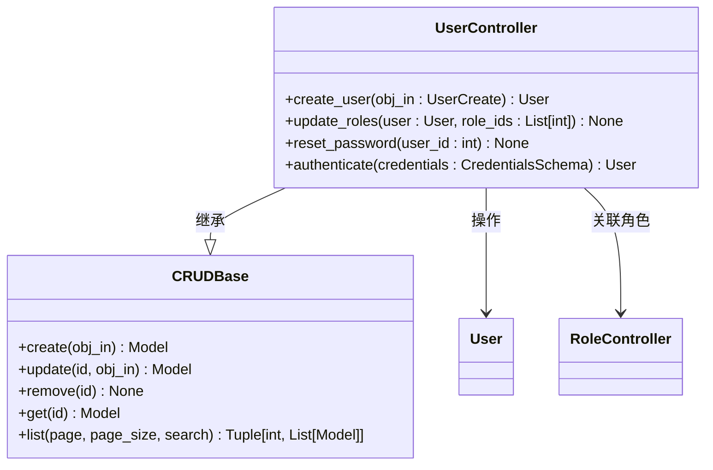
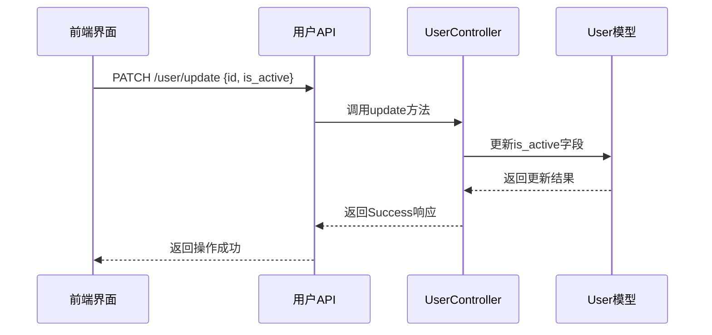
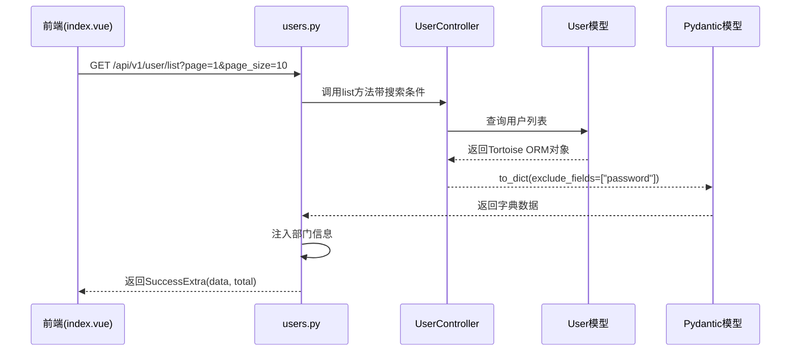
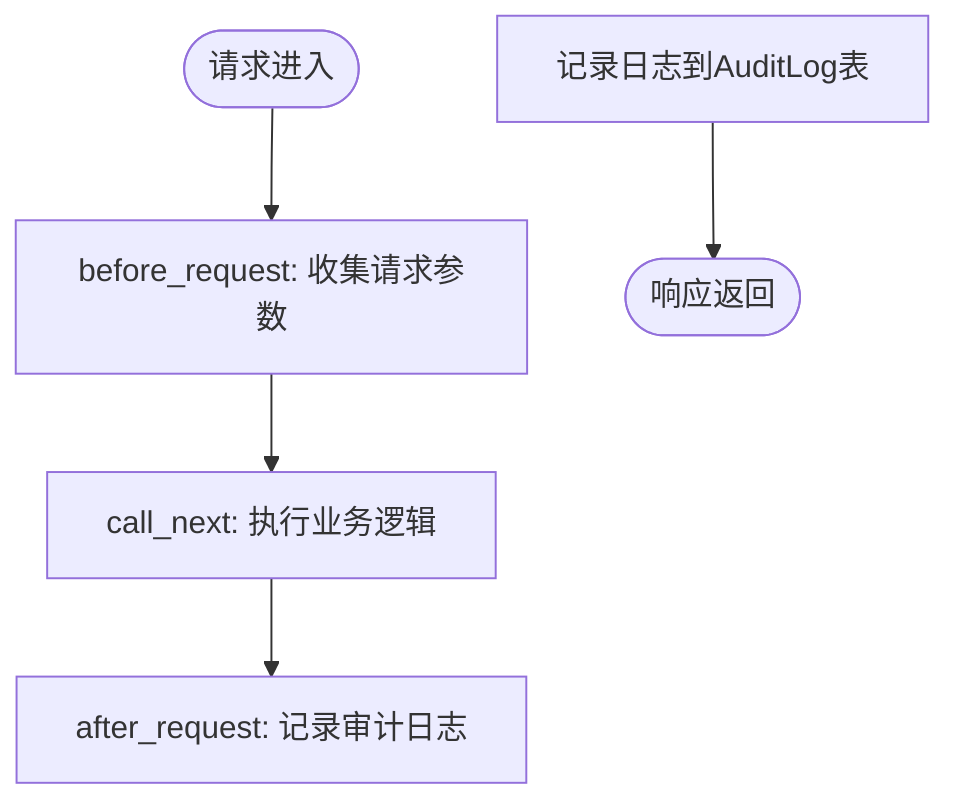

# 用户管理

<cite>
**本文档引用文件**  
- [index.vue](file://web/src/views/system/user/index.vue)
- [user.py](file://app/controllers/user.py)
- [users.py](file://app/api/v1/users/users.py)
- [password.py](file://app/utils/password.py)
- [users.py](file://app/schemas/users.py)
- [middlewares.py](file://app/core/middlewares.py)
</cite>

## 目录
1. [简介](#简介)
2. [前端界面操作](#前端界面操作)
3. [后端业务逻辑实现](#后端业务逻辑实现)
4. [请求流程示例](#请求流程示例)
5. [权限控制与审计日志](#权限控制与审计日志)
6. [常见问题排查](#常见问题排查)
7. [结论](#结论)

## 简介
本模块实现用户全生命周期管理，涵盖新增、编辑、删除、启用/禁用及密码重置等核心功能。系统采用前后端分离架构，前端基于 Vue 3 与 Naive UI 构建交互界面，后端使用 FastAPI 提供 RESTful 接口，通过 Tortoise ORM 实现数据持久化。整体流程包含表单验证、权限校验、密码加密、状态更新与操作审计，确保安全性与可追溯性。

## 前端界面操作

### 表格渲染与分页查询
用户列表通过 `CrudTable` 组件实现，结合 `NTable` 封装支持分页、搜索与动态列渲染。表格列定义于 `index.vue` 的 `columns` 数组中，包含用户名、邮箱、角色标签、部门、超级用户标识、最后登录时间及操作按钮。其中角色字段通过 `render` 函数动态生成多个 `NTag` 组件展示多角色信息。

分页查询由 `api.getUserList` 方法驱动，参数通过 `queryItems` 双向绑定收集，并在组件挂载时自动触发首次加载。查询条件包括用户名模糊匹配、邮箱精确匹配及按部门筛选。

**Section sources**
- [index.vue](file://web/src/views/system/user/index.vue#L150-L155)

### 表单验证机制
新增/编辑用户时，使用 `NForm` 组件进行表单验证。验证规则定义在 `validateAddUser` 对象中，包含：
- 用户名：必填
- 邮箱：必填且格式校验（正则表达式）
- 密码与确认密码：必填且一致性校验
- 角色：至少选择一个

验证触发时机为输入、失焦或值变更事件，确保实时反馈。

**Section sources**
- [index.vue](file://web/src/views/system/user/index.vue#L300-L350)

### 对话框交互逻辑
通过 `CrudModal` 组件实现新增与编辑弹窗。模态框的显示状态、标题与操作类型由 `useCRUD` 组合式函数统一管理。点击“新建用户”按钮调用 `handleAdd` 打开新增表单；点击“编辑”则填充当前行数据并打开编辑表单。

敏感操作（如删除、重置密码）通过 `NPopconfirm` 弹出二次确认对话框，防止误操作。

**Section sources**
- [index.vue](file://web/src/views/system/user/index.vue#L100-L120)

## 后端业务逻辑实现

### 控制器与模型交互
`UserController` 继承自 `CRUDBase`，封装了对 `User` 模型的标准增删改查操作。核心方法包括：
- `create_user`：创建用户前对密码进行哈希加密
- `update_roles`：清空原角色并重新绑定新角色
- `reset_password`：禁止重置超级管理员密码，普通用户密码重置为 "123456" 并加密存储
- `authenticate`：登录认证时验证用户名、密码及账户状态

所有操作均通过异步方式访问数据库，保证高并发性能。



**Diagram sources**
- [user.py](file://app/controllers/user.py#L15-L60)
- [crud.py](file://app/core/crud.py#L1-L20)

### 密码加密处理
密码安全由 `app/utils/password.py` 模块保障，使用 `passlib` 库的 `CryptContext` 配置 Argon2 算法进行哈希加密。提供两个核心函数：
- `get_password_hash(password)`：生成密码哈希值
- `verify_password(plain, hashed)`：验证明文密码是否匹配哈希值

在用户创建和登录认证过程中自动调用，确保密码永不以明文形式存储或传输。

**Section sources**
- [password.py](file://app/utils/password.py#L1-L17)

### 用户状态更新
用户启用/禁用状态通过 `NSwitch` 组件绑定 `is_active` 字段实现。前端调用 `handleUpdateDisable` 方法，将更新后的用户对象提交至 `/api/v1/user/update` 接口。后端在 `UserController.update` 中持久化状态变更，并通过审计中间件记录操作日志。



**Diagram sources**
- [index.vue](file://web/src/views/system/user/index.vue#L250-L280)
- [users.py](file://app/api/v1/users/users.py#L50-L60)

## 请求流程示例

### 分页查询完整流程
从前端发起 `GET /users` 请求，到后端返回序列化数据的完整流程如下：



该流程中，敏感字段 `password` 被显式排除，部门信息通过外键关联补充，最终返回结构化 JSON 数据供前端渲染。

**Section sources**
- [users.py](file://app/api/v1/users/users.py#L10-L40)
- [index.vue](file://web/src/views/system/user/index.vue#L150-L155)

## 权限控制与审计日志

### 权限控制机制
系统通过自定义指令 `v-permission` 实现前端按钮级权限控制。例如：
```vue
<NButton v-permission="'post/api/v1/user/create'">新建用户</NButton>
```
后端在路由装饰器中声明权限标识，确保只有具备相应权限的角色才能执行敏感操作。

**Section sources**
- [index.vue](file://web/src/views/system/user/index.vue#L200-L210)

### 审计中间件
`HttpAuditLogMiddleware` 拦截所有指定方法（POST、PUT、DELETE）的请求，记录以下信息：
- 请求路径、方法、状态码
- 用户ID与用户名（通过Token解析）
- 请求参数与响应体（大响应体自动截断）
- 处理耗时

审计日志写入 `audit_log` 表，支持后续追溯关键操作行为。



**Diagram sources**
- [middlewares.py](file://app/core/middlewares.py#L50-L180)

## 常见问题排查

### 用户无法登录
可能原因及排查步骤：
1. **用户名或密码错误**：检查 `UserController.authenticate` 是否抛出 "无效的用户名" 或 "密码错误" 异常
2. **账户被禁用**：确认 `is_active` 字段为 `true`
3. **Token失效**：检查前端 `token.js` 是否正确存储并发送 Token
4. **认证中间件异常**：查看日志中 `AuthControl.is_authed` 是否抛出异常

**Section sources**
- [user.py](file://app/controllers/user.py#L45-L55)
- [auth.js](file://web/src/utils/auth/auth.js)

### 状态更新失败
可能原因：
1. **权限不足**：确认当前用户拥有 `post/api/v1/user/update` 权限
2. **数据验证失败**：检查 `UserUpdate` 模型字段约束
3. **数据库连接异常**：查看日志是否有 `tortoise.exceptions.OperationalError`
4. **中间件拦截**：确认请求未被 `HttpAuditLogMiddleware` 排除路径过滤

**Section sources**
- [users.py](file://app/api/v1/users/users.py#L50-L60)
- [middlewares.py](file://app/core/middlewares.py#L100-L120)

## 结论
用户管理模块实现了完整的 CRUD 操作与安全控制机制。前端通过组件化设计提升可维护性，后端依托 Pydantic 模型与 Tortoise ORM 实现类型安全与高效持久化。密码加密、权限校验与操作审计三位一体，保障系统安全性与合规性。建议定期审查审计日志，及时发现异常行为。