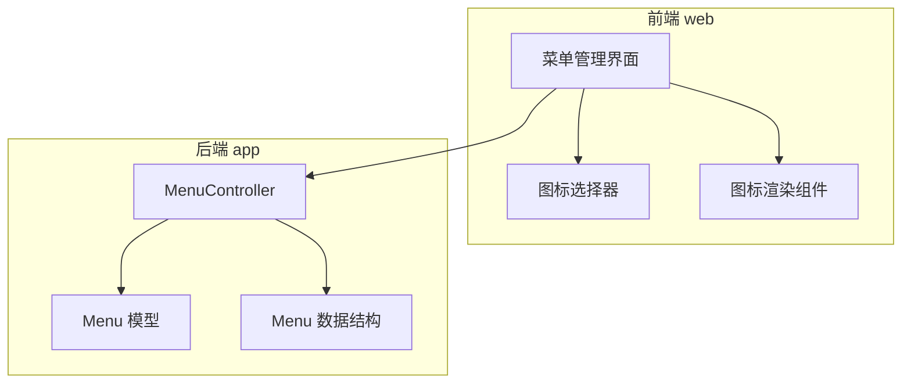
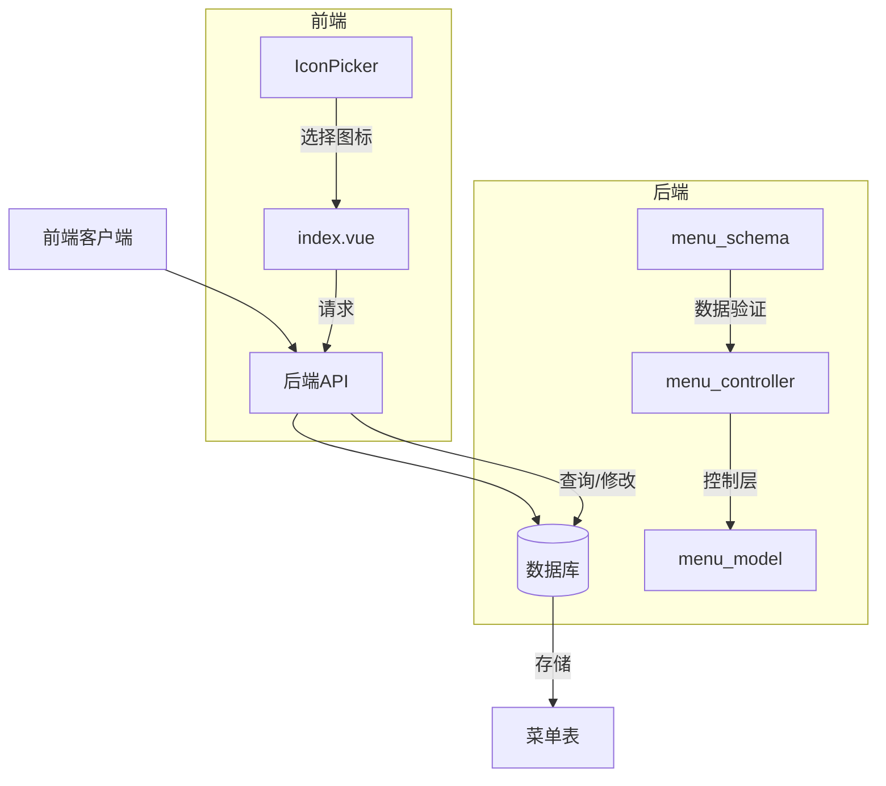
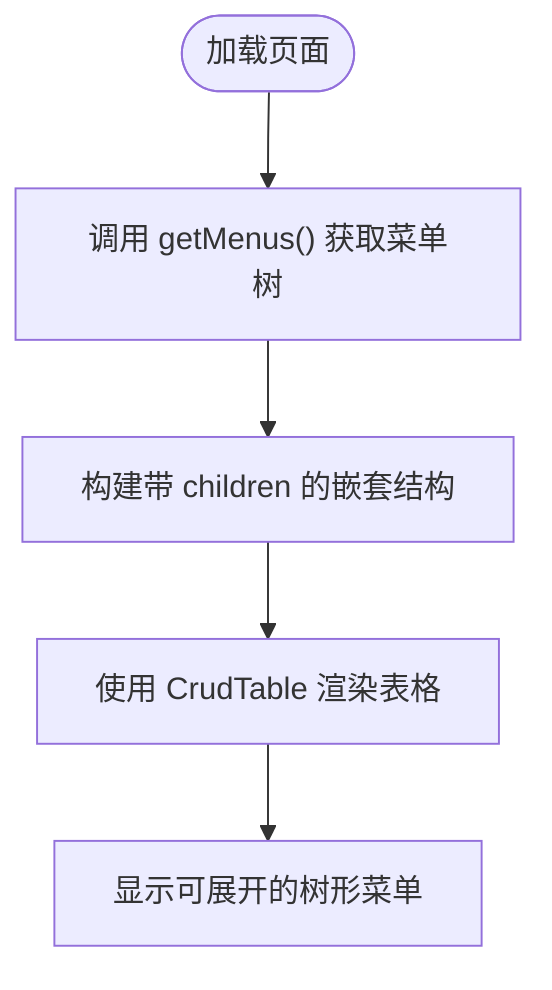
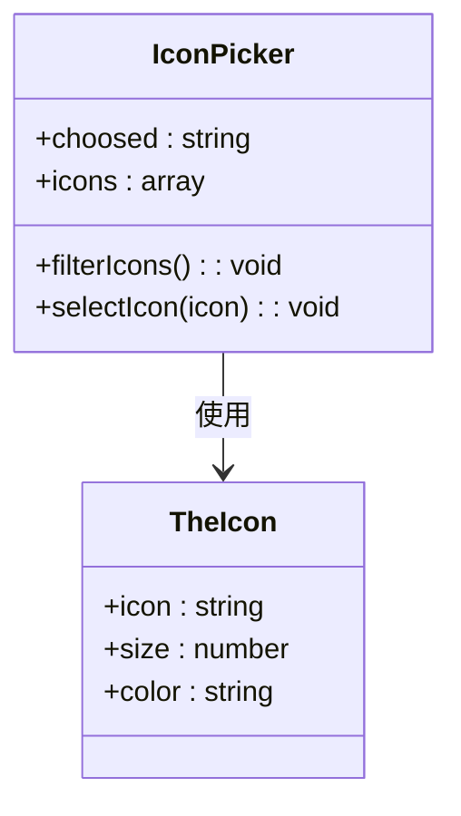
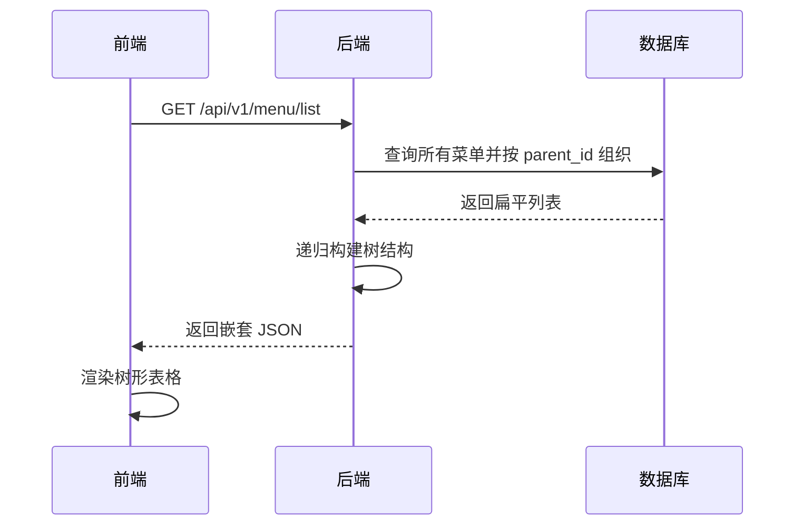
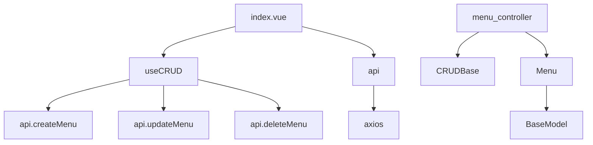

# 菜单管理

<cite>
**本文档引用的文件**  
- [index.vue](file://web/src/views/system/menu/index.vue)
- [menu.py](file://app/controllers/menu.py)
- [menus.py](file://app/schemas/menus.py)
- [admin.py](file://app/models/admin.py)
- [IconPicker.vue](file://web/src/components/icon/IconPicker.vue)
- [TheIcon.vue](file://web/src/components/icon/TheIcon.vue)
</cite>

## 目录
1. [简介](#简介)
2. [项目结构](#项目结构)
3. [核心组件](#核心组件)
4. [架构概览](#架构概览)
5. [详细组件分析](#详细组件分析)
6. [依赖分析](#依赖分析)
7. [性能考虑](#性能考虑)
8. [故障排除指南](#故障排除指南)
9. [结论](#结论)

## 简介
本系统提供完整的菜单管理功能，支持树形结构的多级菜单配置、图标选择、排序与显示控制。前端使用 Vue 3 和 Naive UI 实现递归渲染与交互操作，后端基于 FastAPI 提供 RESTful 接口处理菜单的增删改查及层级关系维护。菜单数据与角色权限关联，作为动态路由依据返回给前端，实现基于权限的界面展示。

## 项目结构

**Diagram sources**  
- [index.vue](file://web/src/views/system/menu/index.vue#L1-L360)
- [menu.py](file://app/controllers/menu.py#L1-L17)
- [admin.py](file://app/models/admin.py#L50-L89)

**Section sources**  
- [index.vue](file://web/src/views/system/menu/index.vue#L1-L360)
- [menu.py](file://app/controllers/menu.py#L1-L17)

## 核心组件

前端通过 `web/src/views/system/menu/index.vue` 实现菜单管理界面，使用 `CrudTable` 和 `CrudModal` 组件封装通用表格与弹窗逻辑。通过 `useCRUD` 组合式函数统一处理创建、编辑、删除和保存操作。后端 `app/controllers/menu.py` 中的 `MenuController` 类继承自 `CRUDBase`，封装了对菜单资源的标准操作。

**Section sources**  
- [index.vue](file://web/src/views/system/menu/index.vue#L1-L360)
- [menu.py](file://app/controllers/menu.py#L1-L17)

## 架构概览

**Diagram sources**  
- [index.vue](file://web/src/views/system/menu/index.vue#L1-L360)
- [menu.py](file://app/controllers/menu.py#L1-L17)
- [admin.py](file://app/models/admin.py#L50-L89)

## 详细组件分析

### 前端菜单管理分析

#### 递归组件与树形渲染
前端使用 `NTreeSelect` 组件实现上级菜单的选择，支持展开/折叠多级结构。表格列中通过 `render` 函数动态渲染图标、开关控件和操作按钮。对于有子菜单的条目，仅允许添加子菜单或编辑，禁止直接删除以保证树结构完整性。

**Diagram sources**  
- [index.vue](file://web/src/views/system/menu/index.vue#L1-L360)

#### 图标选择器实现
`IconPicker.vue` 集成 Iconify 图标库，通过 `@vueuse/core` 的 `watchDebounced` 实现输入防抖搜索。用户输入关键词后实时过滤图标列表，并支持点击预览和选择。所选图标通过 `update:value` 事件双向绑定到表单字段。

**Diagram sources**  
- [IconPicker.vue](file://web/src/components/icon/IconPicker.vue#L1-L70)
- [TheIcon.vue](file://web/src/components/icon/TheIcon.vue#L1-L22)

### 后端菜单控制分析

#### 层级关系与 parentId 字段
`Menu` 模型中的 `parent_id` 字段用于表示父子关系，根节点的 `parent_id = 0`。通过该字段构建树形结构，在查询时递归组装 `children` 数组。系统通过业务逻辑防止循环引用（如不允许将某节点设为其自身的父级）。

#### 路径生成规则
每个菜单项需配置唯一的 `path` 字段，用于前端路由匹配。一级菜单通常对应布局组件（如 Layout），子菜单路径为完整访问路径。`redirect` 字段用于设置重定向目标，仅一级菜单可配置。

**Diagram sources**  
- [menu.py](file://app/controllers/menu.py#L1-L17)
- [admin.py](file://app/models/admin.py#L50-L89)
- [menus.py](file://app/schemas/menus.py#L1-L52)

#### 权限关联与动态路由
菜单通过多对多关系与 `Role` 模型关联。用户登录时，后端根据其角色查询拥有的菜单列表，返回包含 `path`、`component` 等字段的树形结构，前端据此生成动态路由并控制菜单显示。

**Section sources**  
- [admin.py](file://app/models/admin.py#L50-L89)
- [menus.py](file://app/schemas/menus.py#L1-L52)

## 依赖分析

**Diagram sources**  
- [index.vue](file://web/src/views/system/menu/index.vue#L1-L360)
- [menu.py](file://app/controllers/menu.py#L1-L17)
- [admin.py](file://app/models/admin.py#L50-L89)

**Section sources**  
- [index.vue](file://web/src/views/system/menu/index.vue#L1-L360)
- [menu.py](file://app/controllers/menu.py#L1-L17)

## 性能考虑
- **前端缓存**：建议在 `CommonPage` 初始化时缓存菜单树，避免重复请求。
- **后端分页**：当前接口返回全部菜单，若菜单量大可改为分页加载或懒加载子节点。
- **图标搜索优化**：`IconPicker` 可增加本地缓存机制，减少重复过滤开销。
- **减少重渲染**：使用 `v-memo` 或 `shouldUpdate` 优化表格行更新性能。

## 故障排除指南
- **菜单不显示**：检查用户角色是否已分配该菜单；确认 `is_hidden = false`；确保 `path` 唯一且未冲突。
- **路由跳转异常**：验证 `component` 路径是否正确指向前端组件文件；检查 `redirect` 是否配置合理。
- **无法删除菜单**：若菜单存在子项，则删除按钮隐藏，需先删除所有子菜单。
- **图标未生效**：确认图标名称格式正确（如 `ph:user-list-bold`）；检查网络是否能访问 Iconify CDN。
- **排序失效**：确保 `order` 字段为整数且非空，后端应按此字段升序排序返回。

## 结论
本菜单管理系统实现了完整的树形结构管理功能，从前端交互到后端存储均有良好设计。通过 `parentId` 实现灵活的层级组织，结合图标选择器提升用户体验，权限集成保障安全性。未来可进一步支持拖拽排序、批量操作等高级功能，并优化大数据量下的加载性能。