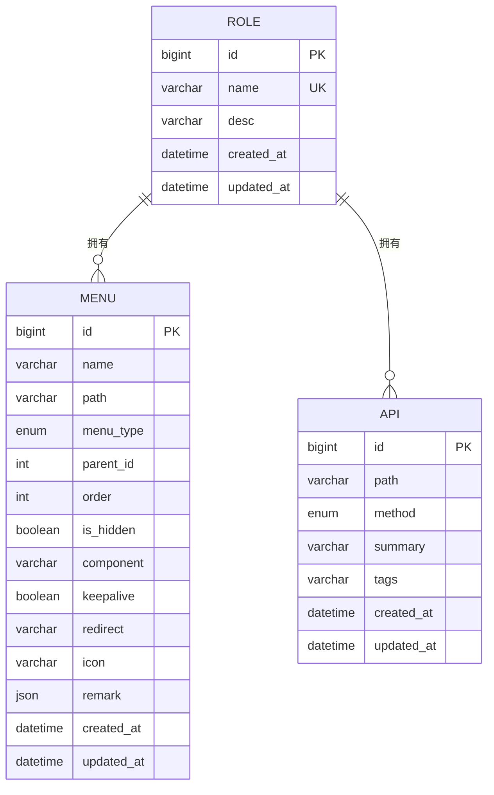
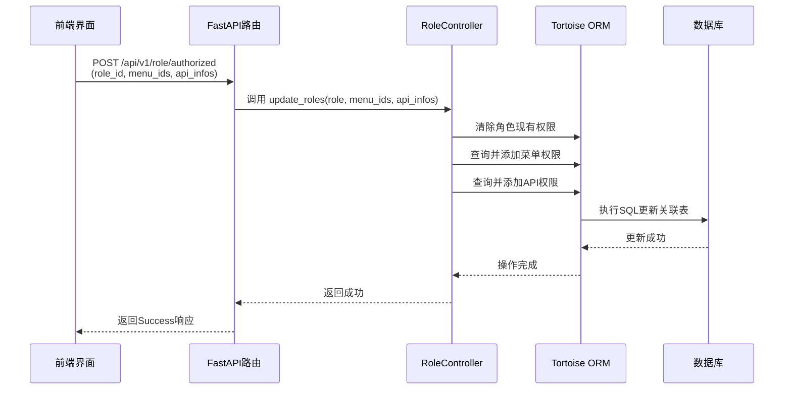

# 角色管理

<cite>
**本文档引用文件**  
- [index.vue](file://web/src/views/system/role/index.vue)
- [role.py](file://app/controllers/role.py)
- [admin.py](file://app/models/admin.py)
- [roles.py](file://app/schemas/roles.py)
- [roles.py](file://app/api/v1/roles/roles.py)
- [crud.py](file://app/core/crud.py)
- [base.py](file://app/models/base.py)
</cite>

## 目录
1. [简介](#简介)
2. [前端角色管理界面](#前端角色管理界面)
3. [后端角色控制逻辑](#后端角色控制逻辑)
4. [数据模型与权限结构](#数据模型与权限结构)
5. [权限分配与更新流程](#权限分配与更新流程)
6. [角色创建与校验机制](#角色创建与校验机制)
7. [权限变更对用户会话的影响](#权限变更对用户会话的影响)
8. [典型错误场景及解决方案](#典型错误场景及解决方案)
9. [总结](#总结)

## 简介
本技术文档详细阐述了系统中角色管理模块的设计与实现，涵盖从前端界面交互到后端数据处理的完整流程。系统采用基于角色的访问控制（RBAC）模型，支持角色的创建、修改、删除以及菜单和API权限的精细化分配。文档重点分析了角色列表展示、权限树形选择器的数据绑定机制、多对多权限关系的存储方式、提交校验逻辑，以及权限变更后对用户上下文的影响。

## 前端角色管理界面

该模块的前端实现位于 `web/src/views/system/role/index.vue`，采用 Vue 3 组合式 API 与 Naive UI 组件库构建。界面主要由角色列表表格、新增/编辑弹窗和权限设置抽屉三部分组成。

角色列表通过 `CrudTable` 组件渲染，列包括角色名、描述和操作按钮。操作列集成了“编辑”、“删除”和“设置权限”三个功能按钮，其可见性通过 `v-permission` 指令进行动态控制，确保用户只能执行其被授权的操作。

“设置权限”功能通过点击按钮触发，会打开一个右侧抽屉（`NDrawer`），内含两个标签页：“菜单权限”和“接口权限”。这两个标签页均使用 `NTree` 组件实现树形结构的选择器，支持模糊搜索（`pattern`）和级联选中（`cascade`）。

- **菜单权限树**：数据源为 `menuOption`，由 `api.getMenus` 接口获取。树节点的 `key-field` 为 `id`，`label-field` 为 `name`，`checked-keys` 绑定到 `menu_ids` 数组，实现选中状态的双向绑定。
- **接口权限树**：数据源为 `apiOption`，由 `api.getApis` 接口获取。由于接口权限由 `method` 和 `path` 共同决定，前端通过 `buildApiTree` 函数将扁平的接口列表按路径分组，并为每个接口生成唯一的 `unique_id`（`method.toLowerCase() + path`）作为树节点的键，确保精确匹配。

**Section sources**
- [index.vue](file://web/src/views/system/role/index.vue#L1-L362)

## 后端角色控制逻辑

后端角色管理的核心逻辑封装在 `app/controllers/role.py` 文件的 `RoleController` 类中。该类继承自通用的 `CRUDBase` 基类，实现了角色的增删改查（CRUD）操作，并扩展了权限管理的专用方法。

`RoleController` 的关键方法是 `update_roles`，它负责处理角色权限的更新。该方法接收一个角色对象、菜单ID列表和API信息列表作为参数。其核心逻辑是：
1.  清除角色当前关联的所有菜单和API权限。
2.  遍历传入的 `menu_ids`，查询对应的 `Menu` 对象，并通过 Tortoise ORM 的 `add` 方法将其添加到角色的 `menus` 多对多关系中。
3.  遍历传入的 `api_infos`（包含 `path` 和 `method`），查询对应的 `Api` 对象，并通过 `add` 方法将其添加到角色的 `apis` 多对多关系中。

此方法确保了权限的完全覆盖更新，而非增量更新。

**Section sources**
- [role.py](file://app/controllers/role.py#L1-L27)

## 数据模型与权限结构

系统的数据模型定义在 `app/models/admin.py` 文件中，基于 Tortoise ORM 实现。角色管理涉及的核心模型如下：

**Diagram sources**
- [admin.py](file://app/models/admin.py#L20-L89)

- **`Role` 模型**：代表一个角色，包含 `name`（角色名，唯一）、`desc`（描述）等字段。通过 `menus` 和 `apis` 两个 `ManyToManyField` 字段与 `Menu` 和 `Api` 模型建立多对多关系。
- **`Menu` 模型**：代表系统菜单，包含名称、路径、图标、排序、是否隐藏等属性，支持树形结构（通过 `parent_id`）。
- **`Api` 模型**：代表一个API接口，由 `path`（路径）和 `method`（请求方法，如GET、POST）共同唯一标识，并包含简要描述和标签。

所有模型均继承自 `BaseModel` 和 `TimestampMixin`，自动包含 `id` 主键、`created_at` 和 `updated_at` 时间戳字段。

**Section sources**
- [admin.py](file://app/models/admin.py#L20-L89)
- [base.py](file://app/models/base.py#L1-L62)

## 权限分配与更新流程

当用户在前端点击“设置权限”并确认后，完整的权限更新流程如下：

1.  **前端请求**：用户点击“确定”按钮，触发 `updateRoleAuthorized` 函数。该函数首先通过 `apiTree.value.getCheckedData()` 获取接口权限树中被选中的节点，提取出 `path` 和 `method` 信息，构造成 `api_infos` 数组。然后调用 `api.updateRoleAuthorized` 接口，将 `role_id`、`menu_ids` 和 `api_infos` 作为参数提交。
2.  **API路由**：请求被 `app/api/v1/roles/roles.py` 文件中的 `update_role_authorized` 路由函数处理。该函数接收 `RoleUpdateMenusApis` 类型的Pydantic模型作为输入，进行数据验证。
3.  **调用控制器**：路由函数调用 `role_controller.update_roles` 方法，并传入从数据库查询到的角色对象以及前端提交的权限数据。
4.  **持久化更新**：`RoleController` 的 `update_roles` 方法执行权限的清除和重新绑定操作，Tortoise ORM 自动维护 `role_menus` 和 `role_apis` 两张关联表，完成数据库层面的更新。

**Diagram sources**
- [index.vue](file://web/src/views/system/role/index.vue#L320-L348)
- [roles.py](file://app/api/v1/roles/roles.py#L65-L73)
- [role.py](file://app/controllers/role.py#L15-L27)

## 角色创建与校验机制

角色的创建流程同样遵循清晰的分层结构：

1.  **前端提交**：在“新建角色”弹窗中填写角色名和描述，点击“确定”。
2.  **API路由**：`create_role` 路由函数接收 `RoleCreate` 模型。
3.  **唯一性校验**：在创建前，路由函数调用 `role_controller.is_exist(name)` 方法，查询数据库中是否已存在同名角色。如果存在，则抛出 `HTTPException` (400)，提示“该角色名已存在”。
4.  **创建角色**：若校验通过，则调用 `role_controller.create(obj_in=role_in)`，通过 `CRUDBase` 基类的 `create` 方法将新角色持久化到数据库。

此机制确保了角色名称的全局唯一性约束。

**Section sources**
- [roles.py](file://app/api/v1/roles/roles.py#L45-L52)
- [role.py](file://app/controllers/role.py#L13-L14)

## 权限变更对用户会话的影响

在当前系统设计中，用户的权限信息通常在用户**登录时**从其关联的角色中获取，并注入到用户会话（Session）或JWT令牌的载荷（Payload）中。这意味着：

- **登录后权限变更**：如果一个用户在登录后，其角色的权限被管理员修改，该用户的当前会话中的权限信息**不会自动更新**。用户将继续拥有登录时被授予的权限，直到其会话过期或主动重新登录。
- **重新登录生效**：用户下一次登录时，系统会重新查询其角色的最新权限，并将其加载到新的会话中，从而获得更新后的权限。

这种设计平衡了性能（避免每次请求都查询数据库）和安全性。对于需要即时生效的权限变更，系统可以提供“强制用户重新登录”或“刷新用户权限”的管理功能。

## 典型错误场景及解决方案

### 场景一：权限设置后未生效
- **现象**：为角色分配了新权限，但拥有该角色的用户无法访问相应功能。
- **原因**：用户的会话中缓存的权限信息未更新。
- **解决方案**：通知用户重新登录，或由管理员调用后端的“刷新用户权限”接口（如果系统提供），强制更新用户会话。

### 场景二：角色删除失败
- **现象**：尝试删除一个角色时，操作失败或返回错误。
- **原因**：该角色可能仍被一个或多个用户关联。直接删除会导致外键约束冲突。
- **解决方案**：在删除角色前，必须先检查并解除所有用户的关联。可以在 `role_controller.remove` 方法中添加前置检查，如果 `user_roles` 关联不为空，则拒绝删除并提示“该角色已被用户使用，无法删除”。

### 场景三：接口权限选择混乱
- **现象**：在接口权限树中，选择一个父节点（如 `/api/v1/users`）时，其下的所有子接口（如 `GET /api/v1/users`, `POST /api/v1/users`）并未被级联选中。
- **原因**：前端 `NTree` 组件的 `cascade` 属性配置错误或未启用。
- **解决方案**：确保在接口权限树的 `NTree` 组件上正确设置了 `cascade` 属性，以实现父子节点的级联选中。

## 总结

本角色管理模块实现了基于RBAC模型的完整权限管理体系。前端通过直观的树形选择器实现了菜单和API权限的精细化配置，后端通过Tortoise ORM高效地管理多对多关系。系统在创建角色时实施了严格的唯一性校验，并通过清晰的API分层确保了逻辑的解耦。理解权限在用户会话中的缓存机制对于排查权限未生效的问题至关重要。未来可考虑增加权限即时刷新功能，以提升管理的灵活性。