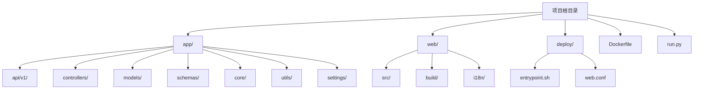

# 目录结构详解

<cite>
**本文档中引用的文件**  
- [init_app.py](file://app/core/init_app.py)
- [middlewares.py](file://app/core/middlewares.py)
- [dependency.py](file://app/core/dependency.py)
- [user.py](file://app/controllers/user.py)
- [role.py](file://app/controllers/role.py)
- [menu.py](file://app/controllers/menu.py)
- [dept.py](file://app/controllers/dept.py)
- [api.py](file://app/controllers/api.py)
- [admin.py](file://app/models/admin.py)
- [base.py](file://app/models/base.py)
- [enums.py](file://app/models/enums.py)
- [users.py](file://app/schemas/users.py)
- [roles.py](file://app/schemas/roles.py)
- [menus.py](file://app/schemas/menus.py)
- [depts.py](file://app/schemas/depts.py)
- [login.py](file://app/schemas/login.py)
- [base.py](file://app/schemas/base.py)
- [jwt_utils.py](file://app/utils/jwt_utils.py)
- [password.py](file://app/utils/password.py)
- [users.py](file://app/api/v1/users/users.py)
- [roles.py](file://app/api/v1/roles/roles.py)
- [menus.py](file://app/api/v1/menus/menus.py)
- [depts.py](file://app/api/v1/depts/depts.py)
- [auditlog.py](file://app/api/v1/auditlog/auditlog.py)
- [apis.py](file://app/api/v1/apis/apis.py)
- [config.py](file://app/settings/config.py)
- [run.py](file://run.py)
- [Dockerfile](file://Dockerfile)
- [entrypoint.sh](file://deploy/entrypoint.sh)
- [web.conf](file://deploy/web.conf)
</cite>

## 目录结构

本项目采用前后端分离架构，整体结构清晰，职责分明。后端基于 FastAPI 框架，前端基于 Vue.js，通过 Nginx 进行反向代理和静态资源服务。

**Diagram sources**
- [app](file://app)
- [web](file://web)
- [deploy](file://deploy)
- [Dockerfile](file://Dockerfile)
- [run.py](file://run.py)

## 后端模块详解

### app/api/v1 - API 接口层

该目录是后端的 API 接口层，负责接收 HTTP 请求并返回响应。每个子目录对应一个功能模块（如用户、角色、菜单等），遵循 RESTful 风格设计。

- `apis/`：API 管理模块，支持动态刷新系统中定义的接口。
- `auditlog/`：审计日志模块，记录所有用户的操作行为。
- `base/`：基础模块，可能包含通用接口。
- `depts/`：部门管理模块。
- `menus/`：菜单管理模块。
- `roles/`：角色管理模块。
- `users/`：用户管理模块。

每个模块的 Python 文件中定义了具体的路由和请求处理函数，通过 FastAPI 的 `APIRouter` 进行注册。

**Section sources**
- [users.py](file://app/api/v1/users/users.py#L1-L82)
- [roles.py](file://app/api/v1/roles/roles.py#L1-L74)
- [menus.py](file://app/api/v1/menus/menus.py#L1-L64)
- [depts.py](file://app/api/v1/depts/depts.py#L1-L49)
- [auditlog.py](file://app/api/v1/auditlog/auditlog.py#L1-L49)
- [apis.py](file://app/api/v1/apis/apis.py#L1-L68)

### app/controllers - 业务逻辑层

该目录是业务逻辑的核心处理层，封装了对数据模型的操作和业务规则。每个控制器（Controller）对应一个数据模型，实现了增删改查（CRUD）等基本操作。

- `user.py`：用户控制器，处理用户创建、认证、角色分配等逻辑。
- `role.py`：角色控制器，管理角色与菜单、API 的权限绑定。
- `menu.py`：菜单控制器，提供菜单的增删改查。
- `dept.py`：部门控制器，使用闭包表（Closure Table）实现树形结构的部门管理。
- `api.py`：API 控制器，负责从路由中动态提取 API 信息并同步到数据库。

控制器通过继承 `CRUDBase` 类实现代码复用，并与 `models` 层紧密协作。

**Section sources**
- [user.py](file://app/controllers/user.py#L1-L61)
- [role.py](file://app/controllers/role.py#L1-L28)
- [menu.py](file://app/controllers/menu.py#L1-L17)
- [dept.py](file://app/controllers/dept.py#L1-L87)
- [api.py](file://app/controllers/api.py#L1-L46)

### app/models - 数据模型层

该目录定义了数据库的实体模型，使用 Tortoise ORM 进行对象关系映射。所有模型均继承自 `BaseModel` 和 `TimestampMixin`，自动包含 `id`、`created_at`、`updated_at` 等字段。

- `admin.py`：核心管理模型，包含 `User`（用户）、`Role`（角色）、`Api`（API）、`Menu`（菜单）、`Dept`（部门）、`AuditLog`（审计日志）等。
- `base.py`：基础模型类，提供通用的 `to_dict` 方法，用于将模型实例转换为字典。
- `enums.py`：枚举类型定义，如 `MethodType`（HTTP 方法）。

模型之间通过多对多关系（ManyToManyField）建立关联，例如用户与角色、角色与菜单/接口。

**Section sources**
- [admin.py](file://app/models/admin.py#L1-L90)
- [base.py](file://app/models/base.py#L1-L63)
- [enums.py](file://app/models/enums.py#L1-L20)

### app/schemas - 数据传输对象（DTO）

该目录定义了用于请求和响应的数据结构，使用 Pydantic 模型进行数据验证和序列化。

- `users.py`：用户相关的 DTO，如 `UserCreate`、`UserUpdate`。
- `roles.py`：角色相关的 DTO。
- `menus.py`：菜单相关的 DTO，包含 `MenuType` 枚举。
- `depts.py`：部门相关的 DTO。
- `login.py`：登录认证相关的 DTO，如 `CredentialsSchema`。
- `base.py`：基础响应结构，如 `Success`、`Fail`、`SuccessExtra`，用于统一封装 API 响应。

这些模型确保了前后端数据交互的类型安全和一致性。

**Section sources**
- [users.py](file://app/schemas/users.py#L1-L45)
- [roles.py](file://app/schemas/roles.py#L1-L33)
- [menus.py](file://app/schemas/menus.py#L1-L53)
- [depts.py](file://app/schemas/depts.py#L1-L19)
- [login.py](file://app/schemas/login.py#L1-L21)
- [base.py](file://app/schemas/base.py#L1-L53)

### app/core - 核心功能

该目录包含应用的核心初始化、中间件、依赖注入和异常处理。

- `init_app.py`：应用初始化入口，负责注册路由、异常处理器、中间件，并初始化数据库和默认数据（如超级管理员、菜单、角色）。
- `middlewares.py`：自定义中间件，包括 `BackGroundTaskMiddleware`（后台任务）和 `HttpAuditLogMiddleware`（HTTP 审计日志），用于记录请求详情。
- `dependency.py`：依赖注入模块，提供 `AuthControl`（JWT 认证）和 `PermissionControl`（权限校验）。
- `exceptions.py`：全局异常处理。
- `crud.py`：通用 CRUD 操作基类。
- `ctx.py`：上下文管理。

**Section sources**
- [init_app.py](file://app/core/init_app.py#L1-L234)
- [middlewares.py](file://app/core/middlewares.py#L1-L183)
- [dependency.py](file://app/core/dependency.py#L1-L54)

### app/utils - 工具函数

该目录提供通用的工具函数。

- `jwt_utils.py`：JWT 令牌的生成。
- `password.py`：密码的哈希加密（使用 `argon2`）和验证。

**Section sources**
- [jwt_utils.py](file://app/utils/jwt_utils.py#L1-L11)
- [password.py](file://app/utils/password.py#L1-L17)

### app/settings - 配置管理

- `config.py`：应用配置，继承自 `BaseSettings`，支持从环境变量加载配置。定义了数据库连接（默认为 SQLite）、JWT 密钥、CORS 策略等。

**Section sources**
- [config.py](file://app/settings/config.py#L1-L95)

## 前端模块详解

### web/src - 前端源码

前端采用 Vue 3 + Vite 构建，目录结构清晰。

- `api/`：API 接口调用封装。
- `assets/`：静态资源，如图标。
- `components/`：可复用的 UI 组件，如表格、模态框、布局组件等。
- `composables/`：组合式函数，如 `useCRUD`。
- `directives/`：自定义指令，如权限控制。
- `layout/`：页面布局，包含头部、侧边栏、标签页等。
- `router/`：路由配置，包含路由守卫（auth-guard）。
- `store/`：状态管理，使用 Pinia。
- `styles/`：全局样式。
- `utils/`：前端工具函数，如认证、HTTP 请求封装。
- `views/`：页面视图，如登录页、用户管理页、角色管理页等。

**Section sources**
- [src](file://web/src)

### web/build - 构建配置

包含 Vite 构建相关的配置文件和脚本。

**Section sources**
- [build](file://web/build)

### web/i18n - 国际化支持

提供多语言支持，包含中文（cn.json）和英文（en.json）的语言包。

**Section sources**
- [i18n](file://web/i18n)

## 部署相关

### deploy/ - 部署配置

- `entrypoint.sh`：Docker 容器的启动脚本，启动 Nginx 和 Python 应用。
- `web.conf`：Nginx 配置文件，将 `/api/` 路径的请求代理到后端 FastAPI 服务（localhost:9999），其他请求则服务前端静态文件。

**Section sources**
- [entrypoint.sh](file://deploy/entrypoint.sh#L1-L5)
- [web.conf](file://deploy/web.conf#L1-L13)

### Dockerfile

定义了多阶段构建的 Docker 镜像。

1. **第一阶段（web）**：使用 Node.js 镜像构建前端，生成 `dist` 目录。
2. **第二阶段**：使用 Python 镜像，安装依赖，复制前端构建产物和后端代码，配置 Nginx，并设置启动脚本。

最终镜像暴露 80 端口，通过 `entrypoint.sh` 启动 Nginx 和 FastAPI 应用。

**Section sources**
- [Dockerfile](file://Dockerfile#L1-L34)

### run.py

FastAPI 应用的启动脚本。使用 Uvicorn 作为 ASGI 服务器，监听 0.0.0.0:9999，开启热重载（reload=True），并自定义了日志格式。

**Section sources**
- [run.py](file://run.py#L1-L14)