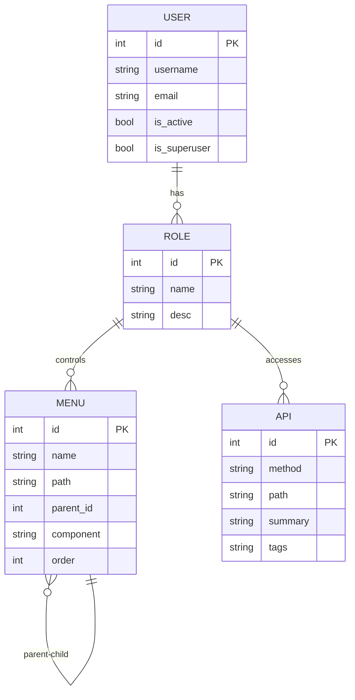
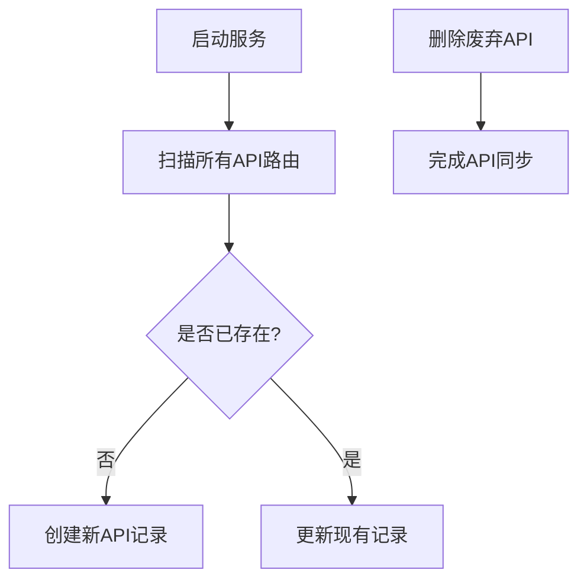
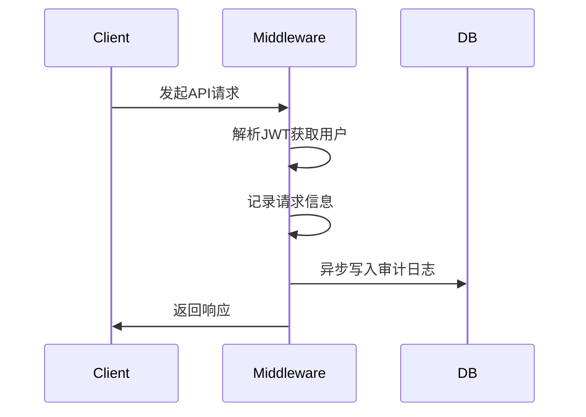
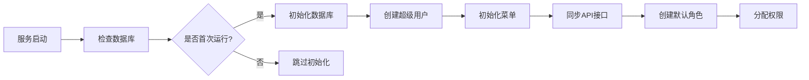
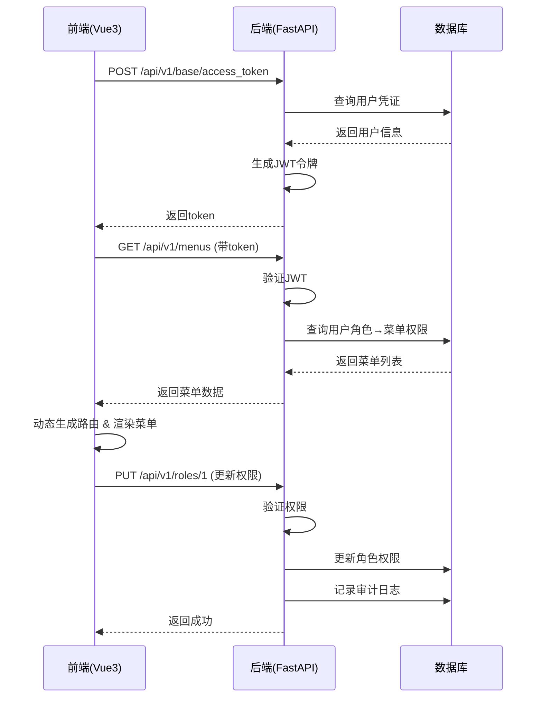

# 系统概述

<cite>
**本文档引用的文件**  
- [README.md](file://README.md)
- [run.py](file://run.py)
- [pyproject.toml](file://pyproject.toml)
- [web/package.json](file://web/package.json)
- [app/core/init_app.py](file://app/core/init_app.py)
- [app/controllers/user.py](file://app/controllers/user.py)
- [app/controllers/role.py](file://app/controllers/role.py)
- [app/controllers/menu.py](file://app/controllers/menu.py)
- [app/controllers/api.py](file://app/controllers/api.py)
</cite>

## 目录

1. [项目定位与核心目标](#项目定位与核心目标)  
2. [关键特性详解](#关键特性详解)  
   - [RBAC 权限管理系统](#rbac-权限管理系统)  
   - [动态配置能力](#动态配置能力)  
   - [JWT 鉴权机制](#jwt-鉴权机制)  
   - [审计日志功能](#审计日志功能)  
   - [动态路由支持](#动态路由支持)  
3. [设计哲学](#设计哲学)  
   - [前后端分离架构](#前后端分离架构)  
   - [模块化设计](#模块化设计)  
   - [开箱即用特性](#开箱即用特性)  
4. [系统初始化机制](#系统初始化机制)  
5. [前后端协同工作流程](#前后端协同工作流程)  
6. [典型用户工作流示例](#典型用户工作流示例)  
7. [适用场景与扩展潜力](#适用场景与扩展潜力)  

## 项目定位与核心目标

`vue-fastapi-admin` 是一个基于 FastAPI 和 Vue3 的现代化全栈后台管理系统，旨在为中小型应用提供一个高性能、高安全性和易扩展的开发平台。该项目融合了 RBAC（基于角色的访问控制）权限模型、JWT 鉴权、动态路由、审计日志等企业级功能，适用于需要精细化权限管理的后台系统建设。

其核心目标是：
- 提供一套开箱即用的后台管理解决方案
- 实现前后端完全分离，便于团队协作开发
- 支持细粒度的权限控制（按钮级与接口级）
- 提供良好的可维护性与可扩展性
- 降低开发者搭建后台系统的成本和时间

**Section sources**  
- [README.md](file://README.md#L1-L245)

## 关键特性详解

### RBAC 权限管理系统

本系统采用标准的 RBAC（Role-Based Access Control）权限模型，通过用户、角色、菜单、API 接口四者之间的关联实现灵活的权限分配。每个用户可拥有多个角色，每个角色可被赋予多个菜单和 API 接口权限，从而实现多维度的权限控制。

**Diagram sources**  
- [app/models/admin.py](file://app/models/admin.py)  
- [app/controllers/user.py](file://app/controllers/user.py#L1-L60)  
- [app/controllers/role.py](file://app/controllers/role.py#L1-L27)

### 动态配置能力

系统支持对用户、角色、菜单、API 接口进行动态配置，所有权限信息均存储于数据库中，无需重启服务即可生效。

- **用户管理**：支持创建、编辑、禁用用户，并为其分配角色
- **角色管理**：可自定义角色名称与描述，并动态绑定菜单与 API 权限
- **菜单管理**：支持多级菜单结构，可配置路径、组件、图标、是否缓存等属性
- **API 管理**：系统自动扫描所有带鉴权的路由并同步至数据库，支持手动刷新

**Diagram sources**  
- [app/controllers/api.py](file://app/controllers/api.py#L1-L45)  
- [app/core/init_app.py](file://app/core/init_app.py#L200-L233)

### JWT 鉴权机制

系统使用 JSON Web Token (JWT) 进行身份验证和授权，确保接口调用的安全性。用户登录后，服务端生成包含用户ID、角色信息的 JWT 令牌，前端在后续请求中携带该令牌进行鉴权。

关键实现位于：
- 后端 JWT 工具类：`app/utils/jwt_utils.py`
- 登录接口：`app/api/v1/base/base.py`
- 路由依赖注入：通过 `Depends` 实现权限校验

**Section sources**  
- [pyproject.toml](file://pyproject.toml#L1-L89)  
- [app/utils/jwt_utils.py](file://app/utils/jwt_utils.py)

### 审计日志功能

系统内置审计日志中间件，自动记录所有关键操作（GET、POST、PUT、DELETE），包括：
- 请求方法与路径
- 客户端IP地址
- 用户身份信息
- 请求时间戳

日志记录被排除 `/docs`、`/openapi.json` 和登录接口，避免冗余数据。

**Diagram sources**  
- [app/core/middlewares.py](file://app/core/middlewares.py)  
- [app/core/init_app.py](file://app/core/init_app.py#L30-L45)

### 动态路由支持

前端 Vue3 应用根据用户角色权限动态生成路由表。用户登录后，后端返回其可访问的菜单列表，前端据此构建路由并渲染侧边栏。

实现流程：
1. 用户登录成功
2. 请求 `/api/v1/menus` 获取授权菜单
3. 前端解析菜单结构并生成路由
4. 渲染导航菜单与页面组件

**Section sources**  
- [web/src/router/guard/auth-guard.js](file://web/src/router/guard/auth-guard.js)  
- [app/api/v1/menus/menus.py](file://app/api/v1/menus/menus.py)

## 设计哲学

### 前后端分离架构

项目采用典型的前后端分离架构：
- **后端**：FastAPI 提供 RESTful API，处理业务逻辑与数据持久化
- **前端**：Vue3 + Vite 构建 SPA 应用，负责 UI 渲染与用户交互
- **通信**：通过 HTTP/HTTPS 协议交互，使用 JSON 格式传输数据

这种架构提高了系统的可维护性、可测试性和部署灵活性。

**Section sources**  
- [run.py](file://run.py#L1-L13)  
- [web/package.json](file://web/package.json#L1-L60)

### 模块化设计

项目采用清晰的模块化设计，各功能模块职责分明：
- `app/api`：API 接口定义
- `app/controllers`：业务逻辑处理
- `app/models`：数据库模型
- `app/schemas`：数据序列化结构
- `app/utils`：工具函数
- `web/src`：前端源码

这种设计便于代码复用与团队协作开发。

**Section sources**  
- [README.md](file://README.md#L200-L245)  
- [app/__init__.py](file://app/__init__.py)

### 开箱即用特性

项目提供“开箱即用”的体验，开发者无需手动初始化基础数据。系统在首次启动时会自动执行以下操作：
- 创建超级管理员账户（用户名：admin，密码：123456）
- 初始化系统管理菜单（用户、角色、菜单、API 等）
- 扫描并注册所有 API 接口
- 创建默认角色（管理员、普通用户）并分配权限

这些逻辑封装在 `app/core/init_app.py` 的 `init_data()` 函数中。

**Diagram sources**  
- [app/core/init_app.py](file://app/core/init_app.py#L150-L233)

## 系统初始化机制

系统通过 `init_data()` 异步函数实现自动初始化，该函数在应用启动时被调用。其主要步骤包括：

1. **数据库初始化**：使用 Aerich 进行 ORM 映射与迁移
2. **超级用户创建**：若无用户存在，则创建 admin 账户
3. **菜单初始化**：构建“系统管理”主菜单及其子菜单
4. **API 同步**：扫描所有带依赖的路由并存入数据库
5. **角色初始化**：创建“管理员”和“普通用户”角色，并分配相应权限

此机制确保了系统部署后可立即使用，极大提升了开发效率。

**Section sources**  
- [app/core/init_app.py](file://app/core/init_app.py#L150-L233)

## 前后端协同工作流程

前后端通过标准化接口进行协作，典型交互流程如下：

**Diagram sources**  
- [app/api/v1/base/base.py](file://app/api/v1/base/base.py)  
- [app/api/v1/roles/roles.py](file://app/api/v1/roles/roles.py)  
- [web/src/router/guard/auth-guard.js](file://web/src/router/guard/auth-guard.js)

## 典型用户工作流示例

以管理员创建角色并分配权限为例：

1. **登录系统**  
   管理员使用 `admin/123456` 登录。

2. **进入角色管理页面**  
   点击“系统管理 → 角色管理”。

3. **创建新角色**  
   点击“新增”，填写角色名称（如“财务专员”）和描述。

4. **分配菜单权限**  
   在弹窗中选择“菜单权限”标签，勾选“财务报表”、“费用审批”等菜单。

5. **分配API权限**  
   切换到“API权限”标签，选择对应接口（如 `GET /api/v1/finance/report`）。

6. **保存并生效**  
   点击“确定”，系统调用 `/api/v1/roles` 接口更新权限，立即生效。

7. **验证权限**  
   使用具有该角色的用户登录，仅能访问已授权的菜单与接口。

**Section sources**  
- [app/controllers/role.py](file://app/controllers/role.py#L1-L27)  
- [web/src/views/system/role/index.vue](file://web/src/views/system/role/index.vue)

## 适用场景与扩展潜力

### 适用场景
- 中小型企业的后台管理系统
- 需要精细化权限控制的应用平台
- 快速原型开发与学习参考
- 微服务架构中的统一管理门户

### 扩展潜力
- **集成 OAuth2 / SSO**：可扩展支持第三方登录
- **多租户支持**：通过数据库隔离实现 SaaS 化
- **工作流引擎**：集成审批流、任务调度等功能
- **微前端架构**：支持多团队协作开发大型系统
- **国际化增强**：完善多语言支持

该项目结构清晰、文档完整、技术栈现代，具备良好的可维护性与扩展性，是构建企业级后台系统的理想选择。

**Section sources**  
- [README.md](file://README.md#L1-L245)  
- [pyproject.toml](file://pyproject.toml#L1-L89)  
- [web/package.json](file://web/package.json#L1-L60)