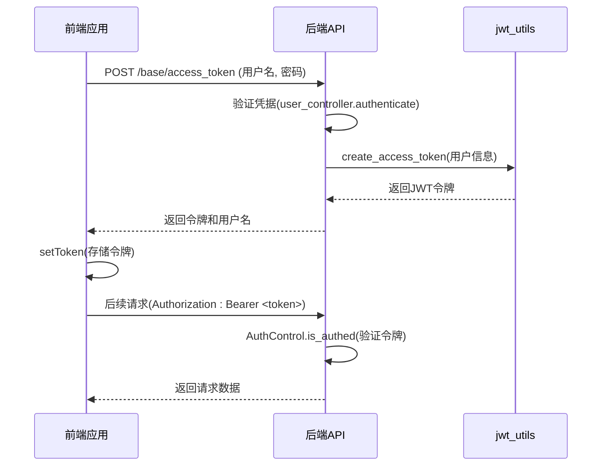
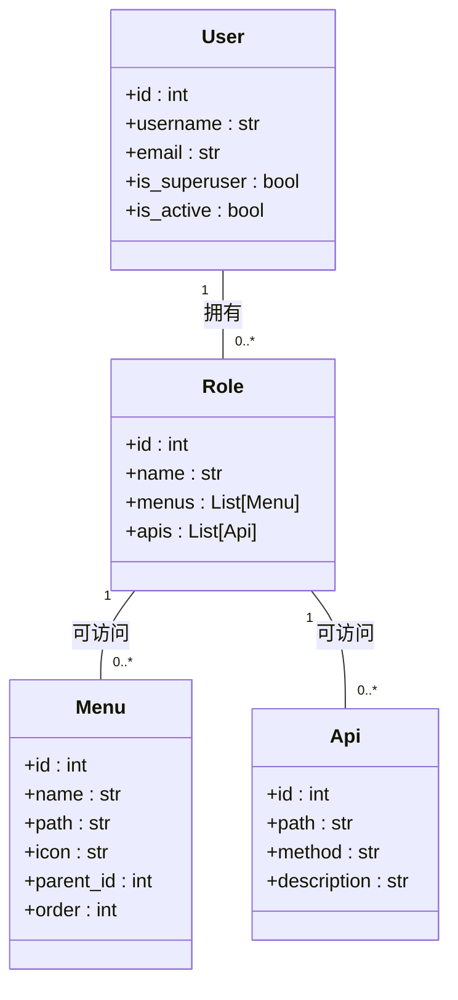
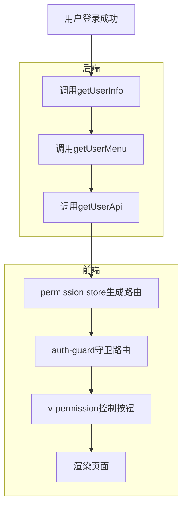
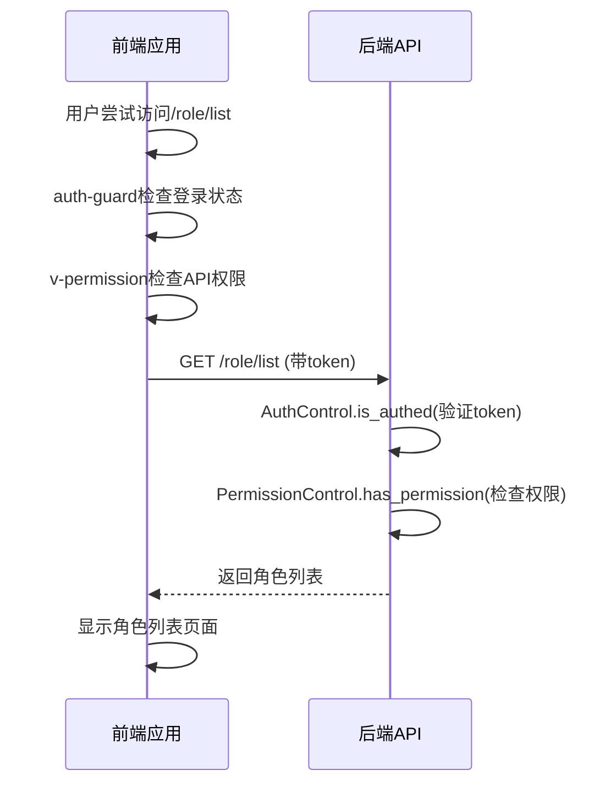

# 认证与权限体系

<cite>
**本文档引用文件**  
- [jwt_utils.py](file://app/utils/jwt_utils.py)
- [users.py](file://app/api/v1/users/users.py)
- [user.py](file://app/controllers/user.py)
- [login.py](file://app/schemas/login.py)
- [token.js](file://web/src/utils/auth/token.js)
- [permission.js](file://web/src/store/modules/permission/index.js)
- [auth-guard.js](file://web/src/router/guard/auth-guard.js)
- [permission.js](file://web/src/directives/permission.js)
- [base.py](file://app/api/v1/base/base.py)
- [dependency.py](file://app/core/dependency.py)
- [menu.py](file://app/controllers/menu.py)
- [role.py](file://app/controllers/role.py)
- [user.js](file://web/src/store/modules/user/index.js)
- [index.js](file://web/src/api/index.js)
- [menus.py](file://app/api/v1/menus/menus.py)
</cite>

## 目录
1. [简介](#简介)
2. [JWT认证流程](#jwt认证流程)
3. [RBAC权限模型](#rbac权限模型)
4. [前后端权限同步机制](#前后端权限同步机制)
5. [双重校验安全机制](#双重校验安全机制)

## 简介
本系统采用基于JWT的无状态认证机制与RBAC（基于角色的访问控制）权限模型，实现前后端分离架构下的安全访问控制。系统通过JWT令牌传递用户身份信息，并结合角色绑定菜单与API权限，实现细粒度的访问控制。

## JWT认证流程

系统采用标准JWT（JSON Web Token）实现用户认证，完整流程如下：

1. **前端登录请求**：用户在登录页面输入用户名和密码，前端通过`/base/access_token`接口提交凭据。
2. **后端验证凭据**：后端调用`user_controller.authenticate()`方法验证用户名和密码，若验证失败则返回相应错误。
3. **生成JWT令牌**：验证通过后，系统调用`jwt_utils.create_access_token()`生成包含用户ID、用户名、是否为超级管理员及过期时间的JWT令牌。
4. **前端存储令牌**：前端收到令牌后，调用`setToken()`方法将令牌存储在localStorage中。
5. **后续请求携带令牌**：前端在后续所有请求的Authorization头中携带该令牌。

**图示来源**
- [base.py](file://app/api/v1/base/base.py#L15-L45)
- [jwt_utils.py](file://app/utils/jwt_utils.py#L4-L10)
- [user.py](file://app/controllers/user.py#L25-L40)
- [token.js](file://web/src/utils/auth/token.js#L7-L12)

**本节来源**
- [base.py](file://app/api/v1/base/base.py#L15-L45)
- [jwt_utils.py](file://app/utils/jwt_utils.py#L4-L10)
- [user.py](file://app/controllers/user.py#L25-L40)
- [token.js](file://web/src/utils/auth/token.js#L7-L12)

## RBAC权限模型

系统采用RBAC（基于角色的访问控制）模型，通过角色将用户与权限解耦，实现灵活的权限管理。

### 模型结构
- **用户(User)**：系统使用者，可被赋予一个或多个角色
- **角色(Role)**：权限集合，包含可访问的菜单和API
- **菜单(Menu)**：前端导航菜单项，具有层级结构
- **API(Api)**：后端接口，包含路径和HTTP方法

### 权限分配流程
1. 管理员创建角色并配置该角色可访问的菜单和API
2. 将角色分配给用户
3. 用户登录后，系统根据其角色获取对应的菜单和API权限

**图示来源**
- [role.py](file://app/controllers/role.py#L15-L25)
- [menu.py](file://app/controllers/menu.py#L1-L15)
- [user.py](file://app/controllers/user.py#L1-L15)

**本节来源**
- [role.py](file://app/controllers/role.py#L15-L25)
- [menu.py](file://app/controllers/menu.py#L1-L15)
- [user.py](file://app/controllers/user.py#L1-L15)

## 前后端权限同步机制

系统通过一系列流程实现前后端权限的同步，确保用户只能访问其被授权的资源。

### 权限同步流程
1. **获取用户信息**：用户登录成功后，前端调用`getUserInfo()`获取用户基本信息
2. **获取权限菜单**：前端调用`getUserMenu()`接口，后端根据用户角色返回可访问的菜单列表
3. **动态生成路由**：前端`permission` store解析菜单数据，动态生成路由配置
4. **路由守卫拦截**：`auth-guard`在路由跳转前检查用户是否已登录，拦截未授权访问
5. **按钮级权限控制**：`v-permission`指令根据用户API权限控制页面内按钮的显示

**图示来源**
- [permission.js](file://web/src/store/modules/permission/index.js#L30-L70)
- [auth-guard.js](file://web/src/router/guard/auth-guard.js#L5-L15)
- [permission.js](file://web/src/directives/permission.js#L1-L25)
- [base.py](file://app/api/v1/base/base.py#L47-L75)

**本节来源**
- [permission.js](file://web/src/store/modules/permission/index.js#L30-L70)
- [auth-guard.js](file://web/src/router/guard/auth-guard.js#L5-L15)
- [permission.js](file://web/src/directives/permission.js#L1-L25)
- [base.py](file://app/api/v1/base/base.py#L47-L75)
- [index.js](file://web/src/api/index.js#L5-L8)

## 双重校验安全机制

系统采用前后端双重校验机制，确保系统的安全性。

### 前端校验
- **路由级校验**：`auth-guard`守卫确保未登录用户无法访问受保护路由
- **菜单级校验**：`permission` store仅生成用户有权访问的路由
- **按钮级校验**：`v-permission`指令隐藏用户无权操作的按钮

### 后端校验
- **身份认证**：`DependAuth`依赖确保所有受保护接口都经过JWT验证
- **权限校验**：`DependPermission`检查当前用户是否有权访问特定API
- **超级管理员特权**：超级管理员拥有所有权限，不受角色限制

**图示来源**
- [dependency.py](file://app/core/dependency.py#L15-L50)
- [auth-guard.js](file://web/src/router/guard/auth-guard.js#L5-L15)
- [permission.js](file://web/src/directives/permission.js#L1-L25)

**本节来源**
- [dependency.py](file://app/core/dependency.py#L15-L50)
- [auth-guard.js](file://web/src/router/guard/auth-guard.js#L5-L15)
- [permission.js](file://web/src/directives/permission.js#L1-L25)