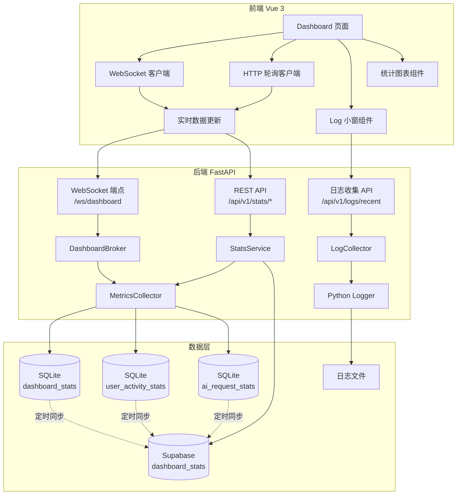
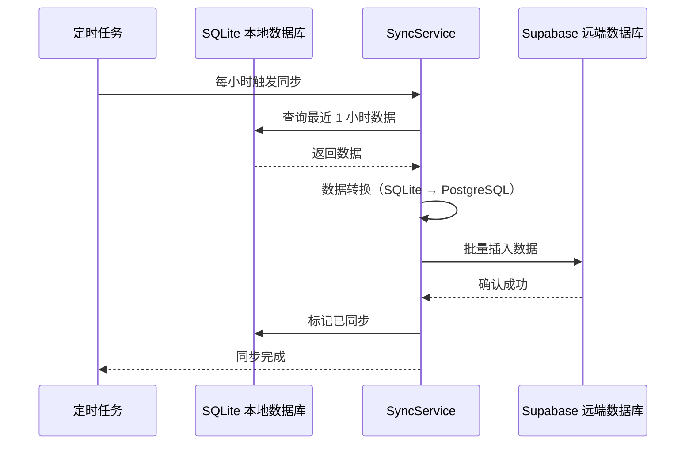

# Dashboard 重构 - 顶层架构设计

**文档版本**: v1.0  
**创建时间**: 2025-01-11  
**状态**: 待用户确认

---

## 📋 文档目的

本文档基于用户确认的需求（`CONFIRMATION_CHECKLIST.md`），提供完整的技术架构设计，包括：
- 系统架构图
- 数据流设计
- API 变更清单
- 数据库变更清单
- 组件变更清单
- 路由与菜单变更清单

---

## 🏗️ 系统架构图

### 整体架构（Mermaid 图）



### 数据流设计

```
┌─────────────────────────────────────────────────────────────────┐
│ 前端 Dashboard 页面                                              │
│                                                                  │
│  ┌──────────────┐  ┌──────────────┐  ┌──────────────┐          │
│  │ 统计横幅     │  │ Log 小窗     │  │ 用户管理中心 │          │
│  │ (5个指标)    │  │ (ERROR/WARN) │  │ (图表)       │          │
│  └──────┬───────┘  └──────┬───────┘  └──────┬───────┘          │
│         │                  │                  │                  │
│         └──────────────────┴──────────────────┘                  │
│                            │                                     │
└────────────────────────────┼─────────────────────────────────────┘
                             │
                ┌────────────┴────────────┐
                │                         │
         WebSocket 连接            HTTP 轮询 (降级)
                │                         │
┌───────────────┼─────────────────────────┼───────────────────────┐
│ 后端 FastAPI  │                         │                        │
│               ▼                         ▼                        │
│  ┌─────────────────────┐   ┌─────────────────────┐             │
│  │ /ws/dashboard       │   │ /api/v1/stats/*     │             │
│  │ (实时推送)          │   │ (REST API)          │             │
│  └──────────┬──────────┘   └──────────┬──────────┘             │
│             │                          │                        │
│             └──────────┬───────────────┘                        │
│                        ▼                                        │
│              ┌──────────────────┐                               │
│              │ MetricsCollector │                               │
│              │ (聚合统计数据)   │                               │
│              └────────┬─────────┘                               │
│                       │                                         │
└───────────────────────┼─────────────────────────────────────────┘
                        │
        ┌───────────────┼───────────────┐
        │               │               │
        ▼               ▼               ▼
┌──────────────┐ ┌──────────────┐ ┌──────────────┐
│ SQLite       │ │ SQLite       │ │ SQLite       │
│ dashboard_   │ │ user_        │ │ ai_request_  │
│ stats        │ │ activity_    │ │ stats        │
│              │ │ stats        │ │              │
└──────┬───────┘ └──────┬───────┘ └──────┬───────┘
       │                │                │
       └────────────────┴────────────────┘
                        │
                        │ 定时同步 (每小时)
                        ▼
                ┌──────────────┐
                │ Supabase     │
                │ dashboard_   │
                │ stats        │
                └──────────────┘
```

---

## 🔑 关键技术决策

### 1. WebSocket vs 轮询（双模式）

**决策**：WebSocket 主模式 + HTTP 轮询降级

**理由**：
- **YAGNI**：用户要求"可配置轮询间隔"，说明需要灵活性
- **SSOT**：WebSocket 和轮询共享同一个数据源（`MetricsCollector`）
- **KISS**：复用现有 SSE 基础设施（`MessageEventBroker` 模式）

**实现**：
```python
# 后端：WebSocket 端点
@router.websocket("/ws/dashboard")
async def dashboard_websocket(websocket: WebSocket):
    await websocket.accept()
    try:
        while True:
            stats = await get_dashboard_stats()
            await websocket.send_json(stats)
            await asyncio.sleep(10)  # 默认 10 秒推送
    except WebSocketDisconnect:
        pass
```

```javascript
// 前端：自动降级逻辑
const connectWebSocket = () => {
  const ws = new WebSocket('ws://localhost:9999/ws/dashboard')
  ws.onmessage = (event) => updateStats(JSON.parse(event.data))
  ws.onerror = () => {
    console.warn('WebSocket 连接失败，降级为轮询')
    startPolling()  // 降级为 HTTP 轮询
  }
}
```

---

### 2. 本地优先 + 远端备份

**决策**：SQLite 本地存储 + Supabase 定时同步

**理由**：
- **YAGNI**：用户明确要求"本地优先，远端备份"
- **SSOT**：本地 SQLite 是唯一写入源，Supabase 只读备份
- **KISS**：复用现有 `AIConfigService` 的同步机制

**数据保留策略**：
- **本地**：保留 30 天（自动清理过期数据）
- **远端**：保留 30 天（Supabase RLS 策略自动清理）

**同步策略**：
- **频率**：每小时同步一次（定时任务）
- **方向**：单向推送（本地 → Supabase）
- **失败处理**：记录错误日志，下次重试

---

### 3. 日志收集（Python Logger）

**决策**：后端 Python logger 输出 + 新增日志收集 API

**理由**：
- **YAGNI**：用户要求"后端 Python logger 输出"
- **SSOT**：所有日志统一通过 Python `logging` 模块输出
- **KISS**：使用内存队列缓存最近 100 条日志，无需数据库

**实现**：
```python
# 后端：日志收集器
class LogCollector:
    def __init__(self, max_size=100):
        self.logs = deque(maxlen=max_size)
        self.handler = LogHandler(self.logs)
        logging.getLogger().addHandler(self.handler)
    
    def get_recent_logs(self, level='WARNING'):
        return [log for log in self.logs if log['level'] >= level]
```

---

## 📊 数据统计实现方案

### 1. 日活监控（JWT 活跃用户数）

**数据来源**：SQLite `user_activity_stats` 表

**统计逻辑**：
```python
# 每次 JWT 验证成功时记录
async def record_user_activity(user_id: str, user_type: str):
    today = datetime.now().date()
    await db.execute("""
        INSERT INTO user_activity_stats (user_id, user_type, activity_date, request_count)
        VALUES (?, ?, ?, 1)
        ON CONFLICT(user_id, activity_date) 
        DO UPDATE SET request_count = request_count + 1
    """, [user_id, user_type, today])
```

**查询 API**：
```python
@router.get("/stats/daily-active-users")
async def get_daily_active_users(time_window: str = "24h"):
    # 返回指定时间窗口内的活跃用户数
    pass
```

---

### 2. AI 请求数量

**数据来源**：SQLite `ai_request_stats` 表

**统计逻辑**：
```python
# 每次 AI 请求时记录
async def record_ai_request(user_id: str, endpoint_id: int, model: str):
    today = datetime.now().date()
    await db.execute("""
        INSERT INTO ai_request_stats (user_id, endpoint_id, model, request_date, count)
        VALUES (?, ?, ?, ?, 1)
        ON CONFLICT(user_id, endpoint_id, model, request_date)
        DO UPDATE SET count = count + 1
    """, [user_id, endpoint_id, model, today])
```

---

### 3. Token 使用量（后续追加）

**状态**：本次重构不实现，预留接口

**预留 API**：
```python
@router.get("/stats/token-usage")
async def get_token_usage():
    return {"message": "Token 统计功能将在后续版本实现"}
```

---

### 4. API 连通性

**数据来源**：复用现有 `/api/v1/llm/monitor/status`

**实现**：
```python
@router.get("/stats/api-connectivity")
async def get_api_connectivity(request: Request):
    monitor = get_monitor(request)
    status = monitor.snapshot()
    return {
        "is_running": status["is_running"],
        "healthy_endpoints": sum(1 for e in models if e.status == "online"),
        "total_endpoints": len(models),
        "last_check": status["last_run_at"]
    }
```

---

### 5. JWT 可获取性

**数据来源**：新增 `/api/v1/stats/jwt-availability`

**统计逻辑**：
```python
# 从 Prometheus 指标计算成功率
@router.get("/stats/jwt-availability")
async def get_jwt_availability():
    total = auth_requests_total._value.sum()
    success = auth_requests_total.labels(status='success')._value.sum()
    return {
        "success_rate": (success / total * 100) if total > 0 else 0,
        "total_requests": total,
        "successful_requests": success
    }
```

---

## 🗄️ 数据库变更清单

### SQLite 新增表（3 张）

#### 1. `dashboard_stats` - Dashboard 统计数据缓存表

```sql
CREATE TABLE dashboard_stats (
    id INTEGER PRIMARY KEY AUTOINCREMENT,
    stat_type TEXT NOT NULL,  -- 'daily_active_users', 'ai_requests', 'api_connectivity', 'jwt_availability'
    stat_value REAL NOT NULL,
    stat_metadata TEXT,  -- JSON 格式，存储额外信息
    time_window TEXT,  -- '1h', '24h', '7d'
    created_at TEXT DEFAULT CURRENT_TIMESTAMP,
    updated_at TEXT DEFAULT CURRENT_TIMESTAMP
);

CREATE INDEX idx_dashboard_stats_type ON dashboard_stats(stat_type);
CREATE INDEX idx_dashboard_stats_created ON dashboard_stats(created_at);
```

**用途**：缓存聚合后的统计数据，减少实时计算压力

---

#### 2. `user_activity_stats` - 用户活跃度统计表

```sql
CREATE TABLE user_activity_stats (
    id INTEGER PRIMARY KEY AUTOINCREMENT,
    user_id TEXT NOT NULL,
    user_type TEXT NOT NULL,  -- 'anonymous', 'permanent'
    activity_date TEXT NOT NULL,  -- YYYY-MM-DD
    request_count INTEGER DEFAULT 1,
    first_request_at TEXT DEFAULT CURRENT_TIMESTAMP,
    last_request_at TEXT DEFAULT CURRENT_TIMESTAMP,
    created_at TEXT DEFAULT CURRENT_TIMESTAMP,
    UNIQUE(user_id, activity_date)
);

CREATE INDEX idx_user_activity_date ON user_activity_stats(activity_date);
CREATE INDEX idx_user_activity_type ON user_activity_stats(user_type);
```

**用途**：记录每日用户活跃度，支持日活统计

---

#### 3. `ai_request_stats` - AI 请求统计表

```sql
CREATE TABLE ai_request_stats (
    id INTEGER PRIMARY KEY AUTOINCREMENT,
    user_id TEXT NOT NULL,
    endpoint_id INTEGER,
    model TEXT,
    request_date TEXT NOT NULL,  -- YYYY-MM-DD
    count INTEGER DEFAULT 1,
    total_latency_ms REAL DEFAULT 0,
    success_count INTEGER DEFAULT 0,
    error_count INTEGER DEFAULT 0,
    created_at TEXT DEFAULT CURRENT_TIMESTAMP,
    updated_at TEXT DEFAULT CURRENT_TIMESTAMP,
    UNIQUE(user_id, endpoint_id, model, request_date),
    FOREIGN KEY(endpoint_id) REFERENCES ai_endpoints(id) ON DELETE SET NULL
);

CREATE INDEX idx_ai_request_date ON ai_request_stats(request_date);
CREATE INDEX idx_ai_request_endpoint ON ai_request_stats(endpoint_id);
```

**用途**：记录 AI 请求统计，支持请求量、成功率、延迟分析

---

### Supabase 新增表（1 张）

#### `dashboard_stats` - 远端备份表

```sql
CREATE TABLE public.dashboard_stats (
    id UUID DEFAULT gen_random_uuid() PRIMARY KEY,
    stat_type TEXT NOT NULL,
    stat_value REAL NOT NULL,
    stat_metadata JSONB,
    time_window TEXT,
    source TEXT DEFAULT 'local_sqlite',  -- 数据来源标识
    synced_at TIMESTAMPTZ DEFAULT NOW(),
    created_at TIMESTAMPTZ DEFAULT NOW()
);

CREATE INDEX idx_dashboard_stats_type ON public.dashboard_stats(stat_type);
CREATE INDEX idx_dashboard_stats_synced ON public.dashboard_stats(synced_at);

-- RLS 策略：30 天自动清理
CREATE POLICY "auto_delete_old_stats" ON public.dashboard_stats
FOR DELETE USING (synced_at < NOW() - INTERVAL '30 days');
```

**用途**：远端备份，支持跨设备数据同步

---

### 数据迁移策略

**迁移脚本**：`scripts/migrate_dashboard_stats.py`

```python
async def migrate():
    # 1. 创建 SQLite 表
    await sqlite_manager.execute(CREATE_DASHBOARD_STATS_SQL)
    await sqlite_manager.execute(CREATE_USER_ACTIVITY_STATS_SQL)
    await sqlite_manager.execute(CREATE_AI_REQUEST_STATS_SQL)
    
    # 2. 创建 Supabase 表（手动执行 SQL）
    print("请在 Supabase Dashboard 执行以下 SQL:")
    print(CREATE_SUPABASE_DASHBOARD_STATS_SQL)
    
    # 3. 初始化数据（可选）
    await init_dashboard_stats()
```

**回滚方案**：
```sql
-- SQLite 回滚
DROP TABLE IF EXISTS dashboard_stats;
DROP TABLE IF EXISTS user_activity_stats;
DROP TABLE IF EXISTS ai_request_stats;

-- Supabase 回滚
DROP TABLE IF EXISTS public.dashboard_stats;
```

---

## 📡 API 变更清单

### 新增 API 端点（8 个）

| 端点 | 方法 | 功能 | 优先级 | 认证 |
|------|------|------|--------|------|
| `/ws/dashboard` | WebSocket | Dashboard 实时数据推送 | P0 | JWT |
| `/api/v1/stats/dashboard` | GET | 聚合所有统计数据 | P0 | JWT |
| `/api/v1/stats/daily-active-users` | GET | 日活用户数 | P0 | JWT |
| `/api/v1/stats/ai-requests` | GET | AI 请求统计 | P0 | JWT |
| `/api/v1/stats/api-connectivity` | GET | API 连通性状态 | P0 | JWT |
| `/api/v1/stats/jwt-availability` | GET | JWT 可获取性 | P0 | JWT |
| `/api/v1/logs/recent` | GET | 最近日志 | P1 | JWT |
| `/api/v1/stats/config` | GET/PUT | 轮询间隔配置 | P1 | JWT |

---

### API 详细设计

#### 1. WebSocket 端点

**路径**：`/ws/dashboard`  
**协议**：WebSocket  
**认证**：JWT（通过查询参数 `?token=xxx`）

**连接流程**：
```javascript
// 前端
const ws = new WebSocket(`ws://localhost:9999/ws/dashboard?token=${token}`)
ws.onmessage = (event) => {
  const data = JSON.parse(event.data)
  updateDashboard(data)
}
```

**推送数据格式**：
```json
{
  "timestamp": "2025-01-11T10:30:00Z",
  "daily_active_users": 1234,
  "ai_requests": 5678,
  "api_connectivity": {
    "healthy": 8,
    "total": 10,
    "rate": 0.8
  },
  "jwt_availability": {
    "success_rate": 99.5,
    "total_requests": 10000
  }
}
```

---

#### 2. 聚合统计 API

**路径**：`GET /api/v1/stats/dashboard`  
**参数**：
- `time_window` (可选): `1h` | `24h` | `7d`（默认 `24h`）

**响应**：
```json
{
  "code": 200,
  "data": {
    "daily_active_users": 1234,
    "ai_requests": 5678,
    "token_usage": null,  // 后续追加
    "api_connectivity": {...},
    "jwt_availability": {...}
  }
}
```

---

#### 3. 日志查询 API

**路径**：`GET /api/v1/logs/recent`  
**参数**：
- `level` (可选): `ERROR` | `WARNING` | `INFO`（默认 `WARNING`）
- `limit` (可选): 最大返回条数（默认 100）

**响应**：
```json
{
  "code": 200,
  "data": [
    {
      "timestamp": "2025-01-11T10:30:00Z",
      "level": "ERROR",
      "user_id": "user-123",
      "message": "JWT validation failed"
    }
  ]
}
```

---

## 🎨 组件变更清单

### 新增 Vue 组件（6 个）

| 组件路径 | 功能 | 优先级 | 依赖 |
|---------|------|--------|------|
| `web/src/components/dashboard/StatsBanner.vue` | 统计横幅（5 个指标） | P0 | Naive UI |
| `web/src/components/dashboard/LogWindow.vue` | Log 小窗 | P1 | Naive UI |
| `web/src/components/dashboard/UserActivityChart.vue` | 用户活跃度图表 | P0 | ECharts |
| `web/src/components/dashboard/WebSocketClient.vue` | WebSocket 客户端封装 | P0 | - |
| `web/src/components/dashboard/PollingConfig.vue` | 轮询间隔配置 | P1 | Naive UI |
| `web/src/components/dashboard/RealTimeIndicator.vue` | 实时状态指示器 | P1 | Naive UI |

---

### 修改 Vue 组件（3 个）

| 组件路径 | 修改内容 | 优先级 |
|---------|---------|--------|
| `web/src/views/dashboard/index.vue` | 整合新组件，替换轮询为 WebSocket | P0 |
| `web/src/layout/components/sidebar/index.vue` | 新增 Log 小窗入口 | P1 |
| `web/src/api/index.js` | 新增统计 API 封装 | P0 |

---

### 删除 Vue 组件（1 个）

| 组件路径 | 删除原因 |
|---------|---------|
| `web/src/views/ai/model-suite/dashboard/index.vue` | 与主 Dashboard 重复（SSOT 合规） |

---

## 🛣️ 路由与菜单变更清单

### 新增路由（4 个）

```javascript
// web/src/router/routes/dashboard.js
export default {
  name: 'Dashboard',
  path: '/dashboard',
  component: Layout,
  redirect: '/dashboard/index',
  meta: { title: 'Dashboard', icon: 'mdi:view-dashboard', order: 0 },
  children: [
    {
      path: 'index',
      name: 'DashboardIndex',
      component: () => import('@/views/dashboard/index.vue'),
      meta: { title: 'Dashboard', affix: true }
    },
    {
      path: 'logs',
      name: 'DashboardLogs',
      component: () => import('@/views/dashboard/logs.vue'),
      meta: { title: '审计日志', icon: 'mdi:file-document-outline' }
    },
    {
      path: 'user-activity',
      name: 'DashboardUserActivity',
      component: () => import('@/views/dashboard/user-activity.vue'),
      meta: { title: '用户活跃度', icon: 'mdi:account-group' }
    },
    {
      path: 'settings',
      name: 'DashboardSettings',
      component: () => import('@/views/dashboard/settings.vue'),
      meta: { title: 'Dashboard 设置', icon: 'mdi:cog' }
    }
  ]
}
```

---

### 修改路由（2 个）

| 路由 | 修改内容 |
|------|---------|
| `/` | 重定向从 `/login` 改为 `/dashboard`（登录后默认页） |
| `/ai/model-suite/dashboard` | 删除（重定向到 `/dashboard`） |

---

### 新菜单结构

```javascript
// 后端返回的菜单结构（/api/v1/base/usermenu）
[
  {
    "name": "Dashboard",
    "path": "/dashboard",
    "icon": "mdi:view-dashboard",
    "order": 0,
    "children": []
  },
  {
    "name": "用户管理中心",
    "path": "/user-center",
    "icon": "mdi:account-group",
    "order": 1,
    "children": [
      { "name": "用户列表", "path": "/system/user" },
      { "name": "部门管理", "path": "/system/dept" },
      { "name": "活跃度监控", "path": "/dashboard/user-activity" }
    ]
  },
  {
    "name": "权限管理",
    "path": "/permission",
    "icon": "mdi:shield-account",
    "order": 2,
    "children": [
      { "name": "角色管理", "path": "/system/role" },
      { "name": "菜单管理", "path": "/system/menu" },
      { "name": "API 权限", "path": "/system/api" }
    ]
  },
  {
    "name": "模型管理",
    "path": "/model",
    "icon": "mdi:robot",
    "order": 3,
    "children": [
      { "name": "API 供应商", "path": "/system/ai" },
      { "name": "模型目录", "path": "/ai/catalog" },
      { "name": "模型映射", "path": "/ai/mapping" }
    ]
  },
  {
    "name": "JWT 测试",
    "path": "/ai/jwt",
    "icon": "mdi:key",
    "order": 4
  },
  {
    "name": "Prompt 管理",
    "path": "/system/ai/prompt",
    "icon": "mdi:text-box",
    "order": 5
  },
  {
    "name": "审计日志",
    "path": "/dashboard/logs",
    "icon": "mdi:file-document-outline",
    "order": 6
  }
]
```

---

## 🔐 权限控制设计

### API 权限要求

| API 端点 | 最低权限 | 说明 |
|---------|---------|------|
| `/ws/dashboard` | `permanent` 用户 | 匿名用户禁止访问 |
| `/api/v1/stats/*` | `permanent` 用户 | 匿名用户禁止访问 |
| `/api/v1/logs/recent` | `admin` 角色 | 仅管理员可查看日志 |
| `/api/v1/stats/config` | `admin` 角色 | 仅管理员可修改配置 |

### 前端路由守卫

```javascript
// web/src/router/guards.js
router.beforeEach((to, from, next) => {
  const userStore = useUserStore()

  // Dashboard 路由需要永久用户权限
  if (to.path.startsWith('/dashboard')) {
    if (userStore.userInfo.user_type === 'anonymous') {
      window.$message.error('匿名用户无权访问 Dashboard')
      return next('/login')
    }
  }

  // 日志路由需要 admin 权限
  if (to.path === '/dashboard/logs') {
    if (!userStore.userInfo.roles.includes('admin')) {
      window.$message.error('仅管理员可查看日志')
      return next('/dashboard')
    }
  }

  next()
})
```

---

## 🛠️ 技术栈选型

### 后端技术栈

| 技术 | 版本 | 用途 | 选型理由 |
|------|------|------|---------|
| FastAPI | 0.111.0 | Web 框架 | 已有基础设施，支持 WebSocket |
| WebSocket | - | 实时推送 | 原生支持，无需第三方库 |
| SQLite | 3.x | 本地存储 | 已有基础设施，轻量级 |
| Supabase | - | 远端备份 | 已有基础设施，PostgreSQL |
| Python logging | 3.11+ | 日志收集 | 标准库，无需第三方库 |

### 前端技术栈

| 技术 | 版本 | 用途 | 选型理由 |
|------|------|------|---------|
| Vue 3 | 3.3.x | UI 框架 | 已有基础设施 |
| Naive UI | 2.x | 组件库 | 已有基础设施 |
| ECharts | 5.x | 图表库 | 功能强大，支持实时更新 |
| WebSocket API | 原生 | 实时通信 | 浏览器原生支持，无需第三方库 |
| Pinia | 2.x | 状态管理 | 已有基础设施 |

### 复用现有基础设施

**SSOT 原则**：最大化复用现有代码，避免重复造轮子

| 现有模块 | 复用方式 |
|---------|---------|
| `MessageEventBroker` | 参考其 SSE 实现，设计 WebSocket 推送 |
| `SSEConcurrencyGuard` | 复用并发控制逻辑，限制 WebSocket 连接数 |
| `AIConfigService` | 复用同步机制，实现 SQLite → Supabase 同步 |
| `EndpointMonitor` | 复用监控逻辑，提供 API 连通性数据 |
| `Prometheus 指标` | 复用现有指标，计算 JWT 可获取性 |

---

## 📊 性能与可扩展性

### 性能指标

| 指标 | 目标值 | 监控方式 |
|------|--------|---------|
| WebSocket 连接延迟 | < 100ms | Prometheus `websocket_latency_ms` |
| 统计数据查询延迟 | < 200ms | Prometheus `stats_query_duration_ms` |
| 日志查询延迟 | < 100ms | Prometheus `log_query_duration_ms` |
| 并发 WebSocket 连接数 | 支持 1000+ | `SSEConcurrencyGuard` 限制 |
| 数据同步延迟 | < 5s | 定时任务监控 |

### 可扩展性设计

**水平扩展**：
- WebSocket 连接通过 Redis Pub/Sub 广播（后续追加）
- 统计数据通过 Redis 缓存（后续追加）

**垂直扩展**：
- SQLite 支持 WAL 模式，提升并发读写性能
- Supabase 自动扩展，无需手动干预

---

## 🔄 数据同步机制

### 同步流程



### 同步策略

**增量同步**：
- 只同步 `updated_at > last_sync_time` 的数据
- 避免全量同步，减少网络开销

**冲突处理**：
- 本地数据优先（本地是唯一写入源）
- Supabase 只读，不会产生冲突

**失败重试**：
- 最多重试 3 次
- 指数退避（1s, 2s, 4s）
- 记录失败日志，下次继续尝试

---

## 🧪 测试策略

### 单元测试

| 测试模块 | 测试内容 | 工具 |
|---------|---------|------|
| `MetricsCollector` | 统计数据聚合逻辑 | pytest |
| `LogCollector` | 日志收集与过滤 | pytest |
| `SyncService` | 数据同步逻辑 | pytest + Mock Supabase |
| `DashboardBroker` | WebSocket 推送逻辑 | pytest + Mock WebSocket |

### 集成测试

| 测试场景 | 验证内容 | 工具 |
|---------|---------|------|
| WebSocket 连接 | 连接建立、数据推送、断线重连 | pytest + WebSocket 客户端 |
| 统计 API | 数据准确性、时间窗口过滤 | pytest + TestClient |
| 日志 API | 日志级别过滤、分页 | pytest + TestClient |
| 数据同步 | SQLite → Supabase 同步成功 | pytest + Supabase 测试库 |

### E2E 测试

| 测试场景 | 验证内容 | 工具 |
|---------|---------|------|
| Dashboard 加载 | 页面渲染、数据展示 | Playwright |
| WebSocket 实时更新 | 数据自动刷新 | Playwright |
| 轮询降级 | WebSocket 失败时自动降级 | Playwright |
| Log 小窗 | 日志实时滚动、复制功能 | Playwright |

---

## 🚨 风险评估与缓释

### 风险 1：WebSocket 连接不稳定

**风险等级**：中
**影响**：用户无法实时看到数据更新

**缓释方案**：
- 自动降级为 HTTP 轮询
- 前端显示连接状态指示器
- 断线自动重连（最多 3 次）

---

### 风险 2：SQLite 并发写入冲突

**风险等级**：低
**影响**：统计数据丢失

**缓释方案**：
- 启用 WAL 模式（Write-Ahead Logging）
- 使用 `ON CONFLICT` 处理重复插入
- 定时任务错峰执行（避免高峰期）

---

### 风险 3：Supabase 同步失败

**风险等级**：低
**影响**：远端备份数据缺失

**缓释方案**：
- 本地数据保留 30 天，有足够时间修复
- 失败重试机制（最多 3 次）
- 记录失败日志，人工介入

---

### 风险 4：日志内存溢出

**风险等级**：低
**影响**：内存占用过高

**缓释方案**：
- 使用 `deque(maxlen=100)` 限制内存占用
- 只保留最近 100 条日志
- 定期清理过期日志

---

## 📋 下一步行动

**请确认以上架构设计，我将：**
1. ✅ 生成 UI 设计方案（2 套 HTML 原型）
2. ✅ 生成实施规格说明（`IMPLEMENTATION_SPEC.md`）
3. ✅ 生成分阶段实施计划（`IMPLEMENTATION_PLAN.md`）

**如有需要调整的地方，请指出，我将立即修改。**

