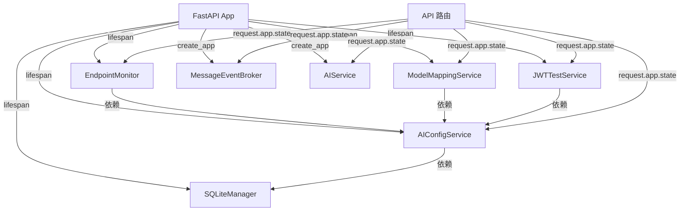

# Dashboard 重构 - 现有代码库审查与差距分析

> **生成时间**: 2025-01-XX  
> **审查范围**: 后端服务层、数据库、API 路由、前端组件、状态管理、样式约定  
> **目标**: 在实施 Dashboard 重构前，全面理解现有架构，避免重复造轮与冲突

---

## 📋 目录

1. [现状 TREE（Current State）](#现状-tree)
2. [目标 TREE（Target State）](#目标-tree)
3. [差距分析（Gap Analysis）](#差距分析)
4. [风险评估（Risk Assessment）](#风险评估)
5. [复用清单（Reusable Components）](#复用清单)

---

## 🌲 现状 TREE

### 后端文件结构

```
app/
├── core/
│   ├── application.py          # ✅ 应用工厂 + lifespan 钩子
│   ├── middleware.py            # ✅ TraceIDMiddleware
│   ├── policy_gate.py           # ✅ PolicyGateMiddleware
│   ├── rate_limiter.py          # ✅ RateLimitMiddleware
│   ├── sse_guard.py             # ✅ SSEConcurrencyGuard（可复用）
│   ├── exceptions.py            # ✅ create_error_response()
│   └── metrics.py               # ✅ Prometheus 指标收集
├── services/
│   ├── ai_config_service.py     # ✅ AIConfigService（单例，app.state 注入）
│   ├── model_mapping_service.py # ✅ ModelMappingService
│   ├── jwt_test_service.py      # ✅ JWTTestService
│   ├── monitor_service.py       # ✅ EndpointMonitor（定时任务模式）
│   └── ai_service.py            # ✅ MessageEventBroker（SSE 推送模式）
├── db/
│   └── sqlite_manager.py        # ✅ SQLiteManager（表创建、迁移、查询）
├── api/
│   └── v1/
│       ├── __init__.py          # ✅ v1_router 聚合
│       ├── base.py              # ✅ 登录、用户信息、菜单
│       ├── health.py            # ✅ 健康探针
│       ├── messages.py          # ✅ SSE 流式消息
│       ├── metrics.py           # ✅ Prometheus 指标导出
│       ├── llm.py               # ✅ LLM 路由聚合
│       ├── llm_models.py        # ✅ 模型 CRUD + 监控控制
│       ├── llm_prompts.py       # ✅ Prompt CRUD
│       ├── llm_mappings.py      # ✅ 模型映射 CRUD
│       ├── llm_tests.py         # ✅ JWT 测试
│       └── llm_common.py        # ✅ 通用依赖（get_service, create_response）
└── auth/
    ├── dependencies.py          # ✅ get_current_user()
    └── jwt_verifier.py          # ✅ JWTVerifier
```

### 前端文件结构

```
web/src/
├── main.js                      # ✅ 应用入口
├── App.vue                      # ✅ 根组件
├── router/
│   ├── index.js                 # ✅ 路由配置 + 动态路由
│   └── routes/
│       └── index.js             # ✅ basicRoutes + asyncRoutes
├── store/
│   ├── index.js                 # ✅ Pinia 初始化
│   └── modules/
│       ├── user/index.js        # ✅ useUserStore
│       ├── permission/index.js  # ✅ usePermissionStore
│       ├── tags/index.js        # ✅ useTagsStore
│       ├── app/index.js         # ✅ useAppStore
│       └── aiModelSuite.js      # ✅ useAiModelSuiteStore
├── api/
│   ├── index.js                 # ✅ 统一 API 导出
│   └── aiModelSuite.js          # ✅ AI 模型套件 API
├── utils/
│   ├── http/
│   │   ├── index.js             # ✅ axios 封装
│   │   ├── interceptors.js      # ✅ 请求/响应拦截器
│   │   └── helpers.js           # ✅ resolveResError()
│   └── auth.js                  # ✅ token 管理
├── components/
│   ├── common/
│   │   └── AppProvider.vue      # ✅ Naive UI 全局配置
│   ├── icon/
│   │   └── TheIcon.vue          # ✅ 图标组件
│   ├── page/
│   │   └── CommonPage.vue       # ✅ 通用页面容器
│   └── table/
│       ├── CrudTable.vue        # ✅ CRUD 表格
│       └── CrudModal.vue        # ✅ CRUD 弹窗
├── views/
│   ├── dashboard/
│   │   └── index.vue            # ✅ 现有 Dashboard（10 秒轮询）
│   ├── system/
│   │   ├── ai/index.vue         # ✅ AI 配置管理
│   │   ├── user/index.vue       # ✅ 用户管理
│   │   └── api/index.vue        # ✅ API 管理
│   └── login/index.vue          # ✅ 登录页
├── styles/
│   ├── reset.css                # ✅ 样式重置
│   └── global.scss              # ✅ 全局样式
└── settings/
    └── theme.json               # ✅ Naive UI 主题配置
```

### 现有服务层架构



### 现有数据库表

**SQLite 表**:
- `ai_endpoints` - AI 端点配置
- `ai_prompts` - Prompt 配置
- `ai_prompt_tests` - Prompt 测试记录

**Supabase 表**（远端备份）:
- `ai_model` - AI 模型配置
- `ai_prompt` - Prompt 配置
- `users` - 用户信息
- `chat_sessions` - 对话会话
- `chat_raw` - 对话原始数据
- `audit_logs` - 审计日志
- `user_metrics` - 用户指标

### 现有 API 端点

**健康探针**:
- `GET /api/v1/healthz` - 总体健康状态
- `GET /api/v1/livez` - 存活探针
- `GET /api/v1/readyz` - 就绪探针

**认证与用户**:
- `POST /api/v1/base/access_token` - 登录
- `GET /api/v1/base/userinfo` - 用户信息
- `GET /api/v1/base/usermenu` - 用户菜单
- `GET /api/v1/base/userapi` - 用户 API 权限

**AI 模型管理**:
- `GET /api/v1/llm/models` - 模型列表
- `POST /api/v1/llm/models` - 创建模型
- `PUT /api/v1/llm/models` - 更新模型
- `DELETE /api/v1/llm/models/{id}` - 删除模型
- `POST /api/v1/llm/models/{id}/check` - 检测模型
- `POST /api/v1/llm/models/{id}/sync` - 同步模型
- `POST /api/v1/llm/models/sync` - 批量同步
- `GET /api/v1/llm/monitor/status` - 监控状态
- `POST /api/v1/llm/monitor/start` - 启动监控
- `POST /api/v1/llm/monitor/stop` - 停止监控

**消息流**:
- `POST /api/v1/messages` - 创建消息
- `GET /api/v1/messages/{id}/events` - SSE 流式事件

**监控指标**:
- `GET /api/v1/metrics` - Prometheus 指标

---

## 🎯 目标 TREE

### 后端新增/修改文件

```
app/
├── services/
│   ├── metrics_collector.py     # [NEW] 统计数据聚合服务
│   ├── log_collector.py         # [NEW] 日志收集服务
│   ├── dashboard_broker.py      # [NEW] WebSocket 推送服务
│   └── sync_service.py          # [NEW] 数据同步服务（SQLite → Supabase）
├── api/v1/
│   ├── dashboard.py             # [NEW] Dashboard API 路由
│   └── __init__.py              # [MODIFIED] 注册 dashboard_router
├── db/
│   └── sqlite_manager.py        # [MODIFIED] 新增 3 张表
└── core/
    └── application.py           # [MODIFIED] 注册新服务 + 定时任务
```

### 前端新增/修改文件

```
web/src/
├── components/dashboard/
│   ├── StatsBanner.vue          # [NEW] 统计横幅
│   ├── LogWindow.vue            # [NEW] Log 小窗
│   ├── UserActivityChart.vue    # [NEW] 用户活跃度图表
│   ├── WebSocketClient.vue      # [NEW] WebSocket 客户端封装
│   ├── PollingConfig.vue        # [NEW] 轮询间隔配置
│   └── RealTimeIndicator.vue    # [NEW] 实时状态指示器
├── views/dashboard/
│   └── index.vue                # [MODIFIED] 替换为新 Dashboard
├── api/
│   └── dashboard.js             # [NEW] Dashboard API 封装
└── store/modules/
    └── dashboard.js             # [NEW] Dashboard 状态管理
```

### 新增数据库表

**SQLite**:
- `dashboard_stats` - Dashboard 统计数据（30 天保留）
- `user_activity_stats` - 用户活跃度统计（30 天保留）
- `ai_request_stats` - AI 请求统计（30 天保留）

**Supabase**:
- `dashboard_stats` - Dashboard 统计数据（远端备份，30 天保留）

### 新增 API 端点

**WebSocket**:
- `WebSocket /ws/dashboard` - 实时推送统计数据

**REST API**:
- `GET /api/v1/stats/dashboard` - 聚合统计数据
- `GET /api/v1/stats/daily-active-users` - 日活用户数
- `GET /api/v1/stats/ai-requests` - AI 请求统计
- `GET /api/v1/stats/api-connectivity` - API 连通性
- `GET /api/v1/stats/jwt-availability` - JWT 可获取性
- `GET /api/v1/logs/recent` - 最近日志
- `GET /api/v1/stats/config` - 配置查询
- `PUT /api/v1/stats/config` - 配置更新

---

## 🔍 差距分析

### 需要新增的文件（14 个）

#### 后端（4 个）

1. **`app/services/metrics_collector.py`**
   - **功能**: 聚合统计数据（日活、AI 请求、Token 使用、API 连通性、JWT 可获取性）
   - **依赖**: `SQLiteManager`, `EndpointMonitor`
   - **模式**: 单例，通过 `app.state` 注入

2. **`app/services/log_collector.py`**
   - **功能**: 收集 Python logger 输出（内存队列，最大 100 条）
   - **依赖**: 无
   - **模式**: 单例，通过 `app.state` 注入

3. **`app/services/dashboard_broker.py`**
   - **功能**: 管理 WebSocket 连接，定时推送统计数据
   - **依赖**: `MetricsCollector`
   - **模式**: 单例，通过 `app.state` 注入
   - **复用**: 参考 `MessageEventBroker` 的 SSE 实现模式

4. **`app/services/sync_service.py`**
   - **功能**: 定时同步 SQLite → Supabase（每小时）
   - **依赖**: `SQLiteManager`, Supabase 客户端
   - **模式**: 单例，通过 `app.state` 注入
   - **复用**: 参考 `AIConfigService` 的同步机制

5. **`app/api/v1/dashboard.py`**
   - **功能**: Dashboard API 路由（WebSocket + REST）
   - **依赖**: `MetricsCollector`, `LogCollector`, `DashboardBroker`
   - **模式**: FastAPI APIRouter
   - **复用**: 参考 `llm_models.py` 的路由注册模式

#### 前端（9 个）

6. **`web/src/components/dashboard/StatsBanner.vue`**
   - **功能**: 统计横幅（5 个指标）
   - **依赖**: Naive UI (`NCard`, `NStatistic`)
   - **模式**: `<script setup>` + Composition API

7. **`web/src/components/dashboard/LogWindow.vue`**
   - **功能**: Log 小窗（级别过滤、复制）
   - **依赖**: Naive UI (`NCard`, `NTable`, `NTag`)
   - **模式**: `<script setup>` + Composition API

8. **`web/src/components/dashboard/UserActivityChart.vue`**
   - **功能**: 用户活跃度图表（ECharts）
   - **依赖**: ECharts 5.x
   - **模式**: `<script setup>` + Composition API

9. **`web/src/components/dashboard/WebSocketClient.vue`**
   - **功能**: WebSocket 客户端封装
   - **依赖**: 原生 WebSocket API
   - **模式**: `<script setup>` + Composition API

10. **`web/src/components/dashboard/PollingConfig.vue`**
    - **功能**: 轮询间隔配置
    - **依赖**: Naive UI (`NModal`, `NInputNumber`)
    - **模式**: `<script setup>` + Composition API

11. **`web/src/components/dashboard/RealTimeIndicator.vue`**
    - **功能**: 实时状态指示器
    - **依赖**: Naive UI (`NTag`)
    - **模式**: `<script setup>` + Composition API

12. **`web/src/api/dashboard.js`**
    - **功能**: Dashboard API 封装
    - **依赖**: `web/src/utils/http/index.js`
    - **模式**: 导出函数（`getDashboardStats`, `getRecentLogs` 等）

13. **`web/src/store/modules/dashboard.js`**
    - **功能**: Dashboard 状态管理
    - **依赖**: Pinia
    - **模式**: `defineStore('dashboard', { state, getters, actions })`

14. **`web/src/views/dashboard/index.vue`**
    - **状态**: [MODIFIED]
    - **变更**: 替换现有 Dashboard 实现

### 需要修改的文件（3 个）

1. **`app/core/application.py`**
   - **变更点**:
     - 在 `lifespan()` 中初始化 4 个新服务
     - 启动定时任务（`SyncService`，每小时同步）
   - **风险**: 低（已有类似模式）

2. **`app/api/v1/__init__.py`**
   - **变更点**: 注册 `dashboard_router`
   - **风险**: 低（已有类似模式）

3. **`app/db/sqlite_manager.py`**
   - **变更点**: 在 `INIT_SCRIPT` 中新增 3 张表
   - **风险**: 低（已有表创建模式）

### 潜在冲突点

#### 1. 定时任务框架

**现状**: `EndpointMonitor` 使用 `asyncio.create_task()` + 手动循环  
**目标**: `SyncService` 需要定时任务（每小时同步）

**冲突**: 无现有定时任务框架（如 APScheduler）

**解决方案**:
- **选项 A**: 复用 `EndpointMonitor` 的手动循环模式
- **选项 B**: 引入 APScheduler（需要新增依赖）
- **推荐**: 选项 A（YAGNI 原则，避免新增依赖）

#### 2. WebSocket vs SSE

**现状**: `MessageEventBroker` 使用 SSE（`StreamingResponse`）  
**目标**: `DashboardBroker` 使用 WebSocket

**冲突**: 无冲突，但需要新增 WebSocket 认证逻辑

**解决方案**:
- 复用 `get_current_user()` 依赖注入
- 参考 `SSEConcurrencyGuard` 实现 WebSocket 并发控制

#### 3. 日志收集

**现状**: 无现有日志收集机制  
**目标**: `LogCollector` 需要拦截 Python logger 输出

**冲突**: 可能影响现有日志输出

**解决方案**:
- 使用 `logging.Handler` 自定义 handler
- 仅收集 ERROR/WARNING 级别日志
- 内存队列限制 100 条（避免内存泄漏）

---

## ⚠️ 风险评估

### 高风险（需要特别注意）

**无高风险项**

### 中风险

1. **定时任务启动/关闭**
   - **风险**: `SyncService` 定时任务未正确关闭可能导致资源泄漏
   - **缓释**: 在 `lifespan()` 的 `finally` 块中显式关闭
   - **回滚**: 移除定时任务启动代码

2. **WebSocket 并发控制**
   - **风险**: 未限制 WebSocket 连接数可能导致资源耗尽
   - **缓释**: 复用 `SSEConcurrencyGuard` 模式
   - **回滚**: 禁用 WebSocket 端点，回退到 HTTP 轮询

### 低风险

1. **数据库表新增**
   - **风险**: 表结构变更可能导致迁移失败
   - **缓释**: 使用 `_ensure_columns()` 动态添加列
   - **回滚**: `DROP TABLE` SQL 脚本

2. **前端组件新增**
   - **风险**: 组件引入可能导致打包体积增大
   - **缓释**: 按需导入 Naive UI 组件
   - **回滚**: 删除新增组件文件

---

## 🔄 复用清单

### 后端可复用模块

| 现有模块 | 复用方式 | 目标模块 |
|---------|---------|---------|
| `MessageEventBroker` | 参考 SSE 实现模式 | `DashboardBroker` |
| `SSEConcurrencyGuard` | 复用并发控制逻辑 | WebSocket 并发控制 |
| `AIConfigService` | 复用同步机制 | `SyncService` |
| `EndpointMonitor` | 复用定时任务模式 | `SyncService` |
| `SQLiteManager` | 复用表创建/查询 | 新增 3 张表 |
| `create_error_response()` | 复用错误响应格式 | Dashboard API |
| `get_current_user()` | 复用认证依赖 | WebSocket 认证 |

### 前端可复用模块

| 现有模块 | 复用方式 | 目标模块 |
|---------|---------|---------|
| `web/src/utils/http/index.js` | 复用 axios 封装 | `dashboard.js` API |
| `web/src/store/modules/aiModelSuite.js` | 参考 Pinia store 模式 | `dashboard.js` store |
| `web/src/components/common/AppProvider.vue` | 复用 Naive UI 配置 | Dashboard 组件 |
| `web/src/views/system/ai/index.vue` | 参考组件结构 | Dashboard 组件 |
| `web/settings/theme.json` | 复用主题配置 | Dashboard 样式 |

---

## 📝 下一步行动

1. **确认复用策略**: 用户确认是否采用上述复用方案
2. **调整实施计划**: 基于差距分析更新 `IMPLEMENTATION_PLAN.md`
3. **开始代码实施**: 按阶段执行（数据库 → 服务层 → API → 前端）

---

**生成时间**: 2025-01-XX  
**审查人**: AI Assistant  
**状态**: 待用户确认

